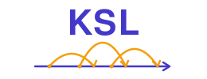
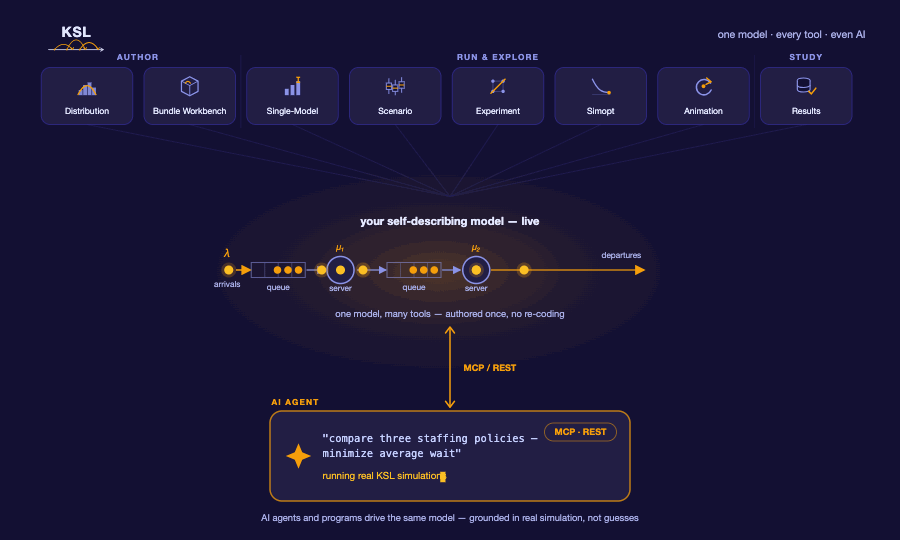

<p align="center">
  <picture>
    <source media="(prefers-color-scheme: dark)" srcset="docs/branding/ksl-logo-reversed.svg">
    
  </picture>
</p>

# Kotlin Simulation Library (KSL)

The Kotlin Simulation Library (KSL) is a Kotlin library for performing Monte Carlo and Discrete-Event
Dynamic System computer simulations.

<p align="center">
  
</p>

The KSL has the following functionality:

- Discrete event calendar and executive
- Random number stream control
- Discrete and continuous random variate generation
  - Bernoulli, Beta, ChiSquared, Binomial, Constant, DUniform, Exponential, Gamma, GeneralizedBeta, Geometric, JohnsonB, Laplace, LogLogistic, Lognormal, NegativeBinomial, Normal, PearsonType5, PearsonType6, Poisson, ShiftedGeometric, Triangular, Uniform, Weibull, DEmpirical, Empirical, AR1Normal
- Statistical summary collection including histograms and box plots
- Automated probability distribution modeling
- Monte Carlo simulation
- Event view modeling
- Process view modeling
  - non-stationary arrivals
  - entity modeling, movement
  - resources, mobile resources
  - conveyors
- Simulation data collection to Excel, CSV, databases, and data frames
- Support for multiple comparison with the best
- Framework for defining multiple objective decision analysis (MODA) based simulation analysis
- Framework for performing simulation optimization
- Framework for performing designed simulation experiments
- Utility extensions for working with arrays and files

## KSL Road Map
Who knows what the future may bring! The KSL is a complex and extremely useful library for performing Monte Carlo and discrete event
simulation experiments.  Here is some planned and potential future functionality.

- Release 1.4 accomplished a significant reorganization of the repository noted in [the release notes](docs/release-notes.md) 
  - New release and installation process
  - A new animation framework and application
  - MCP Servers for the code-base, application functionality, and the textbook
- Future work is planned on 
  - material handling, agent-based constructs, and server computing
  - additional artifacts for maven to support KSL based applications

## Licensing

The KSL is licensed under the [GPL 3.0](https://www.gnu.org/licenses/gpl-3.0.en.html)

Why the GPL and not the LGPL? The KSL has functionality that could be used to form propriety simulation software. 
Using the GPL rather than the LGPL prevents this from happening.  Developers and companies are free to use the KSL. 
Nothing prevents its use in performing (in-house) simulation analysis within industry. In fact, this is encouraged. 
However, developers or companies that want to build and **extend** the KSL (especially for commercial or proprietary reasons), 
are not permitted under the GPL, unless they want to release the functionality under the GPL. 
Developers and companies are encouraged to add functionality to the KSL and release 
the functionality so that everyone can benefit. Developers who want to extend the KSL for proprietary or commercial 
purposes can contact the KSL development team for other possible licensing arrangements.

## Installing the KSL Applications

The KSL desktop applications, MCP/REST servers, and the `kslpkg` command-line tool
ship as a single suite that runs on your own **Java 21** — no build, no Gradle, no
IntelliJ. The base applications are installed in your applications folder and a `KSLWork` folder will serve to hold artifacts of working with KSL applications.

**macOS / Linux**
```
curl -fsSL https://raw.githubusercontent.com/rossetti/KSL/main/install.sh | bash
```
**Windows (PowerShell)**
```
irm https://raw.githubusercontent.com/rossetti/KSL/main/install.ps1 -OutFile "$env:TEMP\ksl-install.ps1"; powershell -ExecutionPolicy Bypass -File "$env:TEMP\ksl-install.ps1"
```

This installs the apps, servers, and `kslpkg` (all sharing one library folder) plus a
`ksl` helper for adding, removing, and updating individual pieces. Your model bundles
and working output are preserved across updates. See the
[Applications install guide](docs/guides/apps/install.md) to run the apps, wire up the
servers, and manage the suite.

> Suite installs require a published release. Developers can build the payload
> locally (`./gradlew assembleKSLWork`) and install it with the installer's `--from`
> option as noted in the guide.

## KSL Book

https://rossetti.github.io/KSLBook/

The [book](https://rossetti.github.io/KSLBook/) explains how to use the KSL.  For example, in 
[Chapter 6](https://rossetti.github.io/KSLBook/processview.html) of the text, you will see fully worked out examples of 
how to implement the process view of simulation.  For example, to simulate a simple M/M/c queue, code such as this 
can be easily developed using the KSL.  This code models the usage of a resource via suspending functions, seize(),
delay(), and release(). In addition, it collects statistics on the processing of the entities.

```
    private inner class Customer : Entity() {
        val pharmacyProcess: KSLProcess = process() {
            wip.increment()
            timeStamp = time
            val a = seize(worker)
            delay(serviceTime)
            release(a)
            timeInSystem.value = time - timeStamp
            wip.decrement()
            numCustomers.increment()
        }
    }
```

## KSL Animations

https://rossetti.github.io/KSL-Animations/

Simulation models can be **watched**, not just summarized. The
[animation gallery](https://rossetti.github.io/KSL-Animations/) plays fifteen worked
examples in your browser — queues forming and clearing, parts riding conveyors, vehicles
routing around a congested aisle, crowds through a doorway — with nothing to install.

Animating your own model is not a second implementation of it. Capture is a flag on a run:
the model executes exactly as it always did and writes a trace, and everything is drawn
from that afterwards. The **KSL Animation** application captures, lays out and replays;
its *Export to HTML…* action writes a single self-contained page — player, trace and
layout in one file — that opens by double-clicking and can be emailed to a student.

The [animation guide](docs/guides/apps/animation.md) walks through capturing a trace from
a model you have already written.

## KSL Video Series

There is also a [video series](https://video.uark.edu/playlist/dedicated/1_0q40d3tg/) that provides an overview of getting started with the KSL and some of the associated material from the textbook.

## KSL Documentation

- If you are looking for the KSL API documentation you can find it here:

https://rossetti.github.io/KSLDocs/

- The repository for the documentation is here:

https://github.com/rossetti/KSLDocs

- KSL [Usage Guides](https://github.com/rossetti/KSL/blob/main/docs/guides/README.md) These guides are short vignettes designed to provide an overview on the key KSL packages, applications, and workflows.

Please be aware that the book and documentation may lag the releases due to lack of developer time.

The rest of this section is for **developers** building KSL from source.

## Cloning and Setting Up a Project

If you are using IntelliJ, you can use its clone repository functionality to
set up a working version. Or, simply download the repository and use IntelliJ to open up
the repository.  IntelliJ will recognize the KSL project as a gradle build and configure an appropriate project.

This is a Gradle based project.

## Build Structure

The KSL is a multi-project Gradle build. `settings.gradle.kts` is the authoritative list of
modules, and each module's `build.gradle.kts` declares what it depends on. They fall into
three tiers:

- **The library.** **KSLCore** is the published artifact (`io.github.rossetti:KSLCore`) — the
  simulation engine, statistics, random-variate generation, optimization, and reporting.
  **KSLApp** sits on top of it and holds the `ksl.app.*` application layer: run configuration,
  orchestration, and the model-bundle infrastructure. It re-exports KSLCore, so whatever
  depends on KSLApp gets KSLCore with it.
- **The applications.** The `KSLAppSwing*` modules are the desktop apps — single model,
  scenarios, designed experiments, simulation optimization, results browsing, distribution
  fitting, bundle authoring, and animation — over a shared `KSLAppSwingCommon`. The
  `KSLServiceCore` / `KSLServer*` modules are the headless server stack, which exposes the
  same capability to AI assistants and other clients.
- **Supporting modules.** The textbook examples, shared test fixtures, and the command-line
  bundle tooling.

The desktop apps depend on **KSLApp** (and **KSLAppSwingCommon**). They load models as
self-describing *bundle JARs* through the `ksl.app.bundle` loading mechanism,
discovered from the `bundles/` folder of your KSL working directory. Models are not
compiled into the apps. **KSLProjectTemplate** is a separate, pre-configured starter project
for building your own models against a published KSL release; it ships a worked model and
`ModelBuilderIfc` you can copy, and the [Bundle Tools guide](docs/guides/apps/bundle-tools.md)
shows how to turn the JAR it builds into a bundle the apps can load.

The published version is set in `KSLCore/build.gradle.kts` (the `version` property):

```
group = "io.github.rossetti"
name = "KSLCore"
version = "R1.4"
```
Just add:  
```
api("io.github.rossetti:KSLCore:R1.4")
```
To your build for the latest release.

## Release Notes

The full release history lives in **[docs/release-notes.md](docs/release-notes.md)**, which
covers two things on separate cadences: the **library** (`KSLCore`, versioned R1.4, R1.3, …)
and the installable **suite** of applications and servers (versioned 0.3.0, 0.2.0, …). A
suite release does not imply a library release, or the reverse.

**Suite 0.3.1** — fixes two things 0.3.0 shipped broken: the KSL Server could not find the
shipped example bundles, and the polished layouts were reachable only from the menu bar.
Auto Layout also lays a circular conveyor out as a loop rather than a straight line.

**Suite 0.3.0** — animations replay in a browser through the same renderer the desktop
application uses; *Export to HTML…* writes a single self-contained page that needs no
install; fifteen polished layouts ship with the suite and are offered in the app; and the
shipped examples moved into a visible `KSL/examples/` folder. See the
[gallery](https://rossetti.github.io/KSL-Animations/).

**Updating an existing install:** re-run the installer one-liner above. `ksl update` is
broken in 0.3.1 and earlier — it re-reads the manifest cached when you installed, so it
re-downloads the version you already have and reports success. Suite 0.3.2 fixes it, but
the fix cannot deliver itself: getting it needs one installer re-run, after which
`ksl update` works normally.

**R1.4:** a reorganization and packaging release. The `ksl.app.*` model-packaging /
run infrastructure moved out of the published KSLCore into a new internal `KSLApp`
module, so KSLCore is now just the simulation engine; a new `ksl.animation` capture
layer feeds the animation app; and simulation optimization gained a penalty-function
method (Park & Kim 2015) plus corrected ISC statistics, feasible-lattice sampling
guards, and a fixed default constraint penalty. The applications and servers now ship
as a single installable suite. See [the release notes](docs/release-notes.md) for the
full list.
