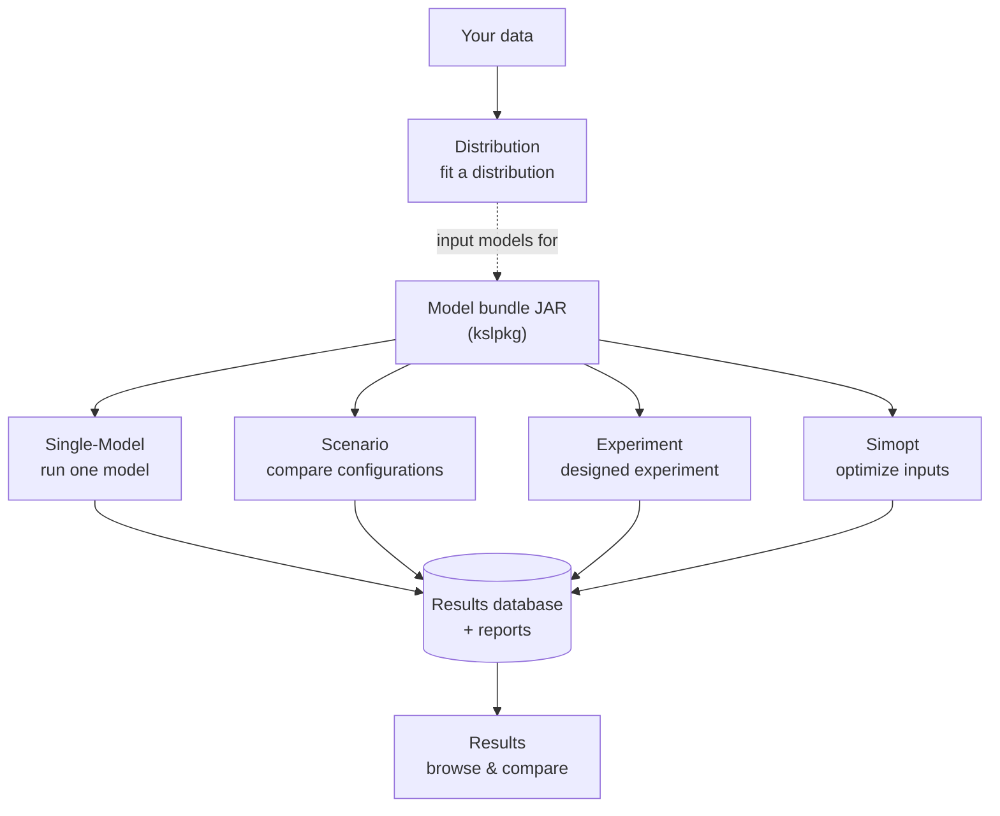

# KSL Desktop Application Guides

Step-by-step, student-facing user guides for the KSL desktop applications. Each
guide walks through the app click-by-click with real screenshots and a concrete
worked example, and shows what the results look like.

New to these apps? Read **[Common UI & concepts](common-ui.md)** first — it covers
the parts every app shares (models & bundles, the workspace, themes, the run
console, reports), so the individual guides don't repeat them.

## The apps

| Guide | What it's for | Status |
|---|---|---|
| **[Single-Model](single.md)** | Run one model, set its inputs, read a report. The best starting point. | ✅ Available |
| **[Scenario](scenario.md)** | Compare several configurations of a model side by side. | ✅ Available |
| **[Experiment](experiment.md)** | Vary inputs over a designed (factorial) experiment. | ✅ Available |
| **[Simopt](simopt.md)** | Search for the input settings that optimize a response. | ✅ Available |
| **[Results](results.md)** | Browse and compare results saved in a simulation database. | ✅ Available |
| **[Distribution](distribution.md)** | Fit probability distributions to data. | ✅ Available |
| **[Bundle Tools](bundle-tools.md)** | Package models as loadable bundle JARs (`kslpkg`, command line). | ✅ Available |

## How the apps relate

A model is packaged once as a **bundle**, then run by the **Single**, **Scenario**,
**Experiment**, or **Simopt** apps. Those runs write a **results database and
reports**, which the **Results** app browses and compares. The **Distribution** app
is the front of the pipeline — it fits distributions to data that feed your models.

## For guide authors

The standard structure for every guide is in **[`_TEMPLATE.md`](_TEMPLATE.md)**.
Visuals come from two reproducible pipelines (see
[`../../app-guides-plan.md`](../../app-guides-plan.md)):

- **App UI** screenshots — a per-module `screenshots<App>` Gradle task renders the
  real Swing windows to PNG (run under `xvfb-run`).
- **Results & charts** — a per-module `results<App>` task renders genuine report
  content (and chart PNGs) via `ksl.utilities.io.report`'s Markdown renderer.
