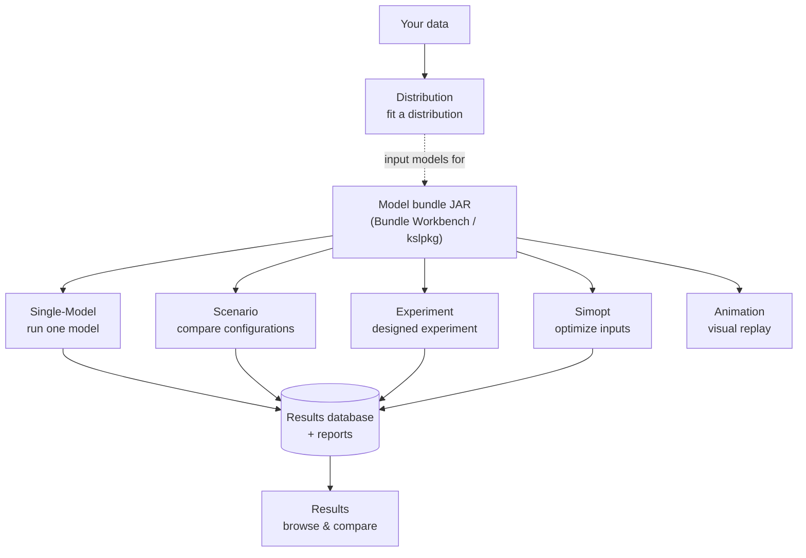

# KSL Application Guides

Step-by-step, user-facing guides for the KSL applications. Most are **desktop
apps** — each guide walks through the app click-by-click with a concrete worked
example. **Bundle Tools** (`kslpkg`) and the **MCP Server** are command-line and
server tools, driven from a terminal.

**First time?** **[Install the KSL suite](install.md)** — one command installs all
these apps, the servers, and `kslpkg` into a single `KSLWork` folder, running on your
own Java 21 (no build required).

New to these apps? Read **[Common UI & concepts](common-ui.md)** next — it covers
the parts every app shares (models & bundles, the workspace, themes, the run
console, reports), so the individual guides don't repeat them.

## The apps

| Guide | What it's for | Status |
|---|---|---|
| **[Single-Model](single.md)** | Run one model, set its inputs, read a report. The best starting point. | ✅ Available |
| **[Scenario](scenario.md)** | Compare several configurations of a model side by side. | ✅ Available |
| **[Experiment](experiment.md)** | Vary inputs over a designed (factorial) experiment. | ✅ Available |
| **[Simopt](simopt.md)** | Search for the input settings that optimize a response. | ✅ Available |
| **[Animation](animation.md)** | Watch a model run as a visual, replayable animation — capture, run, lay out, replay. | ✅ Available |
| **[Results](results.md)** | Browse and compare results saved in a simulation database. | ✅ Available |
| **[Distribution](distribution.md)** | Fit probability distributions to data. | ✅ Available |
| **[Bundle Workbench](bundle-workbench.md)** | Package models as bundle JARs in a guided desktop app — open, identify, catalog, validate, assemble. | ✅ Available |
| **[Bundle Tools](bundle-tools.md)** | Package models as loadable bundle JARs (`kslpkg`, command line). | ✅ Available |

## Servers

Prefer to drive KSL from outside a GUI? The server modules expose KSL's capabilities to
programs and AI assistants. The **[KSL Server](ksl-server.md)** is the one to use: a single
long-running server that gives an AI assistant searchable, tool-driven access to all three
surfaces at once — running models, the source code, and the textbook — started from a
menu-bar / system-tray app and set up with one click from a web console.

See the **[KSL Server guide](ksl-server.md)** to install it, open the console, connect your
assistant with one click, and make a first tool call. It runs headless too, and you can serve
just some surfaces (say, textbook search only for a course that isn't modeling yet).

## How the apps relate

```mermaid
flowchart TD
    bundle["Model bundle JAR<br/>(Bundle Workbench / kslpkg)"]
    bundle --> single["Single-Model<br/>run one model"]
    bundle --> scenario["Scenario<br/>compare configurations"]
    bundle --> experiment["Experiment<br/>designed experiment"]
    bundle --> simopt["Simopt<br/>optimize inputs"]
    bundle --> animation["Animation<br/>visual replay"]
    single --> db[("Results database<br/>+ reports")]
    scenario --> db
    experiment --> db
    simopt --> db
    db --> results["Results<br/>browse & compare"]
    data["Your data"] --> distribution["Distribution<br/>fit a distribution"]
    distribution -.->|"input models for"| bundle
```

A model is packaged once as a **bundle**, then run by the **Single**, **Scenario**,
**Experiment**, or **Simopt** apps — or replayed visually by **Animation**. Those runs write a
**results database and reports**, which the **Results** app browses and compares. The
**Distribution** app is the front of the pipeline — it fits distributions to data that feed
your models.

## For guide authors

The standard structure for every guide is in **[`_TEMPLATE.md`](_TEMPLATE.md)**.
