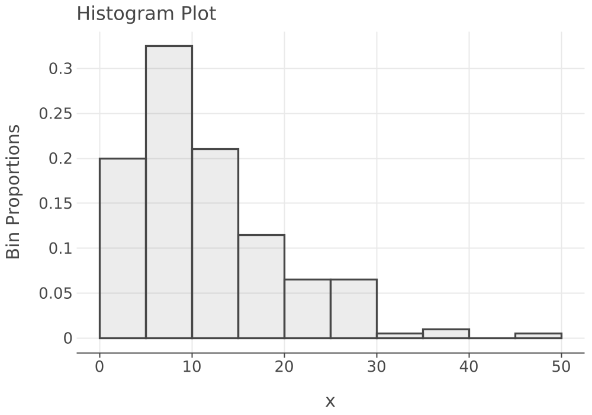
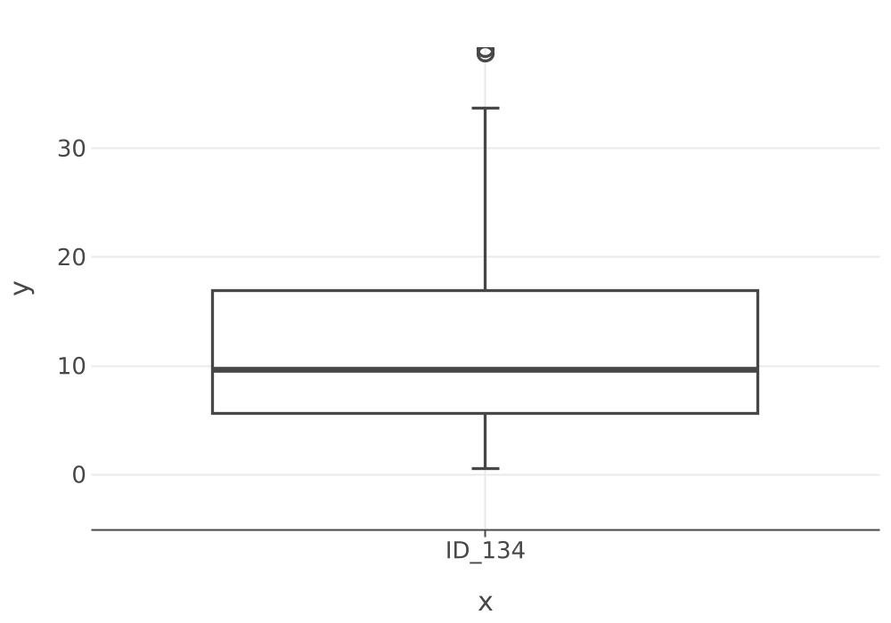
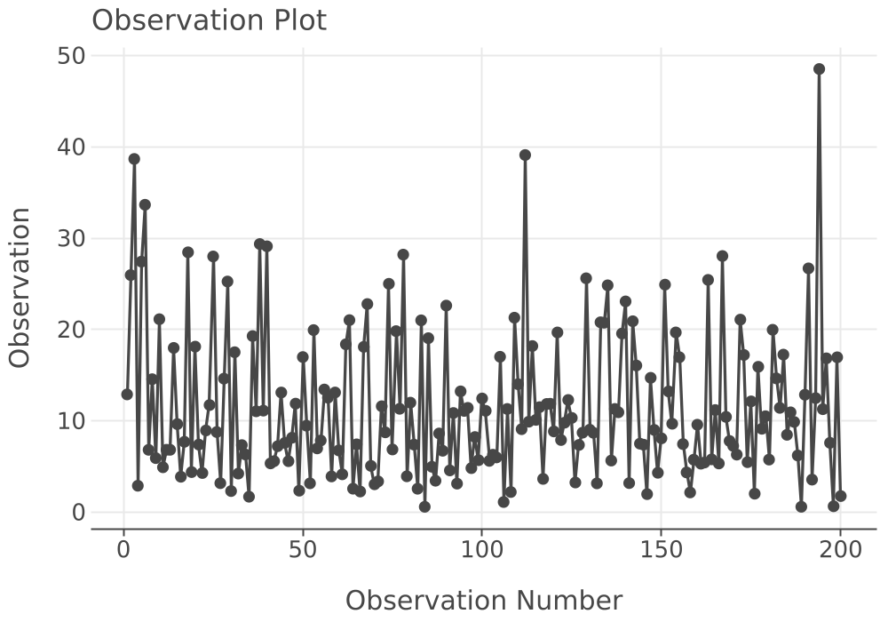
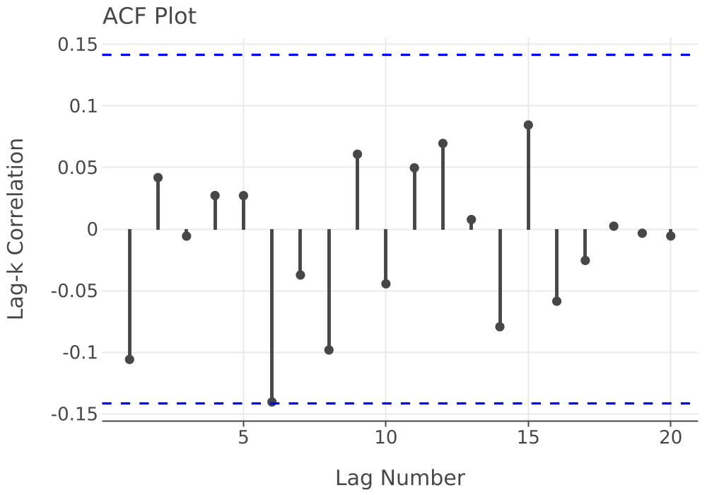
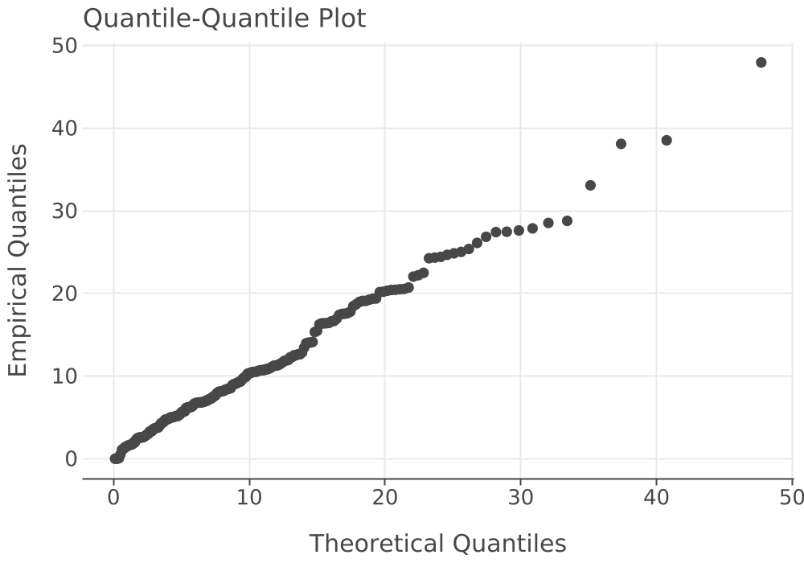
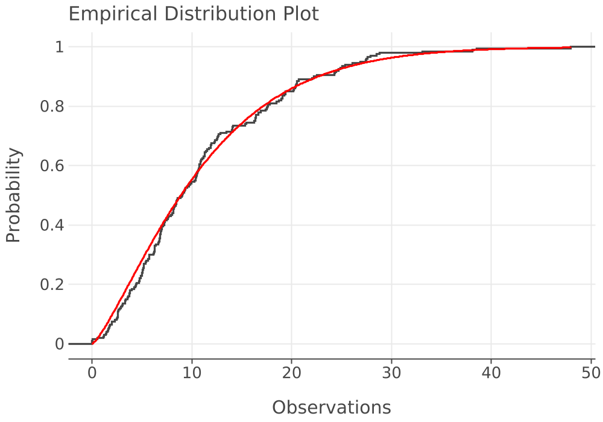
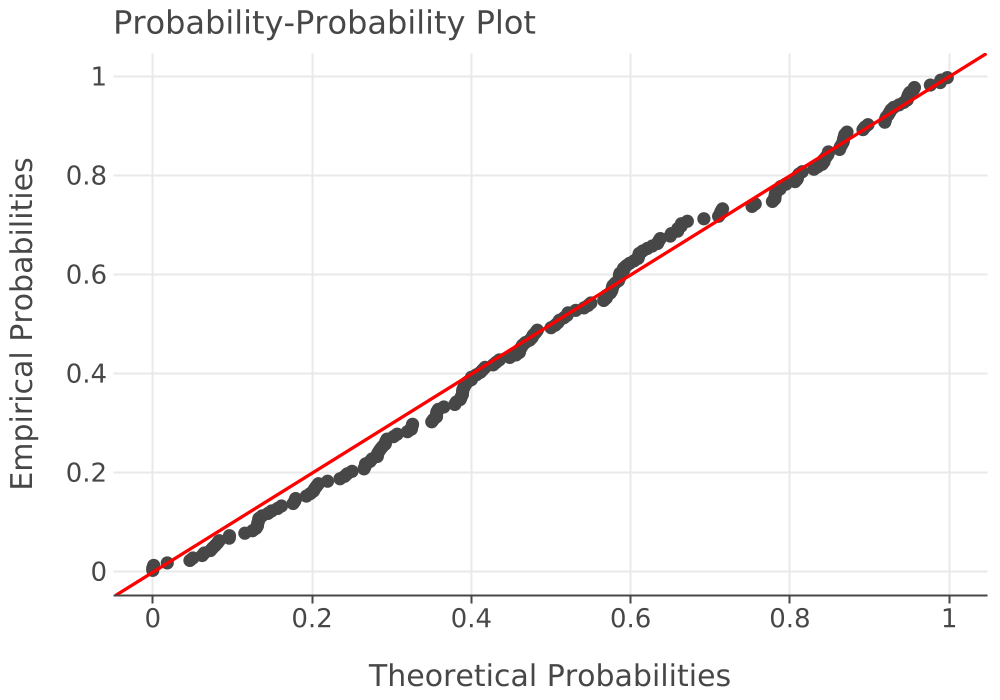

# Service Times — Distribution Fitting

## Data Statistical Summary

n = 200  |  Mean = 11.6271  |  Std Dev = 8.1657  |  Min = 0.5879  |  Max = 48.5324  |  Zeros = false  |  Negatives = false

**Sample Statistics**

|Property| Value|
|:---| ---:|
|Count| 200.0|
|Average| 11.63|
|Std Dev| 8.166|
|Std Error| 0.5774|
|Half-width| 1.139|
|Confidence Level| 0.9500|
|CI Lower| 10.49|
|CI Upper| 12.77|
|Min| 0.5879|
|Max| 48.53|
|Sum| 2325|
|Variance| 66.68|
|Dev Sum of Sq| 1.327e+04|
|Kurtosis| 2.178|
|Skewness| 1.312|
|Lag-1 Covariance| -7.019|
|Lag-1 Correlation| -0.1058|
|Von Neumann Stat| -1.451|
|Missing| 0.000|

### Box Plot Summary

**Five-Number Summary and Fences**

|Property| Value|
|:---| ---:|
|lowerOuterFence| -28.1587|
|lowerInnerFence| -11.2491|
|lowerWhisker| 0.5879|
|min| 0.5879|
|firstQuartile| 5.6605|
|median| 9.6112|
|max| 48.5324|
|upperWhisker| 33.6652|
|thirdQuartile| 16.9335|
|upperInnerFence| 33.8431|
|upperOuterFence| 50.7527|
|range| 47.9445|
|interQuartileRange| 11.2731|

**Outlier Summary**

|Category| Fence Range| Count| Obs. Min| Obs. Max|
|:---| :---| ---:| ---:| ---:|
|Extremely Low| x ≤ -28.1587| 0| —| —|
|Mildly Low| -28.1587 ≤ x ≤ -11.2491| 0| —| —|
|Mildly High| 33.8431 ≤ x ≤ 50.7527| 3| 38.6802| 48.5324|
|Extremely High| x ≥ 50.7527| 0| —| —|

### Histogram

Bins: 10  |  Range: [0.000, 50.00]  |  Under: 0  |  Over: 0  |  Total: 200  |  In Bins: 200  |  Missing: 0

**Bin Frequencies**

|Bin| Label| Lower| Upper| Count| Cum Count| %| Cum %|
|---:| :---| ---:| ---:| ---:| ---:| :---| :---|
|1|   1 [ 0.00, 5.00) | 0.000| 5.000| 40| 40| 20.00%| 20.00%|
|2|   2 [ 5.00,10.00) | 5.000| 10.00| 65| 105| 32.50%| 52.50%|
|3|   3 [10.00,15.00) | 10.00| 15.00| 42| 147| 21.00%| 73.50%|
|4|   4 [15.00,20.00) | 15.00| 20.00| 23| 170| 11.50%| 85.00%|
|5|   5 [20.00,25.00) | 20.00| 25.00| 13| 183| 6.50%| 91.50%|
|6|   6 [25.00,30.00) | 25.00| 30.00| 13| 196| 6.50%| 98.00%|
|7|   7 [30.00,35.00) | 30.00| 35.00| 1| 197| 0.50%| 98.50%|
|8|   8 [35.00,40.00) | 35.00| 40.00| 2| 199| 1.00%| 99.50%|
|9|   9 [40.00,45.00) | 40.00| 45.00| 0| 199| 0.00%| 99.50%|
|10|  10 [45.00,50.00) | 45.00| 50.00| 1| 200| 0.50%| 100.00%|

**Statistics on Binned Data**

|Property| Value|
|:---| ---:|
|Count| 200.0|
|Average| 11.63|
|Std Dev| 8.166|
|Std Error| 0.5774|
|Half-width| 1.139|
|Confidence Level| 0.9500|
|CI Lower| 10.49|
|CI Upper| 12.77|
|Min| 0.5879|
|Max| 48.53|
|Sum| 2325|
|Variance| 66.68|
|Dev Sum of Sq| 1.327e+04|
|Kurtosis| 2.178|
|Skewness| 1.312|
|Lag-1 Covariance| -7.019|
|Lag-1 Correlation| -0.1058|
|Von Neumann Stat| -1.451|
|Missing| 0.000|

### Shift Parameter Analysis

**Left-Shift Estimation (95 % Bootstrap CI for Minimum)**

|Property| Value|
|:---| :---|
|Estimated Left Shift| 0.5879|
|Has Zeros| false|
|Has Negatives| false|
|Zero Tolerance| 0.0010|
|CI for Minimum — Lower| 0.5879|
|CI for Minimum — Upper| 1.1120|

## Data Visualization

### Histogram

### Box Plot

### Observations

### Autocorrelation

## MODA Scoring Results

Alternatives: 9  |  Metrics: 4

### Metric Definitions

**Metric Definitions and Weights**

|Metric| Direction| Weight| Domain Lower| Domain Upper| Units| Description|
|:---| :---| ---:| ---:| ---:| ---:| ---:|
|BIC| SmallerIsBetter| 0.2500| 1152.1578| 3166.6243| —| —|
|AD| SmallerIsBetter| 0.2500| 0.0000| 100.6802| —| —|
|CVM| SmallerIsBetter| 0.2500| 0.0000| 20.9780| —| —|
|QQC| BiggerIsBetter| 0.2500| -1.0000| 1.0000| —| —|

### Scores and Values

**Raw Scores by Alternative and Metric**

|Alternative| BIC| AD| CVM| QQC|
|:---| ---:| ---:| ---:| ---:|
|Uniform(minimum=0.3469736406081161, maximum=48.773301356221936)| 1562.6141| 89.6078| 18.6612| 0.9231|
|Triangular(minimum=0.3469736406081161, mode=0.3469736406081161, maximum=48.773301356221936)| 1415.9587| 19.8622| 4.1395| 0.9763|
|Normal(mean=11.627104016021736, variance=66.67847955895567)| 1417.1485| 5.4097| 0.9529| 0.9476|
|GeneralizedBeta(min=0.3469736406081161, max=48.773301356221936, alpha=1.2308446997283111, beta=4.053251034305603)| 1378.0118| 1.2946| 0.1856| 0.9909|
|0.5879004784721834 + Exponential(mean=11.03920353754955)| 1365.8795| 6.4260| 1.1057| 0.9894|
|0.5879004784721834 + Lognormal(mean=27.207115704432592, variance=9569.46544835339)| 2965.1776| 20.2628| 2.8018| 0.7687|
|0.5879004784721834 + Gamma(shape=1.3472950432394628, scale=8.193605100043024)| 1361.1127| 1.9489| 0.2809| 0.9947|
|0.5879004784721834 + Weibull(shape=1.2831029171486326, scale=11.821812704273261)| 1353.6045| 1.0285| 0.1267| 0.9970|
|0.5879004784721834 + PearsonType5(shape=0.06892737391084663, scale=2.284047664566397E-6)| 2301.1669| 79.4534| 17.3168| 0.3212|

**Transformed Values (0–1) and Overall Weighted Value (sorted by overall value)**

|Alternative| BIC| AD| CVM| QQC| Overall Value|
|:---| ---:| ---:| ---:| ---:| ---:|
|0.5879004784721834 + Weibull(shape=1.2831029171486326, scale=11.821812704273261)| 0.9000| 0.9898| 0.9940| 0.9985| 0.9706|
|GeneralizedBeta(min=0.3469736406081161, max=48.773301356221936, alpha=1.2308446997283111, beta=4.053251034305603)| 0.8879| 0.9871| 0.9912| 0.9955| 0.9654|
|0.5879004784721834 + Gamma(shape=1.3472950432394628, scale=8.193605100043024)| 0.8963| 0.9806| 0.9866| 0.9973| 0.9652|
|0.5879004784721834 + Exponential(mean=11.03920353754955)| 0.8939| 0.9362| 0.9473| 0.9947| 0.9430|
|Normal(mean=11.627104016021736, variance=66.67847955895567)| 0.8685| 0.9463| 0.9546| 0.9738| 0.9358|
|Triangular(minimum=0.3469736406081161, mode=0.3469736406081161, maximum=48.773301356221936)| 0.8690| 0.8027| 0.8027| 0.9881| 0.8656|
|0.5879004784721834 + Lognormal(mean=27.207115704432592, variance=9569.46544835339)| 0.1000| 0.7987| 0.8664| 0.8844| 0.6624|
|Uniform(minimum=0.3469736406081161, maximum=48.773301356221936)| 0.7962| 0.1100| 0.1104| 0.9616| 0.4946|
|0.5879004784721834 + PearsonType5(shape=0.06892737391084663, scale=2.284047664566397E-6)| 0.4296| 0.2108| 0.1745| 0.6606| 0.3689|

### Rankings

**Alternative Rankings (sorted by average rank)**

|Alternative| BIC| AD| CVM| QQC| 1st Rank Count| Avg Rank|
|:---| ---:| ---:| ---:| ---:| ---:| ---:|
|0.5879004784721834 + Weibull(shape=1.2831029171486326, scale=11.821812704273261)| 1| 1| 1| 1| 4| 1.0000|
|0.5879004784721834 + Gamma(shape=1.3472950432394628, scale=8.193605100043024)| 2| 3| 3| 2| 0| 2.5000|
|GeneralizedBeta(min=0.3469736406081161, max=48.773301356221936, alpha=1.2308446997283111, beta=4.053251034305603)| 4| 2| 2| 3| 0| 2.7500|
|0.5879004784721834 + Exponential(mean=11.03920353754955)| 3| 5| 5| 4| 0| 4.2500|
|Normal(mean=11.627104016021736, variance=66.67847955895567)| 6| 4| 4| 6| 0| 5.0000|
|Triangular(minimum=0.3469736406081161, mode=0.3469736406081161, maximum=48.773301356221936)| 5| 6| 7| 5| 0| 5.7500|
|0.5879004784721834 + Lognormal(mean=27.207115704432592, variance=9569.46544835339)| 9| 7| 6| 8| 0| 7.5000|
|Uniform(minimum=0.3469736406081161, maximum=48.773301356221936)| 7| 9| 9| 7| 0| 8.0000|
|0.5879004784721834 + PearsonType5(shape=0.06892737391084663, scale=2.284047664566397E-6)| 8| 8| 8| 9| 0| 8.2500|

## 0.5879004784721834 + Weibull(shape=1.2831029171486326, scale=11.821812704273261)

Distribution: 0.5879004784721834 + Weibull(shape=1.2831029171486326, scale=11.821812704273261)  |  RV Type: Weibull  |  Parameters: 2  |  MODA Value: 0.9706  |  Avg Rank: 1.0000

### Bootstrap Parameter Estimates

**0.5879004784721834 + Weibull(shape=1.2831029171486326, scale=11.821812704273261)**

|Property| Value|
|:---| :---|
|Parameter| shape|
|Original Sample Size| 200|
|Original Estimate| 1.4980|
|Bootstrap Average| 1.5111|
|Bias Estimate| 0.0130|
|Bootstrap MSE Estimate| 0.0063|
|Std. Error Estimate| 0.0786|
|Num Bootstraps| 399|
|CI Level| 0.9500|
|Normal CI Lower| 1.3440|
|Normal CI Upper| 1.6521|
|Basic CI Lower| 1.3151|
|Basic CI Upper| 1.6298|
|Percentile CI Lower| 1.3663|
|Percentile CI Upper| 1.6810|

**0.5879004784721834 + Weibull(shape=1.2831029171486326, scale=11.821812704273261)**

|Property| Value|
|:---| :---|
|Parameter| scale|
|Original Sample Size| 200|
|Original Estimate| 12.9234|
|Bootstrap Average| 12.9602|
|Bias Estimate| 0.0368|
|Bootstrap MSE Estimate| 0.4070|
|Std. Error Estimate| 0.6369|
|Num Bootstraps| 399|
|CI Level| 0.9500|
|Normal CI Lower| 11.6751|
|Normal CI Upper| 14.1716|
|Basic CI Lower| 11.5185|
|Basic CI Upper| 14.1419|
|Percentile CI Lower| 11.7048|
|Percentile CI Upper| 14.3282|

### Distribution Fit Plots

### Goodness of Fit Tests

Estimated parameters: 2  |  Intervals: 31  |  Chi-Sq DOF: 28

**Chi-Squared Bin Table**

|Bin Label| P(Bin)| Observed| Expected| Note|
|:---| ---:| ---:| ---:| :---|
|  1 [ 0.00, 0.82) | 0.0323| 4| 6.4516| |
|  2 [ 0.82, 1.43) | 0.0323| 3| 6.4516| |
|  3 [ 1.43, 1.99) | 0.0323| 8| 6.4516| |
|  4 [ 1.99, 2.53) | 0.0323| 2| 6.4516| |
|  5 [ 2.53, 3.05) | 0.0323| 9| 6.4516| |
|  6 [ 3.05, 3.57) | 0.0323| 5| 6.4516| |
|  7 [ 3.57, 4.09) | 0.0323| 6| 6.4516| |
|  8 [ 4.09, 4.61) | 0.0323| 4| 6.4516| |
|  9 [ 4.61, 5.13) | 0.0323| 10| 6.4516| |
| 10 [ 5.13, 5.67) | 0.0323| 6| 6.4516| |
| 11 [ 5.67, 6.22) | 0.0323| 5| 6.4516| |
| 12 [ 6.22, 6.78) | 0.0323| 8| 6.4516| |
| 13 [ 6.78, 7.35) | 0.0323| 13| 6.4516| |
| 14 [ 7.35, 7.95) | 0.0323| 4| 6.4516| |
| 15 [ 7.95, 8.57) | 0.0323| 11| 6.4516| |
| 16 [ 8.57, 9.21) | 0.0323| 4| 6.4516| |
| 17 [ 9.21, 9.89) | 0.0323| 6| 6.4516| |
| 18 [ 9.89,10.60) | 0.0323| 8| 6.4516| |
| 19 [10.60,11.35) | 0.0323| 13| 6.4516| |
| 20 [11.35,12.15) | 0.0323| 6| 6.4516| |
| 21 [12.15,13.02) | 0.0323| 7| 6.4516| |
| 22 [13.02,13.95) | 0.0323| 1| 6.4516| |
| 23 [13.95,14.98) | 0.0323| 4| 6.4516| |
| 24 [14.98,16.11) | 0.0323| 2| 6.4516| |
| 25 [16.11,17.40) | 0.0323| 9| 6.4516| |
| 26 [17.40,18.89) | 0.0323| 6| 6.4516| |
| 27 [18.89,20.67) | 0.0323| 13| 6.4516| |
| 28 [20.67,22.90) | 0.0323| 4| 6.4516| |
| 29 [22.90,25.94) | 0.0323| 7| 6.4516| |
| 30 [25.94,30.92) | 0.0323| 8| 6.4516| |
| 31 [30.92,97.00) | 0.0323| 4| 6.4515| |

**Goodness of Fit Test Statistics**

|Test| Statistic| p-value|
|:---| ---:| ---:|
|Chi-Squared (DOF = 28)| 48.6200| 0.0092|
|Kolmogorov-Smirnov| 0.0602| 0.4462|
|Anderson-Darling| 1.0285| 0.3425|
|Cramér-von Mises| 0.1267| 0.4694|

