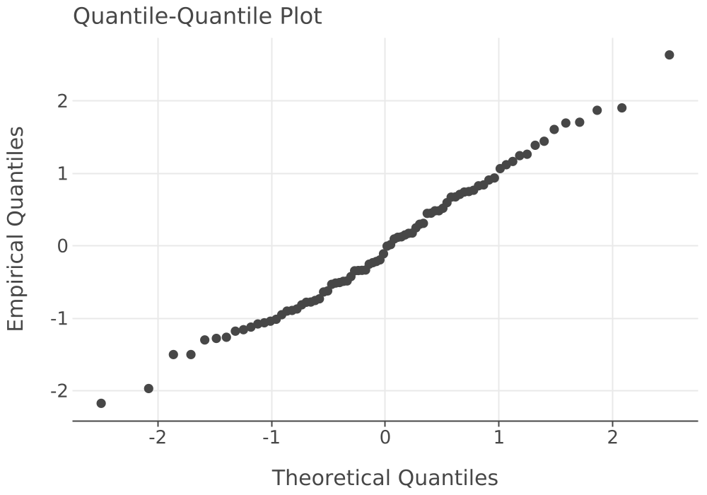
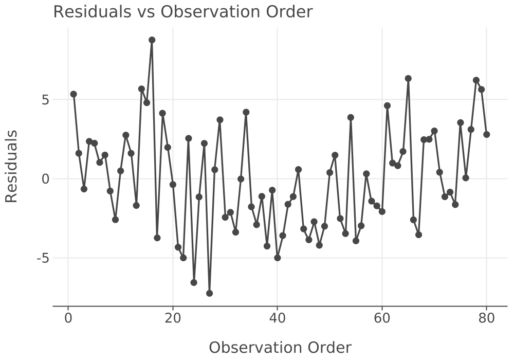

# LK Inventory — 2x2 Factorial & Regression

## 2x2 Factorial Experiment Results

Experiment: LK_Factorial_2x2  |  Design: TwoLevelFactorialDesign  |  Factors: 2  |  Design Points: 4  |  Responses: 7  |  Runs Executed: 4  |  Scale: Coded

### Design Structure

Design type: TwoLevelFactorialDesign  |  Factors: 2  |  Design points: 4  |  Scale: Coded

#### Factors

**Factor Summary**

|Factor| # Levels| Low| High| Mid Point| Half Range| Coded Levels|
|:---| ---:| ---:| ---:| ---:| ---:| :---|
|ReorderPoint| 2| 20.0000| 40.0000| 30.0000| 10.0000| -1.0000, 1.0000|
|OrderQuantity| 2| 40.0000| 80.0000| 60.0000| 20.0000| -1.0000, 1.0000|

#### Design Points (Coded Scale)

**Design Points (Coded Scale)**

|Point| Reps| ReorderPoint| OrderQuantity|
|---:| ---:| ---:| ---:|
|1| 1| -1.0000| -1.0000|
|2| 1| -1.0000| 1.0000|
|3| 1| 1.0000| -1.0000|
|4| 1| 1.0000| 1.0000|

### Model Responses

**Responses Collected (7)**

|Response Name|
|:---|
|InventoryLevel|
|OnHandLevel|
|BackorderLevel|
|TotalCost|
|HoldingCost|
|SetupCost|
|ShortageCost|

### Execution Summary

**Design Point Execution (4 points executed)**

|Point| Experiment Name| Reps| Inventory.orderQuantity| Inventory.reorderPoint| Status|
|---:| :---| ---:| ---:| ---:| :---|
|1| Experiment_1_DP_1| 20| 40.0000| 20.0000| OK|
|2| Experiment_1_DP_2| 20| 80.0000| 20.0000| OK|
|3| Experiment_1_DP_3| 20| 40.0000| 40.0000| OK|
|4| Experiment_1_DP_4| 20| 80.0000| 40.0000| OK|

### Response Statistics

Each row below represents one executed design point. Statistics are computed across the replications at that design point at the 95% confidence level.

#### InventoryLevel

**Across-Replication Statistics: InventoryLevel**

|Name| Count| Average| Std Dev| Std Error| Half-Width| Conf Level| CI Lower| CI Upper| Min| Max|
|:---| ---:| ---:| ---:| ---:| ---:| ---:| ---:| ---:| ---:| ---:|
|Point 1| 20.0000| 14.7740| 0.8783| 0.1964| 0.4111| 0.9500| 14.3629| 15.1850| 13.4980| 16.4772|
|Point 2| 20.0000| 34.5399| 1.5263| 0.3413| 0.7143| 0.9500| 33.8256| 35.2542| 30.8837| 37.1693|
|Point 3| 20.0000| 35.2394| 0.9271| 0.2073| 0.4339| 0.9500| 34.8056| 35.6733| 33.1979| 36.4559|
|Point 4| 20.0000| 55.2760| 1.4766| 0.3302| 0.6911| 0.9500| 54.5850| 55.9671| 53.3234| 58.1427|

#### OnHandLevel

**Across-Replication Statistics: OnHandLevel**

|Name| Count| Average| Std Dev| Std Error| Half-Width| Conf Level| CI Lower| CI Upper| Min| Max|
|:---| ---:| ---:| ---:| ---:| ---:| ---:| ---:| ---:| ---:| ---:|
|Point 1| 20.0000| 17.3739| 0.6702| 0.1499| 0.3137| 0.9500| 17.0602| 17.6876| 16.3003| 18.7937|
|Point 2| 20.0000| 36.1105| 1.2691| 0.2838| 0.5940| 0.9500| 35.5166| 36.7045| 33.4576| 38.6128|
|Point 3| 20.0000| 35.4681| 0.8443| 0.1888| 0.3952| 0.9500| 35.0729| 35.8633| 33.6320| 36.6587|
|Point 4| 20.0000| 55.4179| 1.4504| 0.3243| 0.6788| 0.9500| 54.7391| 56.0967| 53.4064| 58.3801|

#### BackorderLevel

**Across-Replication Statistics: BackorderLevel**

|Name| Count| Average| Std Dev| Std Error| Half-Width| Conf Level| CI Lower| CI Upper| Min| Max|
|:---| ---:| ---:| ---:| ---:| ---:| ---:| ---:| ---:| ---:| ---:|
|Point 1| 20.0000| 2.5999| 0.3276| 0.0732| 0.1533| 0.9500| 2.4466| 2.7532| 1.8041| 3.2068|
|Point 2| 20.0000| 1.5706| 0.4090| 0.0915| 0.1914| 0.9500| 1.3792| 1.7620| 1.0045| 2.5739|
|Point 3| 20.0000| 0.2287| 0.1267| 0.0283| 0.0593| 0.9500| 0.1693| 0.2880| 0.0747| 0.5010|
|Point 4| 20.0000| 0.1419| 0.0843| 0.0189| 0.0395| 0.9500| 0.1024| 0.1813| 0.0341| 0.2830|

#### TotalCost

**Across-Replication Statistics: TotalCost**

|Name| Count| Average| Std Dev| Std Error| Half-Width| Conf Level| CI Lower| CI Upper| Min| Max|
|:---| ---:| ---:| ---:| ---:| ---:| ---:| ---:| ---:| ---:| ---:|
|Point 1| 20.0000| 120.3390| 3.0262| 0.6767| 1.4163| 0.9500| 118.9227| 121.7553| 114.8751| 127.3859|
|Point 2| 20.0000| 127.8666| 3.2610| 0.7292| 1.5262| 0.9500| 126.3405| 129.3928| 122.3605| 133.8094|
|Point 3| 20.0000| 125.4914| 2.1173| 0.4734| 0.9909| 0.9500| 124.5005| 126.4823| 123.0229| 131.1026|
|Point 4| 20.0000| 139.9432| 2.8363| 0.6342| 1.3274| 0.9500| 138.6158| 141.2707| 134.6770| 144.5552|

#### HoldingCost

**Across-Replication Statistics: HoldingCost**

|Name| Count| Average| Std Dev| Std Error| Half-Width| Conf Level| CI Lower| CI Upper| Min| Max|
|:---| ---:| ---:| ---:| ---:| ---:| ---:| ---:| ---:| ---:| ---:|
|Point 1| 20.0000| 17.3739| 0.6702| 0.1499| 0.3137| 0.9500| 17.0602| 17.6876| 16.3003| 18.7937|
|Point 2| 20.0000| 36.1105| 1.2691| 0.2838| 0.5940| 0.9500| 35.5166| 36.7045| 33.4576| 38.6128|
|Point 3| 20.0000| 35.4681| 0.8443| 0.1888| 0.3952| 0.9500| 35.0729| 35.8633| 33.6320| 36.6587|
|Point 4| 20.0000| 55.4179| 1.4504| 0.3243| 0.6788| 0.9500| 54.7391| 56.0967| 53.4064| 58.3801|

#### SetupCost

**Across-Replication Statistics: SetupCost**

|Name| Count| Average| Std Dev| Std Error| Half-Width| Conf Level| CI Lower| CI Upper| Min| Max|
|:---| ---:| ---:| ---:| ---:| ---:| ---:| ---:| ---:| ---:| ---:|
|Point 1| 20.0000| 89.9655| 2.5691| 0.5745| 1.2024| 0.9500| 88.7631| 91.1679| 83.8700| 96.5600|
|Point 2| 20.0000| 83.9030| 2.6329| 0.5887| 1.2322| 0.9500| 82.6708| 85.1352| 76.5300| 88.1300|
|Point 3| 20.0000| 88.8800| 2.3843| 0.5331| 1.1159| 0.9500| 87.7641| 89.9959| 85.6300| 95.3000|
|Point 4| 20.0000| 83.8160| 3.0549| 0.6831| 1.4297| 0.9500| 82.3863| 85.2457| 78.6500| 88.9700|

#### ShortageCost

**Across-Replication Statistics: ShortageCost**

|Name| Count| Average| Std Dev| Std Error| Half-Width| Conf Level| CI Lower| CI Upper| Min| Max|
|:---| ---:| ---:| ---:| ---:| ---:| ---:| ---:| ---:| ---:| ---:|
|Point 1| 20.0000| 12.9996| 1.6379| 0.3662| 0.7665| 0.9500| 12.2331| 13.7661| 9.0204| 16.0340|
|Point 2| 20.0000| 7.8531| 2.0449| 0.4573| 0.9571| 0.9500| 6.8960| 8.8102| 5.0227| 12.8695|
|Point 3| 20.0000| 1.1433| 0.6337| 0.1417| 0.2966| 0.9500| 0.8467| 1.4399| 0.3735| 2.5049|
|Point 4| 20.0000| 0.7093| 0.4217| 0.0943| 0.1973| 0.9500| 0.5120| 0.9067| 0.1703| 1.4150|

## Total Cost ~ Reorder Point + Order Quantity

**Regression Setup**

|Property| Value|
|:---| :---|
|Response| TotalCost|
|Factors| 2|
|Terms| 2|
|Intercept| true|
|Scale| Coded (−1/+1)|

### Regression Summary

Response: TotalCost  |  n = 80  |  Parameters (p): 3  |  Intercept: true  |  Predictors: ReorderPoint, OrderQuantity

#### Analysis of Variance

**ANOVA Table**

|Source| SS| DoF| MS| F₀| P(F > F₀)|
|:---| ---:| ---:| ---:| ---:| ---:|
|Regression| 3899.6660| 2| 1949.8330| 175.8465| 0.0000|
|Error| 853.7965| 77| 11.0883| —| —|
|Total| 4753.4625| 79| —| —| —|

#### Model Fit

**Model Fit Measures**

|Measure| Value|
|:---| ---:|
|R² (Coefficient of Determination)| 0.8204|
|Adjusted R²| 0.8157|
|σ̂ (Regression Standard Error)| 3.3299|
|MSE (Mean Squared Error)| 11.0883|
|F-statistic| 175.8465|
|p-value (F-test)| 0.0000|

### Parameter Estimates

**Parameter Estimates (95% CI)**

|Predictor| Estimate| Std Error| t₀| p-value| CI Lower| CI Upper| Sig.|
|:---| ---:| ---:| ---:| ---:| ---:| ---:| :---|
|Intercept| 128.4101| 0.3723| 344.9151| 0.0000| 127.6687| 129.1514| ***|
|ReorderPoint| 4.3072| 0.3723| 11.5695| 0.0000| 3.5659| 5.0486| ***|
|OrderQuantity| 5.4949| 0.3723| 14.7594| 0.0000| 4.7535| 6.2362| ***|

Sig. codes: ‘***’ p < 0.001  |  ‘**’ p < 0.01  |  ‘*’ p < 0.05  |  ‘.’ p < 0.10

Predictors significant at α = 0.0500: Intercept, ReorderPoint, OrderQuantity.

### Regression Diagnostics

**Residuals and Influence Summary**

|Diagnostic| Value|
|:---| ---:|
|Observations (n)| 80|
|Parameters (p)| 3|
|Min Residual| -7.2371|
|Max Residual| 8.7780|
|Mean Residual| 0.0000|
|Std Dev Residual| 3.2875|
|σ̂ (Regression SE)| 3.3299|
|Mean Leverage (h̄ᵢᵢ)| 0.0375|
|Max Leverage| 0.0375|
|High-Leverage Points (hᵢᵢ > 0.0750)| 0|
|Max Cook’s Distance| 0.0938|
|Influential Points (Cook’s D > 0.0500)| 3|

High-leverage threshold: hᵢᵢ > 2p/n = 0.0750. Influential-point threshold: Cook’s D > 4/n = 0.0500. Observations exceeding these thresholds warrant individual inspection.

#### Diagnostic Plots

##### Normal Q-Q Plot

##### Residuals vs Fitted

##### Residuals vs Observation Order

