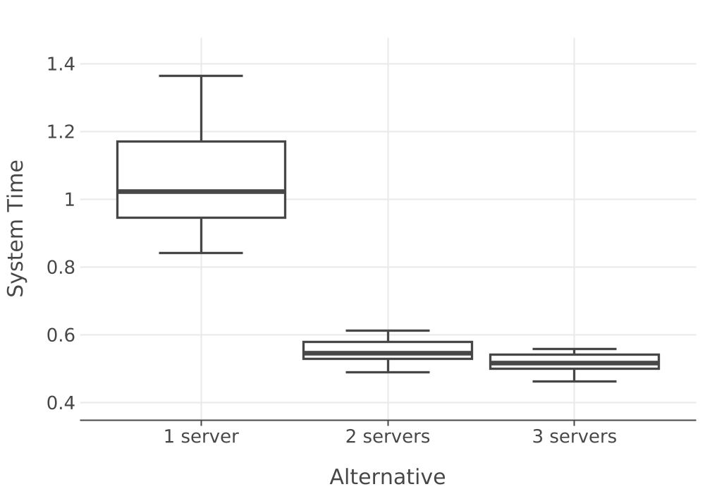
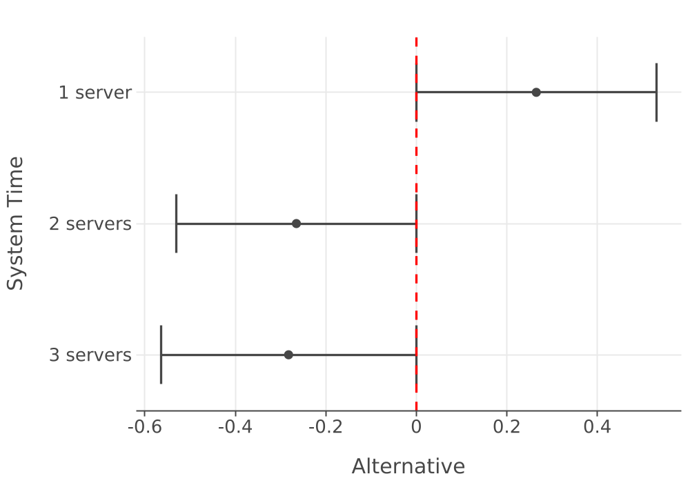
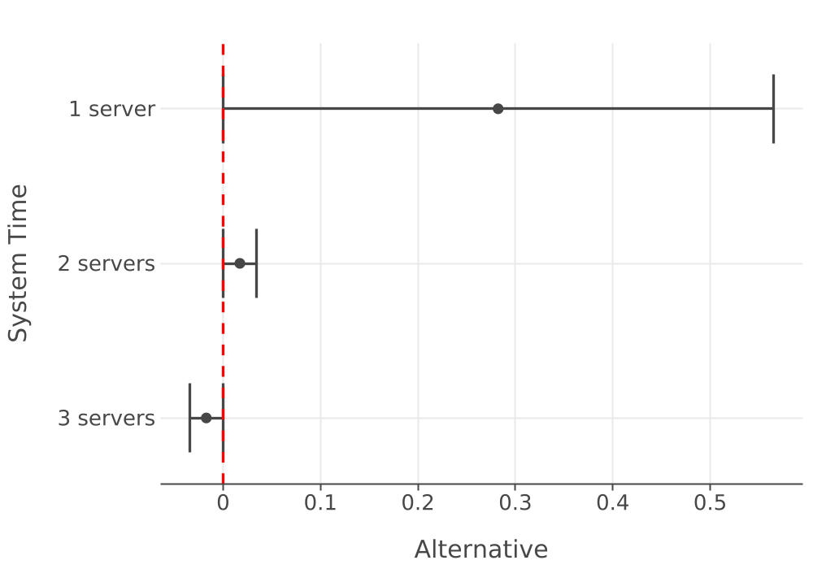

# Scenario Comparison — System Time

## System Time

**Alternative Statistics**

|Name| Count| Average| Std Dev| Std Error| Half-Width| Conf Level| CI Lower| CI Upper| Min| Max|
|:---| ---:| ---:| ---:| ---:| ---:| ---:| ---:| ---:| ---:| ---:|
|1 server| 30.0000| 1.0822| 0.1776| 0.0324| 0.0663| 0.9500| 1.0159| 1.1485| 0.8426| 1.6251|
|2 servers| 30.0000| 0.5520| 0.0331| 0.0060| 0.0124| 0.9500| 0.5396| 0.5643| 0.4900| 0.6127|
|3 servers| 30.0000| 0.5175| 0.0251| 0.0046| 0.0094| 0.9500| 0.5081| 0.5269| 0.4624| 0.5598|

### Response Distributions

### Pairwise Differences

**Pairwise Difference Statistics (CL = 0.95)**

|Pair| Count| Mean Diff| Std Dev| Half Width| CI Lower| CI Upper|
|:---| ---:| ---:| ---:| ---:| ---:| ---:|
|1 server - 2 servers| 30| 0.5303| 0.1518| 0.0567| 0.4736| 0.5870|
|1 server - 3 servers| 30| 0.5647| 0.1653| 0.0617| 0.5030| 0.6264|
|2 servers - 3 servers| 30| 0.0345| 0.0153| 0.0057| 0.0287| 0.0402|

### MCB Max Intervals

Indifference delta: 0.0  |  Best (max): 1 server

**MCB Max Intervals (delta = 0.0)**

|Alternative| Lower| Upper| Possible Best|
|:---| ---:| ---:| :---|
|1 server| 0.0000| 0.5303| true|
|2 servers| -0.5303| 0.0000| false|
|3 servers| -0.5647| 0.0000| false|

### MCB Min Intervals

Indifference delta: 0.0  |  Best (min): 3 servers

**MCB Min Intervals (delta = 0.0)**

|Alternative| Lower| Upper| Possible Best|
|:---| ---:| ---:| :---|
|1 server| 0.0000| 0.5647| false|
|2 servers| 0.0000| 0.0345| false|
|3 servers| -0.0345| 0.0000| true|

### Screening

Probability of correct selection: 0.95

**Screening for Maximum (PCS = 0.95)**

|Alternative| Survives Screening for Maximum|
|:---| :---|
|1 server| true|
|2 servers| false|
|3 servers| false|

**Screening for Minimum (PCS = 0.95)**

|Alternative| Survives Screening for Minimum|
|:---| :---|
|1 server| false|
|2 servers| false|
|3 servers| true|

