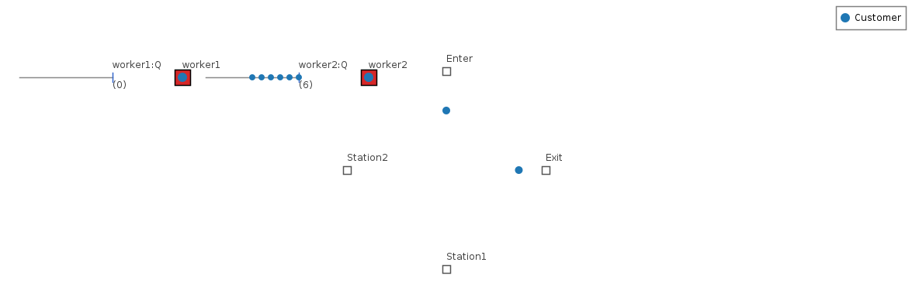
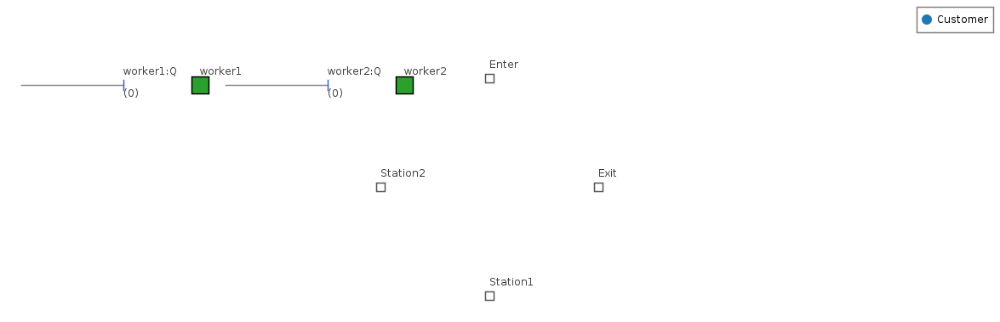
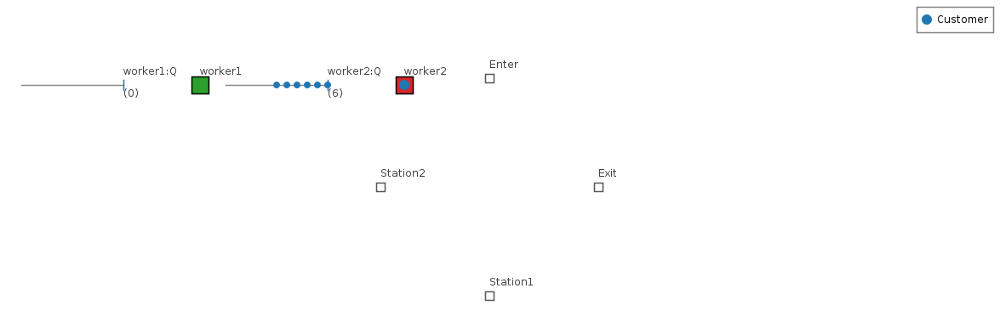

# Animation App — User Guide

The **Animation app** turns a KSL simulation run into a **visual, replayable
animation** — you watch entities move, queues fill and drain, and resources go
busy and idle over simulated time. It follows one workflow across four tabs:
**Capture → Run → Layout → Replay**. Run your model to record a trace, lay out
where things sit on a canvas, then press **Play**.

> **You will need:** Java 21 and a model **bundle** in your workspace. This guide
> uses **TandemQueueWithUnconstrainedMovement** from the KSL book-models bundle —
> a two-station queue where customers *walk* between stations, so there's real
> movement to watch. New to KSL desktop apps? Skim
> [Common UI & concepts](common-ui.md) first.

## What you'll be able to do

- Launch the Animation app and load a model from a **bundle**.
- Record an **animation trace** by running the model in-app.
- Produce a visual **layout** automatically from the run (and tweak it).
- **Replay** the run — play, pause, scrub, loop, and change speed — and read what
  the moving picture is telling you.
- Know where your traces and layouts are saved, and how to reopen them.

---

## 1. At a glance

The whole app is **one window with four tabs**, worked left to right. A **Next: …**
banner under the model bar and a **✓** on each finished tab nudge you along, but
the tabs are never locked — you can revisit any stage.

| Tab | What you do there |
|---|---|
| **Capture** | Choose *what* and *when* to record (defaults record everything). |
| **Run** | Run the model; it writes an animation **trace** (`.atf`). |
| **Layout** | Get a visual **layout** — **Auto Layout** from the run, or place elements by hand. |
| **Replay** | Pair a trace with a layout and **watch it play**. |

The payoff is the Replay canvas. Here is a real frame from this guide's tutorial —
customers (blue dots) walking between two workers, **worker2** busy (red) with a
six-deep queue while **worker1** (green) sits idle:



| Use **this app** when… | Use a sibling app when… |
|---|---|
| You want to **see** how your model behaves — movement, queues, utilization over time. | You want the **numbers** from one run → [Single-Model app](single.md) |
| You're explaining or debugging a model's dynamics visually. | You want to **compare** configurations or optimize → [Scenario](scenario.md) / [Simopt](simopt.md) |

---

## 2. Before you begin

The app has **no models built in** — it discovers **bundle JARs** from your
workspace. Build the KSL book-models bundle and drop it where the app looks:

```bash
./gradlew :KSLExamples:bookExamplesBundleJar
# → KSLExamples/build/libs/book-examples.jar
mkdir -p ~/Documents/KSLWork/bundles
cp KSLExamples/build/libs/book-examples.jar ~/Documents/KSLWork/bundles/
```

The app watches `<KSLWork>/KSLAnimation/bundles/` and `<KSLWork>/bundles/` (where
`<KSLWork>` is `~/Documents/KSLWork`, or `~/KSLWork` if you have no `Documents`
folder). New to bundles? See [Bundle Tools](bundle-tools.md).

**Launch the app:**

```bash
./gradlew :KSLAppSwingAnimation:run
```

Unlike the Single-Model app, it does **not** pop a model picker at startup — the
window opens on **"No model loaded."** with an **Open Model…** button in the model
bar. You'll load the model in [Step 1](#step-1--load-a-model). Everything the app
writes goes under `<KSLWork>/KSLAnimation/<ModelName>/`; change the root any time
from **File ▸ Set Working Directory…**.

---

## 3. A guided tour of the window

- **Model bar** (top) — the loaded **Bundle ▸ Model** dropdown (or "No model
  loaded." + **Open Model…**). Switching models here reopens the app on the new
  model.
- **Workflow banner** — a one-line **Next: …** hint that tracks the four stages.
- **The four tabs** — *Capture*, *Run*, *Layout*, *Replay*. A tab title gains a
  **✓** once that stage is done (e.g. Run is ✓ once a trace exists).
- **Menus** — **File** (open/save a config, **Open Model…**, Set Working
  Directory, Recent), **Bundles** (**Load JAR…**, Open Model…), **Layout** (Auto
  Layout, Layout from Model, Open/Save/Save As…), **View** (light/dark theme).
- **Workspace status bar** (bottom) — your current working directory.

Two things are worth knowing up front. First, a run produces **only a trace**; the
**layout is a separate document** you author on the Layout tab — so the app tracks
*two* files with *two* unsaved-changes markers. Second, a layout binds to a trace
**by element name**, so one trace can be viewed through several layouts, and one
layout reused across runs.

---

## 4. Tutorial — animate the tandem queue

### Step 1 — Load a model

Choose **Bundles ▸ Open Model…**. In the picker, select the **KSL Book Examples**
bundle and the **TandemQueueWithUnconstrainedMovement** model, then **Pick**. (If
the picker is empty, the bundle isn't in your workspace — see
[§2](#2-before-you-begin), or use **Bundles ▸ Load JAR…** to load
`book-examples.jar` directly.) The model bar now shows the model, and the tabs
come alive.

### Step 2 — Capture (accept the defaults)

Open the **Capture** tab. It controls *what* and *when* the next run records. The
default — **"Capture all elements"** for the whole run — records everything, so for
a first animation you can **leave it as is** and move on. (Later you can switch to
*Capture only selected elements* and Include/Exclude specific queues, resources, or
responses, or tick **Limit capture to a time window** to record just part of a long
run.)

### Step 3 — Run the model

Open the **Run** tab and click **Simulate**. Optionally set the number of
replications, run length, and warm-up first (the animation records **replication
1**). The app runs the model and writes a timestamped trace —
`…_yyyyMMdd-HHmmss.atf` — into `<Model>/traces/`. When it finishes you'll be asked
*"Simulation complete… Open it in the Replay tab now?"* — you can say yes, but
first let's make a layout.

> The five **Capture flow field / paths / velocity / force / pulses** checkboxes on
> the Run toolbar are teaching overlays for **agent-based / spatial** models; they
> are off by default and add no cost to an ordinary run.

### Step 4 — Lay it out automatically

Open the **Layout** tab and click **Auto Layout**. The app mines the run you just
recorded for real positions and the model's geometry and produces a layout — the
two workers, their queues, and the station markers, placed on the canvas:



That's the **structure**; the moving entities appear only during Replay. You can
stop here, or hand-edit: drag a glyph to move it, double-click it to open its
editor (position, queue direction/spacing, resource images, or show a response as a
**bar / plot / histogram**), or use the **Add ▸** toolbar to place a queue
(click head then tail), a background image, a path, a clock, or a text label. When
you're happy, **Layout ▸ Save** writes a `.lay.toml` into `<Model>/layouts/`.

### Step 5 — Replay and watch

Open the **Replay** tab. Pick your **Trace** (the run you just made) and a
**Layout** (*Active layout (editing)*, *Auto layout*, or a saved file), then click
**Load**. Press **Play** on the transport bar.

Now you can read the dynamics. Early on, both workers are busy and customers are in
transit between stations; as arrivals outpace **worker2**, a queue builds in front
of it while **worker1** idles — the bottleneck is visible at a glance:



**Transport controls:** ▶ **Play** / ⏸ **Pause**, ⏹ **Stop** (rewind to the
start), a **scrubber** to jump to any time, a **Speed** selector (`0.25×…100×`, or
*Auto* to fit a long run into ~25 seconds of playback), a **Loop** toggle, and
**in `[` / out `]`** points to focus on and loop a slice of the run. The **View**
bar adds *Show grid*, *Fit*, *Zoom*, and (for agent models) overlay toggles.

That's the full loop: **run → auto-layout → replay**. To animate a different model,
**Open Model…** and repeat.

---

## 5. Reference — the four tabs

### Capture

Authors a **CaptureSpec** for the next run. **Mode**: *Capture all elements*
(default) or *Capture only selected elements*. In selected mode, one table per
element kind (queues, resources, responses split into tally and time-weighted, …)
lets you set each element to **Default / Include / Exclude**, with bulk
Include/Exclude/Clear buttons. **Time window**: tick *Limit capture to a time
window* and set start/end to record only part of a run. A validation strip flags
an empty or contradictory selection. For most animations the default is right.

### Run

The Simulate/Cancel toolbar over the shared parameter editor. Set **replications,
run length, warm-up**, plus **Controls** and **Random Variables** override
sub-tabs when the model exposes them, and an output/analysis name. **Simulate**
builds the model fresh, runs it with your capture settings, and writes the `.atf`
trace; **Cancel** stops a run. The five overlay-capture checkboxes record
agent-model teaching data (velocity/force vectors, flow field, planned paths,
marker pulses) — off by default.

### Layout

The visual editor; the canvas is the main surface and doubles as a static preview.
Get a layout three ways: **New (blank)**, **Auto Layout** (mines the latest trace
for real positions, falling back to the model scaffold), or **Layout from Model**
(model structure only, ignoring runs). Then edit:

- **Place** elements from the **Add ▸** toolbar — queue (head→tail click), resource,
  station, location, response/counter, movable resource, plus **Path**, **Image**,
  **Storage**, **Text**, **Clock**, **Conveyor**. Press **Esc** to cancel a placement.
- **Manipulate** on the canvas — click to select, drag to move, rubber-band to
  multi-select, drag grips to rotate a queue or resize a shape, **Delete** to remove,
  **double-click** to open an element's editor.
- **Style** — resource idle/busy images, a response shown as value/bar/plot/summary/
  histogram, per-entity-type object colors and shapes, agent state colors, spaces and
  obstacles (in the **⊞ Elements…** dialog).
- **Save/Open** — `.lay.toml` (default) or `.lay.json`, under `<Model>/layouts/`.

### Replay

Pairs a **trace** with a **layout** (bind by name, so mix and match) and plays it.
**Trace** and **Layout** combos + **Load**; a compatibility read-out reports how the
two line up. The **transport bar** (Play/Pause, Stop, scrubber, Speed, Loop, in/out
focus, time read-out) drives a `PlaybackController` that advances the canvas through
the trace's time range. The **View** bar toggles grid, paths, vectors, pulses,
station contents, and fit/zoom.

---

## 6. Common tasks

| Task | How |
|---|---|
| Animate a different model | **Bundles ▸ Open Model…** (or **Load JAR…** first) |
| Re-run with new settings | **Run** tab → adjust parameters → **Simulate** (writes a new trace) |
| Get a layout without editing | **Layout** tab → **Auto Layout** |
| Reuse a layout across runs | Save it (`Layout ▸ Save`), then pick it in the Replay **Layout** combo |
| Watch just part of a long run | Replay **in `[` / out `]`** focus + **Loop**, or a Capture **time window** |
| Speed up / slow down playback | Replay **Speed** selector (or **Auto**) |
| Just watch an existing trace | Use the lightweight **Animation Viewer** (open a `.atf` + its `.lay.*`) — no capture/run/layout |
| Change where files are saved | **File ▸ Set Working Directory…** |

> Files live under `<KSLWork>/KSLAnimation/<ModelName>/`: `traces/` (`.atf`),
> `layouts/` (`.lay.toml`/`.lay.json` + `images/`), `configs/` (run configs), and
> `output/` (KSL run output). Switch to the Replay tab (or **Rescan folders**) to
> pick up newly produced files.

---

## 7. Troubleshooting & gotchas

| Symptom | Cause | Fix |
|---|---|---|
| The model picker is empty | No bundle in the workspace. | Build & drop `book-examples.jar` into `<KSLWork>/bundles/` ([§2](#2-before-you-begin)), or **Bundles ▸ Load JAR…**. |
| **Replay** says "No traces yet" | You haven't run the model. | Run once on the **Run** tab; a `.atf` appears in `traces/`. |
| Replay canvas is nearly empty | No layout (or a model with little spatial structure). | Click **Auto Layout**; a non-spatial model animates as queues/resources — that's expected. |
| Newly saved trace/layout isn't listed | The folder list is stale. | **Rescan folders** on the Replay tab (switching to the tab also rescans). |
| Playback crawls (long run) | 1× is real-time-per-unit. | Use **Auto** speed or a higher **Speed**; or focus an in/out slice. |
| **Save Layout** is disabled | There's no layout yet. | Create one first — **New**, **Auto Layout**, or **Layout from Model**. |
| The overlay **Show …** toggles do nothing | They're agent-model features. | They light up only for models that report them, when captured (Run-tab checkboxes). |
| Title shows two `*` markers | The run config and the layout are separate documents. | Save each (**File ▸ Save** for the config, **Layout ▸ Save** for the layout). |

---

## 8. See also

- [Common UI & concepts](common-ui.md) — models & bundles, the workspace, themes.
- The modeling guides behind what you're watching — [`ksl-entity`](../ksl-entity.md)
  (process view & movement), [`ksl-spatial`](../ksl-spatial.md) (locations and
  movement), [`ksl-station`](../ksl-station.md) (station networks),
  [`ksl-agent`](../ksl-agent.md) (agent-based models and the capture overlays).
- The other desktop apps — [Single](single.md) · [Scenario](scenario.md) ·
  [Experiment](experiment.md) · [Simopt](simopt.md) · [Results](results.md).
- [MCP Server](mcp-server.md) — an AI assistant can auto-derive, render, and export
  an animation layout for the desktop app to open.

---

<sub>The animation images on this page are **real frames** rendered headlessly from
a captured `.atf` trace of `TandemQueueWithUnconstrainedMovement` (book-models
bundle) through the app's own `SimulationCanvas` — the same picture the Replay tab
draws — via `./gradlew :KSLAppSwingAnimation:renderFrames -Ptrace=<run.atf>`. Point
it at any trace from a traced run to regenerate, so they track the app's rendering.</sub>
