# Animation App — User Guide

The **Animation app** turns a KSL simulation run into a **visual, replayable
animation** — you watch entities move, queues fill and drain, and resources go
busy and idle over simulated time. It follows one workflow across four tabs:
**Capture → Run → Layout → Replay**. Run your model to record a trace, lay out
where things sit on a canvas, then press **Play**.

> **You will need:** Java 21 and a model **bundle** in your workspace. This guide
> uses **TandemQueueWithUnconstrainedMovement** from the KSL Book Examples bundle —
> a two-station queue where customers *walk* between stations, so there's real
> movement to watch. New to KSL desktop apps? Skim
> [Common UI & concepts](common-ui.md) first.

## What you'll be able to do

- Launch the Animation app and load a model from a **bundle**.
- Record an **animation trace** by running the model in-app.
- Produce a visual **layout** automatically from the run (and tweak it).
- **Replay** the run — play, pause, scrub, loop, and change speed — and read what
  the moving picture is telling you.
- Know where your traces and layouts are saved, and how to reopen them.

---

## 1. At a glance

The whole app is **one window with four tabs**, worked left to right. A **Next: …**
banner under the model bar and a **✓** on each finished tab nudge you along, but
the tabs are never locked — you can revisit any stage.

| Tab | What you do there |
|---|---|
| **Capture** | Choose *what* and *when* to record (defaults record everything). |
| **Run** | Run the model; it writes an animation **trace** (`.atf`). |
| **Layout** | Get a visual **layout** — **Auto Layout** from the run, or place elements by hand. |
| **Replay** | Pair a trace with a layout and **watch it play**. |

The payoff is the **Replay** tab. Here is the real app window mid-playback on this
guide's tutorial — a captured trace loaded through an auto-derived layout, a customer
(blue) walking toward **Exit**, and both workers busy (red) with queues of six and
three building behind them, at simulated time **t = 60 of 150**:

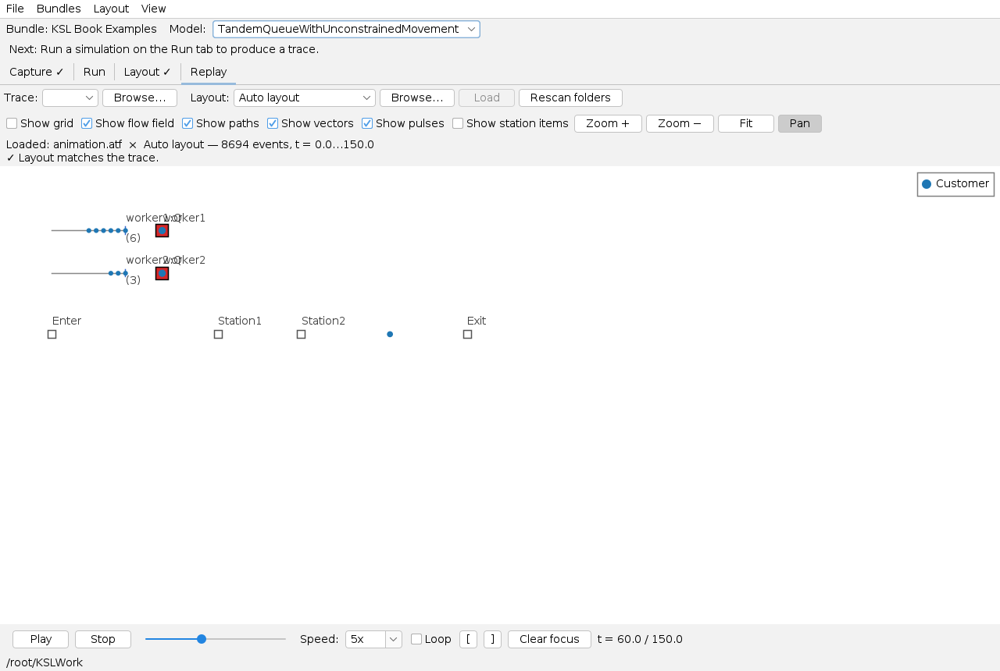

| Use **this app** when… | Use a sibling app when… |
|---|---|
| You want to **see** how your model behaves — movement, queues, utilization over time. | You want the **numbers** from one run → [Single-Model app](single.md) |
| You're explaining or debugging a model's dynamics visually. | You want to **compare** configurations or optimize → [Scenario](scenario.md) / [Simopt](simopt.md) |

---

## 2. Before you begin

The app has **no models built in** — it discovers **bundle JARs**. **You already have
them:** the KSL suite ships the **KSL Animation Examples** (models written to be animated)
alongside the **KSL Book Examples**, so there is nothing to build or copy.

To animate a model of your own, drop its bundle JAR into `<KSLWork>/bundles/` or the app's
own `<KSLWork>/KSLAnimation/bundles/` — where `<KSLWork>` is `~/Documents/KSLWork`, or
`~/KSLWork` if you have no `Documents` folder. New to bundles? See
[Bundle Tools](bundle-tools.md).

**Launch the app:** open **KSL Animation** from Launchpad (macOS) or the Start Menu
(Windows). Not installed yet? See the [installation guide](install.md).

Unlike the Single-Model app, it does **not** pop a model picker at startup — the
window opens on **"No model loaded."** with an **Open Model…** button in the model
bar. You'll load the model in [Step 1](#step-1--load-a-model). Everything the app
writes goes under `<KSLWork>/KSLAnimation/<ModelName>/`; change the root any time
from **File ▸ Set Working Directory…**.

---

## 3. A guided tour of the window

- **Model bar** (top) — the loaded **Bundle ▸ Model** dropdown (or "No model
  loaded." + **Open Model…**). Switching models here reopens the app on the new
  model.
- **Workflow banner** — a one-line **Next: …** hint that tracks the four stages.
- **The four tabs** — *Capture*, *Run*, *Layout*, *Replay*. A tab title gains a
  **✓** once that stage is done (e.g. Run is ✓ once a trace exists).
- **Menus** — **File** (open/save a config, **Open Model…**, Set Working
  Directory, Recent), **Bundles** (**Load JAR…**, Open Model…), **Layout** (Auto
  Layout, Layout from Model, Open/Save/Save As…), **View** (light/dark theme).
- **Workspace status bar** (bottom) — your current working directory.

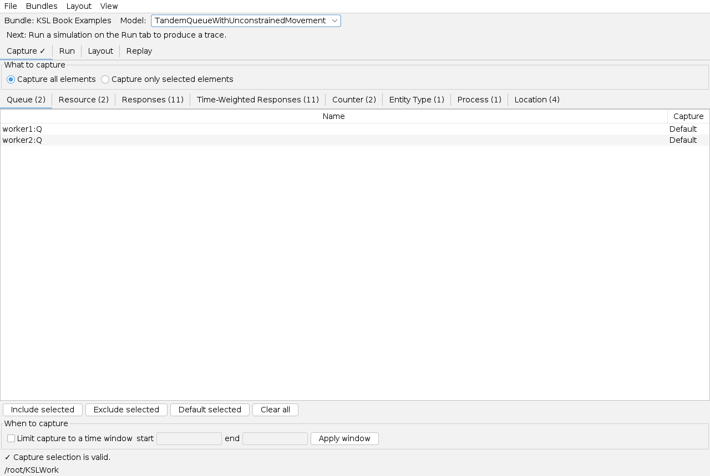

Two things are worth knowing up front. First, a run produces **only a trace**; the
**layout is a separate document** you author on the Layout tab — so the app tracks
*two* files with *two* unsaved-changes markers. Second, a layout binds to a trace
**by element name**, so one trace can be viewed through several layouts, and one
layout reused across runs.

---

## 4. Tutorial — animate the tandem queue

### Step 1 — Load a model

Choose **Bundles ▸ Open Model…**. In the picker, select the **KSL Book Examples**
bundle and the **TandemQueueWithUnconstrainedMovement** model, then **Pick**. (If
the picker is empty, the bundle isn't in your workspace — see
[§2](#2-before-you-begin), or use **Bundles ▸ Load JAR…** to load
`book-examples.jar` directly.) The model bar now shows the model, and the tabs
come alive.

### Step 2 — Capture (accept the defaults)

Open the **Capture** tab. It controls *what* and *when* the next run records. The
default — **"Capture all elements"** for the whole run — records everything, so for
a first animation you can **leave it as is** and move on. (Later you can switch to
*Capture only selected elements* and Include/Exclude specific queues, resources, or
responses, or tick **Limit capture to a time window** to record just part of a long
run.)

### Step 3 — Run the model

Open the **Run** tab and click **Simulate**. Optionally set the number of
replications, run length, and warm-up first (the animation records **replication
1**). The app runs the model and writes a timestamped trace —
`…_yyyyMMdd-HHmmss.atf` — into `<Model>/traces/`. When it finishes you'll be asked
*"Simulation complete… Open it in the Replay tab now?"* — you can say yes, but
first let's make a layout.

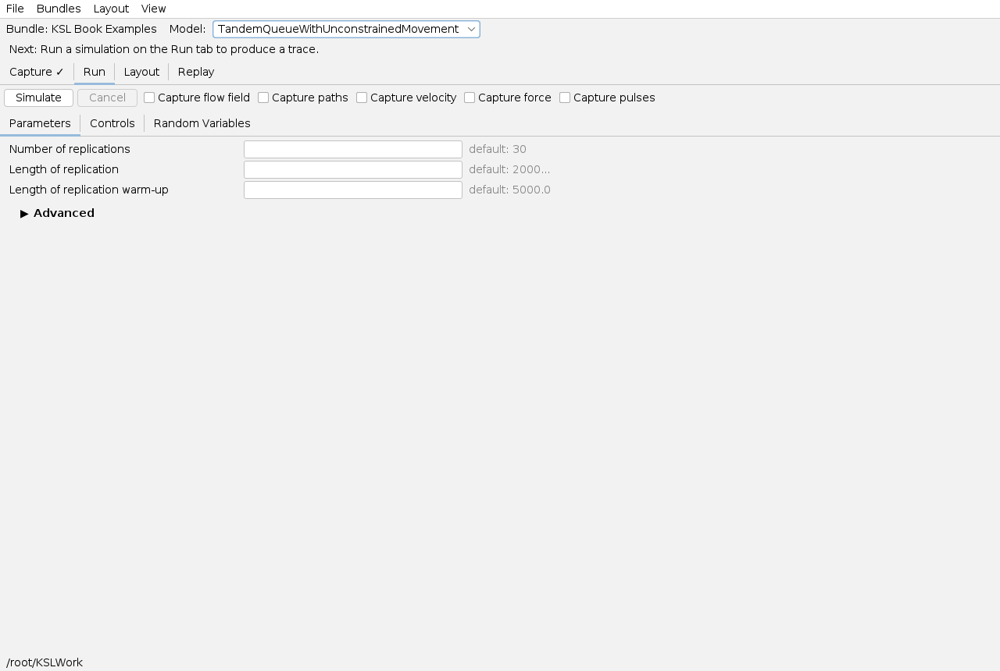

> The five **Capture flow field / paths / velocity / force / pulses** checkboxes on
> the Run toolbar are teaching overlays for **agent-based / spatial** models; they
> are off by default and add no cost to an ordinary run.

### Step 4 — Lay it out automatically

Open the **Layout** tab and click **Auto Layout**. The app mines the run you just
recorded for real positions and the model's geometry and produces a layout — the
two workers, their queues, and the station markers, placed on the canvas:

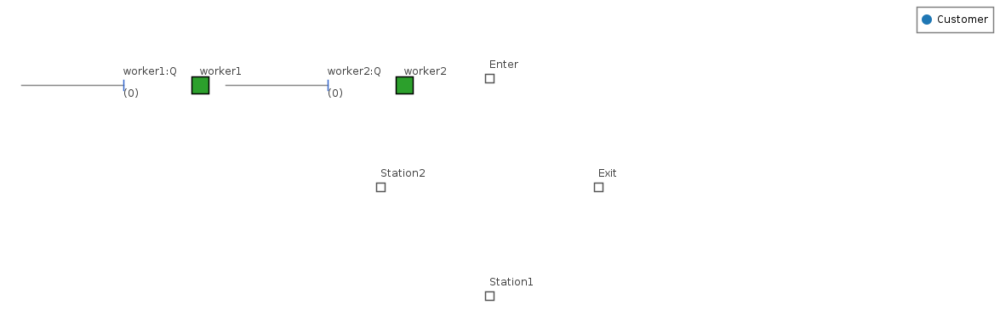

That's the **structure**; the moving entities appear only during Replay. You can
stop here, or hand-edit: drag a glyph to move it, double-click it to open its
editor (position, queue direction/spacing, resource images, or show a response as a
**bar / plot / histogram**), or use the **Add ▸** toolbar to place a queue
(click head then tail), a background image, a path, a clock, or a text label. When
you're happy, **Layout ▸ Save** writes a `.lay.toml` into `<Model>/layouts/`.

### Step 5 — Replay and watch

Open the **Replay** tab. Pick your **Trace** (the run you just made) and a
**Layout** (*Active layout (editing)*, *Auto layout*, or a saved file), then click
**Load**. Press **Play** on the transport bar.

Now you can read the dynamics. Early on, both workers are busy and customers are in
transit between stations; as arrivals outpace **worker2**, a queue builds in front
of it while **worker1** idles — the bottleneck is visible at a glance:

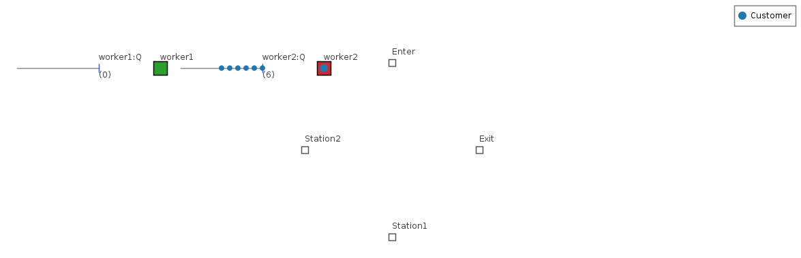

**Transport controls:** ▶ **Play** / ⏸ **Pause**, ⏹ **Stop** (rewind to the
start), a **scrubber** to jump to any time, a **Speed** selector (`0.25×…100×`, or
*Auto* to fit a long run into ~25 seconds of playback), a **Loop** toggle, and
**in `[` / out `]`** points to focus on and loop a slice of the run. The **View**
bar adds *Show grid*, *Fit*, *Zoom*, and (for agent models) overlay toggles.

That's the full loop: **run → auto-layout → replay**. To animate a different model,
**Open Model…** and repeat.

---

## 5. Reference — the four tabs

### Capture

Authors a **CaptureSpec** for the next run. **Mode**: *Capture all elements*
(default) or *Capture only selected elements*. In selected mode, one table per
element kind (queues, resources, responses split into tally and time-weighted, …)
lets you set each element to **Default / Include / Exclude**, with bulk
Include/Exclude/Clear buttons. **Time window**: tick *Limit capture to a time
window* and set start/end to record only part of a run. A validation strip flags
an empty or contradictory selection. For most animations the default is right.

### Run

The Simulate/Cancel toolbar over the shared parameter editor. Set **replications,
run length, warm-up**, plus **Controls** and **Random Variables** override
sub-tabs when the model exposes them, and an output/analysis name. **Simulate**
builds the model fresh, runs it with your capture settings, and writes the `.atf`
trace; **Cancel** stops a run. The five overlay-capture checkboxes record
agent-model teaching data (velocity/force vectors, flow field, planned paths,
marker pulses) — off by default.

### Layout

The visual editor; the canvas is the main surface and doubles as a static preview.
Get a layout three ways: **New (blank)**, **Auto Layout** (mines the latest trace
for real positions, falling back to the model scaffold), or **Layout from Model**
(model structure only, ignoring runs). Then edit:

- **Place** elements from the **Add ▸** toolbar — queue (head→tail click), resource,
  station, location, response/counter, movable resource, plus **Path**, **Image**,
  **Storage**, **Text**, **Clock**, **Conveyor**, and, for a model with a guide path,
  **Guide Path** and **Transporter** ([§8](#8-vehicles)). Press **Esc** to cancel a placement.
- **Manipulate** on the canvas — click to select, drag to move, rubber-band to
  multi-select, drag grips to rotate a queue or resize a shape, **Delete** to remove,
  **double-click** to open an element's editor.
- **Style** — resource idle/busy images, a response shown as value/bar/plot/summary/
  histogram, per-entity-type object colors and shapes, agent state colors, spaces and
  obstacles (in the **⊞ Elements…** dialog).
- **Save/Open** — `.lay.toml` (default) or `.lay.json`, under `<Model>/layouts/`.

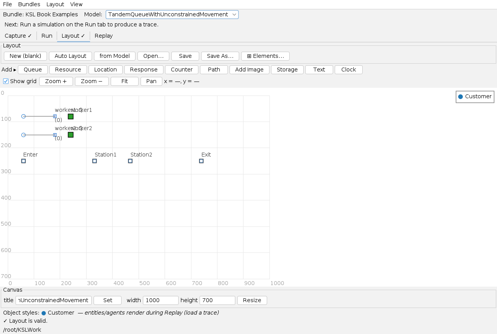

### Replay

Pairs a **trace** with a **layout** (bind by name, so mix and match) and plays it.
**Trace** and **Layout** combos + **Load**; a compatibility read-out reports how the
two line up. The **transport bar** (Play/Pause, Stop, scrubber, Speed, Loop, in/out
focus, time read-out) drives a `PlaybackController` that advances the canvas through
the trace's time range. The **View** bar toggles grid, paths, vectors, pulses,
station contents, and fit/zoom.

---

## 6. Common tasks

| Task | How |
|---|---|
| Animate a different model | **Bundles ▸ Open Model…** (or **Load JAR…** first) |
| Re-run with new settings | **Run** tab → adjust parameters → **Simulate** (writes a new trace) |
| Get a layout without editing | **Layout** tab → **Auto Layout** |
| Reuse a layout across runs | Save it (`Layout ▸ Save`), then pick it in the Replay **Layout** combo |
| Watch just part of a long run | Replay **in `[` / out `]`** focus + **Loop**, or a Capture **time window** |
| Speed up / slow down playback | Replay **Speed** selector (or **Auto**) |
| Just watch an existing trace | Use the lightweight **Animation Viewer** (open a `.atf` + its `.lay.*`) — no capture/run/layout |
| Change where files are saved | **File ▸ Set Working Directory…** |

> Files live under `<KSLWork>/KSLAnimation/<ModelName>/`: `traces/` (`.atf`),
> `layouts/` (`.lay.toml`/`.lay.json` + `images/`), `configs/` (run configs), and
> `output/` (KSL run output). Switch to the Replay tab (or **Rescan folders**) to
> pick up newly produced files.

---

## 7. Troubleshooting & gotchas

| Symptom | Cause | Fix |
|---|---|---|
| The model picker is empty | No bundle in the workspace. | Build & drop `book-examples.jar` into `<KSLWork>/bundles/` ([§2](#2-before-you-begin)), or **Bundles ▸ Load JAR…**. |
| **Replay** says "No traces yet" | You haven't run the model. | Run once on the **Run** tab; a `.atf` appears in `traces/`. |
| Replay canvas is nearly empty | No layout (or a model with little spatial structure). | Click **Auto Layout**; a non-spatial model animates as queues/resources — that's expected. |
| Newly saved trace/layout isn't listed | The folder list is stale. | **Rescan folders** on the Replay tab (switching to the tab also rescans). |
| Playback crawls (long run) | 1× is real-time-per-unit. | Use **Auto** speed or a higher **Speed**; or focus an in/out slice. |
| **Save Layout** is disabled | There's no layout yet. | Create one first — **New**, **Auto Layout**, or **Layout from Model**. |
| The overlay **Show …** toggles do nothing | They're agent-model features. | They light up only for models that report them, when captured (Run-tab checkboxes). |
| A vehicle model's trace is large and slow to load | Most of it is response observations, not vehicles. | Capture selected elements, or a time window ([§8](#8-vehicles)). |
| Title shows two `*` markers | The run config and the layout are separate documents. | Save each (**File ▸ Save** for the config, **Layout ▸ Save** for the layout). |

---

## 8. Vehicles

Models built with `ksl.modeling.guidedpath`, `fleet` and `agv` animate like any other: run, lay out,
replay. The **KSL Vehicle Examples** bundle ships ten of them, each with a layout.

**What you see.**

- **The guide path**, drawn from the model itself, so it appears with no layout at all: links between
  intersections, a tick at each zone boundary, an arrow on a one-way link, spurs drawn lighter. A
  guide path that climbs is separated into floors.
- **Carts**, moving zone by zone. A cart that is standing still *stays* still: it is not slid toward
  its next zone while it waits. That stillness is what congestion looks like.
- **Why a cart is still.** A cart ringed **red is blocked** (the space ahead is taken); a cart ringed
  **grey is halted** (a breakdown, a flat battery, a gate). An unringed still cart is simply idle. The
  two ringed kinds mean opposite things about a design, so they never look alike.
- **Closures**, shaded on the zones they hold: faint while the closure is still draining, solid once it
  holds. Without the shading a cart stopped by a spill or a maintenance window would be stopped by
  space that looks empty.
- **Loads on the cart carrying them**, with a count beside the cart when more than one is aboard. A
  load aboard is not drawn again in the queue that also records it.
- **Assignments**, on request: tick **Show assignments** in the Replay view bar for a faint line from
  each assigned vehicle to its next stop, the pickup until its load is aboard and then the drop-off. It
  says why *that* vehicle is heading there rather than a nearer one. Off by default, since with several
  vehicles the lines cross the canvas. (A web page asks for them with `data-ksl-assignments="true"`.)
- **Free-path fleets** draw their vehicles as movers, ringed orange while charging and grey when failed,
  flat, under tow or out of service.

A fleet's own bookkeeping (its availability and task queues, its dispatcher and vehicle agents, each
vehicle's body as a resource) is not placed by Auto Layout. It is still in the trace and can be placed
by hand.

**Congestion statistics** per link and per zone are off by default, since a network of a thousand zones
would otherwise put a thousand responses in every picker and report; the system-wide ones are always
there. To plot congestion on a particular link or zone, the model must turn them on
(`collectLinkStatistics` / `collectZoneStatistics` on the guide path system) before the run.

**Laying one out.** In the Layout tab, **Guide Path** places and styles a guide path as a whole, since
its shape comes from the model: offset, scale, the **floor offset** that separates floors, link and
closure colours, zone ticks and intersection markers. The form opens on what Auto Layout would give the
path, so accepting it unchanged is a sensible start. **Transporter** sets a cart's shape, size and colour,
and optional colours for loaded, blocked and halted; leave blocked or halted blank to keep the ring. The
static preview draws the guide path, and each transporter at its home base, before any run.

**Capturing a long run.** Only one replication is animated, so the Run tab opens a model at **one
replication** even when the model itself defaults to ten or twenty; a saved configuration that states a
count keeps it. Before every **Simulate** the app runs the model briefly to measure how much trace the run
would write. When that is more than about 500 MB it says so and offers a specific shorter run, named in the
model's own time unit, that writes about 25 MB: for the test-and-repair shop, **Run 3,300 minutes**, about
seven shifts, which is plenty to watch. It changes only the replication length on the Run tab, and sets the warm-up to 0. **Run
anyway** and **Cancel** are the other choices. A model built for a year-long study, such as the
test-and-repair shop on a guide path, would otherwise write gigabytes and never finish.

To keep a long run, capture only what you want to watch (Capture ▸ *Capture only selected elements*,
with the guide path and the fleet included; a guide path brings its transporters with it) or a time
window. Response observations are often most of a vehicle model's trace. Selecting *leaves out* what you
did not choose, so include anything you mean to plot. A few statistics are left out unless you ask for them,
and the Capture tab shows them as **Default (off)**: a guide path's counts of zone traversals and events
scheduled, which change thousands of times a shift and draw nothing. Set one to **Include** to record it.

---

## 9. Gallery — what a polished layout looks like

Everything above produces a layout **automatically**. Auto Layout mines the run for
what it can — flow order, real positions, where each machine stands, the routes
entities took — and that is usually enough to understand a model. Turning one into
something worth *showing* is a further pass of deliberate work: renaming what a
reader would not recognise, hiding the labels that only repeat their neighbours,
sizing elements to the arrangement, and saying in a caption what the picture is of.

These six are among the fifteen models the KSL animation bundle ships, each after that pass. Every one is
a committed `.lay.toml` in [`docs/animations/layouts`](../../animations/layouts), produced by a script that
records why every change was made, and every one **installs with the suite** — with a model open, use
**Layout ▸ Use Shipped Layout** to load the polished layout for it. It opens as a new unsaved document, so
the shipped copy stays as it is and your first *Save* goes to your own workspace.

**Test & repair shop, with transport workers** — five stations placed from the
model's own distance matrix, the routes parts actually travelled drawn between them,
and three workers (triangles) carrying parts around the shop.

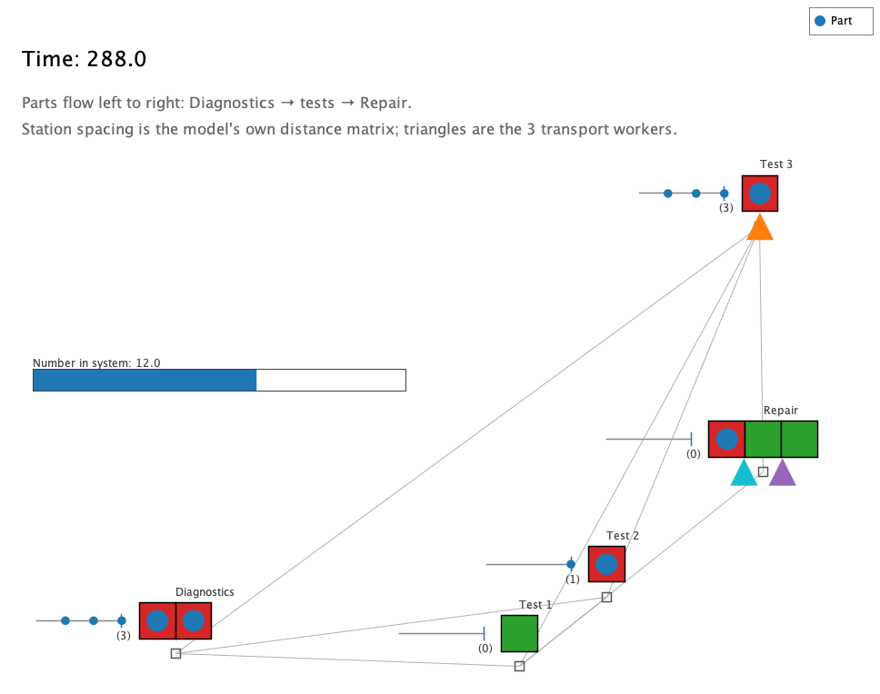

**The same shop, with a loop conveyor** — the transport policy swapped. The belt is
drawn as the loop it is, with each segment's length proportional to the cells the
model declares, so a ride takes as long on screen as it does in the run.

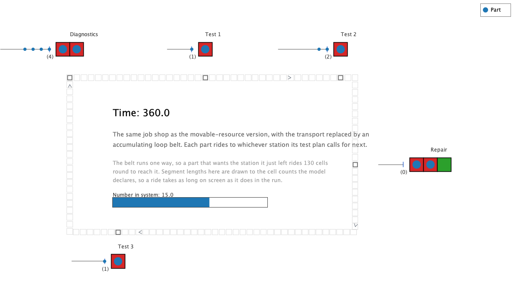

**STEM career fair** — students walk a five-location venue. Where they *stop* is a
bare `delay()` with no geometry of its own; a **storage** bound to the delay's name
is what draws it, as a crowd at the name-tag table and a room full of conversations.

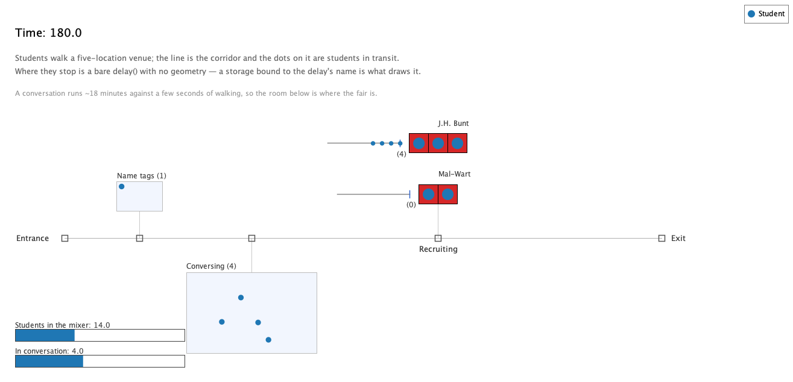

**Tandem queue with blocking** — a single buffer space between two stations. A
blocked server and a busy server look identical in a report; here the queue at the
buffer *is* the blockage, and the annotations say so.

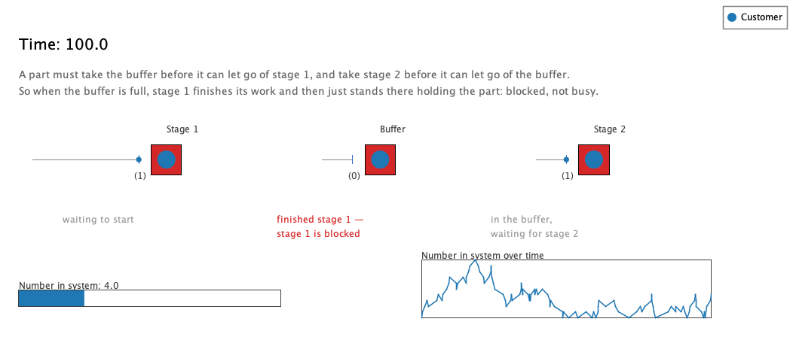

**SIR epidemic on a grid** — an agent model. The colours are the agents' own reported
states, and the three bars share one scale, so their crossover is the epidemic
peaking.

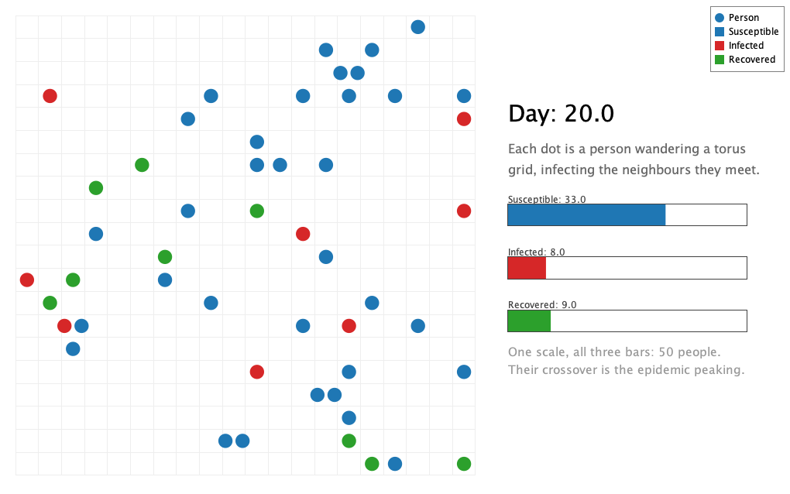

**Pedestrian crowd** — forty people leaving a room through a three-cell doorway under
social-force dynamics. Blue is where each is going, orange is the force of the crowd
pushing on it, and the wash behind them is the flow field they steer down.

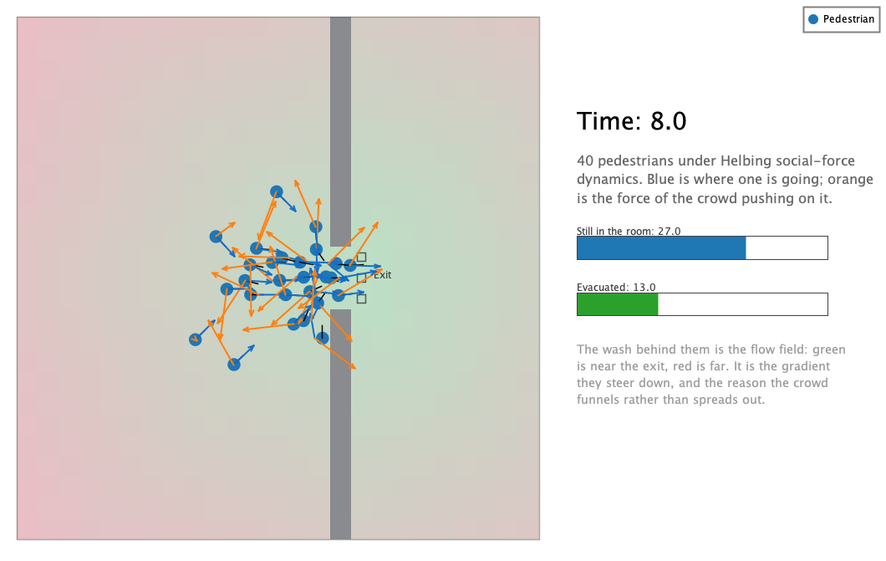

Reproducing any of them takes two commands — one to capture the trace, one to apply
the polish:

```bash
./gradlew :KSLExamples:showcaseCapture -PmodelName=Example13MovableResources -Pout=build/showcase
python3 docs/animations/polish-Example13.py
./gradlew :KSLExamples:publishAnimationLayouts
```

`-PmodelName=list` prints everything capturable. The reusable part — which defects to
look for, and in what order to fix them — is written up in the
[polishing playbook](../../animations/polishing-playbook.md), which also covers doing
the same over the MCP server.

---

## 10. See also

- [Common UI & concepts](common-ui.md) — models & bundles, the workspace, themes.
- The modeling guides behind what you're watching — [`ksl-entity`](../ksl-entity.md)
  (process view & movement), [`ksl-spatial`](../ksl-spatial.md) (locations and
  movement), [`ksl-station`](../ksl-station.md) (station networks),
  [`ksl-agent`](../ksl-agent.md) (agent-based models and the capture overlays).
- The other desktop apps — [Single](single.md) · [Scenario](scenario.md) ·
  [Experiment](experiment.md) · [Simopt](simopt.md) · [Results](results.md).
- [KSL Server](ksl-server.md) — an AI assistant can auto-derive, render, and export
  an animation layout for the desktop app to open.
