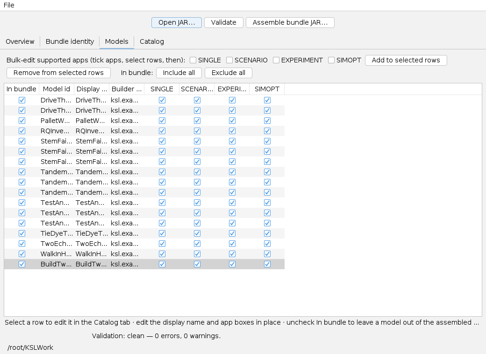
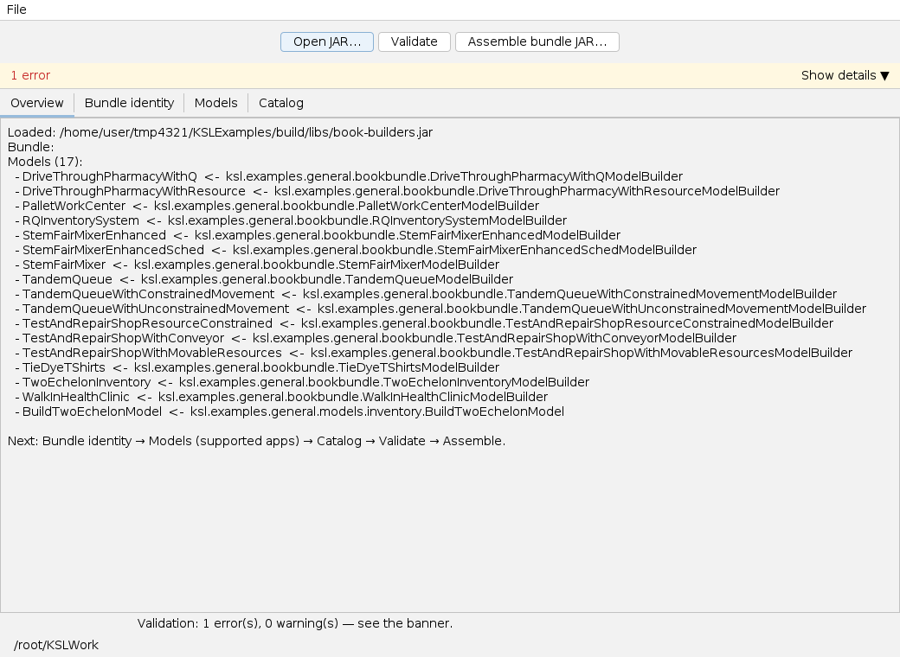
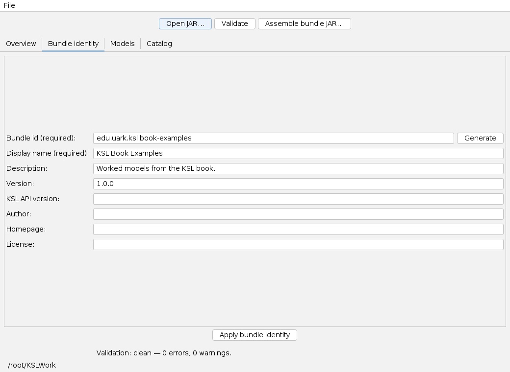
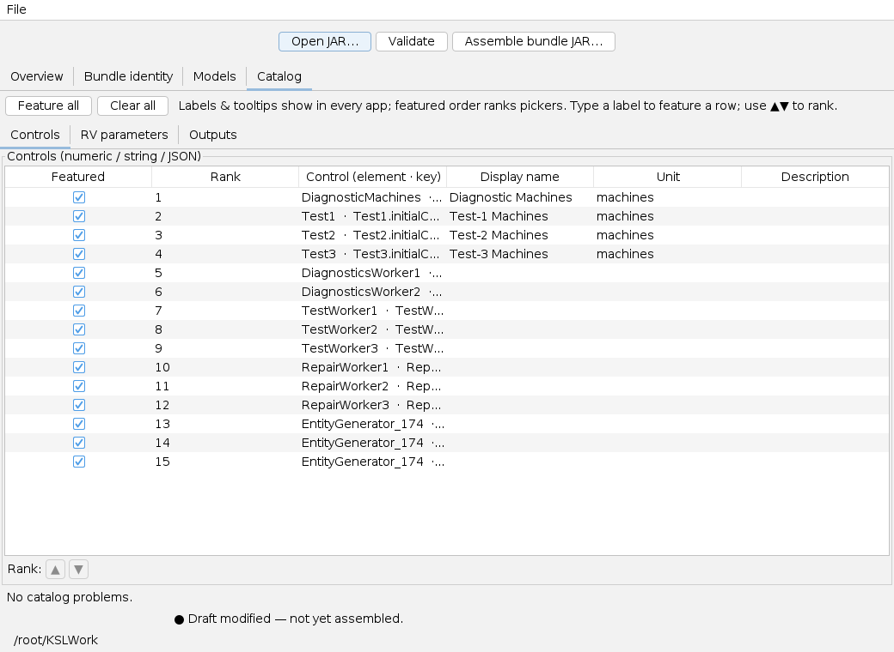
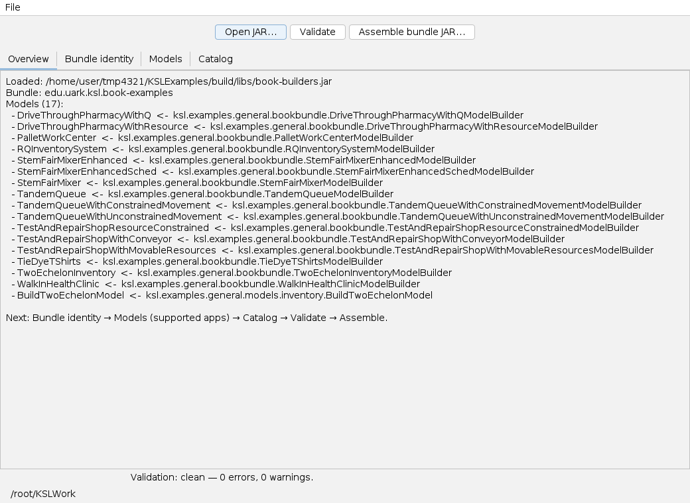

# Bundle Workbench — User Guide

The **Bundle Workbench** turns a **builders JAR** — your compiled model-builder
classes — into a **bundle JAR** that the KSL desktop apps and servers can load. It
walks you through it visually, one step per tab: **open** the builders JAR, give the
bundle an **identity**, declare each model's **supported apps**, curate a **catalog**
of headline inputs and outputs, **Validate**, and **Assemble**. It is the graphical
twin of `kslpkg assemble` — same result, guided and with live validation.

> **You will need:** Java 21 and a **builders JAR** (built below). New to bundles?
> See [Common UI → Models and bundles](common-ui.md#models-and-bundles). Prefer the
> command line? The [Bundle Tools (`kslpkg`)](bundle-tools.md) guide does the same job
> in a terminal.

## What you'll be able to do

- Open a **builders JAR** and see the model builders the workbench discovers in it.
- Give the bundle an **identity** — a required, globally-unique **bundle id** plus a
  display name, version, and optional metadata.
- Declare which **apps** each model supports, and **include or exclude** models from
  the assembled set.
- Curate a **catalog** — feature, label, unit, and rank the inputs and outputs that
  should headline every app's pickers.
- **Validate** the draft and **assemble** a self-describing bundle JAR.

---

## 1. At a glance

The app is **one window**: a toolbar (**Open JAR… · Validate · Assemble bundle
JAR…**) over **four tabs** worked left to right. The **Overview** tab is always
available; the three editing tabs unlock once a JAR is open. An inline **health
banner** and a status line keep you honest as you go.



| Use **this app** when… | Use a sibling when… |
|---|---|
| You have compiled model builders and want to **package them as a bundle**, with validation, in a guided UI. | You just want to **run** a model that's already bundled → [Single](single.md) / [Scenario](scenario.md) / [Experiment](experiment.md) / [Simopt](simopt.md) |
| You're authoring interactively and want to **see** discovery, catalog, and validation. | You want to **script or CI** the same assembly → [`kslpkg` CLI](bundle-tools.md) |

**Builders JAR vs bundle JAR.** A *builders JAR* is just your compiled
`ModelBuilderIfc` classes — no manifest, no metadata. A *bundle JAR* is
self-describing: it adds a `bundle.toml` manifest, a per-model `descriptor.json`
(the model's input/output surface), and your catalog. The workbench reads the first
and writes the second; **your builders JAR is never modified**.

---

## 2. Before you begin

**Build a builders JAR to work with.** This guide uses the KSL book models. From the
repository root:

```bash
./gradlew :KSLExamples:bookBuildersJar
# → KSLExamples/build/libs/book-builders.jar   (17 model builders, no manifest)
```

(That's the same builders JAR the project's own `bookExamplesBundleJar` task feeds to
`kslpkg assemble` — here you'll assemble it by hand instead.)

**Launch the app:**

```bash
./gradlew :KSLAppSwingBundle:run
```

The window opens on the **Overview** tab reading *"Open a builders JAR … to begin"* —
there is no model picker, because the workbench starts from a JAR you choose.
Everything it writes goes under `<KSLWork>/KSLBundleWorkbench/` (where `<KSLWork>` is
`~/Documents/KSLWork`, or `~/KSLWork` if you have no `Documents` folder); change the
root any time from **File ▸ Set Working Directory…**. See
[Common UI & concepts](common-ui.md) for the workspace and themes.

---

## 3. A guided tour of the window

Open `book-builders.jar` (next section) and the window fills in like this:



1. **Toolbar** — **Open JAR…** (load a builders *or* an assembled bundle JAR),
   **Validate** (check the draft), **Assemble bundle JAR…** (write the output). The
   last two are disabled until a JAR is open.
2. **Health banner** — appears when the draft has errors or warnings (here, *"1
   error"* — the required bundle id is still blank) and hides itself when clean.
   **Show details ▾** lists each finding; a finding can jump you to the tab that owns it.
3. **The four tabs** — **Overview** (summary + guided next step), **Bundle
   identity**, **Models**, **Catalog**. The three editing tabs enable only once a JAR
   is open, so the flow is hard to do out of order.
4. **Overview body** — what was loaded, the bundle id, and every discovered model
   (`modelId ← builderClass`), followed by a one-line **Next:** hint.
5. **Status line + workspace bar** (bottom) — the last action's result and your
   current working directory.

Two things to know. The window **title shows `*`** and the status line reads *"●
Draft modified — not yet assembled"* whenever you have edits that aren't written to a
JAR yet — closing then prompts you to Assemble, Discard, or Cancel. And **Open JAR…
auto-detects** what you hand it: a plain builders JAR starts a fresh draft, while an
already-assembled bundle JAR (one carrying a `bundle.toml`) reopens for editing.

---

## 4. Tutorial — assemble the book-examples bundle

### Step 1 — Open the builders JAR

Click **Open JAR…** (or **File ▸ Open JAR…**), choose
`KSLExamples/build/libs/book-builders.jar`, and **Open**. The workbench builds each
discovered builder once to learn its models and lands on **Overview** listing **17
models** (`DriveThroughPharmacyWithQ`, `TandemQueue`, `WalkInHealthClinic`, …). If any
builder failed to build, a **Discovery warnings** dialog names it and the rest
continue. The banner shows **1 error** — you haven't set the required bundle id yet,
which is the next step.

### Step 2 — Set the bundle identity

Open the **Bundle identity** tab and fill in the form. Only two fields are required:

- **Bundle id** — a stable, globally-unique id you choose. A reverse-DNS form is
  recommended (e.g. `edu.uark.ksl.book-examples`); uniqueness is your responsibility
  (there's no central registry). Stuck? Click **Generate** and give it an
  organization/domain — it suggests `<domain>.<jar-name>`.
- **Display name** — what humans see in pickers (e.g. `KSL Book Examples`).

**Version** and the rest (description, KSL API version, author, homepage, license) are
optional. Click **Apply bundle identity**; the banner's error clears and the status
line reads *"Validation: clean."*



### Step 3 — Declare supported apps (and include/exclude models)

Open the **Models** tab — a table with one row per discovered model. Each row carries
an **In bundle** toggle, the read-only **Model id** and **Builder class**, the
editable **Display name**, and a checkbox for each of the four run apps —
**SINGLE, SCENARIO, EXPERIMENT, SIMOPT**. Tick the apps a model is meant for
(SIMOPT, for instance, only makes sense when the model has numeric inputs with bounds
and an objective response).


Editing tips, all in place:

- **Bulk-edit:** tick apps in the top strip, select rows, then **Add to selected
  rows** / **Remove from selected rows**.
- **In bundle:** untick a row (or use **Exclude all** / **Include all**) to drop a
  model from the assembled set *while keeping its builder in the JAR* — the escape
  hatch for a **shared closure** another model delegates to (it must stay resolvable
  at runtime but isn't itself a headline model). In this bundle,
  `BuildTwoEchelonModel` is a good candidate to exclude.
- **Double-click** a row for a detail dialog: rename the **Model id**, and inspect the
  model's **controls, RV parameters, and responses** as a collapsible tree.

Selecting a row also drives the **Catalog** tab, which follows the highlighted model.

### Step 4 — Curate the catalog

Open the **Catalog** tab. The *catalog* is the curated set of **featured** inputs and
outputs that float to the top of every app's pickers — with your labels, units, and
priority order. It has three sub-tabs: **Controls** (numeric/string/JSON), **RV
parameters**, and **Outputs** (responses + counters).



In each family table:

- Tick **Featured** to catalog a row — or just **type a label**, which auto-features
  it (a labelled item is, by definition, in the catalog).
- Edit **Display name / Unit / Description** in place; these show in every app.
- Use **▲ / ▼** to rank featured rows — the order is the priority pickers use.
- **Feature all** / **Clear all** act on the whole selected model at once.

The status line reads **No catalog problems** when the catalog is consistent with the
model's descriptor. The catalog is optional — a bundle with none still assembles — but
it's what makes the run apps pleasant to drive.

### Step 5 — Validate

Click **Validate** any time. The workbench assembles the draft to a *temporary* bundle
and runs the full bundle check — bundle id, model ids, supported apps, catalog, and
builder resolvability — then reports **0 errors, 0 warnings** or lists what's wrong in
the health banner. Fix findings and re-validate until it's clean. (Assemble validates
too, so this step is a preview.)

### Step 6 — Assemble the bundle JAR

Click **Assemble bundle JAR…**. The save dialog defaults to
`book-builders-bundle.jar` in your workspace — rename it (e.g. `book-examples.jar`) and
**Save**. The workbench writes a new, self-describing bundle JAR and confirms *"Wrote
book-examples.jar"*; the title's `*` clears.



### Reading the result

Your new bundle JAR contains a **`bundle.toml`** manifest (identity + per-model
supported apps and catalog) and, per model, a **`descriptor.json`** capturing its
input/output surface — everything a consumer needs **without instantiating a Kotlin
class**. Drop it into `<KSLWork>/bundles/` and the [Single](single.md),
[Scenario](scenario.md), [Experiment](experiment.md), and [Simopt](simopt.md) apps
(and the [MCP](mcp-server.md) / REST servers) will discover and run its models, with
your catalog shaping their pickers.

---

## 5. Reference — the tabs & toolbar

### Toolbar

**Open JAR…** loads a builders JAR (fresh draft) or an assembled bundle JAR (resume
editing), auto-detected. **Validate** assembles to a temp JAR and runs
`BundleValidation`, publishing findings to the health banner. **Assemble bundle
JAR…** writes the output JAR (default `<input-stem>-bundle.jar`); it requires a bundle
id and refuses nothing else silently — problems surface in the banner.

### Overview

A read-only summary: what JAR is loaded, the bundle id, every discovered model as
`modelId ← builderClass`, any skipped builders, and a one-line **Next:** hint. It's the
landing page and the place to confirm discovery.

### Bundle identity

A form over the bundle's identity: **Bundle id** (required, with **Generate**),
**Display name** (required), **Description**, **Version**, **KSL API version**,
**Author**, **Homepage**, **License**. Edits apply on **Apply bundle identity**.

### Models

The master table of discovered models: **In bundle** toggle, **Model id** (read-only),
**Display name** (editable), **Builder class** (read-only), and a boolean column per
**KSLAppKind** (SINGLE / SCENARIO / EXPERIMENT / SIMOPT). A **bulk** strip edits
supported apps across selected rows and includes/excludes all; **double-click** opens a
per-model detail dialog (rename the model id, inspect the descriptor). Selecting a row
drives the Catalog tab.

### Catalog

Per-model catalog authoring, one **table per family** (Controls / RV parameters /
Outputs). Columns: **Featured**, **Rank**, the item, **Display name**, **Unit**,
**Description**. **Feature all** / **Clear all**, **▲ / ▼** ranking, and a live
problem read-out. Featured order is picker priority; labels and units show in every app.

---

## 6. Common tasks

| Task | How |
|---|---|
| Resume editing an assembled bundle | **Open JAR…** the bundle JAR — it's auto-detected and its identity/catalog restored |
| Package your own models | Build a JAR of your `ModelBuilderIfc` classes, then open it here |
| Keep a shared closure out of the model set | Untick **In bundle** for it on the Models tab (its builder stays in the JAR) |
| Suggest a bundle id | **Generate** on the Bundle identity tab → enter your org/domain |
| Do the same thing on the command line | `kslpkg assemble <builders.jar> --id <bundleId> …` — see [Bundle Tools](bundle-tools.md) |
| Change where files are saved | **File ▸ Set Working Directory…** |

> The workbench writes under `<KSLWork>/KSLBundleWorkbench/`; the file dialogs start
> there. Assembled bundles are just JARs — put them wherever the consuming apps look
> (typically `<KSLWork>/bundles/`).

---

## 7. Troubleshooting & gotchas

| Symptom | Cause | Fix |
|---|---|---|
| Banner shows **1 error** right after opening | The **bundle id** is required and starts blank. | Set it on the **Bundle identity** tab (or **Generate** one), then **Apply**. |
| **No model builders found** | The JAR has no `ModelBuilderIfc` classes (or isn't a builders JAR). | Open a real builders JAR; check the class actually implements the builder interface. |
| **Discovery warnings** dialog on open | One or more builders threw while building. | Fix the builder's `build(...)`; the others still load, and the skipped ones are listed on Overview. |
| **Validate / Assemble** are greyed out | No JAR is open. | **Open JAR…** first — the editing tabs and these buttons unlock together. |
| Title shows `*` / *"Draft modified"* | You have edits not yet written to a JAR. | **Assemble bundle JAR…** to persist (or Discard when closing). |
| A model I excluded is still in the JAR | By design — **exclude** drops it from the *model set*, not the *classes*. | That's the shared-closure escape hatch; nothing to fix. |
| The **SIMOPT** box has no effect for a model | Supported apps are declarations, not capabilities. | Only tick apps the model can actually serve (SIMOPT needs bounded numeric inputs + an objective). |

---

## 8. See also

- [Common UI & concepts](common-ui.md) — the workspace, themes, and how the desktop
  apps discover and consume bundles.
- [Bundle Tools (`kslpkg`)](bundle-tools.md) — the command-line companion:
  `inspect` a JAR and `assemble` bundles in scripts and CI.
- The run apps that consume your bundle — [Single](single.md) ·
  [Scenario](scenario.md) · [Experiment](experiment.md) · [Simopt](simopt.md).
- [MCP Server](mcp-server.md) — run the bundled models from an AI assistant.

---

<sub>The window screenshots on this page are captured from the running Swing app by
`./gradlew :KSLAppSwingBundle:screenshotsBundle -Pbuilders=<book-builders.jar>` under
`xvfb-run`, so they regenerate as the app changes. The tutorial opens the real
`book-builders.jar` (17 book model builders) built by
`./gradlew :KSLExamples:bookBuildersJar`.</sub>
