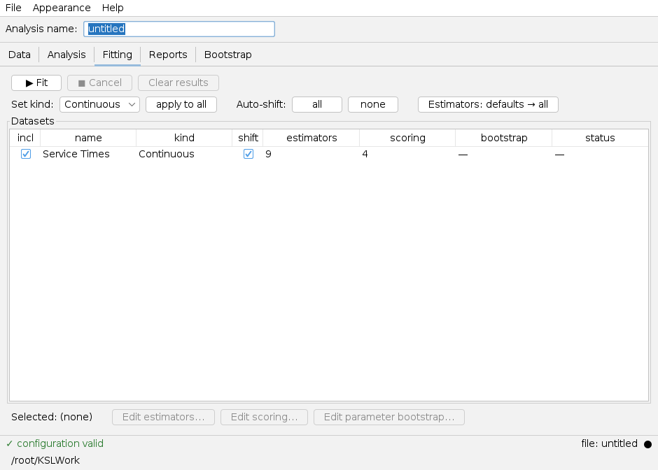
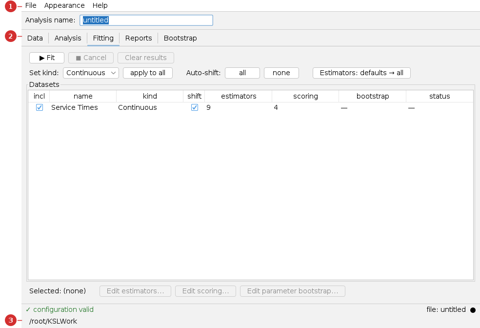
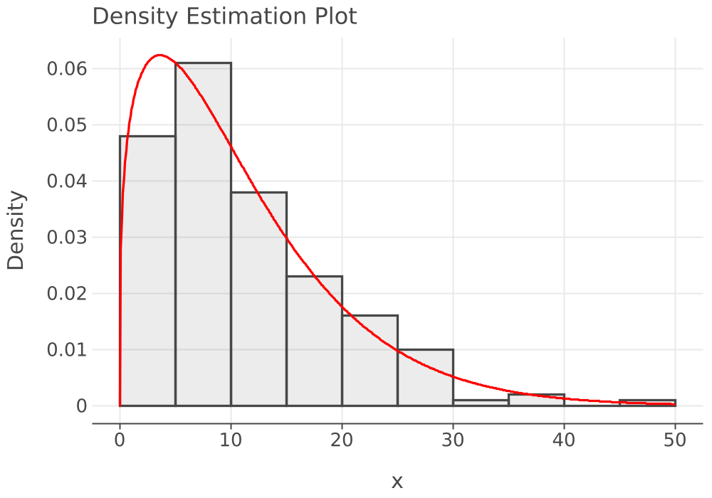

# Distribution Fitting App — User Guide

The **Distribution Fitting app** takes a set of data values and finds the **probability
distribution** that best describes them. You load data, the app fits many candidate
distributions, scores them, and recommends the best one — ready to use as an input model
in a simulation.

> **You will need:** Java 21 and some numeric **data** (a column of values). This guide
> uses a generated sample so you need nothing extra. New here? Read
> [Common UI & concepts](common-ui.md).

## What you'll be able to do

- Load a dataset (from a file, a database, or pasted values).
- Explore it (statistics, histogram, plots).
- Fit and **rank** candidate distributions, and read the recommended fit.
- Read goodness-of-fit results and overlay plots.

---

## 1. At a glance

You move through the tabs **Data → Analysis → Fitting → Reports** (with **Bootstrap** for
resampling). Load data, click **Fit**, and read the ranked results.

| Use **this app** when… | Use a sibling app when… |
|---|---|
| You have **data** and need an input distribution for a model. | You have a *model* and want to run it → [Single](single.md) / [Scenario](scenario.md) |
| You want to know "which distribution fits this?" | You want to analyze *simulation output* → [Results app](results.md) |

---

## 2. Before you begin

You need data. The **Data** tab can import from a delimited file (CSV / whitespace), a
database table, or pasted/inline values. This guide uses **200 generated samples** named
*Service Times*. Each dataset is marked **Continuous** or **Discrete**, which determines
the candidate distributions.

---

## 3. A guided tour of the window

1. **Menu bar** — *File*, *Appearance*, *Help*, plus an **Analysis name** field that
   titles the reports.
2. **Tabs** — *Data*, *Analysis*, *Fitting*, *Reports*, *Bootstrap*.
3. **Status bar** — a validation indicator (*"✓ configuration valid"*), the file name, and
   the working directory.

---

## 4. Tutorial — fit a distribution to service times

### Step 1 — Load the data (Data tab)

On the **Data** tab, add a dataset — *Add from file*, *Load from database*, or paste
values. Confirm its name and that it's marked **Continuous**.

### Step 2 — Explore it (Analysis tab)

Pick the dataset and view its **Statistics**, **Histogram**, observation plot, and ACF.
This is your sanity check before fitting — is the data shaped like something a standard
distribution could match?

### Step 3 — Fit candidate distributions (Fitting tab)

The **Fitting** tab (shown in §1) lists each dataset with its **kind**, an **auto-shift**
flag, and how many **estimators** (9 here) and **scoring** models (4) will be used. Use
**Edit estimators…** / **Edit scoring…** to customize, then click **▶ Fit**. A progress
bar runs and the row's **status** becomes *Done*.

### Reading the results

The app ranks every fitted distribution by a multi-criteria score (BIC, Anderson–Darling,
Cramér–von Mises, and a Q-Q correlation). Below is the genuine ranking for our data — the
same output the **Reports** tab produces:

| Distribution (best first) | BIC | AD | CVM | QQ | Avg Rank |
|:---|---:|---:|---:|---:|---:|
| **Weibull** (shape 1.28, scale 11.82) | 1 | 1 | 1 | 1 | **1.00** |
| Gamma (shape 1.35, scale 8.19) | 2 | 3 | 3 | 2 | 2.50 |
| GeneralizedBeta | 4 | 2 | 2 | 3 | 2.75 |
| Exponential (mean 11.04) | 3 | 5 | 5 | 4 | 4.25 |
| Normal | 6 | 4 | 4 | 6 | 5.00 |

The recommended distribution is a shifted **Weibull(shape ≈ 1.28, scale ≈ 11.82)** (overall
score 0.97). The **density overlay** shows the fitted curve against the data histogram —
a close match:

**How to read it.** Weibull ranks first on all four criteria, so it's the clear
recommendation here. (The data was in fact generated from a Gamma distribution, which ranks
a close second — with only 200 points, Weibull and Gamma are nearly indistinguishable, a
useful reminder that "best fit" is a statistical judgment, not a certainty.) The app also
produces **Q-Q**, **P-P**, and **ECDF** plots and formal goodness-of-fit tests to confirm
the choice.

> The full rendered report — data summary, MODA scoring, all rankings, bootstrap parameter
> estimates, every fit plot, and the goodness-of-fit tests — is at
> [`_generated/distribution-report.md`](_generated/distribution-report.md).

---

## 5. Reference — every tab explained

| Tab | What it's for |
|---|---|
| **Data** | Import datasets (file / database / inline); set each as Continuous or Discrete. |
| **Analysis** | Exploratory analysis of one dataset: statistics, histogram, observation/ACF plots, shift analysis. |
| **Fitting** | Configure estimators and scoring per dataset; run the fit; see per-dataset status. |
| **Reports** | Open the **recommended distribution** or **all fitted distributions** report (HTML). |
| **Bootstrap** | Resample to assess how stable the recommended-family choice is. |

---

## 6. Common tasks

| Task | How |
|---|---|
| Fit several datasets at once | Add them all on **Data**; tick **incl**; **Fit** runs the batch |
| Restrict the candidate distributions | **Edit estimators…** on the Fitting tab |
| Force/disable an automatic shift | The **shift** checkbox / **Auto-shift: all / none** |
| See how confident the family choice is | Run the **Bootstrap** tab |
| Open the recommended-fit report | **Reports** tab → *Recommended distribution* → *Open in browser* |

---

## 7. Troubleshooting & gotchas

| Symptom | Cause | Fix |
|---|---|---|
| A discrete-only distribution won't fit | The dataset is marked **Continuous** (or vice-versa). | Set the correct **kind** on the Data/Fitting tab. |
| The recommended fit looks poor | The data may need a shift, or no standard family fits well. | Enable **auto-shift**; inspect the Q-Q/P-P plots; consider an empirical distribution. |
| Fit produces no results | No datasets included, or none selected. | Tick **incl** for at least one dataset. |
| Top two distributions are nearly tied | Small sample; similar families. | Collect more data, or use the **Bootstrap** tab to judge stability. |

---

## 8. See also

- [Common UI & concepts](common-ui.md) · [Single-Model app](single.md) — uses the fitted distribution as a model input.
- [KSL Book](https://rossetti.github.io/KSLBook/) — input modeling and distribution fitting.

---

Screenshots and the fitting report are generated by
`./gradlew :KSLAppSwingDistribution:screenshotsDistribution` and `:resultsDistribution`
(under `xvfb-run`), so they regenerate when the app changes.
