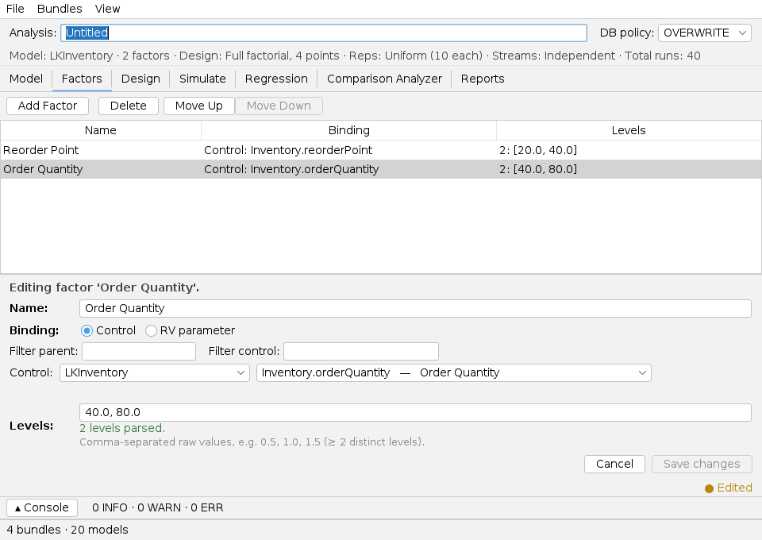
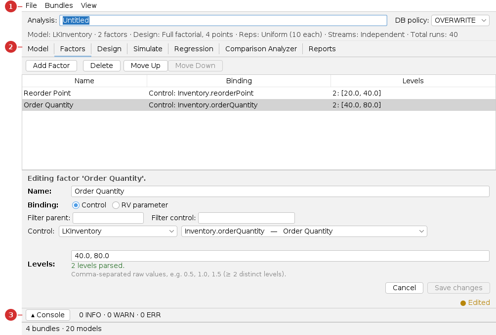
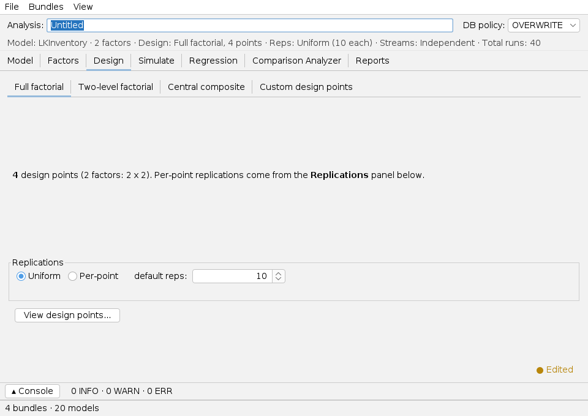
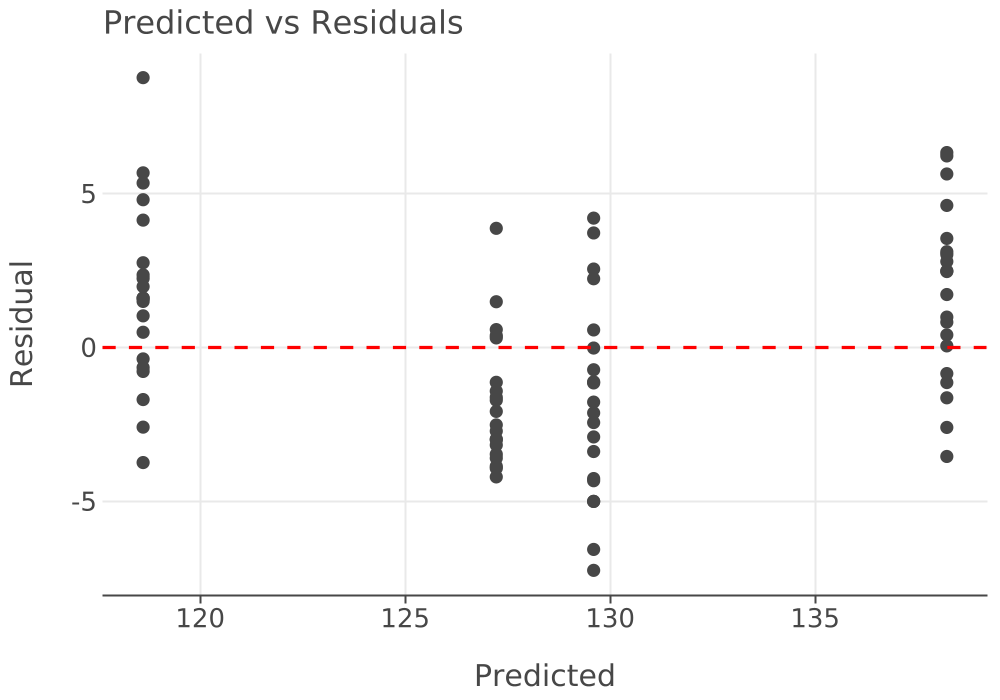

# Designed Experiment App — User Guide

The **Experiment app** runs a **designed experiment**: it varies two or more model
inputs (called *factors*) over a planned grid of values, runs every combination, and
fits a **regression model** so you can see how each factor affects a response.

> **You will need:** Java 21 and a model **bundle**. This guide uses the **LK (s,S)
> inventory** model from the book-models bundle. New here? Read
> [Common UI & concepts](common-ui.md) and the [Single-Model guide](single.md) first.

## What you'll be able to do

- Choose a model and pick the inputs to study as **factors**, each with low/high levels.
- Build a **full-factorial design** and preview its design points.
- Run all design points at once.
- Read a **regression** that quantifies each factor's effect on a response.

---

## 1. At a glance

You move left-to-right through the tabs — **Model → Factors → Design → Simulate →
Regression** — building the study, then reading the fitted model.

| Use **this app** when… | Use a sibling app when… |
|---|---|
| You want to **measure the effect** of inputs over a grid. | You have a few hand-picked configs → [Scenario app](scenario.md) |
| You want a regression / response surface. | You want the *best* inputs found automatically → [Simopt app](simopt.md) |

---

## 2. Before you begin

Load the model from a **bundle** (see [Common UI → Models and bundles](common-ui.md#models-and-bundles)).
Results are written under your working directory. Enabling the database **persists** the
run to SQLite for later analysis (e.g. in the [Results app](results.md)); the in-app
**Comparison Analyzer** and regression work on the most recent run's results in memory and
don't require it.

---

## 3. A guided tour of the window

1. **Menu bar** — *File*, *Bundles*, *View*.
2. **Tabs** — the workflow, left to right: *Model*, *Factors*, *Design*, *Simulate*,
   *Regression*, *Comparison Analyzer*, *Reports*. A **summary banner** under the toolbar
   always shows the current model, factor count, design, replications, and total runs.
3. **Simulate** — runs every design point (on the *Simulate* tab).
4. **Console drawer** — the run log.

---

## 4. Tutorial — a 2×2 factorial on the inventory model

### Step 1 — Pick the model (Model tab)

On the **Model** tab, select the **LK (s,S) Inventory** model. The tab shows its
controls (inputs you can study) and responses (outputs you can measure).

### Step 2 — Define the factors (Factors tab)

Click **Add Factor** for each input to vary. Bind each factor to a model **control** and
give it two levels:

| Factor | Bound control | Levels |
|---|---|---|
| Reorder Point | `Inventory.reorderPoint` | 20, 40 |
| Order Quantity | `Inventory.orderQuantity` | 40, 80 |

The factor editor (lower half of the screenshot in §1) lets you pick the control from a
drop-down and type comma-separated levels. The banner updates to *"2 factors · …"*.

### Step 3 — Choose the design (Design tab)

Pick **Full factorial**. With two factors at two levels each, that's **2×2 = 4 design
points**. Set **Replications → Uniform, 10** so each point runs 10 times (40 runs total).
Click **View design points…** to preview the exact combinations before running.

### Step 4 — Run (Simulate tab)

On the **Simulate** tab, choose an execution mode and click **Simulate**. A status table
shows each design point advancing to *Completed*.

### Reading the results — the regression

The headline output is on the **Regression** tab: a model of a response as a function of
the factors. Below is the genuine fit of **Total Cost** for this experiment (coded
factors, −1/+1), the same report the app produces.

The four design points and their average total cost:

| Point | Reorder Point | Order Quantity | Avg Total Cost |
|---:|---:|---:|---:|
| 1 | 20 | 40 | 120.34 |
| 2 | 20 | 80 | 127.87 |
| 3 | 40 | 40 | 125.49 |
| 4 | 40 | 80 | 139.94 |

The fitted first-order model (R² = 0.82) and its coefficients:

| Predictor | Estimate | Std Error | t | p-value | Sig. |
|:---|---:|---:|---:|---:|:---|
| Intercept | 128.41 | 0.37 | 344.9 | 0.0000 | *** |
| Reorder Point | 4.31 | 0.37 | 11.6 | 0.0000 | *** |
| Order Quantity | 5.49 | 0.37 | 14.8 | 0.0000 | *** |

**How to read it.** Both coefficients are positive and highly significant (p < 0.001),
so over the studied range, raising **either** the reorder point or the order quantity
increases total cost — order quantity slightly more (5.49 vs 4.31 per coded unit). The
model explains 82% of the variation (R² = 0.82). The **residual diagnostic plots** check
that the fit's assumptions hold:

> The full rendered report — factor summary, all design points, every response's
> statistics, the ANOVA table, and all diagnostic plots — is at
> [`_generated/experiment-report.md`](_generated/experiment-report.md).

---

## 5. Reference — every tab explained

| Tab | What it's for |
|---|---|
| **Model** | Choose the model; view its controls and responses. |
| **Factors** | Define factors, bind each to a control (or RV parameter), set levels. |
| **Design** | Choose a design family (Full / Two-level factorial, Central composite, or Custom points) and set replications. **View design points…** previews the grid. |
| **Simulate** | Run all design points; watch the per-point status table. |
| **Regression** | Fit a linear model to a chosen response; open/save the report. |
| **Comparison Analyzer** | Compare responses across design points (box plots, CIs, MCB). Shared with the [Results app](results.md). |
| **Reports** | Generated batch reports (HTML / Markdown / CSV). |

---

## 6. Common tasks

| Task | How |
|---|---|
| Study a third input | **Add Factor** and bind it; the design grows automatically |
| Reduce runs for many factors | Use a **Two-level factorial** (or fractional) design |
| See the exact runs before simulating | **Design → View design points…** |
| Add the interaction term to the fit | Choose an *all-terms* model on the Regression tab |
| Save / reopen the study | **File → Save** / **Open** (a `.toml` document) |

---

## 7. Troubleshooting & gotchas

| Symptom | Cause | Fix |
|---|---|---|
| Banner shows a validation warning | A factor's control isn't resolvable, or it has < 2 levels. | Re-bind the control; give each factor at least two distinct levels. |
| Two-level design rejected | A factor has more than two levels. | Two-level designs need exactly two levels per factor. |
| Regression looks "perfect" (R² = 1) | A saturated model (as many terms as points). | Add replications, or fit a smaller (first-order) model. |
| Comparison Analyzer is empty | No run yet this session (it reads the last run's in-memory results). | **Simulate** the design points first. |

---

## 8. See also

- [Common UI & concepts](common-ui.md) · [Scenario app](scenario.md) · [Simopt app](simopt.md) · [Results app](results.md)
- [KSL Book](https://rossetti.github.io/KSLBook/) — designed experiments and response surfaces.

---

Screenshots and the regression report are generated by
`./gradlew :KSLAppSwingExperiment:screenshotsExperiment` and `:resultsExperiment`
(under `xvfb-run`), so they regenerate when the app changes.
