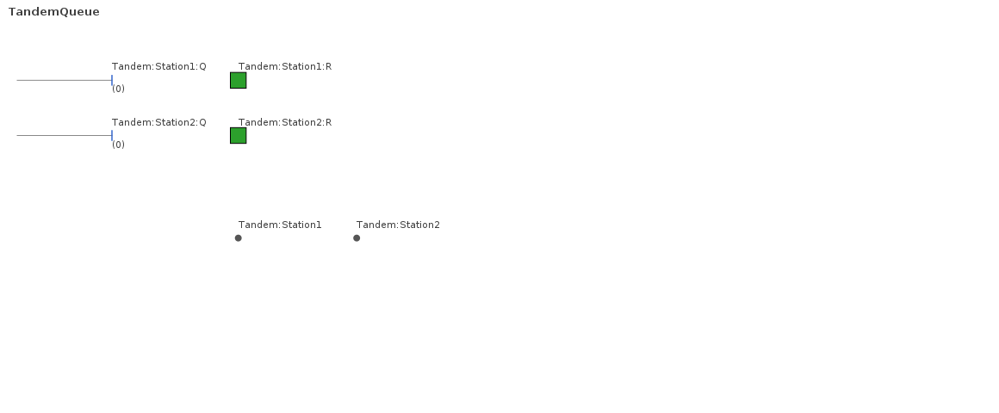

# KSL MCP Server — User Guide

The **KSL MCP server** turns any MCP-capable AI assistant (Claude Desktop, Cursor,
Codex, …) into a front-end for KSL: the assistant **calls tools** to run and analyze
your simulation models — single runs, scenario comparisons, designed experiments,
simulation-optimization — and to fit probability distributions and generate random
variates. You talk to the assistant in plain language; it drives KSL for you.

> **You will need:** Java 21 on your `PATH`, a terminal, and an **MCP-capable client**
> (this guide uses Claude Desktop). You'll build the server jar and an example model
> bundle below. Unlike the desktop-app guides, this one is a *server* an AI client
> drives, so the examples are **real command and tool transcripts**, not screenshots.
>
> New to model bundles? See [Bundle Tools](bundle-tools.md). This guide covers a
> local, single-user setup; [§3](#3-connect-your-ai-client) has a short note on
> exposing the server over a network.

## What you'll be able to do

- Build and launch the KSL MCP server.
- Wire it into your AI client — automatically or by hand.
- Verify the connection and see the tools the assistant gains.
- Have the assistant run the example pharmacy model and read the results with you.
- Serve **your own** model by dropping in a bundle JAR.
- Know when to reach for stdio vs. HTTP, and where to go for security and operations.

---

## 1. At a glance

The server exposes KSL as a broad set of tools — running models, designed experiments,
optimization, distribution fitting, and results analysis — plus a handful of guided
prompts, over either of two transports. You never call the tools yourself — your assistant does, in response to
what you ask it.

**Two transports:**

| Transport | Best for | How it runs | Endpoint |
|---|---|---|---|
| **stdio** | one AI client on your machine (Claude Desktop, Cursor, Codex) | the **client launches** the server as a subprocess | none — stdin/stdout |
| **HTTP / SSE** | a standing server, or remote / multiple clients | **you run it**; it stays up | `http://127.0.0.1:3001` |

Most people want **stdio** — skip to [§3](#3-connect-your-ai-client). HTTP is
summarized there too.

**What the assistant can do** — the tools group into capability areas:

| Area | What it's for | Representative tools |
|---|---|---|
| **Orientation** | the turn-one router | `get_started` |
| **Discovery** | what models exist and their inputs/outputs | `list_bundles`, `describe_model` |
| **Run** | run one model (blocking or async) | `run_model`, `run_config`, `submit_run`, `get_run_result` |
| **Experiments** | two-level factorial designs | `run_experiment`, `experiment_config` |
| **Optimization** | search inputs for the best response | `run_optimization` |
| **Distribution fitting** | fit distributions to data | `fit_dataset`, `get_fit_report` |
| **Data & statistics** | summaries, histograms, autocorrelation | `summarize_data`, `acf_analysis` |
| **Random variates** | sample from a distribution | `list_distributions`, `generate_variates` |
| **Results & artifacts** | fetch retained results and reports | `get_result`, `list_results`, `get_artifacts` |
| **Database analysis** | mine a run's KSL database | `db_summary`, `db_compare` |
| **Animation & layout** | auto-derive / validate / render a layout | `auto_layout`, `render_animation_layout` |
| **Bundle authoring** | package a builders JAR into a bundle | `bundle_authoring_candidates`, `assemble_bundle` |
| **Documents** | save/reuse configs across sessions | `save_document`, `load_document` |
| **Workspace** | where the server reads and writes | `get_workspace`, `set_workspace` |

The full tool list is in [§8](#8-reference). When in doubt, ask the assistant to call
`get_started` — it returns the live model catalog and routes you to the right workflow.

| Use **the MCP server** when… | Use a sibling when… |
|---|---|
| You want an **AI assistant** to run and explain models conversationally. | You want a hands-on GUI → the [desktop apps](README.md) (Single, Scenario, …) |
| You're exploring, and want the assistant to pick the right KSL workflow. | You want to script runs from a shell or web app → the **REST** server (a sibling transport) |

---

## 2. Before you begin

**Check Java 21.**

```bash
java -version      # must report 21.x
```

**You already have the server.** Installing the KSL suite puts it here, next to the other
servers — there is nothing to download or build:

| Platform | Location |
|---|---|
| macOS / Linux | `~/Applications/KSL/.support/Servers/mcp/` |
| Windows | `%LOCALAPPDATA%\Programs\KSL\.support\Servers\mcp\` |

Not installed yet? It's one command — see the [installation guide](install.md).
(`.support` is hidden in a file browser on purpose; it holds the plumbing. You only need
its path for a command like the one below.)

**You already have models, too.** Unlike the code and book servers, this one *runs* your
models, so it needs **bundle JARs** — and the suite ships two: the **KSL Book Examples**
(the textbook's models) and the **KSL Animation Examples**. Nothing to build or copy.

It also watches your workspace, so a bundle JAR you drop into `<KSLWork>/bundles/` — or
the server's own `<KSLWork>/KSLServer/bundles/` — is picked up within a few seconds, **no
restart needed**. To pin a directory of your choice instead, set `KSL_BUNDLES_DIR`.

**Verify it** with the built-in self-test — it prints where it looks and what it found:

```bash
~/Applications/KSL/.support/Servers/mcp/ksl-mcp --doctor
```

```text
KSL MCP server - doctor
  version:     1.0.0
  bundle dirs: /Users/you/Documents/KSLWork/KSLServer/bundles, /Users/you/Documents/KSLWork/bundles,
               /Users/you/Applications/KSL/.support/bundles
  bundles:     2
    - edu.uark.ksl.book-examples  models=[DriveThroughPharmacyWithQ, DriveThroughPharmacyWithResource,
      PalletWorkCenter, RQInventorySystem, StemFairMixerEnhanced, ... WalkInHealthClinic]
    - edu.uark.ksl.animation-examples  models=[Example01DriveThroughPharmacy, ... Example15DroneDelivery]
  OK - the server runs and 2 model bundle(s) are available.
```

That last bundle directory is the suite's own — the shipped examples. **Your** directories
come first, so if you put your own copy of a shipped bundle in the workspace, yours wins.

If it says **`no model bundles were found`**, the jar is in the wrong place or isn't a
real bundle — see [§10](#10-troubleshooting--gotchas).

---

## 3. Connect your AI client

With stdio, **your client launches the server** as a subprocess — you just register it
in the client's MCP configuration.

**The easy way — let the server wire itself in:**

```bash
~/Applications/KSL/.support/Servers/mcp/ksl-mcp --setup
```

It detects installed agents (Claude Desktop, Cursor, Codex), merges in a `ksl` entry
(backing up the original once), and — if it finds none — prints the exact snippet to
paste yourself:

```text
KSL MCP server - setup

No supported agent detected (Claude Desktop / Codex).
Add this to your agent's MCP servers configuration:

"ksl": {
    "command": "/Users/you/Applications/KSL/.support/Servers/mcp/ksl-mcp",
    "args": [
        "--stdio"
    ]
}
```

> **Why it points at that script and not at `java -jar`.** This server *shares* the suite's
> ~150 MB of libraries rather than duplicating them, so its jar is a thin one that cannot
> start on its own — `java -jar ksl-mcp.jar` fails with *"no main manifest attribute"*. The
> `ksl-mcp` script assembles the classpath and starts it. `--setup` writes the right thing
> automatically; you only need to know this if you hand-write the config. (The self-contained
> `ksl-code` / `ksl-book` servers are the opposite — for them `java -jar` is correct.)

**The manual way.** Put that same `ksl` block under `mcpServers` in your client's config
(for Claude Desktop, `claude_desktop_config.json` — macOS
`~/Library/Application Support/Claude/`, Windows `%APPDATA%\Claude\`, Linux
`~/.config/Claude/`):

```json
{
  "mcpServers": {
    "ksl": {
      "command": "/Users/you/Applications/KSL/.support/Servers/mcp/ksl-mcp",
      "args": ["--stdio"]
    }
  }
}
```

> **Use absolute paths.** A GUI client doesn't inherit your shell `PATH`, so `command`
> must be the full path to `java` (the `--setup` output uses `java.home/bin/java` for
> exactly this reason), and the jar path must be absolute too.

**Restart the client fully.** The KSL tools then appear (in Claude Desktop, under
Settings → Connectors). Verify by asking:

> *"Use the ksl tools to list the available models."*

The assistant should call `list_bundles` and report the 16 book-examples models. You're
connected — go to [§4](#4-tutorial--your-first-session).

**Prefer HTTP?** Run the HTTP/SSE server instead (it stays up until you stop it):

```bash
~/Applications/KSL/.support/Servers/mcp/ksl-mcp-http        # Ctrl-C to stop
```

```text
Application started in 0.248 seconds.
Responding at http://127.0.0.1:3001
```

Check it and point an HTTP MCP client at the base URL:

```bash
curl -s http://127.0.0.1:3001/health
# {"status":"UP","service":"ksl-mcp","version":"1.0.0"}
```

> **Exposing it on a network — read this first.** By default the HTTP server binds
> `127.0.0.1` (local only) with **no authentication**. To reach it from another
> machine, set `KSL_BIND_HOST=0.0.0.0` and require a bearer token with
> `KSL_AUTH_TOKEN=<secret>` — clients then send `Authorization: Bearer <secret>`
> (the `/health`, `/ready`, `/version` probes stay open). There is **no TLS**, so on
> an untrusted network put the server behind an SSH tunnel or a reverse proxy. Never
> expose it unauthenticated.

---

## 4. Tutorial — your first session

With the client connected and the book-examples bundle loaded, here is a real first
session. You type plain requests; the assistant calls tools and interprets the results.
The tool calls and outputs below are the actual protocol exchanges.

### Step 1 — Orient

Ask the assistant to get its bearings (or it will do this on its own on turn one). It
calls `get_started`, which returns the live model catalog and routes your goal to a
workflow:

```text
Available models now:
  - edu.uark.ksl.book-examples: DriveThroughPharmacyWithQ, DriveThroughPharmacyWithResource,
    PalletWorkCenter, RQInventorySystem, ... WalkInHealthClinic

Pick the path that matches the user's goal:
  - "Run one scenario and read the outputs"          → the run_a_model prompt
  - "Compare input settings / find which inputs matter" → the design_an_experiment prompt
  - "I have a dataset and want a probability distribution" → the fit_a_distribution prompt
  - "Find the inputs that minimize/maximize a response"   → the optimize_a_model prompt
```

### Step 2 — Discover the model

> *"Tell me about the DriveThroughPharmacyWithQ model."*

The assistant calls `describe_model`, which reports the model's outputs and its editable
inputs:

```text
Model DriveThroughPharmacyWithQ
  task kinds: SINGLE, SCENARIO, EXPERIMENT
  responses:  NumBusy, Num in System, System Time, PharmacyQ:NumInQ,
              PharmacyQ:TimeInQ, SysTime >= 4 minutes, Num Served
  inputs:     Pharmacy.numPharmacists  (Number of Pharmacists, min 1)
              ServiceTime.mean         (Mean Service Time, min)
```

### Step 3 — Run it

> *"Run it for 30 replications and summarize the results."*

The assistant calls `run_model` with `numberOfReplications: 30`. The model runs, and the
tool returns a result — a Markdown table plus a `resultId` you can refer back to:

```text
Result e8d0f843… — status: completed
Model DriveThroughPharmacyWithQ — replications 30/30 (COMPLETED_ALL_STEPS)

| Response             | Average  | Std Err | 95% CI half-width |
|----------------------|----------|---------|-------------------|
| NumBusy              |   0.4988 | 0.00081 |           0.00166 |
| Num in System        |   0.9932 | 0.00454 |           0.00928 |
| System Time          |   0.9944 | 0.00417 |           0.00852 |
| PharmacyQ:NumInQ     |   0.4945 | 0.00403 |           0.00825 |
| PharmacyQ:TimeInQ    |   0.4950 | 0.00386 |           0.00790 |
| SysTime >= 4 minutes |   0.0176 | 0.00069 |           0.00142 |
| Num Served           | 14981.73 |   20.06 |             41.03 |

Next steps: compare settings with a scenario batch (run_config) · optimize inputs
(run_optimization) · drill into one response (get_response).
```

### Reading the results

A good assistant won't just dump the table — it will read it with you. The key ideas:

- **System Time** (minutes a customer spends in the system) averages **0.9944** across
  the 30 replications, with a 95% CI half-width of **0.0085** — so the true long-run mean
  is plausibly in **[0.986, 1.003]** minutes. The half-width is the *margin of error*; a
  smaller one means a more precise estimate, which you buy with more replications or a
  longer run.
- **NumBusy ≈ 0.4988** means the single pharmacist is busy about **50%** of the time.
- **Num Served ≈ 14,982** customers over the run.
- Each result carries a **`resultId`** (`e8d0f843…`). Later in the session you can ask the
  assistant to `get_result` / `get_response` / `get_artifacts` for it — no re-run needed
  — and `list_results` finds work from earlier sessions. Ask `get_workspace` to see where
  the server wrote the run's files.

---

## 5. Going further: worked interactions

The first session covered a single run. The same conversational pattern reaches every
other KSL workflow — below are the headline ones, each a real exchange, lightly
abridged. For the concepts behind them, follow the linked deep guides.

### 5.1 Compare a few named configurations (scenarios)

> *"Run the pharmacy model with 2 pharmacists and with 3, and compare."*

The assistant runs a two-**scenario** batch with `run_config` — each scenario overriding
just the control it changes — and reports them side by side:

```text
Batch of 2 scenario result(s):
- 2 Pharmacists   System Time = 0.5328   PharmacyQ:TimeInQ = 0.0330
- 3 Pharmacists   System Time = 0.5028   PharmacyQ:TimeInQ = 0.0030
```

The third pharmacist barely moves **System Time** (0.53 → 0.50 min) but cuts the **queue
wait** roughly ten-fold (0.033 → 0.003 min) — the bottleneck was the wait, not the
service. → concepts: [`ksl-controls-experiments`](../ksl-controls-experiments.md); GUI: [Scenario app](scenario.md).

### 5.2 Vary factors to see which matter (designed experiment)

> *"Try a 2×2 experiment over pharmacists (2, 3) and mean service time (0.5, 0.7), keeping a database."*

`run_experiment` runs the four factor combinations (design points); because a database
was kept, the results also feed [§6](#6-analyzing-results-in-a-database):

```text
Result 7be97d07… — batch of 4 design-point result(s)
  DP_1  System Time = 0.5328      DP_2  System Time = 0.7958
  DP_3  System Time = 0.5032      DP_4  System Time = 0.7110
```

Each design point is one combination of the factor levels. To learn which factor
actually drives the response, ask for `experiment_regression`; to rank the four honestly,
use `db_compare` ([§6](#6-analyzing-results-in-a-database)). →
[`ksl-controls-experiments`](../ksl-controls-experiments.md); [Experiment app](experiment.md).

### 5.3 Search for the best inputs (optimization)

> *"For the RQInventorySystem model, find the reorder point and quantity that minimize total cost."*

`run_optimization` searches the decision variables — here reorder point R and quantity Q,
each 1–10 — to minimize the model's `TotalCost` response:

```text
Result 6c7dc99f… — status: optimization
Best solution: reorder point R = 1, reorder quantity Q = 2, estimated TotalCost ≈ 2.149
Iterations evaluated: 13
```

The solver improved the objective from ≈ 4.14 to **2.15** over 13 iterations and returned
the best (R, Q). Tighten the bounds or raise `replicationsPerEvaluation` to refine. →
[`ksl-simopt`](../ksl-simopt.md); [Simopt app](simopt.md).

### 5.4 Fit a distribution to data

> *"Here are 300 observed service times — what distribution fits?"* (generated here with `generate_variates`)

`fit_dataset` fits candidate families and ranks them by **MODA** — a multi-objective
score over several goodness-of-fit metrics:

```text
Distribution fit 31c4b5ec… — recommended: exponential (top MODA score)

| Rank | Family      | MODA score | Parameters               | p-value |
|------|-------------|-----------:|--------------------------|--------:|
|  1   | exponential |     0.9728 | mean = 1.015             |   0.522 |
|  2   | gamma       |     0.9724 | shape 1.06, scale 0.96   |   0.733 |
|  3   | weibull     |     0.9724 | shape 1.04, scale 1.03   |   0.914 |
|  4   | normal      |     0.9110 | mean 1.02, variance 1.01 |   0.000 |
```

Exponential wins (the sample was exponential) with a healthy p-value; `get_fit_report`
returns density / Q-Q / P-P plots, and `get_fit_scoring` the full metric matrix. →
[`ksl-utilities-distributions-fitting`](../ksl-utilities-distributions-fitting.md); [Distribution app](distribution.md).

---

## 6. Analyzing results in a database

Any run can write a **KSL database** — a SQLite file the server keeps alongside the
result — by setting `enableKSLDatabase` (the [§5.2](#52-vary-factors-to-see-which-matter-designed-experiment)
experiment did). It unlocks cross-experiment comparison, statistical views, and export,
all headless. Point the database tools at that experiment's `resultId`:

```text
db_experiments  → 4 experiment(s): DP_1, DP_2, DP_3, DP_4

db_summary(DP_2) → across-replication statistics for one experiment
   System Time   average 0.7958   (with std error, 95% CI half-width, min/max, count…)

db_compare("System Time") → multiple-comparison (MCB) ranking
   best  (lowest System Time):  DP_3  at 0.5032
   worst (highest):             DP_2  at 0.7958
   screening keeps the configurations that could be best at 95% confidence
```

`db_compare` is the honest way to pick a winner: it accounts for the noise in each
estimate, so you keep the set that is *statistically* best rather than just the
lucky-lowest. `db_export` writes the tables as CSV / Excel, and `db_summary_report` /
`db_compare_report` render full reports as downloadable artifacts. →
[`ksl-utilities-io`](../ksl-utilities-io.md); [Results app](results.md).

---

## 7. Animation & layouts

The server can also produce a model's **visual layout** — where its queues, resources,
stations, and paths sit on a canvas — for the desktop animation app. The assistant works
a *propose → render → look → revise* loop: `auto_layout` proposes a layout,
`render_animation_layout` draws a PNG preview, `validate_animation_layout` checks its
names against the model, and `export_layout` writes the file the app opens.

> *"Auto-lay-out the TandemQueue model from a traced run and show me the picture."*

`auto_layout` mines a **traced** run (a `run_model` with `tracing: true`) to place the
model's elements — here two queues, two resources, and two stations — and
`render_animation_layout` returns a preview:



```text
Rendered the layout to layout.png — fetch it with get_artifact(name="layout.png").
Exported the layout to TandemQueue.lay.toml — open it in the desktop animation app
(Open layout → *.lay.toml).
```

From here the assistant can nudge positions and re-render, or hand the exported
`.lay.toml` to the desktop app to animate against a live or replayed run. → the
`ksl.animation` package and the desktop animation app.

---

## 8. Reference

### The full tool catalog

**Orientation** — `get_started`.
**Discovery** — `list_bundles`, `list_models`, `describe_model`.
**Run (single)** — `run_model`, `run_config`, `submit_run`, `get_run_events`,
`get_run_result`, `cancel_run`, `run_template`, `validate_run_config`, `preview_run_config`.
**Experiments** — `run_experiment`, `experiment_config`, `experiment_template`,
`validate_experiment_config`, `preview_experiment_config`, `get_design_point`,
`experiment_regression`.
**Optimization** — `run_optimization`, `run_optimization_config`, `optimization_template`,
`validate_optimization_config`, `preview_optimization_config`.
**Distribution fitting** — `fit_dataset`, `fit_config`, `fit_template`, `validate_fit_config`,
`preview_fit_config`, `get_fit_scoring`, `get_fit_report`, `get_fit_data_summary`.
**Data & statistics** — `summarize_data`, `acf_analysis`, `shift_analysis`,
`family_frequency_bootstrap`.
**Random variates** — `list_distributions`, `generate_variates`.
**Results & artifacts** — `get_result`, `list_responses`, `get_response`, `get_artifacts`,
`get_artifact`, `list_results`.
**Database analysis** — `db_open_external`, `db_status`, `db_experiments`, `db_summary`,
`db_compare`, `db_views`, `db_view`, `db_compare_report`, `db_export`, `db_summary_report`.
**Animation & layout** — `auto_layout`, `validate_animation_layout`, `render_animation_layout`,
`export_layout`.
**Bundle authoring** — `bundle_authoring_candidates`, `preview_bundle_authoring`, `assemble_bundle`.
**Documents** — `save_document`, `load_document`, `list_documents`, `delete_document`.
**Workspace** — `get_workspace`, `set_workspace`.

**Guided prompts** (surfaced by the client as ready-made starting points):
`run_a_model`, `optimize_a_model`, `fit_a_distribution`, `generate_random_variates`,
`explore_a_model`, `design_an_experiment`, `get_started`.

Every tool comes in a family: a quick one-shot form (`run_model`), a full-document form
(`run_config`), a `*_template` to scaffold that document, a `validate_*` to check it, and
a `preview_*` to see its cost *before* running. Long runs use `submit_run` →
`get_run_events` → `get_run_result`.

### Launchers, endpoints & modes

| Launcher / mode | Transport | Purpose |
|---|---|---|
| `ksl-mcp --stdio` | stdio | the server an AI client runs |
| `ksl-mcp-http` | HTTP/SSE | a standing server on port 3001 |
| `ksl-mcp --doctor` | — | self-test: version, bundle dirs, bundles found |
| `ksl-mcp --setup` / `--remove` | — | wire / unwire the server into detected clients |
| `ksl-mcp --version` | — | print the server version |

Both launchers live in the suite's `.support/Servers/mcp/` folder.

HTTP health routes: `GET /health`, `GET /ready` (503 until the first bundle scan finishes),
`GET /version`.

### Key configuration

Read from environment variables (highest priority), then `~/.ksl/config.toml`, then
defaults. The most-used knobs:

| Env var | Default | What it does |
|---|---|---|
| `KSL_BUNDLES_DIR` | `<KSLWork>/KSLServer/bundles` + `<KSLWork>/bundles` + the suite's shipped examples | where the server looks for model bundles (setting this replaces all three) |
| `KSL_MCP_PORT` | `3001` | HTTP server port |
| `KSL_BIND_HOST` | `127.0.0.1` | HTTP bind address (`0.0.0.0` to expose on a LAN) |
| `KSL_AUTH_TOKEN` | *(none)* | when set, HTTP requires `Authorization: Bearer <token>` |
| `KSL_RUN_TIMEOUT_SECONDS` | `0` (no limit) | cap on a single run |

Every knob has a `KSL_*` environment override (shown) and a `~/.ksl/config.toml`
equivalent; other settings there include the result cache and `maxConcurrentJobs`
(default: one per CPU core).

---

## 9. Common tasks

| Task | How |
|---|---|
| Serve **your own** model | Compile it to a *builders JAR* (public no-arg `ModelBuilderIfc` classes), then `kslpkg assemble your-builders.jar --id your.bundle.id` and drop the resulting `*-bundle.jar` into `<KSLWork>/KSLServer/bundles/`. See [Bundle Tools](bundle-tools.md). |
| Pin the bundle directory | `export KSL_BUNDLES_DIR=/path/to/bundles` before launching |
| Run a standing HTTP server | `ksl-mcp-http` (Ctrl-C to stop) |
| Re-wire / remove a client | `ksl-mcp --setup` / `ksl-mcp --remove` |
| Find earlier results | ask the assistant to call `list_results`, then `get_result <id>` |
| Save a config to reuse | ask it to `save_document` (and `load_document` next session) |
| Check the server is healthy | `ksl-mcp --doctor` (stdio) or `curl .../health` (HTTP) |

To reach the server from another machine, see the security note in
[§3](#3-connect-your-ai-client).

---

## 10. Troubleshooting & gotchas

| Symptom | Cause | Fix |
|---|---|---|
| KSL tools don't appear after `--setup` | The client wasn't fully restarted, or the config path is wrong. | Quit and reopen the client; confirm the `ksl` entry is in the right `mcpServers` config file. |
| `list_bundles` is empty / *"not a KSL bundle (no META-INF/ksl/bundle.toml manifest)"* | The jar is a plain builders jar, not an **assembled** bundle. | Run `kslpkg assemble` on it first (see [§9](#9-common-tasks) / [Bundle Tools](bundle-tools.md)). |
| Bundle jar present but not found | It's in the wrong directory (the default is under **`KSLWork`**, not `~/.ksl`), or it bundled KSLCore. | Put it in `<KSLWork>/KSLServer/bundles/` (check `--doctor`'s reported path); a bundle must **not** package KSLCore. |
| The client shows garbled output / protocol errors (stdio) | A bundled model printed to **stdout**, which is the MCP channel. | Never `println` in a bundled model; use logging (stderr) instead. |
| `UnsupportedClassVersion` on launch | Wrong Java. | Use JDK 21 (`java -version`). |
| HTTP: port in use, `401`, or `/ready` returns `503` | Port conflict, missing/invalid bearer token, or the first bundle scan hasn't finished. | Change `KSL_MCP_PORT`; check the `Authorization: Bearer` token; or just retry — `/ready` is `503` only until the first bundle scan completes. |
| *"server is at capacity"* | Too many concurrent jobs. | Raise `server.maxConcurrentJobs`, or retry. |
| A run never finishes | An unbounded model. | Set `KSL_RUN_TIMEOUT_SECONDS`. |
| Several `java` processes using memory when idle | Clients start stdio servers eagerly, and each configured KSL server is its own process. | Turn the servers off when not in use — see [Managing MCP server processes](mcp-process-management.md). |

---

## 11. See also

- **Sibling MCP servers** — [Code MCP Server](mcp-server-code.md) (`ksl-code`, searchable
  KSL source / API) and [Book MCP Server](mcp-server-book.md) (`ksl-book`, the textbook).
  This `ksl` server runs models; those two answer code and concept questions.
- **Managing the servers** — [Managing MCP server processes](mcp-process-management.md):
  why several Java processes appear, and how to turn the servers off/on.
- The **REST server** — a sibling transport that drives the same models over plain
  HTTP for scripts and web apps (user guide planned).
- [Bundle Tools](bundle-tools.md) — package your own models into loadable bundles (`kslpkg`).
- The desktop app guides — [Single](single.md), [Scenario](scenario.md),
  [Experiment](experiment.md), [Simopt](simopt.md), [Results](results.md),
  [Distribution](distribution.md) — the GUI way to reach the same KSL capabilities.
- [KSL Book](https://rossetti.github.io/KSLBook/) — the simulation concepts behind the
  pharmacy model and the statistics you read above.
