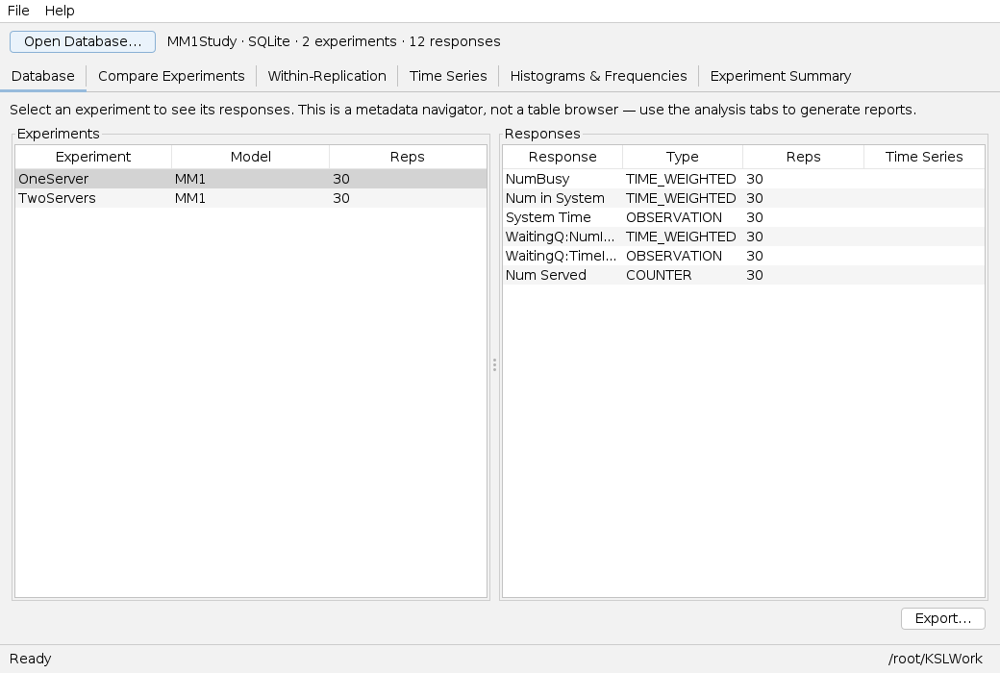
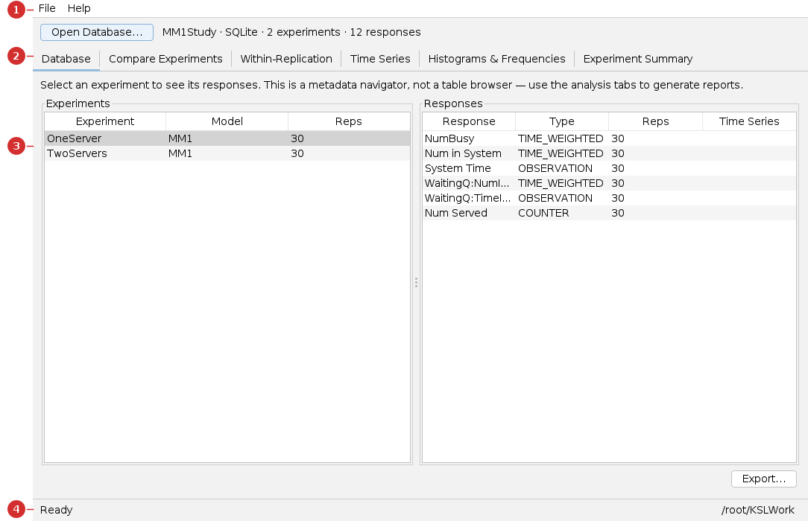
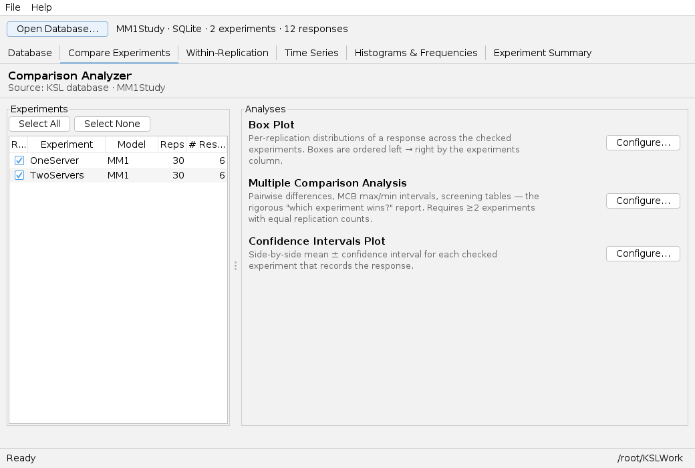

# Results Analyzer — User Guide

The **Results Analyzer** opens a **results database** produced by a KSL simulation and
helps you explore and compare what's inside: experiments, responses, comparisons,
diagnostics, and time series. It's a *read-and-report* workbench — you don't run models
here, you analyze runs you already made.

> **You will need:** Java 21 and a KSL **results database** (a `.db` file). You get one by
> running a model with the database enabled in the [Single](single.md), [Scenario](scenario.md),
> or [Experiment](experiment.md) apps. New here? Read [Common UI & concepts](common-ui.md).

## What you'll be able to do

- Open a results database and browse its experiments and responses.
- Compare experiments with box plots, confidence intervals, and **MCB**.
- Generate within-replication diagnostics, time-series plots, and summaries.
- Export the data to Excel, CSV, or SQL.

---

## 1. At a glance

Open a database with **Open Database…**, browse it on the **Database** tab, then use the
analysis tabs to generate reports (which open in your browser).

| Use **this app** when… | Use a sibling app when… |
|---|---|
| You want to **analyze runs you already made**. | You want to *run* a model → [Single](single.md) / [Scenario](scenario.md) / [Experiment](experiment.md) |
| You want to compare experiments saved in a database. | You're comparing scenarios you're running *now* → [Scenario app](scenario.md) |

---

## 2. Before you begin

You need a results database. Any of the run apps can produce one — enable the **KSL
database** option before simulating, and look under your working directory's `output/`
folder for the `.db` file. This guide uses a database with two M/M/1 experiments
(**OneServer**, **TwoServers**), each with 30 replications.

---

## 3. A guided tour of the window

1. **Menu bar** — *File* (Open Database, Export, Set Working Directory) and *Help*. A
   header line summarizes the open database (*"MM1Study · SQLite · 2 experiments · 12
   responses"*).
2. **Tabs** — *Database*, *Compare Experiments*, *Within-Replication*, *Time Series*,
   *Histograms & Frequencies*, *Experiment Summary*.
3. **Experiments / Responses tables** — on the *Database* tab, the left table lists
   experiments; selecting one fills the right table with its responses.
4. **Status bar** — messages and the working directory.

---

## 4. Tutorial — explore and compare two experiments

### Step 1 — Open the database

Click **Open Database…** and choose the `.db` file (or **File → Open Database**). The
header updates to show the database name, type, and how many experiments and responses it
holds.

### Step 2 — Browse the metadata (Database tab)

Select an experiment on the left; its responses appear on the right with their **type**
(TIME_WEIGHTED, OBSERVATION, COUNTER) and replication count. This tab is a *navigator* —
use the analysis tabs to actually generate reports.

### Step 3 — Compare experiments

On **Compare Experiments**, tick the experiments to include, then **Configure…** one of:

- **Box Plot** — per-replication distributions of a response, side by side.
- **Multiple Comparison Analysis (MCB)** — pairwise differences and MCB intervals; the
  rigorous *"which experiment wins?"* report (needs ≥ 2 experiments with equal reps).
- **Confidence Intervals Plot** — each experiment's mean ± CI for a response.

Each opens a configure dialog (pick the response, confidence level, output location), then
**Generate** writes an HTML report and opens it in your browser.

### Reading the results

The comparison report this tab produces is exactly the kind shown in the
[Scenario guide's MCB example](scenario.md#reading-the-results) — an alternatives table, a
box plot, pairwise differences, and MCB intervals identifying the best experiment with
statistical confidence. For our two-server-count experiments, MCB on **System Time** would
identify **TwoServers** as the lower-cost-in-time configuration.

> Other tabs answer other questions: **Within-Replication** (histograms, Q-Q normality
> checks for one experiment), **Time Series** (per- and across-replication plots),
> **Histograms & Frequencies** (in-model histogram outputs), and **Experiment Summary**
> (cross-replication statistics for one experiment).

---

## 5. Reference — every tab explained

| Tab | What it's for |
|---|---|
| **Database** | Browse experiments and their responses (metadata navigator). |
| **Compare Experiments** | Box plots, MCB, and CI plots across selected experiments. |
| **Within-Replication** | Histograms, observation plots, and Q-Q/P-P normality checks for one experiment. |
| **Time Series** | Per-replication overlays and across-replication summaries. |
| **Histograms & Frequencies** | Histogram/frequency responses collected during the run. |
| **Experiment Summary** | Cross-replication summary statistics for one experiment. |

---

## 6. Common tasks

| Task | How |
|---|---|
| Open a different database | **Open Database…** (file/folder, or a Postgres server) |
| Export the data | **File → Export** → Excel, CSV, or SQL |
| Set the confidence level | In each analysis's **Configure…** dialog |
| Find the database a run produced | Look under `<working dir>/output/.../*.db` |

---

## 7. Troubleshooting & gotchas

| Symptom | Cause | Fix |
|---|---|---|
| "not a valid database" on open | The file isn't a KSL SQLite database, or is still being written. | Pick the finished `.db` file; ensure the run completed. |
| MCB option won't generate | Fewer than two experiments, or unequal replication counts. | Include ≥ 2 experiments with the same number of replications. |
| Responses table is empty | No experiment is selected. | Click an experiment row on the left. |
| A response has no time series | It wasn't collected as a time-series response. | Only responses flagged *Time Series* support those plots. |

---

## 8. See also

- [Common UI & concepts](common-ui.md) · [Scenario app](scenario.md) · [Experiment app](experiment.md)
- [KSL Book](https://rossetti.github.io/KSLBook/) — output analysis and comparison procedures.

---

Screenshots (and the sample database) are generated by
`./gradlew :KSLAppSwingResults:screenshotsResults` (under `xvfb-run`), so they regenerate
when the app changes.
