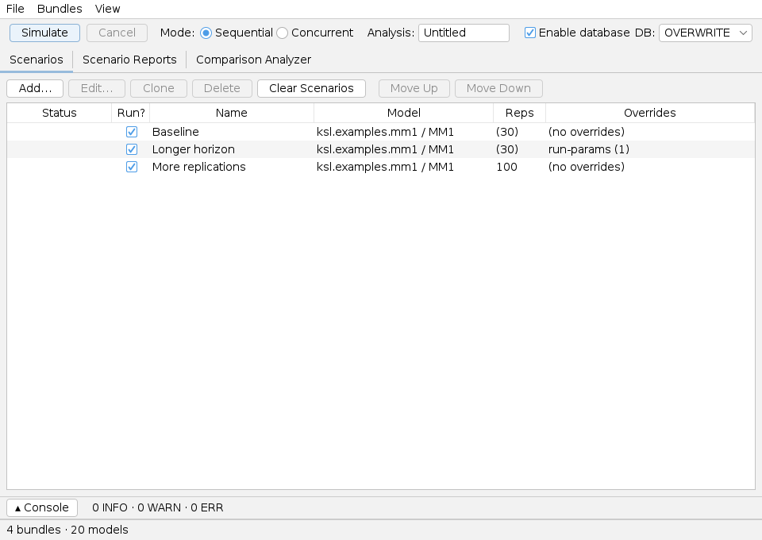
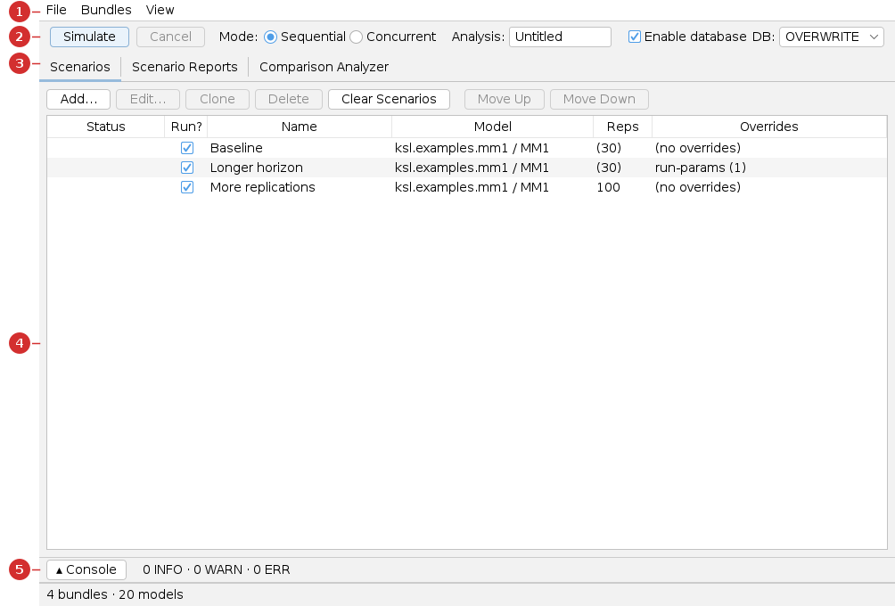

# Scenario Analyzer — User Guide

The **Scenario Analyzer** runs **several configurations of a model side by side** and
compares their results. Each *scenario* is the same or a different model with its own
inputs and run settings; you run them all together, then compare a response across them
statistically.

> **You will need:** Java 21 and a model **bundle** (this guide uses the **M/M/1 queue**
> from the book-models bundle). New here? Read [Common UI & concepts](common-ui.md) and
> the simpler [Single-Model guide](single.md) first.

## What you'll be able to do

- Add several scenarios bound to a model and give each its own run settings.
- Run all scenarios at once (sequentially or concurrently).
- Read a **multiple-comparison** report that ranks the scenarios on a response and tells
  you which is best with statistical confidence.

---

## 1. At a glance

You build a list of scenarios on the **Scenarios** tab, click **Simulate**, then read
the **Scenario Reports** and **Comparison Analyzer** tabs.

| Use **this app** when… | Use a sibling app when… |
|---|---|
| You have a handful of **named configurations** to compare. | You want one model only → [Single-Model app](single.md) |
| The configurations are chosen by hand. | You want to vary inputs on a **grid/design** → [Experiment app](experiment.md) |
| You want a statistical "which is best?" answer. | You want the computer to **search** for the best inputs → [Simopt app](simopt.md) |

---

## 2. Before you begin

Like the other apps, the Scenario Analyzer loads models from **bundles** (use the
**Bundles** menu to load a JAR, or drop one in `~/.ksl/bundles/`). See
[Common UI → Models and bundles](common-ui.md#models-and-bundles). Results are written
under your **working directory**. The **Enable database** toggle **persists** each run to
a SQLite database so you can revisit it later (for example, in the [Results app](results.md));
it is *not* required for the in-app **Comparison Analyzer**, which works on the results of
your most recent run, held in memory.

---

## 3. A guided tour of the window

1. **Menu bar** — *File*, *Bundles*, *View*. See [Common UI](common-ui.md#menu-bar).
2. **Run toolbar** — **Simulate** / **Cancel**, the **Mode** toggle
   ([Sequential or Concurrent](common-ui.md#execution-mode-sequential--concurrent)), the
   **Analysis** name, **Enable database**, and the **DB** policy.
3. **Tabs** — *Scenarios*, *Scenario Reports*, *Comparison Analyzer*.
4. **Scenarios table** — one row per scenario (Status, Run?, Name, Model, Reps,
   Overrides) with **Add / Edit / Clone / Delete / Move** buttons above it.
5. **Console drawer** — the run log. See [Common UI](common-ui.md#run-console).

---

## 4. Tutorial — compare three configurations

### Step 1 — Add scenarios

On the **Scenarios** tab, click **Add…**, pick the **M/M/1 Queue** model, and name the
scenario. Repeat to build a short list. In the screenshot above there are three:

| Name | Model | Reps | Overrides |
|---|---|---|---|
| Baseline | M/M/1 | 30 | (none) |
| Longer horizon | M/M/1 | 30 | run length → 1000 |
| More replications | M/M/1 | 100 | (none) |

Select a row and click **Edit…** to open a scenario editor where you set **run
parameters**, **control overrides** (model inputs), and **RV overrides**. Untick **Run?**
to skip a scenario without deleting it; use **Clone** to fork a near-duplicate.

> **Tip.** The most useful comparisons vary a **model input** — for an M/M/1 queue, the
> number of servers. You set that under **Control Overrides** in the scenario editor.

### Step 2 — Set the analysis name and run

Type an **Analysis** name (it names the output folder and database), choose **Sequential**
mode, and click **Simulate**. The console shows progress and each row's **Status** advances
to *Completed*. (Leave **Enable database** ticked if you also want the run saved to disk for
later analysis in the Results app; it's optional for the comparison below.)

### Step 3 — Read the reports

The **Scenario Reports** tab collects a report per scenario plus a summary. The
**Comparison Analyzer** tab is where the scenarios meet: pick a response and an analysis
(box plot, confidence intervals, or **multiple comparison with the best (MCB)**).

### Reading the results

To show a comparison with a clear winner, here is a genuine **MCB** report comparing the
M/M/1 **System Time** under one, two, and three servers — exactly the output the
Comparison Analyzer produces. First, each alternative's average (with a 95% half-width):

| Alternative | Count | Average | Half-Width | CI Lower | CI Upper |
|:---|---:|---:|---:|---:|---:|
| 1 server | 30 | 1.0822 | 0.0663 | 1.0159 | 1.1485 |
| 2 servers | 30 | 0.5520 | 0.0124 | 0.5396 | 0.5643 |
| 3 servers | 30 | 0.5175 | 0.0094 | 0.5081 | 0.5269 |

A **box plot** makes the differences obvious — going from one to two servers roughly
halves the time in system; the second-to-third gain is small:

**Which is best?** MCB answers this with confidence. Minimizing System Time, the
*MCB (min)* intervals identify **3 servers** as the best, and the screening step rules
out the others:

| Alternative | MCB-min Lower | MCB-min Upper | Possible Best |
|:---|---:|---:|:---|
| 1 server | 0.0000 | 0.5647 | false |
| 2 servers | 0.0000 | 0.0345 | false |
| 3 servers | −0.0345 | 0.0000 | **true** |

So with 95% confidence the three-server configuration has the lowest mean System Time.
The 2-vs-3 pairwise difference is small (≈0.034) but its interval excludes zero, so the
improvement is statistically real here.

> The full rendered comparison (pairwise differences, both MCB directions, screening, and
> all charts) is at [`_generated/scenario-report.md`](_generated/scenario-report.md).

---

## 5. Reference — every tab explained

### Scenarios

The master list. Each row is a scenario; the toolbar above runs them. **Add…** picks a
model; **Edit…** opens the per-scenario editor (run parameters + control/RV overrides);
**Clone**, **Delete**, **Move Up/Down**, and **Clear Scenarios** manage the list; **Run?**
includes/excludes a row.

### Scenario Reports

After a run, a standard report per scenario plus a batch summary, in the formats you
enabled. See [Common UI → Reports](common-ui.md#reports-what-you-get-and-how-to-read-them).

### Comparison Analyzer

Pick a response, then run a **box plot**, **confidence-interval**, or **MCB** analysis
across the scenarios. It works on the **in-memory** per-replication results of your most
recent run — no database required (re-run if you've edited the scenarios since). The same
analysis panel appears in the [Results app](results.md), where it reads from a saved
database instead.

---

## 6. Common tasks

| Task | How |
|---|---|
| Add / duplicate a scenario | **Add…** / **Clone** on the Scenarios tab |
| Skip a scenario without deleting it | Untick its **Run?** box |
| Run faster on a multi-core machine | Set **Mode → Concurrent** |
| Change a scenario's inputs | Select it, **Edit…**, use the override sections |
| Save / reopen the scenario set | **File → Save** / **Open** (a `.toml` document) |

---

## 7. Troubleshooting & gotchas

| Symptom | Cause | Fix |
|---|---|---|
| Comparison Analyzer has no data | No run yet this session (or the last run produced no per-replication data). | **Simulate** the scenarios first. |
| "name must be unique" when adding | Two scenarios share a name. | Rename — names are the row key and the DB key. |
| A scenario shows **Skipped** | Its **Run?** box is unticked. | Tick it to include it. |
| DB error about an existing database | A database with that analysis name exists. | Set **DB → NEW**, or change the Analysis name. |

---

## 8. See also

- [Common UI & concepts](common-ui.md) · [Single-Model app](single.md) · [Experiment app](experiment.md) · [Results app](results.md)
- [KSL Book](https://rossetti.github.io/KSLBook/) — multiple-comparison procedures.

---

Screenshots and the comparison report are generated by
`./gradlew :KSLAppSwingScenario:screenshotsScenario` and `:resultsScenario` (under
`xvfb-run`), so they regenerate when the app changes.
