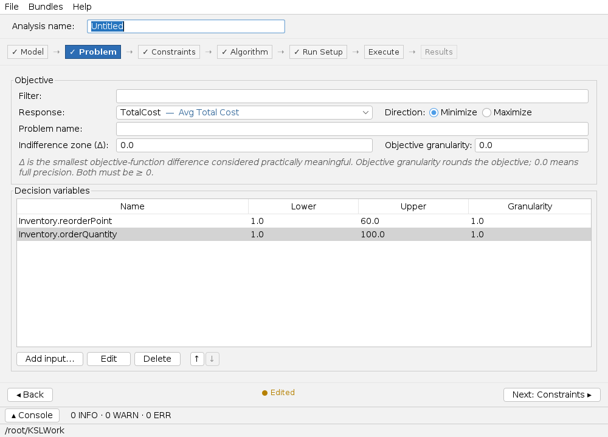
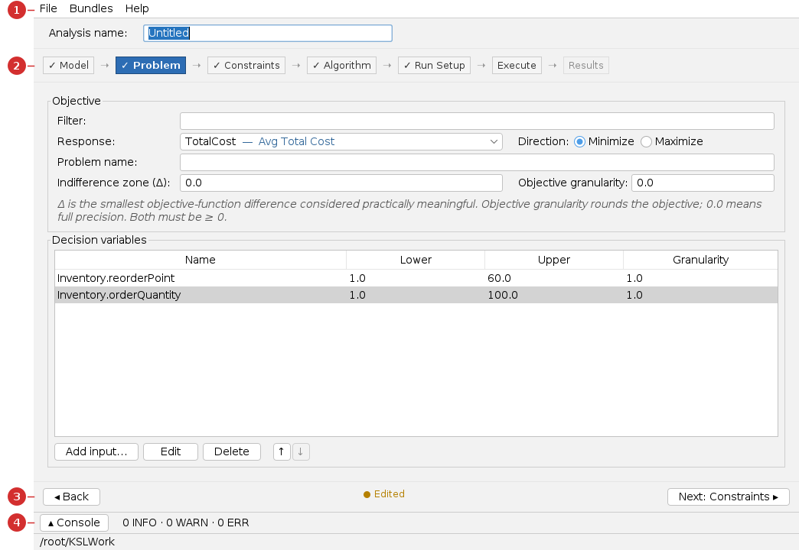

# Simulation Optimization App — User Guide

The **Simopt app** (simulation optimization) **searches** for the model inputs that give
the best response. You define decision variables and bounds, pick an objective to
minimize or maximize, choose a search algorithm, and the app runs the model many times
to find a good solution.

> **You will need:** Java 21 and a model **bundle**. This guide uses an **LK (s,S)
> inventory** optimization model from the book-models bundle. New here? Read
> [Common UI & concepts](common-ui.md), then the [Experiment guide](experiment.md).

## What you'll be able to do

- Choose an objective response and decision variables with bounds.
- Pick a search algorithm (e.g. simulated annealing).
- Run the optimization and read the **best solution** it found.

---

## 1. At a glance

Unlike the tab-based apps, Simopt is a **stepper**: you move through
**Model → Problem → Constraints → Algorithm → Run Setup → Execute → Results**, completing
one step at a time.

| Use **this app** when… | Use a sibling app when… |
|---|---|
| You want the computer to **find the best** inputs. | You already have configs to compare → [Scenario app](scenario.md) |
| The input space is too large to enumerate. | You want to **measure effects** over a grid → [Experiment app](experiment.md) |

---

## 2. Before you begin

Load the model from a **bundle** (see
[Common UI → Models and bundles](common-ui.md#models-and-bundles)). The model must expose
the inputs you want to optimize as controls and the objective as a response.

---

## 3. A guided tour of the window

1. **Menu bar** — *File*, *Bundles*, *Help*.
2. **Stepper rail** — the seven steps; a ✓ marks completed steps. Click a completed step
   to revisit it.
3. **Step footer** — **Back** / **Next** to move between steps, with an *Edited/Saved*
   badge.
4. **Console drawer** — the optimization log.

---

## 4. Tutorial — minimize inventory cost

### Step 1 — Model

Select the **LK Inventory (optimization)** model. The step shows its controls (candidate
decision variables) and responses (candidate objectives).

### Step 2 — Problem

Set the **objective**: response **TotalCost**, direction **Minimize**. Then **Add input…**
for each decision variable with its bounds:

| Decision variable | Lower | Upper | Granularity |
|---|---:|---:|---:|
| `Inventory.reorderPoint` | 1 | 60 | 1 |
| `Inventory.orderQuantity` | 1 | 100 | 1 |

Granularity 1 keeps the search on whole units. The **indifference zone (Δ)** is the
smallest objective difference you consider meaningful (leave 0 for full precision).

### Step 3 — Constraints (optional)

Add bounds or linear constraints relating the variables/responses, or skip straight
through — this step auto-completes when the problem is defined.

### Step 4 — Algorithm

Choose a search algorithm — **Simulated Annealing**, Stochastic Hill Climbing,
Cross-Entropy, or R-SPLINE — and set its parameters (iterations, replications per
evaluation, cooling schedule, …).

### Step 5 — Run Setup

Set evaluation limits and tracking options (log every N evaluations, snapshot the best
solution) and the output directory.

### Step 6 — Execute

Click **Optimize**. The step shows live progress — current best objective and iteration
count — and the console logs each evaluation.

### Reading the results

Step 7, **Results**, reports the best solution. Below is a genuine run of simulated
annealing on this problem (40 iterations, 20 replications per evaluation) — the same
solver report the app produces.

The search ran **31 iterations** and made **132 evaluations** (2,640 replications). It
improved from the initial guess to the best solution found:

| | Reorder Point | Order Quantity | Avg Total Cost (95% half-width) |
|---|---:|---:|---:|
| Initial solution | 33 | 14 | 124.65 (± 1.13) |
| **Best found** | **14** | **49** | **122.31 (± 1.96)** |

**How to read it.** Simulated annealing explored combinations of reorder point and order
quantity, keeping the lowest-cost solution: a reorder point of **14** and order quantity
of **49**, giving an estimated total cost of **122.31** per period. Because the objective
is itself a *simulation estimate*, it comes with a confidence half-width — solutions whose
intervals overlap are not clearly different, which is what the **indifference zone**
setting is for.

> The full rendered solver report (run summary, evaluator metrics, initial/current/best
> solutions) is at [`_generated/simopt-report.md`](_generated/simopt-report.md).

---

## 5. Reference — every step explained

| Step | What it's for |
|---|---|
| **Model** | Choose the model; view controls and responses. |
| **Problem** | Objective response + direction; decision variables with bounds and granularity. |
| **Constraints** | Optional variable/response bounds and linear constraints. |
| **Algorithm** | Pick the search algorithm and its parameters. |
| **Run Setup** | Evaluation budget, tracking, output location. |
| **Execute** | Run the optimization; watch live progress and the current best. |
| **Results** | The best solution found, with downloadable artifacts. |

---

## 6. Common tasks

| Task | How |
|---|---|
| Revisit an earlier step | Click it on the **stepper rail** (if completed) |
| Constrain the search | Add bounds/constraints on the **Constraints** step |
| Make the search longer/shorter | Adjust iterations and replications on **Algorithm** / **Run Setup** |
| Treat near-ties as equal | Raise the **indifference zone (Δ)** on the Problem step |
| Save / reopen the study | **File → Save** / **Open** (a `.toml` document) |

---

## 7. Troubleshooting & gotchas

| Symptom | Cause | Fix |
|---|---|---|
| A later step is locked | An earlier step is incomplete. | Complete the objective + at least one decision variable. |
| Optimization is very slow | Many evaluations × many replications. | Lower the iteration count or replications per evaluation. |
| Best solution looks no better than the start | Too few iterations, or a flat/noisy objective. | Run longer, or raise replications to reduce noise. |
| "objective required" on Run Setup | No objective response chosen. | Set it on the Problem step. |

---

## 8. See also

- [Common UI & concepts](common-ui.md) · [Experiment app](experiment.md) · [Scenario app](scenario.md) · [Results app](results.md)
- [KSL Book](https://rossetti.github.io/KSLBook/) — simulation optimization.

---

Screenshots and the solver report are generated by
`./gradlew :KSLAppSwingSimopt:screenshotsSimopt` and `:resultsSimopt` (under `xvfb-run`),
so they regenerate when the app changes.
