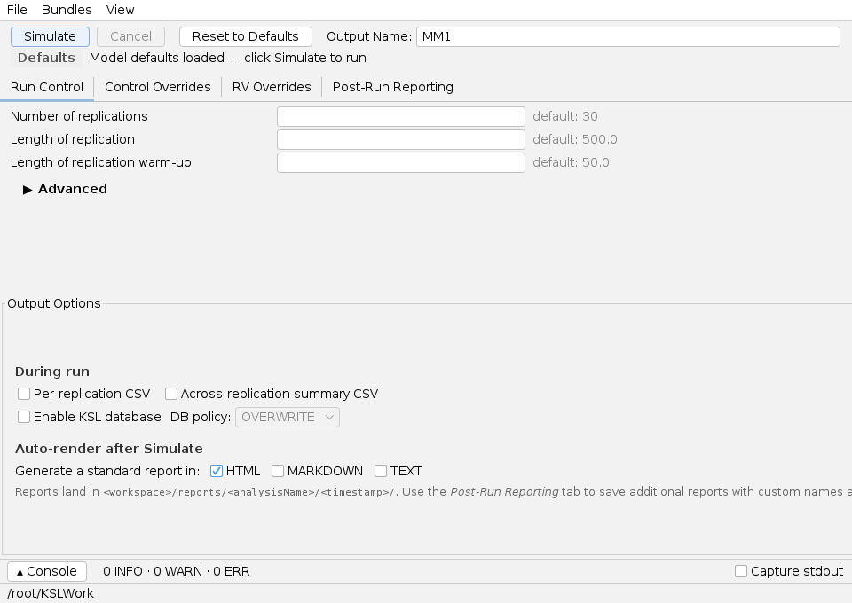
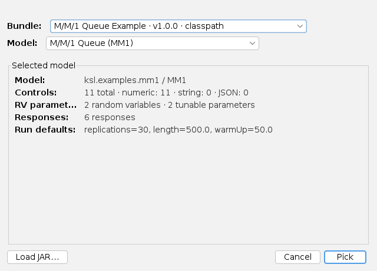
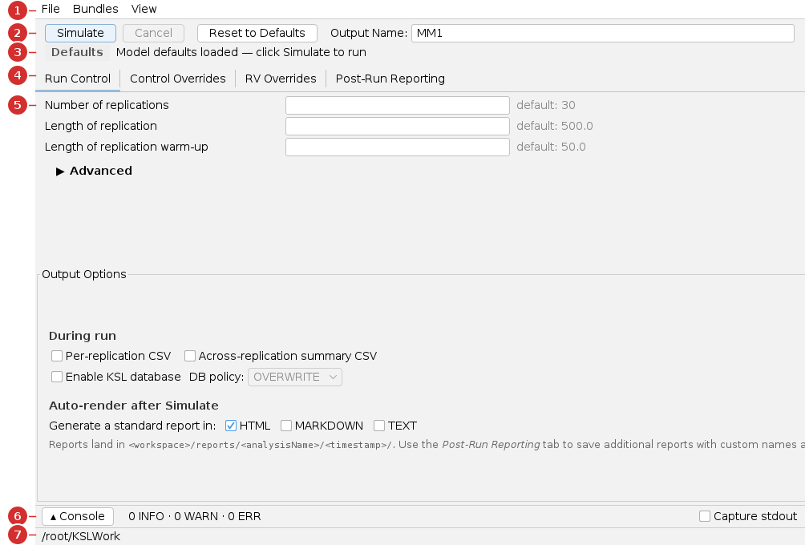
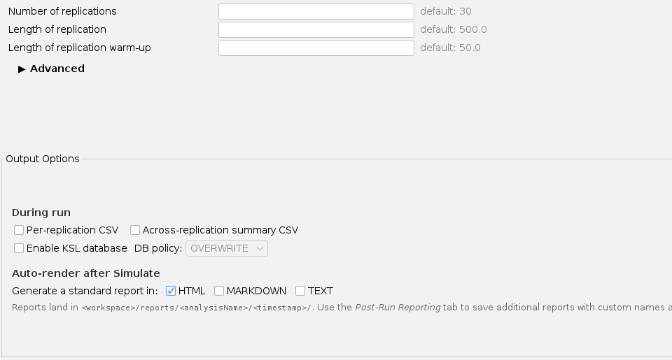
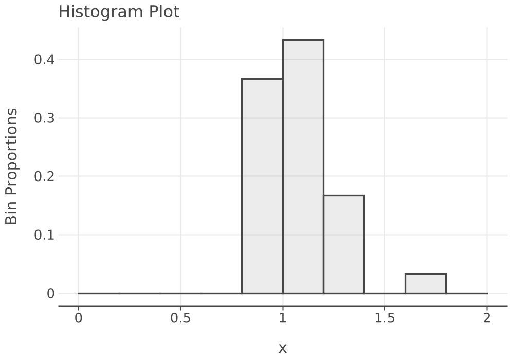
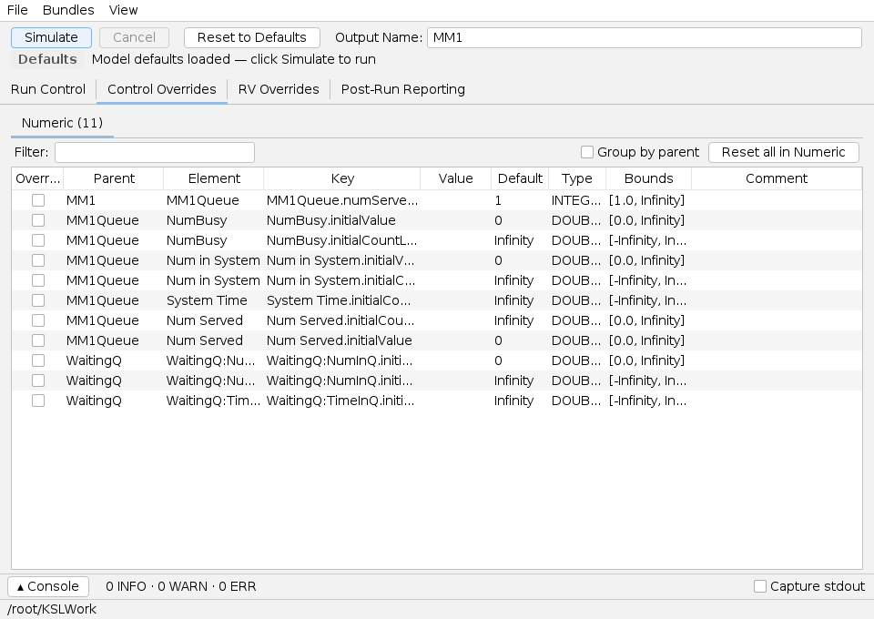
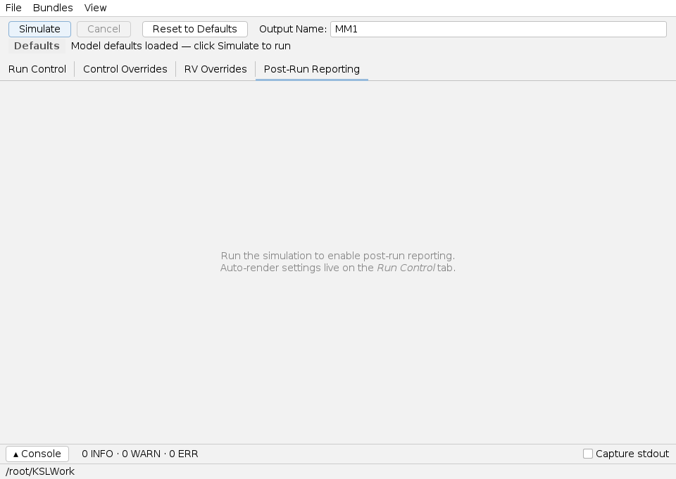

# Single-Model App — User Guide

The **Single-Model app** runs **one** simulation model, lets you adjust its run
settings and inputs, and shows you the results. It's the simplest of the KSL
desktop apps and the best place to start: set a few parameters, click
**Simulate**, and read a report.

> **You will need:** Java 21 and a model **bundle** to load. This guide uses the
> **M/M/1 queue** model from the KSL book-models bundle. New to the KSL desktop
> apps? Skim [Common UI & concepts](common-ui.md) first.

## What you'll be able to do

- Launch the Single-Model app and load a model from a **bundle**.
- Pick the example M/M/1 queue model and recognize every region of the window.
- Set the number of replications, run length, and warm-up period.
- Run a simulation and have a report generated automatically.
- Read across-replication statistics and a results chart, and understand what a
  confidence-interval half-width tells you.
- Override a model's built-in inputs and save your setup to reuse later.

---

## 1. At a glance

The whole app is one window. You set inputs in the center tabs, click **Simulate**
in the toolbar, and a report is written to your workspace.

| Use **this app** when… | Use a sibling app when… |
|---|---|
| You want to run **one** model and look at its results. | You want to compare **several** configurations side by side → [Scenario app](scenario.md) |
| You're exploring or debugging a single setup. | You want to vary inputs over a **designed experiment** → [Experiment app](experiment.md) |
| You want a quick report for one run. | You want the computer to **search for the best** inputs → [Simopt app](simopt.md) |

---

## 2. Before you begin

The app doesn't have models built in — it loads them from **bundles** (JAR files
that advertise one or more models). When you launch the app, it shows a **Pick a
Model** dialog listing the bundles it found (on the classpath and in
`~/.ksl/bundles/`):

For this guide, the **M/M/1 Queue Example** bundle and its **M/M/1 Queue (MM1)**
model are what you want — the *Selected model* panel summarizes the model's inputs
and run defaults. (The KSL **book-models** bundle, shipping as a released artifact,
provides this and the other textbook models.)

- If the model you want is already listed, select its bundle and model.
- If the list is empty or missing your model, click **Load JAR…** to load a bundle
  JAR, or drop the JAR into `~/.ksl/bundles/` before launching. See
  [Common UI → Models and bundles](common-ui.md#models-and-bundles).

You'll click **Pick** in [Step 1](#step-1--pick-the-mm1-model) of the tutorial.

Everything the app writes (reports, databases) goes under your **working directory**,
shown in the status bar at the bottom of the window (here, `/root/KSLWork`). Change
it any time from **File → Set Working Directory…**.

---

## 3. A guided tour of the window

The red numbers below are added for this guide; they are not part of the app.

1. **Menu bar** — *File* (reset, open, save, set working directory, exit),
   *Bundles* (load another bundle JAR, see what's loaded), and *View* (theme).
   See [Common UI](common-ui.md#menu-bar).
2. **Run toolbar** — the **Simulate** button (run the model), **Cancel**,
   **Reset to Defaults**, and the **Output Name** field that names this run's
   output files and folder.
3. **Run-status strip** — a badge telling you the current state: *Defaults*,
   *Edited*, *Running…*, *Completed*, or *Failed*, with a one-line summary.
4. **Tabs** — *Run Control*, *Control Overrides*, *RV Overrides*, and *Post-Run
   Reporting*. (Override tabs appear only when the model exposes those inputs.)
5. **Run parameters** — the editable run settings: number of replications, run
   length, and warm-up.
6. **Console drawer** — collapsible run log; its header shows INFO / WARN / ERR
   counts at a glance. See [Common UI](common-ui.md#run-console).
7. **Workspace status bar** — your current working directory.

---

## 4. Tutorial — run the M/M/1 queue

### Step 1 — Pick the M/M/1 model

At launch, the **Pick a Model** dialog appears (shown in [§2](#2-before-you-begin)).
Choose the **M/M/1 Queue Example** bundle and the **M/M/1 Queue (MM1)** model, check
the *Selected model* summary (11 controls, 6 responses, run defaults
replications=30, length=500, warm-up=50), and click **Pick**. The main window opens
on that model.

### Step 2 — Look at the run parameters

Open the **Run Control** tab (it's selected when the app starts). The three boxes
show the model's defaults as grey hint text:

| Field | Meaning | Default |
|---|---|---|
| **Number of replications** | How many independent runs to average over. More replications → more precise estimates. | 30 |
| **Length of replication** | How long each run lasts (in simulated time). | 500.0 |
| **Length of replication warm-up** | Initial period discarded so startup bias doesn't skew the averages. | 50.0 |

Leave them empty to use the defaults, or type a value to override one. For this
tutorial, leave all three at their defaults.

### Step 3 — Choose what output to produce

Lower on the same tab, **Output Options** controls what gets written when you run:

- **During run** — optionally write per-replication / summary **CSV** files and a
  **KSL database**.
- **Auto-render after Simulate** — tick **HTML**, **Markdown**, and/or **Text** to
  have a standard report generated and opened automatically when the run finishes.
  **HTML** is ticked by default.

Leave **HTML** ticked.

### Step 4 — Name the run (optional)

In the toolbar, **Output Name** defaults to the model name, `MM1`. This becomes the
subfolder and file stem for this run's output under your working directory. You can
leave it as `MM1`.

### Step 5 — Simulate

Click **Simulate**. The status strip switches to **Running…**, the console logs
progress, and within a second or two it reads **Completed** with a summary like
"30 / 30 replications". Your HTML report opens in your browser automatically.

> If the output folder already exists, the app asks before writing into it — pick
> **Use Existing Folder** to continue. See [§7](#7-troubleshooting--gotchas).

### Reading the results

The report the app produced is below — the **same content**, rendered here from the
KSL reporting engine. First, what was run:

| Property | Value |
|:---|:---|
| Model Name | MM1 |
| Replications | 30 |
| Run Length | 500.0 |
| Warm-Up Length | 50.0 |

Then the **across-replication statistics** — each response averaged over the 30
replications, with a 95% confidence-interval half-width:

| Name | Count | Average | Std Dev | Std Error | Half-Width | CI Lower | CI Upper | Min | Max |
|:---|---:|---:|---:|---:|---:|---:|---:|---:|---:|
| NumBusy | 30 | 0.5105 | 0.0314 | 0.0057 | 0.0117 | 0.4988 | 0.5223 | 0.4361 | 0.5683 |
| Num in System | 30 | 1.0771 | 0.2095 | 0.0382 | 0.0782 | 0.9989 | 1.1553 | 0.7974 | 1.7543 |
| System Time | 30 | 1.0822 | 0.1776 | 0.0324 | 0.0663 | 1.0159 | 1.1485 | 0.8426 | 1.6251 |
| WaitingQ:NumInQ | 30 | 0.5666 | 0.1870 | 0.0341 | 0.0698 | 0.4968 | 0.6364 | 0.3613 | 1.2027 |
| WaitingQ:TimeInQ | 30 | 0.5681 | 0.1680 | 0.0307 | 0.0627 | 0.5054 | 0.6308 | 0.3811 | 1.1140 |
| Num Served | 30 | 447.83 | 19.04 | 3.48 | 7.11 | 440.72 | 454.94 | 409.0 | 486.0 |

**How to read a row.** Take **System Time** (time a customer spends in the system).
The average across the 30 runs is **1.0822** with a half-width of **0.0663**, so the
true long-run mean is plausibly in **[1.0159, 1.1485]** at 95% confidence. The
server is busy about **51%** of the time (NumBusy ≈ 0.5105). A smaller half-width
means a more precise estimate — get one by running more replications or a longer run.

Reports can also include **charts**. Here is the distribution of the per-replication
**System Time** averages — most runs landed near 1.0–1.2, the spread you see in the
table's Min/Max:

> The full rendered report (every response, all statistics, and this chart) is kept
> at [`_generated/single-report.md`](_generated/single-report.md). It is produced by
> a script, not typed by hand, so it always matches what the app outputs.

---

## 5. Reference — every tab explained

### Run Control

The editable run parameters (replications, length, warm-up) plus **Output Options**
(CSV, database, and which report formats to auto-render). This is the only tab you
need for a basic run.

### Control Overrides

Lists the model's **controls** — named inputs the model author exposed — grouped
into **Numeric**, **String**, and **JSON** sub-tabs. Each row shows the element, the
control key, its default, type, and allowed bounds. Tick **Override** and type a
value to change an input for the next run.

In the example, alongside the real M/M/1 controls you'll see demo controls such as
`Dispatcher.fleetSize` (Integer, bounds [1, 50]) and `Dispatcher.utilisationTarget`
(Double, bounds [0, 1]) — included to show the different field types. See
[Common UI → Override fields](common-ui.md#override-fields).

### RV Overrides

Override the **random-variable** parameters (for example, a mean service time) or
seeds. The tab appears only when the model exposes random variables.

### Post-Run Reporting

Before a run, this tab is empty:

After a successful run it lets you save **additional** reports with custom names and
section choices, and lists everything saved this session. (Routine reports are
already produced by *Auto-render after Simulate* on the Run Control tab.)

---

## 6. Common tasks

| Task | How |
|---|---|
| Reset everything to model defaults | **File → Reset to Model Defaults** (or the toolbar **Reset to Defaults**) |
| Save your setup to reuse later | **File → Save Configuration** (`Ctrl/Cmd+S`) — writes a `.toml` you can reopen |
| Reopen a saved setup | **File → Open Configuration…** |
| Change the working directory | **File → Set Working Directory…** |
| Switch light/dark theme | **View → Appearance** |
| Watch the run log | Click **▲ Console** at the bottom to expand the drawer |

> A **configuration** saves your *inputs*, not your *results*. Results are written as
> reports/databases under the working directory. See
> [Common UI](common-ui.md#configurations-vs-results).

---

## 7. Troubleshooting & gotchas

| Symptom | Cause | Fix |
|---|---|---|
| Status reads **Edited** in orange | You changed a parameter since the last run. | Click **Simulate** to run with the new values. |
| Dialog: *"A folder named … already exists"* | The Output Name's folder already has output. | Choose **Use Existing Folder** to overwrite, or **Choose Different Name…**. |
| Report didn't open in the browser | No auto-open available, or no format ticked. | Tick a format under *Auto-render after Simulate*, or open it from the workspace `reports/` folder. |
| A red **health banner** appears at the top | A run parameter is invalid (e.g. negative length). | Click **Jump to source** and fix the highlighted field. |
| **Control Overrides** / **RV Overrides** tab is missing | The model exposes no controls / random variables. | Nothing to fix — the tabs appear only when applicable. |

---

## 8. See also

- [Common UI & concepts](common-ui.md)
- [Scenario app](scenario.md) · [Experiment app](experiment.md) · [Simopt app](simopt.md) · [Results app](results.md)
- [KSL Book](https://rossetti.github.io/KSLBook/) — the simulation concepts behind the M/M/1 model.

---

Screenshots and the results report on this page are generated by
`./gradlew :KSLAppSwingSingle:screenshotsSingle` (under `xvfb-run`) and
`:KSLAppSwingSingle:resultsSingle`, so they regenerate when the app changes.
