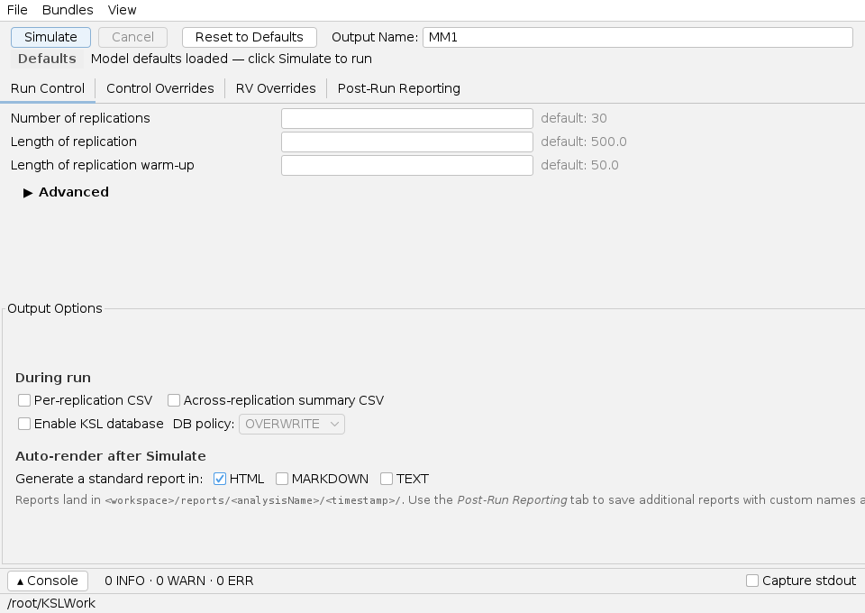
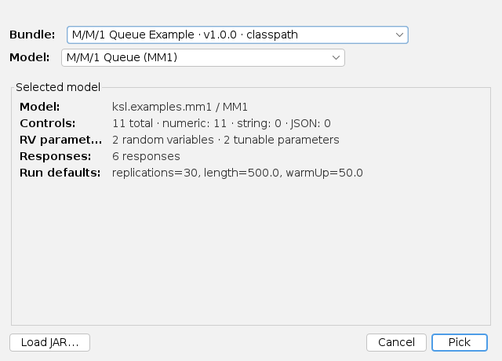
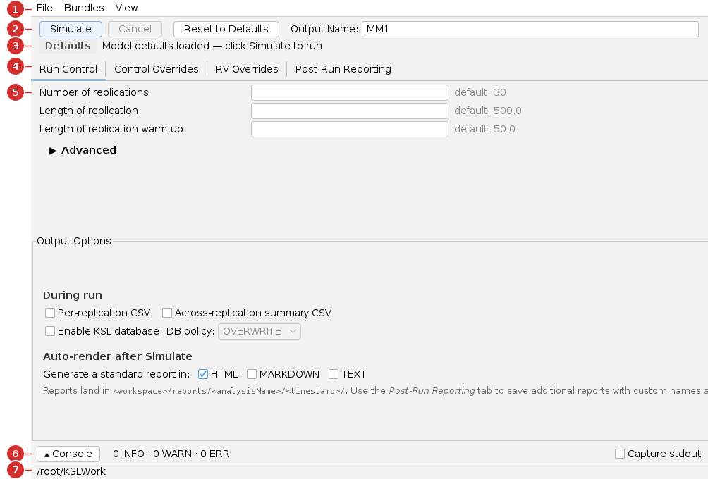
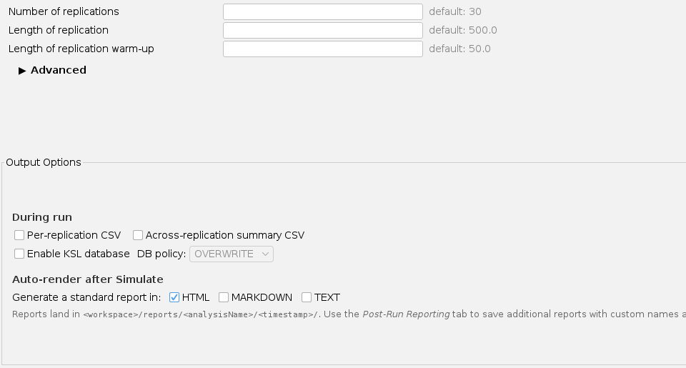
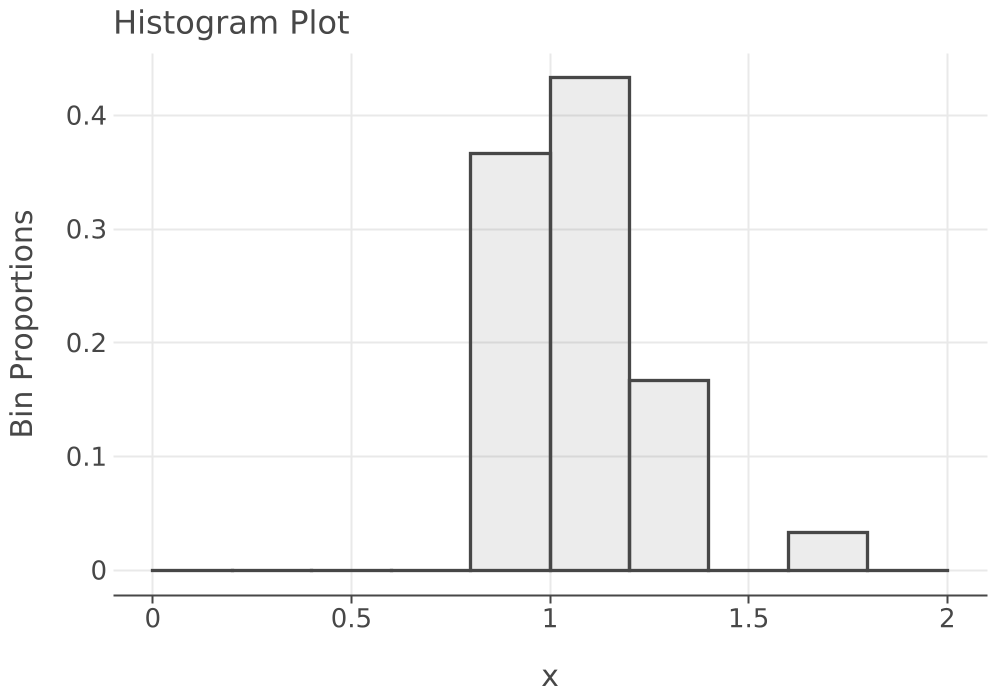
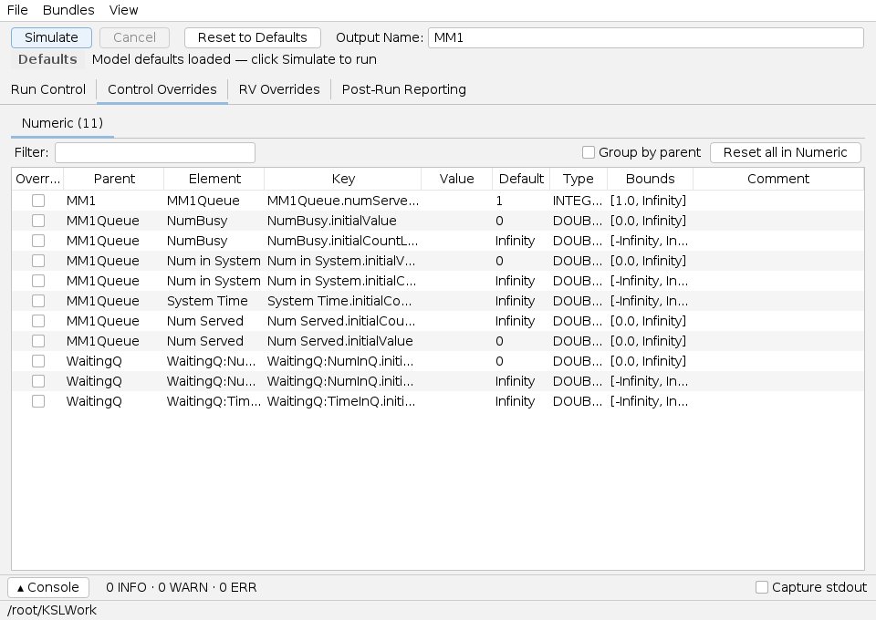
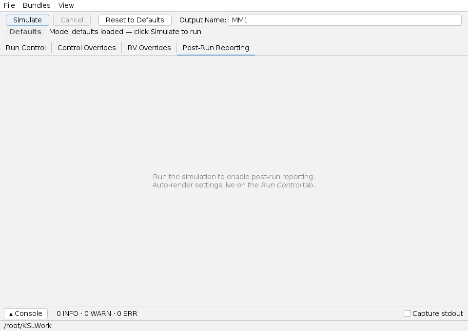

# Single-Model App — User Guide

The **Single-Model app** runs **one** simulation model, lets you adjust its run
settings and inputs, and shows you the results. It's the simplest of the KSL
desktop apps and the best place to start: set a few parameters, click
**Simulate**, and read a report.

> **You will need:** Java 21 and a model **bundle** to load. This guide uses the
> **Drive-Through Pharmacy** model (`DriveThroughPharmacyWithQ`) from the **KSL Book
> Examples** bundle (`book-examples.jar`) — the book's canonical single-server queue.
> New to the KSL desktop apps? Skim [Common UI & concepts](common-ui.md) first.

> **⚠️ Screenshots pending refresh.** This guide now uses the
> **DriveThroughPharmacyWithQ** model; the window images below were captured from an
> earlier example model and will be re-captured. The written steps, inputs, run
> defaults, and results on this page are correct for DriveThroughPharmacyWithQ.

## What you'll be able to do

- Launch the Single-Model app and load a model from a **bundle**.
- Pick the **DriveThroughPharmacyWithQ** model and recognize every region of the window.
- Set the number of replications, run length, and warm-up period.
- Run a simulation and have a report generated automatically.
- Read across-replication statistics and a results chart, and understand what a
  confidence-interval half-width tells you.
- Override a model's built-in inputs and save your setup to reuse later.
- Capture a **Welch warm-up analysis** and **response traces**, and save their reports.

---

## 1. At a glance

The whole app is one window. You set inputs in the center tabs, click **Simulate**
in the toolbar, and a report is written to your workspace.

| Use **this app** when… | Use a sibling app when… |
|---|---|
| You want to run **one** model and look at its results. | You want to compare **several** configurations side by side → [Scenario app](scenario.md) |
| You're exploring or debugging a single setup. | You want to vary inputs over a **designed experiment** → [Experiment app](experiment.md) |
| You want a quick report for one run. | You want the computer to **search for the best** inputs → [Simopt app](simopt.md) |

---

## 2. Before you begin

The app doesn't have models built in — it loads them from **bundles** (JAR files
that advertise one or more models). When you launch the app, it shows a **Pick a
Model** dialog listing the bundles it found:

For this guide, use the **KSL Book Examples** bundle and its **DriveThroughPharmacyWithQ**
model — the *Selected model* panel summarizes the model's inputs and run defaults.
**It's already there:** the KSL suite ships the book examples, so the bundle is listed the
first time you open the app. Nothing to build or copy.

- If the model you want is already listed, select its bundle and model.
- To use a model of your own, drop its bundle JAR into your `<KSLWork>/bundles/` folder
  before launching, or click **Load JAR…** to load one now. See
  [Common UI → Models and bundles](common-ui.md#models-and-bundles).

You'll click **Pick** in [Step 1](#step-1--pick-the-model) of the tutorial.

Everything the app writes (reports, databases) goes under your **working directory**,
shown in the status bar at the bottom of the window (here, `/root/KSLWork`). Change
it any time from **File → Set Working Directory…**.

---

## 3. A guided tour of the window

The red numbers below are added for this guide; they are not part of the app.

1. **Menu bar** — *File* (reset, open, save, set working directory, exit),
   *Bundles* (load another bundle JAR, **open a different model**, see what's loaded),
   and *View* (theme). See [Common UI](common-ui.md#menu-bar).
2. **Run toolbar** — the **Simulate** button (run the model), **Cancel**,
   **Reset to Defaults**, and the **Output Name** field that names this run's
   output files and folder.
3. **Run-status strip** — a badge telling you the current state: *Defaults*,
   *Edited*, *Running…*, *Completed*, or *Failed*, with a one-line summary.
4. **Tabs** — *Run Control*, *Control Overrides*, *RV Overrides*, and *Post-Run
   Reporting*. (Override tabs appear only when the model exposes those inputs.)
5. **Run parameters** — the editable run settings: number of replications, run
   length, and warm-up.
6. **Console drawer** — collapsible run log; its header shows INFO / WARN / ERR
   counts at a glance. See [Common UI](common-ui.md#run-console).
7. **Workspace status bar** — your current working directory.

---

## 4. Tutorial — run the Drive-Through Pharmacy queue

`DriveThroughPharmacyWithQ` is a single-server drive-through pharmacy: customers
arrive (Poisson, mean 1 per minute), one pharmacist serves them (exponential,
mean 0.5 minute), and any who arrive while the pharmacist is busy wait in the
`PharmacyQ`. With one server and exponential arrivals and service, it is an M/M/1
queue — the book's canonical starting example.

### Step 1 — Pick the model

At launch, the **Pick a Model** dialog appears (shown in [§2](#2-before-you-begin)).
Choose the **KSL Book Examples** bundle and the **DriveThroughPharmacyWithQ** model,
check the *Selected model* summary — its inputs are **Number of Pharmacists**
(`Pharmacy.numPharmacists`) and **Mean Service Time** (`ServiceTime.mean`), and its
run defaults are replications=30, length=20000, warm-up=5000 — and click **Pick**.
The main window opens on that model.

### Step 2 — Look at the run parameters

Open the **Run Control** tab (it's selected when the app starts). The three boxes
show the model's defaults as grey hint text:

| Field | Meaning | Default |
|---|---|---|
| **Number of replications** | How many independent runs to average over. More replications → more precise estimates. | 30 |
| **Length of replication** | How long each run lasts (in simulated minutes). | 20000.0 |
| **Length of replication warm-up** | Initial period discarded so startup bias doesn't skew the averages. | 5000.0 |

Leave them empty to use the defaults, or type a value to override one. For this
tutorial, leave all three at their defaults.

### Step 3 — Choose what output to produce

Lower on the same tab, **Output Options** controls what gets written when you run:

- **During run** — optionally write per-replication / summary **CSV** files and a
  **KSL database**.
- **Auto-render after Simulate** — tick **HTML**, **Markdown**, and/or **Text** to
  have a standard report generated and opened automatically when the run finishes.
  **HTML** is ticked by default.

Leave **HTML** ticked.

> Below Output Options the Run Control tab also has two **opt-in analyses** —
> **Warm-Up Analysis (Welch)** and **Response Trace** — that must be switched on
> *before* you Simulate; their reports then appear on the **Post-Run Reporting** tab.
> See [§5](#5-reference--every-tab-explained). Skip them for this first run.

### Step 4 — Name the run (optional)

In the toolbar, **Output Name** defaults to the model name,
`DriveThroughPharmacyWithQ`. This becomes the subfolder and file stem for this run's
output under your working directory. You can leave it as is.

### Step 5 — Simulate

Click **Simulate**. The status strip switches to **Running…**, the console logs
progress, and within a second or two it reads **Completed** with a summary like
"30 / 30 replications". Your HTML report opens in your browser automatically.

> If the output folder already exists, the app asks before writing into it — pick
> **Use Existing Folder** to continue. See [§7](#7-troubleshooting--gotchas).

### Reading the results

Here is what the run produced. First, what was run:

| Property | Value |
|:---|:---|
| Model Name | DriveThroughPharmacyWithQ |
| Replications | 30 |
| Run Length | 20000.0 |
| Warm-Up Length | 5000.0 |

Then the **across-replication statistics** — each response averaged over the 30
replications, with a 95% confidence-interval half-width:

| Name | Average | Std Error | Half-Width | 95% CI |
|:---|---:|---:|---:|:---:|
| NumBusy | 0.4988 | 0.00081 | 0.00166 | [0.4971, 0.5005] |
| Num in System | 0.9932 | 0.00454 | 0.00928 | [0.9839, 1.0025] |
| System Time | 0.9944 | 0.00417 | 0.00852 | [0.9859, 1.0029] |
| PharmacyQ:NumInQ | 0.4945 | 0.00403 | 0.00825 | [0.4863, 0.5028] |
| PharmacyQ:TimeInQ | 0.4950 | 0.00386 | 0.00790 | [0.4871, 0.5029] |
| SysTime >= 4 minutes | 0.0176 | 0.00069 | 0.00142 | [0.0162, 0.0190] |
| Num Served | 14981.73 | 20.06 | 41.03 | [14940.70, 15022.76] |

**How to read a row.** Take **System Time** (minutes a customer spends in the
system). The average across the 30 runs is **0.9944** with a half-width of
**0.0085**, so the true long-run mean is plausibly in **[0.9859, 1.0029]** minutes
at 95% confidence. The single pharmacist is busy about **50%** of the time
(NumBusy ≈ 0.4988), roughly **1.8%** of customers wait more than 4 minutes, and
about **14,982** customers are served over the run. A smaller half-width means a
more precise estimate — get one by running more replications or a longer run.

Reports can also include **charts**. Here is the distribution of the per-replication
**System Time** averages — most runs landed near 0.98–1.01, the spread you see in
the table's confidence interval:

---

## 5. Reference — every tab explained

### Run Control

The editable run parameters (replications, length, warm-up) plus **Output Options**
(CSV, database, and which report formats to auto-render) — all you need for a basic
run. Two **opt-in analyses** sit lower on the tab; both are **captured during the run**,
so you must configure them *before* Simulate:

- **Warm-Up Analysis (Welch)** — **Configure Warm-Up Analysis…** opens a dialog where you
  tick *Capture Welch warm-up data during the run* and choose which responses to analyze
  (each with a discretizing interval — a batch size for tally responses, a Δt for
  time-weighted ones). It feeds the **Welch Report…** button on the Post-Run Reporting tab:
  a Welch and cumulative-average plot for finding the warm-up (truncation) point that
  removes initialization bias.
- **Response Trace** — **Configure Response Trace…** picks the responses whose **sample
  paths** to record (each with a replication cap). It feeds the **Trace Report…** button on
  Post-Run Reporting.

A one-line summary beside each button shows the current selection; both are disabled when
the model exposes no responses.

### Control Overrides

Lists the model's **controls** — named inputs the model author exposed — grouped
into **Numeric**, **String**, and **JSON** sub-tabs. Each row shows the element, the
control key, its default, type, and allowed bounds. Tick **Override** and type a
value to change an input for the next run.

DriveThroughPharmacyWithQ exposes a single numeric control,
`Pharmacy.numPharmacists` (Integer, lower bound 1, default 1) — tick **Override**
and set it to, say, `2` to run with a second pharmacist. (Models that expose string
or JSON controls show those on the **String** / **JSON** sub-tabs; this model has
none.) See [Common UI → Override fields](common-ui.md#override-fields).

### RV Overrides

Override the **random-variable** parameters or seeds — for this model,
`ServiceTime`'s mean (default 0.5 minute) or the arrival process. The tab appears
only when the model exposes random variables.

### Post-Run Reporting

Before a run, this tab is empty:

After a successful run it lets you save **additional** reports with custom names and
section choices, and lists everything saved this session. (Routine reports are
already produced by *Auto-render after Simulate* on the Run Control tab.)

Two extra buttons here serve the opt-in analyses, and are **enabled only when the run
captured their data**: **Welch Report…** (the Welch + cumulative-average plot, plus
optional partial-sums and bias-test sections) and **Trace Report…** (response sample
paths, with a choice of *first replication* or specific replication numbers and an
optional start/end time window). Both offer HTML, Markdown, and Text formats. Enable the
matching analysis on the **Run Control** tab *before* Simulate — neither report can be
produced from a run that didn't capture it.

---

## 6. Common tasks

| Task | How |
|---|---|
| Reset everything to model defaults | **File → Reset to Model Defaults** (or the toolbar **Reset to Defaults**) |
| Find the warm-up (truncation) point | **Configure Warm-Up Analysis…** on Run Control → **Simulate** → **Welch Report…** on Post-Run Reporting |
| Save response **sample paths** | **Configure Response Trace…** on Run Control → **Simulate** → **Trace Report…** on Post-Run Reporting |
| Save your setup to reuse later | **File → Save Configuration** (`Ctrl/Cmd+S`) — writes a `.toml` you can reopen |
| Reopen a saved setup | **File → Open Configuration…** |
| Run a **different model** | **Bundles → Open Model…** (use **Load JAR…** first if its bundle isn't loaded) |
| Change the working directory | **File → Set Working Directory…** |
| Switch light/dark theme | **View → Appearance** |
| Watch the run log | Click **▲ Console** at the bottom to expand the drawer |

> A **configuration** saves your *inputs*, not your *results*. Results are written as
> reports/databases under the working directory. See
> [Common UI](common-ui.md#configurations-vs-results).

### Switching to a different model

You don't have to restart the app to work on another model. **Bundles → Open Model…** shows
the same bundle → model picker you saw at launch; choose a model and the window reopens on
it, at the same size and position. If the model you want lives in a bundle that isn't
loaded yet, use **Bundles → Load JAR…** first.

Switching starts a clean editor on the new model: overrides belong to the model whose
controls and random variables they name, so they are not carried across. The app asks
before discarding unsaved changes, and refuses to switch while a simulation is running —
cancel the run first. Save your configuration beforehand if you want to come back to it.

Opening a **configuration** that was saved for another model does the same thing: the app
tells you which model the file belongs to and offers to open it, rather than applying that
file's overrides to whatever model happens to be loaded.

---

## 7. Troubleshooting & gotchas

| Symptom | Cause | Fix |
|---|---|---|
| Status reads **Edited** in orange | You changed a parameter since the last run. | Click **Simulate** to run with the new values. |
| Dialog: *"A folder named … already exists"* | The Output Name's folder already has output. | Choose **Use Existing Folder** to overwrite, or **Choose Different Name…**. |
| Report didn't open in the browser | No auto-open available, or no format ticked. | Tick a format under *Auto-render after Simulate*, or open it from the workspace `reports/` folder. |
| A red **health banner** appears at the top | A run parameter is invalid (e.g. negative length). | Click **Jump to source** and fix the highlighted field. |
| **Control Overrides** / **RV Overrides** tab is missing | The model exposes no controls / random variables. | Nothing to fix — the tabs appear only when applicable. |
| **Welch Report…** / **Trace Report…** is greyed out | The run didn't capture that data. | Enable **Warm-Up Analysis** / **Response Trace** on the **Run Control** tab before **Simulate** — neither can be produced retroactively. |

---

## 8. See also

- [Common UI & concepts](common-ui.md)
- [Scenario app](scenario.md) · [Experiment app](experiment.md) · [Simopt app](simopt.md) · [Results app](results.md)
- [KSL Book](https://rossetti.github.io/KSLBook/) — the simulation concepts behind the drive-through pharmacy model.
