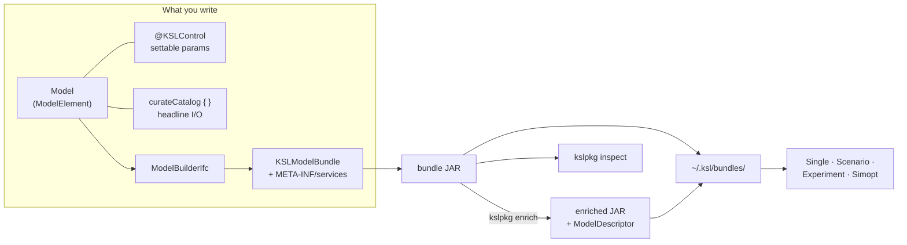
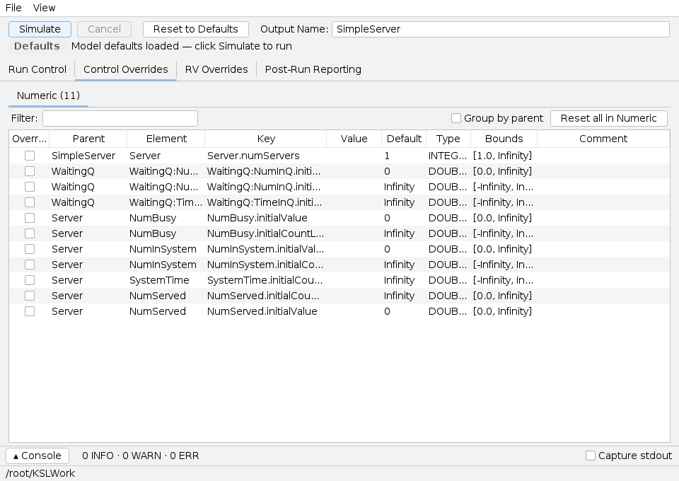

# Guide: Preparing a Model for Bundling

A task-oriented guide for **model developers**: how to take a working KSL model and make
it *bundle-ready* so the desktop apps (and future hosted runtimes) can discover, configure,
and run it — without your code being compiled into them.

This guide ties together pieces documented elsewhere rather than replacing them:

- The **[`ksl.controls`](ksl-controls.md)** guide covers control annotations in depth.
- The **[Bundle Tools (`kslpkg`)](apps/bundle-tools.md)** guide covers the command-line
  packaging tool.
- The **desktop-app guides** ([Single](apps/single.md), [Scenario](apps/scenario.md),
  [Experiment](apps/experiment.md), [Simopt](apps/simopt.md)) cover the consumers.

The worked example is the compile-verified
[`SimpleServer`](../../KSLExamples/src/main/kotlin/ksl/examples/general/bundling/SimpleServer.kt)
model and its
[`SimpleServerBundle`](../../KSLExamples/src/main/kotlin/ksl/examples/general/bundling/SimpleServerBundle.kt),
in `KSLExamples`.

---

## 1. What this guide is for

The KSL desktop apps don't compile your model into them. Instead, a model travels as a
**bundle** — a JAR that *describes itself* and supplies a builder that constructs the model
on demand. Apps discover bundles from your personal folder `~/.ksl/bundles/` (or via
**Bundles → Load JAR…**); the same bundle works in all four apps, in the `kslpkg` tool, and
in planned runtimes (a REST service, an MCP server for agents).



**Why bother?** One compiled model becomes reusable across every app; experiments and
optimizers can set its parameters *by name*; and tooling can read its input/output surface
from the JAR without instantiating any Kotlin class.

---

## 2. The mental model — four things a bundle-ready model has

| Ingredient | What it is | How you add it |
|---|---|---|
| **Controls** | Named, externally-settable parameters the apps vary (e.g. number of servers). | Annotate setters with `@KSLControl` / `@KSLStringControl` / `@KSLJsonControl`. |
| **A catalog** | The *headline* inputs/outputs, each with a friendly name and unit, used to drive the apps' info panels and pickers. | `model.curateCatalog { input/rvParameter/output … }`. |
| **A descriptor** | The model's serialized input/output surface (controls, RV parameters, responses, run defaults, catalog). | Auto-derived by `model.modelDescriptor()`; embedded by `kslpkg enrich`. |
| **A bundle** | The discoverable wrapper that names the model(s), says which apps each supports, and builds them. | Implement `KSLModelBundle` + register it for `ServiceLoader`. |

How they relate: **controls** and the **catalog** are properties of the built model;
together they feed the **descriptor**; the **bundle** makes the whole thing discoverable
from a JAR. Controls are the machine-settable surface (experiments/optimizers write them by
key); the catalog is the human-facing surface (display names + units).

---

## 3. Quick start — one model, end to end

### Step 1 — Code the model and add controls

Write your model as usual. For every parameter an app should be able to vary, annotate its
**setter** with `@KSLControl`. The example exposes the number of servers:

```kotlin
class SimpleServer(
    parent: ModelElement,
    numServers: Int = 1,
    /* … RV sources … */
    name: String? = null
) : ModelElement(parent, name) {

    @set:KSLControl(controlType = ControlType.INTEGER, lowerBound = 1.0)
    var numServers: Int = numServers
        set(value) {
            require(value > 0) { "The number of servers must be > 0" }
            require(!model.isRunning) { "Cannot change the number of servers while the model is running" }
            field = value
        }

    private val mySystemTime = Response(this, "SystemTime")
    val systemTime: ResponseCIfc get() = mySystemTime
    // … NumInSystem, NumServed, the event logic …
}
```

The control becomes addressable by the key `"<elementName>.numServers"` — here
`"Server.numServers"`. See **[`ksl.controls`](ksl-controls.md)** for the string/JSON control
families, bounds, and validation.

> **Why setters?** Only annotated setters become controls. Marking the setter lets the apps
> write a new value (with bounds-checking) before each run.

### Step 2 — Curate the catalog

The catalog nominates your model's *headline* inputs and outputs and gives each a friendly
name and unit. Call `curateCatalog` after the elements exist (typically in the builder):

```kotlin
model.curateCatalog {
    input(server, SimpleServer::numServers) { displayName = "Number of Servers"; unit = "servers" }
    rvParameter(server.serviceTime, "mean")  { displayName = "Mean Service Time"; unit = "min" }
    rvParameter(server.timeBetweenArrivals, "mean") { displayName = "Mean Time Between Arrivals"; unit = "min" }
    output(server.systemTime)  { displayName = "Avg Time in System"; unit = "min" }
    output(server.numInSystem) { displayName = "Avg Number in System" }
    output(server.numServed)   { displayName = "Number Served" }
}
```

- **`input`** binds a control; **`rvParameter`** binds one parameter of a random variable
  (e.g. an exponential `mean`); **`output`** nominates a response.
- This is what populates the apps' *Selected model* info and input editors — a model without
  a catalog still runs, but its surface is harder for users to read.

### Step 3 — Wrap construction in a `ModelBuilderIfc`

A bundle never hands out a live `Model`; it hands out a **builder** that constructs one on
demand. Implement `build(modelConfiguration, experimentRunParameters)`:

```kotlin
override fun builder(): ModelBuilderIfc = object : ModelBuilderIfc {
    override fun build(
        modelConfiguration: Map<String, String>?,
        experimentRunParameters: ExperimentRunParametersIfc?
    ): Model {
        // The child element name ("Server") must differ from the Model's name.
        val model = Model("SimpleServer", autoCSVReports = false)
        val server = SimpleServer(model, numServers = 1, name = "Server")
        model.numberOfReplications = 30
        model.lengthOfReplication = 5000.0
        model.lengthOfReplicationWarmUp = 1000.0
        model.curateCatalog { /* … as in Step 2 … */ }
        if (experimentRunParameters != null) model.changeRunParameters(experimentRunParameters)
        return model
    }
}
```

> Use a **named** builder/model class (not an anonymous inline lambda) when you want the same
> compiled builder to be reusable across apps and reference forms.

### Step 4 — Declare the bundle

Implement `KSLModelBundle` (the bundle) and `KSLBundledModel` (each model). The required
fields are small:

```kotlin
class SimpleServerBundle : KSLModelBundle {
    override val bundleId = "ksl.guide.simple-server"
    override val displayName = "Simple Server Queue (Guide Example)"
    override val description = "A minimal single-queue, c-server station used by the model-bundling guide."
    override val version = "1.0.0"
    override val kslApiVersion = "1.2"
    override val tags = setOf("guide", "queue", "example")   // optional metadata
    override val models = listOf(SimpleServerModel)

    private object SimpleServerModel : KSLBundledModel {
        override val modelId = "SimpleServer"
        override val displayName = "Simple Server Queue"
        override val description = "Customers arrive, wait in one queue, are served by one of c servers, and leave."
        override val supportedApps = setOf(
            KSLAppKind.SINGLE, KSLAppKind.SCENARIO, KSLAppKind.EXPERIMENT, KSLAppKind.SIMOPT
        )
        override fun builder(): ModelBuilderIfc = /* Step 3 */
    }
}
```

- **`bundleId` / `modelId`** are stable identifiers (saved configurations resolve against
  them) — choose reverse-DNS-ish ids and don't rename casually.
- **`supportedApps`** advertises where the model is meaningful (a model with no varied input
  isn't a useful `EXPERIMENT`/`SIMOPT` subject, for instance).
- **`kslApiVersion`** records the KSL API the bundle was built against.
- Optional: `author`, `homepage`, `license`, `tags`, and **config recipes** (pre-canned run
  setups) via `recipesFor(modelId)`.

### Step 5 — Register for discovery

Bundles are found through Java's `ServiceLoader`. Add a single line naming your bundle class
to this resource in your JAR:

```text
# src/main/resources/META-INF/services/ksl.app.bundle.KSLModelBundle
ksl.examples.general.bundling.SimpleServerBundle
```

Without this registration the JAR contains your classes but advertises **no** bundles —
the single most common "my model won't show up" mistake.

### Step 6 — Inspect (hand-off to `kslpkg`)

Build the JAR, then verify what consumers will see with
**[`kslpkg`](apps/bundle-tools.md)**:

```text
$ java -jar kslpkg.jar inspect simple-server-bundle.jar
JAR: .../simple-server-bundle.jar
Discovery: ServiceLoader (META-INF/services/ksl.app.bundle.KSLModelBundle)
Bundles: 1

Bundle: ksl.guide.simple-server
  Display name : Simple Server Queue (Guide Example)
  Version      : 1.0.0
  KSL API      : 1.2
  Models       : 1
    - SimpleServer (Simple Server Queue)
        Apps         : SINGLE, SCENARIO, EXPERIMENT, SIMOPT
        Has in-JAR descriptor : no
  Optional metadata:
    Tags      : guide, queue, example
```

`Has in-JAR descriptor : no` means the next step hasn't run yet.

### Step 7 — Enrich (embed the descriptor)

`enrich` builds each model once, captures its **`ModelDescriptor`**, and writes a copy of the
JAR with the descriptors embedded — so consumers can read the model's surface without
instantiating it:

```text
$ java -jar kslpkg.jar enrich simple-server-bundle.jar -o simple-server-bundle-enriched.jar --force
Wrote simple-server-bundle-enriched.jar
  Embedded 1 descriptor entry:
    META-INF/ksl/models/SimpleServer/descriptor.json
```

The embedded descriptor carries the responses, controls, RV parameters, run defaults, and —
because we curated one — the **catalog**:

```text
responses : NumBusy, NumInSystem, NumServed, SystemTime, WaitingQ:NumInQ, WaitingQ:TimeInQ
catalog inputs  : Number of Servers (servers), Mean Service Time (min), Mean Time Between Arrivals (min)
catalog outputs : Avg Time in System (min), Avg Number in System, Number Served
```

### Step 8 — Automate enrichment in Gradle

Wire enrichment into your build so the published JAR is always enriched. Add a `JavaExec`
task that runs `kslpkg enrich` on your bundle JAR (the reference implementation is
`KSLExamples/build.gradle.kts` → `enrichExampleBundle`):

```kotlin
tasks.register<JavaExec>("enrichBundle") {
    group = "ksl bundle"
    description = "Embed ModelDescriptor JSON into a copy of this bundle's JAR."
    val bundleJar = tasks.named<Jar>("jar")
    dependsOn(bundleJar)
    classpath = files("tools/kslpkg.jar")          // adjust to where you keep kslpkg
    mainClass.set("ksl.bundle.tools.MainKt")
    doFirst {
        args = listOf("enrich", bundleJar.get().archiveFile.get().asFile.absolutePath, "--force")
    }
}
```

### Step 9 — Verify in an app

Drop the JAR into `~/.ksl/bundles/` (or use **Bundles → Load JAR…**) and launch an app. The
model appears with the controls you authored — here `Server.numServers`, an `INTEGER` bounded
`[1, ∞)`, on the **Control Overrides** tab of the [Single-Model app](apps/single.md):



That's the whole point: a model you wrote, now configurable and runnable in every KSL app.

---

## 4. Key types

| Type | Package | Role |
|---|---|---|
| `KSLModelBundle` | `ksl.app.bundle` | The bundle: id, display name, version, `kslApiVersion`, models, optional metadata, recipes. |
| `KSLBundledModel` | `ksl.app.bundle` | One model: id, display name, `supportedApps`, `builder()`. |
| `ModelBuilderIfc` | `ksl.simulation` | `build(modelConfiguration, experimentRunParameters): Model`. |
| `KSLAppKind` | `ksl.app.bundle` | `SINGLE` · `SCENARIO` · `EXPERIMENT` · `SIMOPT`. |
| `@KSLControl` family | `ksl.controls` | Marks settable parameters → [controls guide](ksl-controls.md). |
| `curateCatalog` / `ModelCatalog` | `ksl.simulation` | Nominate headline inputs/outputs with names + units. |
| `Model.modelDescriptor()` / `ModelDescriptor` | `ksl.simulation` | The serialized I/O surface that `enrich` embeds. |
| `KSLConfigRecipe` / `ConfigRecipeKind` | `ksl.app.bundle` | Optional pre-canned run configurations shipped with a bundle. |

---

## 5. Recipes & variations

- **Multiple models per bundle.** `models` is a list — ship related models in one JAR; each
  declares its own `supportedApps`.
- **Restrict the apps.** A pure cost model with no decision variable might be
  `supportedApps = setOf(SINGLE)` only.
- **Config recipes.** Override `recipesFor(modelId)` to ship ready-made run/scenario/
  experiment setups alongside the model.
- **Build-time variants.** Read `modelConfiguration` in `build(...)` to construct variants
  (e.g. a topology size) from a string map.
- **Bundle-ready checklist:**
  1. Settable parameters are `@KSLControl`-annotated setters.
  2. Headline inputs/outputs are `curateCatalog`-nominated with names + units.
  3. A `ModelBuilderIfc` constructs the model and honors `experimentRunParameters`.
  4. `KSLModelBundle` + `KSLBundledModel` declare stable ids, version, `supportedApps`.
  5. `META-INF/services/ksl.app.bundle.KSLModelBundle` names the bundle class.
  6. `kslpkg inspect` shows the bundle; `kslpkg enrich` succeeds.

---

## 6. Gotchas

- **Child element name must not equal the Model name.** `Model("SimpleServer")` with a child
  named `"SimpleServer"` collides at the root; name the child `"Server"`.
- **Missing `META-INF/services` registration** → the JAR loads but advertises no bundles.
  This is the most common discovery failure; `kslpkg inspect` will say `Bundles: 0`.
- **Control keys are `<elementName>.<property>`** and change if you rename the element or
  property — saved configurations reference them, so treat them as API.
- **`build(...)` must honor `experimentRunParameters`** (call `changeRunParameters`), or hosts
  that set replications/length will be ignored.
- **Don't bundle KSLCore.** A bundle JAR is loaded under the host's classloader, which already
  provides KSLCore; bundling it invites version conflicts.
- **Descriptor JSON isn't byte-stable** across `enrich` runs (it captures a construction-time
  marker and an auto-incrementing experiment id) — don't diff descriptors for equality.

---

## 7. See also

- [`ksl.controls`](ksl-controls.md) — the control-annotation system in depth.
- [Bundle Tools (`kslpkg`)](apps/bundle-tools.md) — the packaging CLI.
- The app guides — [Single](apps/single.md), [Scenario](apps/scenario.md), [Experiment](apps/experiment.md), [Simopt](apps/simopt.md) — the bundle consumers.
- `KSLBundleTools/README.md` and the `ksl.app.bundle` SPI source.
- [KSL Book](https://rossetti.github.io/KSLBook/).

---

<sub>The `SimpleServer` model/bundle is compiled in `KSLExamples`; the `kslpkg` transcripts
and the app screenshot above are real output produced from its
`simple-server-bundle.jar` (`./gradlew :KSLExamples:guideExampleBundleJar`).</sub>
