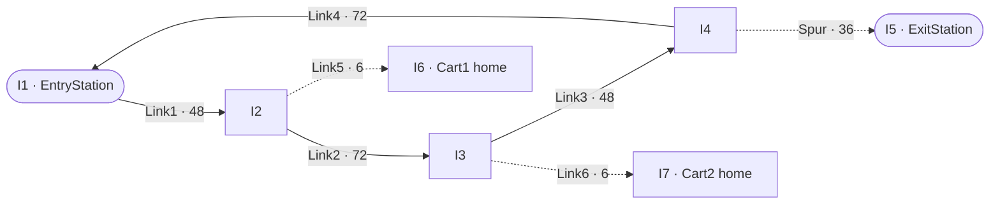
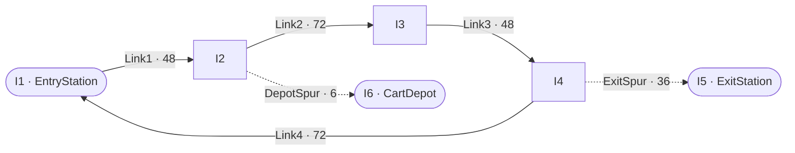
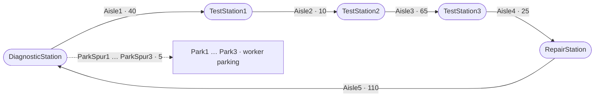
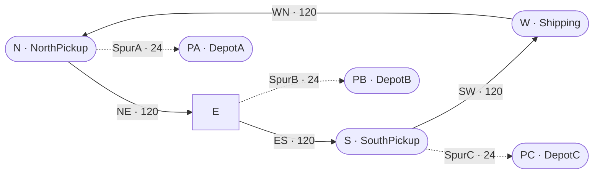
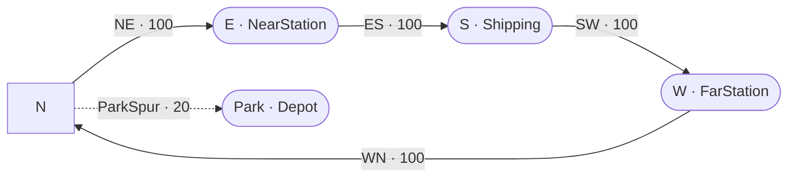
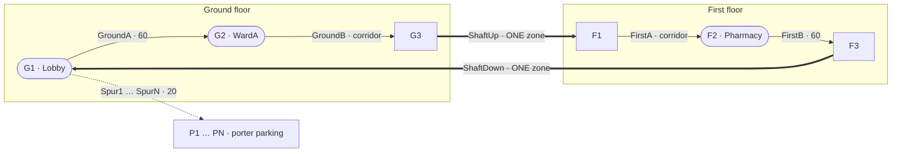
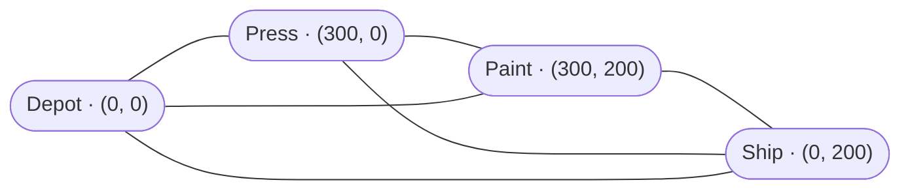

# Vehicles in KSL — a tutorial through the examples

*Ten worked cases.* Each one states a **problem**, describes the **model** with a
figure of the layout, gives **the whole of its code** with an explanation of every
part, shows what it **produced**, and says what that is evidence **for**. Every
figure on this page came from running the example named beside it; none is recalled
or estimated, and the code is the example's own, quoted whole rather than
summarised.

**You should not have to open anything to follow this page.**

If you have not met the four transport subsystems, read
[`ksl-transport`](ksl-transport.md) first — it is one page and it is the map
this tutorial walks over.

---

## How to read this tutorial

The examples are ordered so that each one needs only what came before it.

| # | Case | Run it with |
|---|---|---|
| 1 | [A simple AGV shop](#1-a-simple-agv-shop) | `:KSLExamples:simpleAgvExample` |
| 2 | [The same shop, both paradigms](#2-the-same-shop-modelled-both-ways) | `:KSLExamples:twoParadigmsExample` |
| 3 | [Free path against guide path](#3-free-path-against-guide-path) | *(a model class; see below)* |
| 4 | [Six dispatching rules](#4-six-dispatching-rules) | `:KSLExamples:dispatchingRuleComparison` |
| 5 | [Turning a cart round](#5-turning-a-cart-round) | `:KSLExamples:retaskingExample` |
| 6 | [A hospital on two floors](#6-a-hospital-on-two-floors) | `:KSLExamples:multiFloorHospitalExample` |
| 7 | [A two-lane warehouse](#7-a-two-lane-warehouse) | `:KSLExamples:twoLaneWarehouseExample` |
| 8 | [A dispatcher with no aisles](#8-a-dispatcher-with-no-aisles) | `:KSLExamples:freePathFleetExample` |
| 9 | [What the engine costs](#9-what-the-engine-costs) | `:KSLExamples:guidedPathBenchmark` |
| 10 | [What deciding costs](#10-what-deciding-costs) | `:KSLExamples:agvBenchmark` |
| 11 | [A shop with spills and a maintenance window](#11-a-shop-with-spills-and-a-maintenance-window) | `:KSLExamples:guidePathDisturbancesExample` |
| 12 | [Three answers to one closure](#12-three-answers-to-one-closure) | `:KSLExamples:zoneClosurePolicyExample` |
| 13 | [Whose turn is it?](#13-whose-turn-is-it) | `:KSLExamples:crossingArbiterExample` |

**A note on the output.** Several examples print warnings above their tables —
horizon diagnostics, and in two cases deadlock reports logged at ERROR. Those
are the audit doing its job, not a fault. Read the tables last.

**Reading the code.** Each case has a **The code** section that reproduces the
example **in full**, broken into numbered parts, each part followed by an
explanation of what it does and why it is written that way. Nothing is
paraphrased and nothing load-bearing is left out. Two things are omitted and it is
worth knowing which:

- **The files' own documentation comments**, because this page replaces them. The
  short comments *inside* the code are kept — several of them record a mistake that
  was actually made.
- **The import lists**, except in case 1, which explains them once. They are
  mechanical, and an IDE writes them for you.

A test — `KSLExamples/src/test/kotlin/ksl/examples/general/doc/TransportTutorialCodeTest.kt`
— reads this page and checks that every line of every code block is still in the
file its case names. If an example is edited and this page is not, the build says
so.

**Reading the numbers.** Every comparison on this page is **paired**: the alternatives
run on common random numbers through a `ScenarioRunner`, and the reported difference is
computed replication by replication with a half-width beside it. A difference smaller than
its half-width means *no detectable difference at this sample size*, which is not the same
as "the same". Two cases report no intervals and say why — case 5 is deterministic, and
cases 9 and 10 measure wall-clock time. The full half-width summary report for every
configuration, covering every response the model keeps, is printed by the runner: to the
console for the small studies and to the KSL output directory for the larger ones.

**Reading the figures.** Every case that models a network has a figure of it,
drawn from the code that builds it. The figures are **topological**: an arrow is
a link, and a number on it is that link's *declared length*, which is what
routing reads. Nothing is to scale, and no figure carries coordinates — except
case 8, which is not a guide path at all and where the coordinates *are* the
model.

| In the figures | Means |
|---|---|
| `A ──▶ B` | a one-way link — vehicles travel A to B and never B to A |
| a **dotted** arrow | a **spur**: two-way, one vehicle at a time, and a dead end |
| a **thick** arrow | a lift shaft, which is an ordinary link of exactly one zone |
| a rounded node | an intersection carrying a named **station** |
| a plain node | a bare intersection |
| a line with **no** arrowhead | not a link at all — case 8 is a plane, and its lines only say what is reachable |

Two figures are drawn as **plans** rather than graphs: the warehouse in case 7
and the benchmark grid in case 9. An automatic graph layout draws a rectangular
grid as a diagonal cascade, and in those two cases the shape of the building is
part of the point. Both carry their own key in their captions.

---

## 1. A simple AGV shop

`ksl.examples.general.guidedpath.SimpleAGVExample`

### The problem

Two carts carry parts from an entry station to an exit station in a small shop.
This is the smallest layout that is worth building, and the point of it is that
**the layout is the model**.

### The model



*Figure 1 — the shop. Because the loop turns one way only, entry to exit is 204
feet the long way round while exit back to entry is 108. Loop zones are 12 feet;
the two home spurs get 6.*

A one-way loop with a spur down to the exit station and a parking spur for each
cart. Four properties of that description are load-bearing:

- **The main loop runs one way.** Two carts can queue behind one another but can
  never face each other, so head-on deadlock is impossible rather than merely
  unlikely.
- **The exit station is on a spur.** A spur admits one cart. The second cart
  sent there waits at the mouth, out on the loop, rather than following the
  first in and facing it with neither able to reverse.
- **Each cart has a parking spur of its own.** A stopped cart goes on holding
  the zones it stands on.
- **Zone sizes differ between links.** The loop is discretised at twelve feet so
  two six-foot carts cannot close to less than six; the home spurs are six feet
  and get a zone size of their own. Zone size belongs to a *link* precisely so
  that this is expressible.

### The code

`SimpleAGVExample.kt` in full, with nothing left out but the GPL header and the
file's own documentation comments — which this page replaces. The parts follow the
file's own reading order: the model class and the names it is written in, then the
layout, then the body, then the study. Every later case is presented the same way,
so if you read one walk-through closely, read this one.

#### 1. Imports

```kotlin
package ksl.examples.general.guidedpath

import ksl.controls.experiments.ScenarioRunner
import ksl.modeling.elements.EventGeneratorRVCIfc
import ksl.modeling.entity.ProcessModel
import ksl.modeling.guidedpath.GuidedPathNetwork
import ksl.modeling.guidedpath.GuidedPathTransportSystem
import ksl.modeling.guidedpath.GuidedTransporter
import ksl.modeling.guidedpath.GuidedTransporterPoolWithQ
import ksl.modeling.guidedpath.LinkType
import ksl.modeling.guidedpath.TransporterPlacement
import ksl.modeling.guidedpath.rules.ClosestByNetworkDistanceRule
import ksl.modeling.guidedpath.rules.EndOfZoneControl
import ksl.modeling.guidedpath.rules.ParkInPlaceRule
import ksl.modeling.guidedpath.rules.ReturnToHomeBaseRule
import ksl.modeling.variable.Counter
import ksl.modeling.variable.CounterCIfc
import ksl.modeling.variable.RandomVariable
import ksl.modeling.variable.RandomVariableCIfc
import ksl.modeling.variable.Response
import ksl.modeling.variable.ResponseCIfc
import ksl.simulation.Model
import ksl.simulation.ModelElement
import ksl.utilities.random.rvariable.ConstantRV
import ksl.utilities.random.rvariable.ExponentialRV
import ksl.utilities.statistic.MultipleComparisonAnalyzer
```

Worth reading once, because they say what a guide-path study is assembled from, and
you will not see them again in this tutorial.

- `ProcessModel` is the base class for a model whose entities are written as
  suspending processes. `ModelElement` and `Model` are the framework: everything in
  a KSL model is a `ModelElement` in a tree, and `Model` is the root you simulate.
- The `guidedpath` package is the substrate: a `GuidedPathNetwork` is the layout, a
  `GuidedPathTransportSystem` runs vehicles over it, a `GuidedTransporter` is a
  vehicle, and a `GuidedTransporterPoolWithQ` is a group of them that entities queue
  for.
- The three `rules` imports are **policies**, and they are the whole experiment:
  `ClosestByNetworkDistanceRule` chooses which cart comes, `ReturnToHomeBaseRule`
  and `ParkInPlaceRule` say what an idle cart does. `EndOfZoneControl` decides at
  what point a moving vehicle releases the zone behind it.
- `Response`, `Counter` and `RandomVariable` are model elements: a `Response`
  collects observations, a `Counter` counts events, and a `RandomVariable` wraps a
  distribution so that it has a name, a stream the model manages, and a place in the
  report. Each has a read-only `CIfc` companion interface, used in part 6.
- `ScenarioRunner` and `MultipleComparisonAnalyzer` are the study machinery, and
  parts 8 and 9 are where they earn their place.

#### 2. The model class, and the names it is written in

```kotlin
class SimpleAGVExample(
    parent: ModelElement,
    name: String? = null
) : ProcessModel(parent, name) {

    private val entryStation = "EntryStation"
    private val exitStation = "ExitStation"
    private val agv1Home = "I6"
    private val agv2Home = "I7"

    // A zone is the unit of exclusion: one zone holds one vehicle. Twelve feet on the loop keeps
    // two six-foot carts a cart's length apart; a home spur is one cart long and gets its own size.
    private val loopZoneLength = 12.0
    private val homeSpurZoneLength = 6.0

    private val network: GuidedPathNetwork = buildNetwork()
```

The names are `private val`s on the model class, which is the KSL convention for a
model's vocabulary: the class is `SimpleAGVExample`, named for its file, and
`entryStation` is how the network builder and the part's process name the same place
without repeating a string. They are private because nothing outside the model has any
business naming its stations — a study varies the model's **inputs**, and part 8 shows
what that looks like. The values are the vocabulary of everything below.

The two zone lengths are the interesting pair. **A zone is the unit of exclusion on a
guide path — one zone holds one vehicle** — so choosing 12 for the loop says that two
carts on the loop can never be closer than one zone apart, which for six-foot carts is
the physical minimum. The home spurs are six feet long altogether: one cart, one zone.
A single network-wide zone size could not express both, which is the argument for
`zoneLength` being an argument of `link`, as it is in part 3.

`agv1Home` and `agv2Home` are intersection names rather than station names, and that
is legal: anywhere the model asks for a place, an intersection name will do. A station
is a *named* intersection, nothing more.

#### 3. The layout

```kotlin
    private fun buildNetwork(): GuidedPathNetwork =
        GuidedPathNetwork.builder("SimpleAgvNetwork")
            .intersection("I1", x = 0.0, y = 72.0)
            .intersection("I2", x = 48.0, y = 72.0)
            .intersection("I3", x = 48.0, y = 0.0)
            .intersection("I4", x = 0.0, y = 0.0)
            .intersection("I5", x = 0.0, y = -36.0)
            .intersection("I6", x = 54.0, y = 72.0)
            .intersection("I7", x = 54.0, y = 0.0)
            .link("Link1", "I1", "I2", length = 48.0, zoneLength = loopZoneLength, beginDirection = 0.0)
            .link("Link2", "I2", "I3", length = 72.0, zoneLength = loopZoneLength, beginDirection = 270.0)
            .link("Link3", "I3", "I4", length = 48.0, zoneLength = loopZoneLength, beginDirection = 180.0)
            .link("Link4", "I4", "I1", length = 72.0, zoneLength = loopZoneLength, beginDirection = 90.0)
            .link(
                "Spur", "I4", "I5", length = 36.0, zoneLength = loopZoneLength,
                type = LinkType.SPUR, beginDirection = 270.0
            )
            .link(
                "Link5", "I2", "I6", length = 6.0, zoneLength = homeSpurZoneLength,
                type = LinkType.SPUR, beginDirection = 0.0
            )
            .link(
                "Link6", "I3", "I7", length = 6.0, zoneLength = homeSpurZoneLength,
                type = LinkType.SPUR, beginDirection = 0.0
            )
            .station(entryStation, "I1")
            .station(exitStation, "I5")
            .build()
```

This is the whole network — the thing Figure 1 draws — and every argument does
something.

**`intersection(name, x, y)`** declares a node. The coordinates are for drawing and
animation **only**. Routing never reads them; it reads the declared link lengths in the
calls beneath. That separation is what lets case 6 put a hospital on two floors without
the network knowing what a floor is.

**`link(name, from, to, length, zoneLength, beginDirection)`** declares a one-way
aisle. Four things to notice:

- `length` is the **routing** distance. Nothing checks it against the coordinates, and
  nothing should: an aisle that bends, or that runs up a shaft, is longer than the
  straight line between its ends.
- `zoneLength` cuts the link into zones. `Link1` is 48 long at 12 a zone, so it is four
  zones and holds up to four carts nose to tail. `Link5` is 6 long at 6 a zone: one
  zone, one cart.
- `beginDirection` is a compass bearing used for animation and for a vehicle's initial
  heading. It is not routing either.
- The four loop links form a **cycle**, `I1 → I2 → I3 → I4 → I1`, all one way. There is
  no link in the other direction anywhere on the loop, which is what makes a head-on
  meeting impossible rather than merely unlikely.

**`type = LinkType.SPUR`** is the other kind of link: a dead end, entered from the
junction end and left the way it came. Because a spur admits one vehicle at a time, the
second cart sent to the exit station waits at the mouth — out on the loop — rather than
following the first in and facing it with neither able to reverse.

**`station(name, intersection)`** attaches a name a process can ask for. **`build()`**
returns an immutable `GuidedPathNetwork`. Because the loop is one way its distances are
not symmetric: entry to exit is 204 the long way round, and exit back to entry is 108.

#### 4. The model class, and the line that makes locations mean something

```kotlin
class SimpleAGVExample(
    parent: ModelElement,
    name: String? = null
) : ProcessModel(parent, name) {

    private val entryStation = "EntryStation"
    private val exitStation = "ExitStation"
    private val agv1Home = "I6"
    private val agv2Home = "I7"

    // A zone is the unit of exclusion: one zone holds one vehicle. Twelve feet on the loop keeps
    // two six-foot carts a cart's length apart; a home spur is one cart long and gets its own size.
    private val loopZoneLength = 12.0
    private val homeSpurZoneLength = 6.0

    private val network: GuidedPathNetwork = buildNetwork()

    init {
        // The parts travel on the guide path, so it is their spatial model too.
        spatialModel = network
    }

    /**
     *  The guide path's runtime: zone occupancy, the movement of the carts, and every statistic the
     *  report below is drawn from.
     *
     *  Public and concrete, as a [ksl.modeling.entity.Conveyor] is. A transport system is a
     *  **substrate** rather than a resource -- nothing seizes it, models ask it for space and read
     *  its statistics -- so it has no controlled-access interface and needs none. The things a model
     *  does hold by contract are the transporter and the pool, which do:
     *  [ksl.modeling.guidedpath.GuidedTransporterCIfc] and
     *  [ksl.modeling.guidedpath.GuidedTransporterPoolCIfc].
     */
    val system = GuidedPathTransportSystem(this, network, name = "AgvSystem")
```

`SimpleAGVExample` extends `ProcessModel`, which is what allows the `Part` class further down to
be written as a suspending process. `parent: ModelElement` is the KSL convention: every
element is constructed into a tree under the `Model`.

`sendCartsHome` is the experimental factor and `timeBtwArrivals` is the load. Both are
constructor parameters with defaults, so a study varies them by calling rather than by
editing.

**`spatialModel = network`** is the easily-missed line. It tells the framework that this
model's entities live in that network's space, which is what makes `currentLocation` in
part 7 mean *a junction on this network*. Leave it out and a part has no meaningful
position for a transporter to be sent to.

The network is the geometry; `GuidedPathTransportSystem` is the object that owns zone
occupancy, moves vehicles, detects blocking, and keeps the statistics part 9 reads.

#### 5. The carts, and the one line the experiment turns on

```kotlin
    private val cart1 = GuidedTransporter(
        system, TransporterPlacement.At(agv1Home), ConstantRV(10.0), 1, EndOfZoneControl(), "Cart1"
    ).apply { homeBase = agv1Home }

    private val cart2 = GuidedTransporter(
        system, TransporterPlacement.At(agv2Home), ConstantRV(10.0), 1, EndOfZoneControl(), "Cart2"
    ).apply { homeBase = agv2Home }

    private val carts = GuidedTransporterPoolWithQ(
        this, system, listOf(cart1, cart2),
        ClosestByNetworkDistanceRule(), ReturnToHomeBaseRule(), "Carts"
    )

    /**
     *  Whether an idle cart returns to its own spur or stays where it stopped.
     *
     *  The pool reads its disposition rule when a cart is released, so this takes effect from the
     *  next release; the rules carry no state, so nothing needs resetting between replications.
     */
    @set:KSLControl(controlType = ControlType.BOOLEAN)
    var sendCartsHome: Boolean = true
        set(value) {
            carts.idleDispositionRule = if (value) ReturnToHomeBaseRule() else ParkInPlaceRule()
            field = value
        }
```

A `GuidedTransporter` takes, in order: the system it belongs to, where it starts, how
fast it goes, how many zones long it is, its zone-control rule, and its name.

- `TransporterPlacement.At(agv1Home)` starts the cart on its own parking spur.
  Starting both carts at the same place would be an error on a guide path — one zone,
  one vehicle.
- `ConstantRV(10.0)` is the velocity. A distribution would be equally acceptable; a
  constant makes this example's arithmetic checkable.
- `1` is the vehicle's **length in zones**. A cart occupying two zones would claim two,
  and could not fit on a one-zone spur at all.
- `EndOfZoneControl()` says the cart releases the zone behind it when it has fully left
  it — the conservative choice, and the one that models a physical vehicle rather than
  a point.

Then the pool, which is what the parts actually ask. It takes **two** rules, and they
answer different questions: `ClosestByNetworkDistanceRule` decides which cart comes when
one is wanted, scored by distance *along the network*; the *idle disposition* rule
decides where a cart goes when nobody wants it. Only the second changes between the two
scenarios, by way of a single `if` in a single argument position. `homeBase` is set on
both carts either way, so even the declarations are identical; what differs is whether
anything ever reads them.

#### 6. The statistics, the inputs, and the arrival process

```kotlin
    // Named, so that its own TimeBtwEventsRV has a stable key a scenario or a catalog can name.
    private val tba = ExponentialRV(20.0, 1)
    private val myArrivalGenerator = EntityGenerator(::Part, tba, tba, name = "PartArrivals")
    val generator: EventGeneratorRVCIfc
        get() = myArrivalGenerator

    private val myLoadingTime = RandomVariable(this, ConstantRV(0.5), name = "LoadingTime")
    val loadingTimeRV: RandomVariableCIfc
        get() = myLoadingTime

    private val myUnLoadingTime = RandomVariable(this, ConstantRV(0.5), name = "UnLoadingTime")
    val unLoadingTimeRV: RandomVariableCIfc
        get() = myUnLoadingTime

    private val myTimeInSystem: Response = Response(this, "TimeInSystem")
    val timeInSystem: ResponseCIfc
        get() = myTimeInSystem

    private val myCompleted: Counter = Counter(this, "PartsDelivered")
    val completed: CounterCIfc
        get() = myCompleted
```

This is the KSL house style for a model's outputs and inputs, and it is worth copying.

**Each statistic is a private field with a public read-only accessor.** The model owns
`myTimeInSystem` and can write to it; a caller gets `timeInSystem: ResponseCIfc` and can
only ask it questions. A model whose responses are public `val`s invites anything to
write to them; a model whose responses are private with no accessor cannot be asked
anything at all, which is a frustrating way to discover that a run has to be repeated.

**The loading and unloading delays are `RandomVariable`s rather than bare `ConstantRV`s.**
Wrapping a distribution in a `RandomVariable` makes it a model element: it gets a name in
the report, a stream the model manages across replications, and — through the
`RandomVariableCIfc` accessor — a handle a study can use to change the input without
editing the model.

`EntityGenerator(::Part, timeUntilFirst, timeBtwEvents)` is the standard arrival process.
It takes a **constructor reference** and calls it on a schedule, activating each new
entity's default process. `streamNum = 1` pins the random number stream, so both
scenarios see **the same arrivals at the same instants** — which is what makes part 9's
paired comparison a comparison of parking rules rather than of luck.

#### 7. The part, which is the whole of the passive paradigm

```kotlin
        val delivery = process(isDefaultProcess = true) {
            val arrived = time
            currentLocation = network.requireLocation(entryStation)
            guidedTransport(
                carts,
                destination = exitStation,
                pickupLocation = entryStation,
                loadingDelay = myLoadingTime,
                unLoadingDelay = myUnLoadingTime
            )
            myTimeInSystem.value = time - arrived
            myCompleted.increment()
        }
    }
```

Everything a part does, in a dozen lines.

`process(isDefaultProcess = true)` declares the entity's behaviour as a coroutine and
marks it the one the generator activates. Inside it:

- `currentLocation = network.requireLocation(entryStation)` — the part states where it
  is standing. This is **required** on a guide path and it is the API surfacing a
  physical fact: a transporter is summoned to a named junction. `requireLocation` throws
  on a name the network does not know, which turns a typo into an immediate failure
  rather than a mysterious one.
- **`guidedTransport(...)` is the entire journey and it suspends.** The pool chooses a
  cart; the cart drives to the entry station, claiming each zone ahead of it and possibly
  waiting for one that is occupied; it is loaded; it carries the part round the loop and
  down the exit spur; it is unloaded. Only then does the next line run.

**That the choice of cart is made here, inside the asking part's own process, at the
instant it happens to ask, over whatever is free at that instant, is what "passive"
means.** There is nowhere else it could be made, because no other object is running.
Case 2 is the same shop with that decision moved somewhere else.

#### 8. The experiment: two scenarios over one factor

```kotlin
fun main() {
    val model = Model("SimpleAGV")
    SimpleAGVExample(model, name = "AgvShop")
    model.numberOfReplications = 10
    model.lengthOfReplication = 8000.0
    model.lengthOfReplicationWarmUp = 1000.0
    // One model serves both scenarios, so the streams must be sent back to the start for the
    // second one. Without this the scenarios see different arrivals, the arrival variability stops
    // cancelling, and the paired half-widths below widen by more than an order of magnitude.
    model.resetStartStreamOption = true

    // One model, one control. Both scenarios draw arrivals from the same stream, so the arrival
    // variability cancels in the paired difference below.
    val sentHome = "CartsSentHome"
    val leftInPlace = "CartsLeftInPlace"
    val runner = ScenarioRunner("SimpleAgvHomeBases")
    runner.addScenario(model, name = sentHome, inputs = mapOf("AgvShop.sendCartsHome" to 1.0))
    runner.addScenario(model, name = leftInPlace, inputs = mapOf("AgvShop.sendCartsHome" to 0.0))
    runner.simulate()
    // An autoflush writer: print() builds an unflushed one internally, whose output can be lost.
    runner.write(PrintWriter(System.out, true))
```

The two configurations are two **scenarios** in a `ScenarioRunner`, rather than two
hand-written calls to `simulate()`.

`addScenario` takes the model, a name, any control overrides — none here — and the run
parameters. Both scenarios get the same ten replications, the same 8,000-unit horizon and
the same 1,000-unit warm-up, because the only thing being compared is where an idle cart
waits and any difference in the run settings would swamp it.

The fleet is *structural* here — each cart needs its own parking spur — so this is a
runner over **model instances** rather than over control values. Both forms are
supported; a study varying a scalar input would pass it in the `inputs` map instead and
reuse one model.

What the runner adds over two bare `simulate()` calls: identical run parameters by
construction, a KSL database capturing both runs, a standard half-width summary report
per scenario, and — the part this study needs — the **per-replication** observations
behind each average.

#### 9. Reading the result, and why the comparison is paired

```kotlin
    println()
    println("Where an idle cart waits: $sentHome minus $leftInPlace, paired by replication")
    println("(${model.numberOfReplications} replications, 95% intervals)")
    println()
    println("  %-40s %12s %12s %12s".format("response", "difference", "half-width", "detectable?"))
    for (response in listOf(
        "PartsDelivered",
        "TimeInSystem",
        "AgvSystem:NumObstructionsDetected",
        "AgvSystem:NumTransportersBlocked"
    )) {
        val observations = runner.observationsAsMap(response)
        check(observations.size == 2) {
            "expected per-replication observations of $response for both scenarios, got " +
                "${observations.keys}. A missing response would print an empty row rather than say so."
        }
        val mca = MultipleComparisonAnalyzer(observations, response)
        val d = checkNotNull(mca.pairedDifferenceStatistic(sentHome, leftInPlace)) {
            "no paired difference for '$sentHome - $leftInPlace' of $response"
        }
        val detectable = if (kotlin.math.abs(d.average) > d.halfWidth) "yes" else "no"
        println("  %-40s %12.4f %12.4f %12s".format(response, d.average, d.halfWidth, detectable))
    }
}
```

`runner.print()` writes the standard half-width summary report for both scenarios: every
response the model keeps, with a confidence interval, rather than the four columns the
author happened to think of.

Then the comparison. `runner.observationsAsMap(response)` returns, for one response, a
map of scenario name to that scenario's **per-replication** values, which is exactly what
`MultipleComparisonAnalyzer` wants. `pairedDifferenceStatistic` gives the difference
computed replication by replication, with its own interval.

**Why pairing matters here.** Both scenarios draw arrivals from the same stream, so
replication *k* of one faces the same arrivals as replication *k* of the other. The
arrival variability cancels in the difference, and the interval around the paired
difference is far tighter than the interval around either average.

Two habits in this block are worth taking:

- **`check(observations.size == 2)`.** If a response name were misspelled the map would
  come back empty and the loop would print nothing at all. A silently empty table is the
  failure mode this study exists to warn about, so the code refuses to produce one.
- **The direction of the difference is stated rather than assumed.** The analyzer forms
  each pair once, in insertion order, so asking for it backwards returns `null` rather
  than a sign-flipped answer.

### What it shows

Two scenarios, ten replications, common arrivals — so the comparison is paired
replication by replication rather than average against average:

```
  response                                   difference   half-width  detectable?
  PartsDelivered                                 0.1000       0.5278           no
  TimeInSystem                                  -1.2009       1.0846          yes
  AgvSystem:NumObstructionsDetected            -40.5000       5.3453          yes
  AgvSystem:NumTransportersBlocked              -0.1380       0.0126          yes
```

Each row is *carts sent home* minus *carts left in place*. The full half-width summary
report for both configurations — every response the model keeps — is printed above this
table by `runner.print()`.

### What to learn

**Neither run fails, and the delivered counts are indistinguishable** — a paired
difference of 0.10 against a half-width of 0.53. This shop is arrival-limited, so the
damage does not reach the headline number. The obstruction count is the signal that
survives: 40.5 more of them, against a half-width of 5.3. That is why the condition is
counted into the standard report rather than merely logged.

> **A destination is a resource.** A transporter that stops goes on holding its
> zones for the rest of the run. Any model in which two vehicles finish in the
> same place will have the first arrival block the second — and the second is not
> delayed, it waits for ever.

This is the single most likely way for a working-looking guide-path model to be
quietly wrong. Watch `numObstructionsDetected`; a positive value means something
in your layout is standing in the way.

---

## 2. The same shop, modelled both ways

`ksl.examples.general.agv.TwoParadigmsExample` — **read this one first if you
read only one.**

### The problem

KSL can model the same vehicles two ways. Under the **passive** paradigm an
entity seizes a cart from a pool; under the **active** paradigm a dispatcher
decides. Are these two models of one world, or two different worlds?

### The model



*Figure 2 — case 1's loop with one cart and one depot. This figure is the whole
physical model, and it is **the same figure for both runs**: the passive shop and
the active shop are built from this one network.*

One shop, built twice. The physical world is identical in both runs — same guide
path, same zones, same routing, same blocking rules — and every line that differs
is a line about *who decides*:

```kotlin
guidedTransport(carts, destination = EXIT, pickupLocation = ENTRY)   // passive
transportByFleet(agv,  destination = EXIT, origin = ENTRY)           // active
```

The two lines look similar and mean something quite different. Under the passive
paradigm the choice of *which* cart is made inside the part's own process, at
the instant it happens to ask, over whatever is free then. There is nowhere else
it could be made, because no other object is running.

### The code

`TwoParadigmsExample.kt` in full, minus its GPL header and documentation comments. It
contains **two complete models** of the same shop, and the exercise is to read them
against each other: everything they share is the world, and everything they do not is
the paradigm.

#### 1. Imports and names

```kotlin
package ksl.examples.general.agv

import ksl.controls.experiments.ScenarioRunner
import ksl.modeling.agv.AgvSystem
import ksl.modeling.agv.AgvVehicle
import ksl.modeling.entity.ProcessModel
import ksl.modeling.guidedpath.GuidedPathNetwork
import ksl.modeling.guidedpath.GuidedPathTransportSystem
import ksl.modeling.guidedpath.GuidedTransporter
import ksl.modeling.guidedpath.GuidedTransporterPoolWithQ
import ksl.modeling.guidedpath.LinkType
import ksl.modeling.guidedpath.TransporterPlacement
import ksl.modeling.guidedpath.rules.ClosestByNetworkDistanceRule
import ksl.modeling.guidedpath.rules.ReturnToHomeBaseRule
import ksl.modeling.variable.Counter
import ksl.modeling.variable.CounterCIfc
import ksl.modeling.variable.RandomVariable
import ksl.modeling.variable.RandomVariableCIfc
import ksl.modeling.variable.Response
import ksl.modeling.variable.ResponseCIfc
import ksl.simulation.Model
import ksl.simulation.ModelElement
import ksl.utilities.random.rvariable.ConstantRV
import ksl.utilities.random.rvariable.ExponentialRV
import ksl.utilities.statistic.MultipleComparisonAnalyzer
```

The same substrate imports as case 1, plus `AgvSystem` and `AgvVehicle` from
`ksl.modeling.agv` — the active binding — and `ScenarioRunner` and
`MultipleComparisonAnalyzer` for the comparison.

```kotlin

private val entryStation = "EntryStation"
private val exitStation = "ExitStation"
private val cartDepot = "CartDepot"

/** Both shops name their statistics identically, so the two runs can be compared replication
 *  by replication rather than only average by average. */
private val timeInSystemName = "TimeInSystem"
private val deliveredName = "Delivered"
```

Three station names, then two response names as constants. **The two shops name their
statistics identically on purpose.** Had one called its response `PassiveShop:TimeInSystem`
and the other `ActiveShop:TimeInSystem`, the two runs could only be compared average
against average; sharing the name is what lets them be compared replication by
replication in part 6.

#### 2. The layout both shops use

```kotlin
private fun createShopFloorNetwork(): GuidedPathNetwork = GuidedPathNetwork.builder("ShopFloor")
    .intersection("I1", x = 0.0, y = 72.0)
    .intersection("I2", x = 48.0, y = 72.0)
    .intersection("I3", x = 48.0, y = 0.0)
    .intersection("I4", x = 0.0, y = 0.0)
    .intersection("I5", x = 0.0, y = -36.0)
    .intersection("I6", x = 54.0, y = 72.0)
    .link("Link1", "I1", "I2", length = 48.0, zoneLength = 12.0, beginDirection = 0.0)
    .link("Link2", "I2", "I3", length = 72.0, zoneLength = 12.0, beginDirection = 270.0)
    .link("Link3", "I3", "I4", length = 48.0, zoneLength = 12.0, beginDirection = 180.0)
    .link("Link4", "I4", "I1", length = 72.0, zoneLength = 12.0, beginDirection = 90.0)
    .link("ExitSpur", "I4", "I5", length = 36.0, zoneLength = 12.0,
        type = LinkType.SPUR, beginDirection = 270.0)
    .link("DepotSpur", "I2", "I6", length = 6.0, zoneLength = 6.0,
        type = LinkType.SPUR, beginDirection = 0.0)
    .station(entryStation, "I1")
    .station(exitStation, "I5")
    .station(cartDepot, "I6")
    .build()
```

Case 1's loop with one cart's depot instead of two — the same four one-way links, the
same exit spur, the same zone size of 12 on the loop and 6 on the depot spur. Part 3 of
case 1 explains every argument.

**What matters is that it is one function, called by both models.** Not a copied builder,
not two networks that ought to agree: if the layouts could drift apart, the comparison
below would be measuring the drift and reporting it as a paradigm difference.

#### 3. The load, common to both

```kotlin
    private val numArrivals = 400
    private val cartSpeed = 10.0
```

Two numbers that fix the workload, declared identically in each shop. The stream number
matters as much: both shops draw arrivals from `ExponentialRV(40.0, streamNum = 1)`, so
both see the same 400 arrivals at the same instants. Without that the two runs could
agree to three digits and differ in the fourth, and nobody could say whether that was the
paradigm or the sampling.

#### 4. The passive shop, in full

```kotlin
class PassiveShop(parent: ModelElement, name: String? = null) : ProcessModel(parent, name) {

    private val numArrivals = 400
    private val cartSpeed = 10.0

    val network = createShopFloorNetwork()

    init {
        spatialModel = network
    }

    val space = GuidedPathTransportSystem(this, network, name = "Space")

    val cart = GuidedTransporter(
        space, TransporterPlacement.At(cartDepot), ConstantRV(cartSpeed), name = "Cart"
    ).apply { homeBase = cartDepot }

    val carts = GuidedTransporterPoolWithQ(
        this, space, listOf(cart), ClosestByNetworkDistanceRule(), ReturnToHomeBaseRule(), "Carts"
    )

    private val myTimeInSystem = Response(this, timeInSystemName)
    val timeInSystem: ResponseCIfc
        get() = myTimeInSystem

    private val myDelivered = Counter(this, deliveredName)
    val delivered: CounterCIfc
        get() = myDelivered

    private val myTimeBetweenArrivals = RandomVariable(
        this, ExponentialRV(40.0, streamNum = 1), name = "TBA"
    )
    val timeBetweenArrivals: RandomVariableCIfc
        get() = myTimeBetweenArrivals

    private inner class Part : Entity("Part") {
        val production = process(isDefaultProcess = true) {
            val arrived = time
            currentLocation = network.requireLocation(entryStation)
            guidedTransport(carts, destination = exitStation, pickupLocation = entryStation)
            myTimeInSystem.value = time - arrived
            myDelivered.increment()
        }
    }

    private inner class Source : Entity() {
        val arrivals = process(isDefaultProcess = true) {
            repeat(numArrivals) {
                delay(myTimeBetweenArrivals)
                activate(Part().production)
            }
        }
    }

    override fun initialize() {
        activate(Source().arrivals)
    }
}
```

Read it top to bottom.

`GuidedPathTransportSystem` is the substrate's runtime. `GuidedTransporter` is one
vehicle at the depot. `GuidedTransporterPoolWithQ` is the group the parts will ask, with
its two rules — `ClosestByNetworkDistanceRule` for which cart comes,
`ReturnToHomeBaseRule` for what an idle cart does.

The statistics follow the house style of case 1's part 6: private field, public `CIfc`
accessor, and the arrival distribution wrapped in a `RandomVariable` so that it is a
named model element rather than an anonymous field.

The part's process is four lines of work: state where it is standing, ask the pool,
record, count. `guidedTransport` suspends until the part has been set down at the exit.

`Source` is an alternative to case 1's `EntityGenerator`: an entity whose whole process
is a loop that delays and activates parts. It is more code and it is worth knowing,
because a generator can only produce identical entities on a schedule while a source can
decide what to make and when — case 4 uses exactly that freedom to alternate its pickup
points.

`override fun initialize()` runs at the start of **every** replication. Activating the
source there rather than in a constructor is what makes replication two start fresh.

**Nothing in this class holds a commitment.** The pool is a container of candidates. The
choice of which cart comes is made inside `guidedTransport`, in the asking part's own
process, at the instant it asks, over whatever is free at that instant.

#### 5. The active shop, in full

```kotlin
/** The part states what it needs and suspends. A dispatcher and a vehicle do the rest. */
class ActiveShop(parent: ModelElement, name: String? = null) : ProcessModel(parent, name) {

    private val numArrivals = 400

    init {
        spatialModel = network
    }

    val agv = AgvSystem(this, network, name = "Agv")

    val cart = AgvVehicle(
        agv, TransporterPlacement.At(cartDepot), ConstantRV(cartSpeed), name = "Cart"
    ).apply { homeBase = cartDepot }

    private val myTimeInSystem = Response(this, timeInSystemName)
    val timeInSystem: ResponseCIfc
        get() = myTimeInSystem

    private val myDelivered = Counter(this, deliveredName)
    val delivered: CounterCIfc
        get() = myDelivered

    private val myTimeBetweenArrivals = RandomVariable(
        this, ExponentialRV(40.0, streamNum = 1), name = "TBA"
    )
    val timeBetweenArrivals: RandomVariableCIfc
        get() = myTimeBetweenArrivals

    private inner class Part : Entity("Part") {
        val production = process(isDefaultProcess = true) {
            val arrived = time
            currentLocation = network.requireLocation(entryStation)
            transportByFleet(agv, destination = exitStation, origin = entryStation)
            myTimeInSystem.value = time - arrived
            myDelivered.increment()
        }
    }

    private inner class Source : Entity() {
        val arrivals = process(isDefaultProcess = true) {
            repeat(numArrivals) {
                delay(myTimeBetweenArrivals)
                activate(Part().production)
            }
        }
    }

    override fun initialize() {
        activate(Source().arrivals)
    }
}
```

Now the same shop with the decision moved out of the part.

**The declarations are shorter.** There is no pool and no rules object, because an
`AgvSystem` **is** the fleet and the dispatcher: vehicles are constructed into it, and its
assignment policy is a constructor argument that defaults to `NearestVehiclePolicy()`.
The vehicle is an `AgvVehicle` rather than a `GuidedTransporter`, but the arguments are
word for word the same — the same placement, the same velocity, the same `homeBase`.

**One line inside the process differs:**

- passive — `guidedTransport(carts, destination = EXIT, pickupLocation = ENTRY)`
- active — `transportByFleet(agv, destination = EXIT, origin = ENTRY)`

Read the receivers. The passive call names `carts`, a **pool**, which the part is choosing
from at this instant. The active call names `agv`, a **system**, which will decide on the
part's behalf — possibly later, possibly after weighing work this part cannot see. The
rename from `pickupLocation` to `origin` says the same thing from the other end: the part
is no longer arranging its own collection, it is stating where its load is.

Everything else — the `Source`, the `initialize`, the statistics, the arrival stream — is
identical to the passive shop, line for line.

#### 6. The experiment

```kotlin
fun main() {
    val replications = 20
    val horizon = 8_000.0

    // One scenario per paradigm. Both build the same network from the same function, run the same
    // replications over the same horizon, and draw arrivals from the same stream, so anything that

    val runner = ScenarioRunner("TwoParadigms")
    val passiveModel = Model("TwoParadigms_Passive")
    PassiveShop(passiveModel, name = "PassiveShop")
    runner.addScenario(
        model = passiveModel, name = passiveName, inputs = emptyMap(),
        numberReplications = replications, lengthOfReplication = horizon,
        lengthOfReplicationWarmUp = warmUp
    )
    val activeModel = Model("TwoParadigms_Active")
    ActiveShop(activeModel, name = "ActiveShop")
    runner.addScenario(
        model = activeModel, name = activeName, inputs = emptyMap(),
        numberReplications = replications, lengthOfReplication = horizon,
        lengthOfReplicationWarmUp = warmUp
    )
```

One scenario per paradigm, both with the same run parameters. Two different **model
classes** in one runner, which is legitimate: a scenario is a model plus its run
parameters, and nothing requires the models to be related.

#### 7. The comparison, and what only one side can answer

```kotlin
fun main() {
    val replications = 20
    val horizon = 8_000.0
    val warmUp = 1_000.0
    val passiveName = "Passive"
    val activeName = "Active"

    // One scenario per paradigm. Both build the same network from the same function, run the same
    // replications over the same horizon, and draw arrivals from the same stream, so anything that
    // differs between them is the paradigm and nothing else.
    val runner = ScenarioRunner("TwoParadigms")
    val passiveModel = Model("TwoParadigms_Passive")
    PassiveShop(passiveModel, name = "PassiveShop")
    runner.addScenario(
        model = passiveModel, name = passiveName, inputs = emptyMap(),
        numberReplications = replications, lengthOfReplication = horizon,
        lengthOfReplicationWarmUp = warmUp
    )
    val activeModel = Model("TwoParadigms_Active")
    ActiveShop(activeModel, name = "ActiveShop")
    runner.addScenario(
        model = activeModel, name = activeName, inputs = emptyMap(),
        numberReplications = replications, lengthOfReplication = horizon,
        lengthOfReplicationWarmUp = warmUp
    )

    runner.simulate()
    runner.print()

    println()
    println("One shop, modelled two ways: $passiveName minus $activeName")
    println("(paired by replication, $replications replications, 95% intervals)")
    println()
    println("  %-22s %14s %14s %14s".format("response", "difference", "half-width", "detectable?"))
    for (response in listOf(deliveredName, timeInSystemName)) {
        val observations = runner.observationsAsMap(response)
        check(observations.size == 2) {
            "expected per-replication observations of $response for both paradigms, got " +
                "${observations.keys}. Both shops must name this response identically or there is " +
                "nothing to pair."
        }
        val mca = MultipleComparisonAnalyzer(observations, response)
        val d = checkNotNull(
            mca.pairedDifferenceStatistic(passiveName, activeName)
        ) { "no paired difference for $response" }
        val detectable = if (kotlin.math.abs(d.average) > d.halfWidth) "yes" else "no"
        println("  %-22s %14.6f %14.6f %14s".format(response, d.average, d.halfWidth, detectable))
    }
}
```

`runner.print()` writes both half-width summary reports.

Then the paired comparison, on the two responses the shops name identically. The result
is the strongest form the claim can take: **every paired difference is exactly zero, and
so is every half-width.** Not "within a confidence interval" — identical, replication by
replication. With one cart, "closest idle transporter" and "nearest vehicle" are the same
rule, so they should agree, and the fact that they do is what makes the active subsystem a
second way of modelling this world rather than a different world.

The closing block points at rows that appear in the Active report and have no Passive
equivalent:

- `Agv:Dispatcher:WaitForAssignment` — from the instant a load asked to the instant
  somebody committed a vehicle to it. **A passive pool has no object that holds a
  commitment**, so there is no instant to measure from.
- `Agv:Dispatcher:TaskQ:TimeInQ` — the dispatcher's own queue of outstanding work.
- `Agv:TimeAboard` and `Cart:FracTimeOnTask` — "on task" is not "moving", and neither
  contains the other: a cart is on task while standing still being loaded, and moving but
  not on task while returning to its depot.

### What it shows

With one cart, "closest idle transporter" and "nearest vehicle" are the same rule — there
is only ever one candidate — so the models should agree. They do, and the paired form of
the claim is the strongest one available:

```
  response                   difference     half-width    detectable?
  Delivered                    0.000000       0.000000             no
  TimeInSystem                 0.000000       0.000000             no
```

**Every paired difference is exactly zero, replication by replication, and so is every
half-width.** Not "within a confidence interval" — identical, twenty times over.

### What to learn

That agreement is the load-bearing result of the whole subsystem. Had the
answers differed, this would not be a second way of modelling one world; it
would be a different world, and every comparison a researcher wanted to make
between paradigms would be confounded by the modelling choice itself.

The example then prints what **only** the active model can report — the wait
split into *waiting to be assigned* and *waiting for arrival*. A passive pool
has no object that holds a commitment, so there is no instant at which a
decision was made to measure from.

---

## 3. Free path against guide path

`ksl.examples.book.chapter8.TestAndRepairShopWithGuidedTransporters`

This is a model class rather than a runnable study: it is the guide-path twin of
`TestAndRepairShopWithMovableResources`, built so the two can be compared.

### The problem

When does it matter that vehicles must follow aisles?

### The model



*Figure 3 — the aisle the workers walk, zoned at 5, with a parking spur per
worker. The free-path twin of this model holds a **direct** distance for every
pair of stations: TestStation3 to TestStation1 is 80 there and 175 here, because
on this aisle a worker must go round through repair and diagnostics.*

Chapter 8's test-and-repair shop, with its three transport workers moved off a
distance model onto a guide path. **Everything about the work is identical** —
the same four test plans with the same probabilities, the same processing-time
distributions, the same repair times, the same arrival process, the same five
stations, the same three transporters, the same walking speed. Only the *space*
changes.

The leg lengths are taken from the free-path model's own distances along the
cycle, so the two models agree about how far apart things are and disagree only
about what a worker must do to get between them.

### The code

This is the largest model in the tutorial and the only one taken from the
textbook, so it is worth the space: `TestAndRepairShopWithGuidedTransporters.kt`
in full, minus its documentation comments and its import list (case 1's part 1
covers the imports; the additional ones here are `ResourceWithQ`, `RandomVariable`
and the distributions).

**Read it as a shop that happens to have transport in it.** Four of the eight
parts below have nothing to do with vehicles at all — they are the work — and that
is the point: everything about the work is identical to the free-path twin, and
only the space changes.

#### 1. The class, and everything a study might want to vary

```kotlin
class TestAndRepairShopWithGuidedTransporters @JvmOverloads constructor(
    parent: ModelElement,
    numTransporters: Int = 3,
    timeBtwArrivals: Double = 20.0,
    name: String? = null,
    aisleNetwork: GuidedPathNetwork? = null,
    transporterVelocity: RVariableIfc? = null,
    transporterHomes: List<String>? = null,
    transporterPhysicalLength: Double? = null,
    zoneControlRule: ZoneControlRuleIfc = EndOfZoneControl(),
    idleDispositionRule: IdleDispositionRuleIfc = ReturnToHomeBaseRule()
) : ProcessModel(parent, name) {
```

Eleven parameters, all but the first with defaults. `numTransporters` is the one
the study in the table below sweeps. The rest exist so that a comparison is a call
rather than an edit:

- **`aisleNetwork`** lets a caller supply a different layout. This is how the same
  shop is run over another guide path without touching the model.
- `transporterVelocity`, `transporterHomes`, `transporterPhysicalLength` describe
  the fleet.
- `zoneControlRule` decides when a moving vehicle releases the zone behind it;
  `idleDispositionRule` decides where an idle one goes.

`@JvmOverloads` generates the overloads a Java caller would need. `ProcessModel` is
the base class because the part below is written as a suspending process.

#### 2. The work: fifteen random variables

```kotlin
    // test plan 1, distribution j
    private val t11 = RandomVariable(this, LognormalRV(20.0, 4.1 * 4.1))
    private val t12 = RandomVariable(this, LognormalRV(12.0, 4.2 * 4.2))
    private val t13 = RandomVariable(this, LognormalRV(18.0, 4.3 * 4.3))
    private val t14 = RandomVariable(this, LognormalRV(16.0, 4.0 * 4.0))

    // test plan 2, distribution j
    private val t21 = RandomVariable(this, LognormalRV(12.0, 4.0 * 4.0))
    private val t22 = RandomVariable(this, LognormalRV(15.0, 4.0 * 4.0))

    // test plan 3, distribution j
    private val t31 = RandomVariable(this, LognormalRV(18.0, 4.2 * 4.2))
    private val t32 = RandomVariable(this, LognormalRV(14.0, 4.4 * 4.4))
    private val t33 = RandomVariable(this, LognormalRV(12.0, 4.3 * 4.3))

    // test plan 4, distribution j
    private val t41 = RandomVariable(this, LognormalRV(24.0, 4.0 * 4.0))
    private val t42 = RandomVariable(this, LognormalRV(30.0, 4.0 * 4.0))

    private val r1 = RandomVariable(this, TriangularRV(30.0, 60.0, 80.0))
    private val r2 = RandomVariable(this, TriangularRV(45.0, 55.0, 70.0))
    private val r3 = RandomVariable(this, TriangularRV(30.0, 40.0, 60.0))
    private val r4 = RandomVariable(this, TriangularRV(35.0, 65.0, 75.0))

    // Named, so that a study -- or the vehicle-examples bundle's catalog -- can nominate its mean
    // as an input. An unnamed random variable has no stable key to nominate.
    private val diagnosticTime = RandomVariable(this, ExponentialRV(30.0), name = "DiagnosticTime")

    /** How long diagnosis takes; its mean is the shop's headline load parameter. */
    val diagnosticTimeRV: RandomVariableCIfc
        get() = diagnosticTime

    // The same walking speed as the free-path model, in meters per minute. Sharing it is what makes
    // the comparison about the space rather than about how fast anybody walks.
    private val myWalkingSpeedRV = TriangularRV(22.86, 45.72, 52.5)
```

Nothing here is about transport. Four test plans of two to four steps, each step
with its own lognormal processing time; four triangular repair times, one per plan;
an exponential diagnostic time; and a triangular walking speed.

`RandomVariable(this, ...)` wraps a distribution as a **model element**, which is
what gives it a stream that resets between replications and a name in the report.
`myWalkingSpeedRV` is *not* wrapped, because it is handed to the transporters
rather than sampled here.

These fifteen lines are copied from `TestAndRepairShopWithMovableResources.kt`
unchanged. That is the load-bearing property of this whole case: if any of them
differed, the comparison below would be comparing two shops rather than two
spaces.

#### 3. The station names and the aisle

```kotlin
    // Station names, which double as the guide path's addresses: a part asks to be carried to a
    // station by name, and a caller supplying its own aisle must name its stations the same. A
    // name the network does not carry raises at the first journey rather than running on.
    private val diagnosticStation = "DiagnosticStation"
    private val testStation1 = "TestStation1"
    private val testStation2 = "TestStation2"
    private val testStation3 = "TestStation3"
    private val repairStation = "RepairStation"

    // The aisle is discretized at five meters, which divides every leg of the loop exactly.
    private val zoneLength = 5.0

    /**
     *  The one-way aisle through the five stations, plus a parking spur per transporter.
     *
     *  Leg lengths are the free-path model's own distances along this cycle, so the two models
     *  place the stations the same distance apart. What differs is that here a worker can only
     *  travel one way round, and can be held up by another worker in front of it.
     */
    private fun createNetwork(numSpurs: Int, networkName: String = "ShopAisle"): GuidedPathNetwork {
        var b = GuidedPathNetwork.builder(networkName)
            .intersection(diagnosticStation, x = 0.0, y = 0.0)
            .intersection(testStation1, x = 40.0, y = 0.0)
            .intersection(testStation2, x = 50.0, y = 0.0)
            .intersection(testStation3, x = 50.0, y = -65.0)
            .intersection(repairStation, x = 25.0, y = -65.0)
            .link("Aisle1", diagnosticStation, testStation1, length = 40.0, zoneLength = zoneLength, beginDirection = 0.0)
            .link("Aisle2", testStation1, testStation2, length = 10.0, zoneLength = zoneLength, beginDirection = 0.0)
            .link("Aisle3", testStation2, testStation3, length = 65.0, zoneLength = zoneLength, beginDirection = 270.0)
            .link("Aisle4", testStation3, repairStation, length = 25.0, zoneLength = zoneLength, beginDirection = 180.0)
            .link("Aisle5", repairStation, diagnosticStation, length = 110.0, zoneLength = zoneLength, beginDirection = 90.0)
        // A parking spur per transporter, off the diagnostic end of the aisle. An idle worker
        // left standing in the aisle would block everything behind it, with no error and a run
        // that finishes looking entirely reasonable.
        for (i in 1..numSpurs) {
            b = b.intersection("Park$i", x = -10.0, y = -10.0 * i)
            b = b.link(
                "ParkSpur$i", diagnosticStation, "Park$i", length = zoneLength, zoneLength = zoneLength,
                type = LinkType.SPUR, beginDirection = 180.0
            )
        }
        return b.build()
    }
```

The five station names are `private val`s, exactly as in the free-path twin, whose
stations are `private val diagnosticStation = dm.Location("DiagnosticStation")` and so
on. A caller that supplies its own aisle has to name its stations the same, and the
model says so at the first journey rather than later: the part asks for its station by
name and `requireLocation` raises on one the network does not carry.

`createNetwork` builds the cycle Figure 3 draws: five links, one way round,
diagnostic → test 1 → test 2 → test 3 → repair → diagnostic. **The five leg lengths
are the free-path model's own distances between those pairs**, which is what makes
the two models agree about how far apart things are.

What they do *not* agree about is everything else. The free-path model holds a
distance for **every** pair — TestStation3 to TestStation1 is 80 there — while here
a worker at test 3 must go round through repair and diagnostics to reach test 1, which
is 25 + 110 + 40 = 175. Nothing in the free-path model could report that, and
nothing in this one could fail to.

The loop of spurs at the end is case 1's lesson applied before it can bite: one
parking place per worker, off the diagnostic end. Without them the first worker to
finish would stop wherever it happened to be, and everything behind it would stop
too — with no error and a run that looks entirely reasonable.

#### 4. Wiring the shop onto the aisle

```kotlin
/**
     *  The aisle the workers walk. Defaults to this chapter's own layout; a caller may supply
     *  another, which is how the same shop is compared against the guided-path model of the same
     *  system built in the reference implementation. The process below is untouched by the choice:
     *  what changes is the space, which is the whole point of comparing.
     */
    val network: GuidedPathNetwork = aisleNetwork ?: createNetwork(numTransporters)

    init {
        spatialModel = network
    }

    val transportSystem = GuidedPathTransportSystem(this, network, name = "ShopTransport")

    /** Where each worker starts, and returns to when the idle rule says so. */
    private val homes: List<String> =
        transporterHomes ?: (1..numTransporters).map { "Park$it" }

    init {
        require(homes.size == numTransporters) {
            "There are $numTransporters transporters but ${homes.size} home locations were given."
        }
        val unknownHomes = homes.filter { network.location(it) == null }
        require(unknownHomes.isEmpty()) {
            "Home location(s) $unknownHomes are not intersections or stations of aisle " +
                    "(${network.name}), which carries ${(1..numTransporters).map { "Park$it" }} " +
                    "for parking unless a different aisle was supplied."
        }
    }

    private val carts: List<GuidedTransporter> = (1..numTransporters).map { i ->
        GuidedTransporter(
            transportSystem, TransporterPlacement.At(homes[i - 1]),
            transporterVelocity ?: myWalkingSpeedRV, 1, zoneControlRule, name = "Worker$i",
            physicalLength = transporterPhysicalLength
        ).apply { homeBase = homes[i - 1] }
    }

    val transportWorkers = GuidedTransporterPoolWithQ(
        this, transportSystem, carts,
        ClosestByNetworkDistanceRule(), idleDispositionRule, "TransportWorkerPool"
    )
```

`aisleNetwork ?: createNetwork(numTransporters)` is the substitution point part 1
promised: supply a layout or get this one.

`spatialModel = network` is what makes `currentLocation` in part 8 mean a junction
on this aisle. `GuidedPathTransportSystem` is the runtime that owns zone occupancy
and moves the workers.

The `require` on `homes.size` is worth copying as a habit. A caller who supplied
three home names for four transporters would otherwise get a model that ran and was
quietly wrong — one worker parked somewhere it should not be.

Each worker is a `GuidedTransporter` placed at its own home, with the walking-speed
distribution as its velocity, a length of one zone, and the caller's zone-control
rule. `physicalLength` is optional and describes the vehicle's real extent, used for
animation and for spacing.

`GuidedTransporterPoolWithQ` is the group. **The parts ask the pool, not a worker
by name** — exactly as they do in the free-path twin — which is the second property
that makes these two models comparable.

#### 5. The stations themselves

```kotlin
    private val diagnosticWorkers: ResourceWithQ = ResourceWithQ(this, "DiagnosticWorkers", capacity = 2)
    private val myTest1: ResourceWithQ = ResourceWithQ(this, "Test1")
    private val myTest2: ResourceWithQ = ResourceWithQ(this, "Test2")
    private val myTest3: ResourceWithQ = ResourceWithQ(this, "Test3")
    private val repairWorkers: ResourceWithQ = ResourceWithQ(this, "RepairWorkers", capacity = 3)

    // Readable so that a study can ask what each station cost, which a model whose resources are
    // all private cannot be asked at all.
    val diagnostics: ResourceCIfc get() = diagnosticWorkers
    val test1: ResourceCIfc get() = myTest1
    val test2: ResourceCIfc get() = myTest2
    val test3: ResourceCIfc get() = myTest3
    val repair: ResourceCIfc get() = repairWorkers

    val diagnosticsQ: QueueCIfc<ProcessModel.Entity.Request> get() = diagnosticWorkers.waitingQ
    val test1Q: QueueCIfc<ProcessModel.Entity.Request> get() = myTest1.waitingQ
    val test2Q: QueueCIfc<ProcessModel.Entity.Request> get() = myTest2.waitingQ
    val test3Q: QueueCIfc<ProcessModel.Entity.Request> get() = myTest3.waitingQ
    val repairQ: QueueCIfc<ProcessModel.Entity.Request> get() = repairWorkers.waitingQ
```

Five ordinary `ResourceWithQ`s: two diagnostic workers, one machine at each of the
three test stations, three repair workers. Nothing about them is transport-aware;
a part seizes them with `use` in part 8.

The nineteen lines of accessors below them are a deliberate habit rather than
ceremony. The resources are `private` so nothing outside can seize them, but a
study needs to *ask* what each station cost — utilisation, queue length, time in
queue. Exposing each as a read-only `ResourceCIfc` and its queue as a `QueueCIfc`
gives a caller the questions without the verbs. **A model whose resources are all
private cannot be asked anything at all**, which is a common and frustrating way to
find that a run has to be repeated.

#### 6. The test plans

```kotlin
    /** One step of a test plan: which machine, how long, and where it is on the aisle. */
    inner class TestPlanStep(
        val testMachine: ResourceWithQ,
        val processTime: RandomVariable,
        val testStation: String
    )

    private val testPlan1 = listOf(
        TestPlanStep(myTest2, t11, testStation2), TestPlanStep(myTest3, t12, testStation3),
        TestPlanStep(myTest2, t13, testStation2), TestPlanStep(myTest1, t14, testStation1)
    )
    private val testPlan2 = listOf(
        TestPlanStep(myTest3, t21, testStation3),
        TestPlanStep(myTest1, t22, testStation1)
    )
    private val testPlan3 = listOf(
        TestPlanStep(myTest1, t31, testStation1), TestPlanStep(myTest3, t32, testStation3),
        TestPlanStep(myTest1, t33, testStation1)
    )
    private val testPlan4 = listOf(
        TestPlanStep(myTest2, t41, testStation2),
        TestPlanStep(myTest3, t42, testStation3)
    )
```

`TestPlanStep` binds three things: which machine, how long it takes, and **where it
is on the aisle**. That third field is the only transport-aware thing in this part,
and it exists because a part must be carried to a named place.

The four plans are the routes: plan 1 visits test 2, test 3, test 2 again, then test
1 — four legs, and on a one-way loop "test 2 again" means going the whole way round.
`repairTimes` maps a plan to its repair distribution.

`REmpiricalList(this, sequences, planCDf)` draws a plan from an empirical
distribution with the cumulative probabilities `0.25, 0.375, 0.75, 1.0` — so plan 1
with probability 0.25, plan 2 with 0.125, plan 3 with 0.375, plan 4 with 0.25. Every
one of those numbers is the textbook's.

#### 7. Arrivals, and six statistics

```kotlin
    private val repairTimes = mapOf(
        testPlan1 to r1,
        testPlan2 to r2,
        testPlan3 to r3,
        testPlan4 to r4
    )

    private val sequences = listOf(testPlan1, testPlan2, testPlan3, testPlan4)
    private val planCDf = doubleArrayOf(0.25, 0.375, 0.75, 1.0)
    private val planList = REmpiricalList<List<TestPlanStep>>(this, sequences, planCDf)

    // Named, so that its own TimeBtwEventsRV has a stable key a study or a catalog can name.
    private val tba = ExponentialRV(timeBtwArrivals)
    private val myArrivalGenerator = EntityGenerator(::Part, tba, tba, name = "PartArrivals")
    val generator: EventGeneratorRVCIfc
        get() = myArrivalGenerator

    private val wip: TWResponse = TWResponse(this, "NumInSystem")
    val numInSystem: TWResponseCIfc
        get() = wip
    private val timeInSystem: Response = Response(this, "TimeInSystem")
    val systemTime: ResponseCIfc
        get() = timeInSystem
    private val myContractLimit: IndicatorResponse =
        IndicatorResponse({ x -> x <= 480.0 }, timeInSystem, "ProbWithinLimit")
    val probWithinLimit: ResponseCIfc
        get() = myContractLimit

    /**
     *  How long a part spent aboard a worker, summed over its journeys: from the instant a worker
     *  was allocated to it until it was set down, which is what the reference implementation books
     *  as an entity's transfer time. The wait *for* a worker is not part of it -- that is queueing,
     *  and is measured by the transport pool's own queue.
     */
    private val myTransferTime: Response = Response(this, "TransferTime")
    val transferTime: ResponseCIfc
        get() = myTransferTime

    private val myNumberIn: Counter = Counter(this, "NumberIn")
    val numberIn: CounterCIfc
        get() = myNumberIn
    private val myNumberOut: Counter = Counter(this, "NumberOut")
    val numberOut: CounterCIfc
        get() = myNumberOut

```

`EntityGenerator(::Part, tba, tba, name = "PartArrivals")` is the arrival process,
exponential with the constructor's mean. The generator is **named** because it wraps
both variates in model elements of its own, called `PartArrivals:TimeBtwEventsRV` and
`PartArrivals:TimeUntilFirstEventRV` — so naming it is what gives the arrival rate a
key a study or a catalog can name. An unnamed element gets `ID_<n>`, which is not
something anything can nominate.

The statistics are worth naming individually because they are the model's whole
output:

- `wip` is a **`TWResponse`** — time-weighted — because "number in system" is a
  quantity that exists continuously and must be averaged over *time*, not over
  observations. Using a plain `Response` here would average the values without
  regard to how long each one held, and would be wrong.
- `timeInSystem` is an ordinary `Response`: one observation per part.
- `myContractLimit` is an **`IndicatorResponse`**, which observes another response
  through a predicate — here `x <= 480.0` — and reports the *fraction* of
  observations that satisfied it. That is a service-level statistic written in one
  line rather than a counter and a division.
- `myTransferTime` is the time a part spent in a transporter's hands, accumulated
  in part 8.
- `myNumberIn` and `myNumberOut` are counters, and the gap between them is the
  work still in the shop when the clock stopped.

Each private statistic has a public read-only accessor, for the reason given in
part 5.

#### 8. The part, and the one line the guide path forces

```kotlin
    private inner class Part : Entity() {
        val plan: List<TestPlanStep> = planList.randomElement

        val testAndRepairProcess: KSLProcess = process(isDefaultProcess = true) {
            // Where the part is has to be tracked explicitly: a transporter is asked to come to a
            // named junction, and the part is not carried from wherever it happens to be but from
            // the station it is standing at.
            var at = diagnosticStation
            var carried = 0.0
            currentLocation = network.requireLocation(diagnosticStation)
            wip.increment()
            myNumberIn.increment()
            timeStamp = time
            use(diagnosticWorkers, delayDuration = diagnosticTime)
            for (tp in plan) {
                val leg = guidedTransport(
                    transportWorkers, destination = tp.testStation, pickupLocation = at
                )
                carried += leg.approachTime + leg.rideTime
                at = tp.testStation
                use(tp.testMachine, delayDuration = tp.processTime)
            }
            val lastLeg = guidedTransport(transportWorkers, destination = repairStation, pickupLocation = at)
            carried += lastLeg.approachTime + lastLeg.rideTime
            use(repairWorkers, delayDuration = repairTimes[plan]!!)
            myTransferTime.value = carried
            timeInSystem.value = time - timeStamp
            myNumberOut.increment()
            wip.decrement()
        }
    }
```

The part's whole life. Draw a test plan, go to diagnostics, walk the plan, go to
repair, leave.

Two lines are about the guide path and the rest is the shop:

```kotlin
            var at = diagnosticStation
```

and, in the loop,

```kotlin
                val leg = guidedTransport(
                    transportWorkers, destination = tp.testStation, pickupLocation = at
                )
```

**`var at` is the whole difference between this model and its twin.** On a distance
model a worker walks to wherever the part *is*, so the part never has to say where
that is. On a guide path a transporter is summoned to a **named junction**, so the
process must track which station the part is standing at and hand it over as
`pickupLocation`. Here is the whole of the same process in chapter 8's
`TestAndRepairShopWithMovableResources.kt`:

```kotlin
        val testAndRepairProcess: KSLProcess = process(isDefaultProcess = true) {
            currentLocation = diagnosticStation
            wip.increment()
            timeStamp = time
            //every part goes to diagnostics
            use(diagnosticWorkers, delayDuration = diagnosticTime)
            // get the iterator
            val itr = plan.iterator()
            // iterate through the plan
            while (itr.hasNext()) {
                val tp = itr.next()
                // goto the location
                transportWith(transportWorkers, toLoc = tp.testStation)
                // use the tester
                use(tp.testMachine, delayDuration = tp.processTime)
            }
            // visit repair
            transportWith(transportWorkers, toLoc = repairStation)
            use(repairWorkers, delayDuration = repairTimes[plan]!! )
            timeInSystem.value = time - timeStamp
            wip.decrement()
        }
```

That is the twin's process in full. Its transport is one line —
`transportWith(transportWorkers, toLoc = tp.testStation)` — where the guided model
needs four, and there is no `at` to maintain, because a distance model sends a
worker to wherever the part already is. Everything else in the two processes is
the same shop doing the same work.

The other detail worth taking is what gets added into transfer time:

```kotlin
                carried += leg.approachTime + leg.rideTime
```

`guidedTransport` returns a result rather than nothing. `approachTime` is the empty
run to fetch the part, `rideTime` is the loaded run, and their sum is what the
textbook books as transfer time. **The wait *for* a worker is deliberately not in
it** — that is queueing, it is already measured by the transport pool's own queue,
and folding it in here would count it twice.

`use(resource, delayDuration = ...)` is seize-delay-release in one call, which is
why the four station visits are one line each.

### What it shows

**This shop, both ways.** `Ch8Example5` against `Ch8Example6`, ten replications
of ten years each, everything at its default:

| statistic | free path | guide path |
|---|---|---|
| `TimeInSystem` | 351.56 ± 9.03 | 358.93 ± 9.06 |
| `ProbWithinLimit` | 0.8186 ± 0.0184 | 0.8088 ± 0.0187 |
| `NumInSystem` | 17.66 ± 0.54 | 18.03 ± 0.55 |
| `TransportWorkerPool:FractionBusy` | **0.1561 ± 0.0010** | **0.2930 ± 0.0017** |
| the five station utilizations | 0.7531 / 0.8583 / 0.7811 / 0.8664 / 0.8720 | identical, half-widths included |

Read the station row first, because it is a check rather than a result. The five
utilizations come out **equal to every digit reported**, and they have to: a
station's utilization is the sum of its service times over a fixed horizon, and
those are drawn from the same streams by the same parts in the same order
whatever the aisle does. When a part reaches a machine cannot change how long the
machine then works. So that row is how you confirm the two models are still the
same shop, and its agreement is worth more than any paragraph claiming they are.

Then the answer: the aisle costs this shop **about two percent** of time in
system, 351.6 against 358.9 — a gap comfortably inside either half-width, and so
not resolvable at ten replications. On this layout, at this load, the free-path
model gives the right answer.

What the aisle does cost, unmistakably, is **transport labour**. The pool goes
from 15.6% busy to 29.3%, on half-widths of a tenth and two tenths of a
percentage point. The same work, nearly twice the worker time, because a one-way
loop makes a worker travel 100.7 metres per journey over legs the distance model
crosses directly. The workers also block each other about 163,000 times per
replication — real, and 0.6–1.0% of their time, which is to say not what is
driving anything here.

Those two findings belong together. At three workers the shop is nowhere near
transport-bound, so congestion has little to bite on; the aisle shows up in what
the fleet costs rather than in what the shop delivers.

**A haul that *is* transport-bound**, for contrast — a different and tighter
layout, from [`ksl-guidedpath` §1](ksl-guidedpath.md#1-what-this-package-is-for):

| carts | free-path completions | guided | free-path time in system | guided |
|---|---|---|---|---|
| 1 | 64 | 64 | 878.4 | 878.4 |
| 2 | 128 | 128 | 752.4 | 754.6 |
| 4 | 255 | 236 | 498.5 | 538.6 |
| 6 | 380 | **236** | 248.4 | **538.6** |
| 8 | 492 | **236** | 31.0 | **538.6** |

### What to learn

On this shop the free-path model is right about the answer and wrong about the
price: it under-books the transport labour by half and still puts time in system
inside the confidence interval. **That is the benign case, and it is the common
one.** A free-path model of a shop whose transport is not the constraint is not
an approximation you have to apologize for.

The second table is the case that is not benign. At one and two carts the two
models still agree — **that is a real range** — and beyond it they part company.
The guide path stops improving at four carts because the exit spur admits one
cart at a time and no size of fleet can put two of them down it. The distance
model has no such notion, so it goes on rewarding every cart added, for ever. A
study that sized that fleet from the free-path answer would buy eight carts,
expect thirty-one minutes, and get five hundred and thirty-eight.

> **The point is not that the free-path number is wrong.** It is that nothing in
> a free-path model is *capable* of being wrong here: there is no statistic it
> could report, however carefully read, that would reveal the aisle it does not
> represent. Which is why the two tables above are the same lesson — in the first
> the aisle happens not to matter, and the free-path model cannot tell you that
> either.

One thing not to read off the per-worker rows: `Worker1` does roughly three times
`Worker3`'s share of the work, and that is a tie-break, not a layout effect.
Every parking spur hangs off the diagnostic end at the same length, so the
workers are interchangeable by network distance and
`ClosestByNetworkDistanceRule` settles the tie in declaration order.

---

## 4. Six dispatching rules

`ksl.examples.general.agv.DispatchingRuleComparison`

### The problem

Does the dispatching rule matter, and how would you know?

### The model



*Figure 4 — a one-way ring of four legs of 120, zoned at 12, with a depot spur
for each of the three carts. Note the **two** pickup stations, at opposite
corners.*

One shop, three carts, six rules, common random numbers throughout. Because
deciding is a substitutable object, the study changes the rule and nothing else.

Two pickup points, deliberately: on a single-origin layout every task costs a
given vehicle the same, so rules that rank *tasks* differently cannot be told
apart — the comparison would be unfalsifiable and would quietly report that the
choice does not matter.

### The code

`DispatchingRuleComparison.kt` in full, minus its GPL header and documentation comments.
It is a **one-factor experiment**: one model class, six values of one constructor argument,
common random numbers throughout, and a paired analysis of the result.

#### 1. Imports

```kotlin
package ksl.examples.general.agv

import ksl.controls.experiments.ScenarioRunner
import ksl.modeling.agv.AgvSystem
import ksl.modeling.agv.AgvVehicle
import ksl.modeling.entity.ProcessModel
import ksl.modeling.fleet.policies.AssignmentPolicyIfc
import ksl.modeling.fleet.policies.BatchedAssignmentPolicy
import ksl.modeling.fleet.policies.ContractNetAssignmentPolicy
import ksl.modeling.fleet.policies.FurthestVehiclePolicy
import ksl.modeling.fleet.policies.LeastUsedVehiclePolicy
import ksl.modeling.fleet.policies.NearestVehiclePolicy
import ksl.modeling.guidedpath.GuidedPathNetwork
import ksl.modeling.guidedpath.LinkType
import ksl.modeling.guidedpath.TransporterPlacement
import ksl.modeling.variable.Counter
import ksl.modeling.variable.CounterCIfc
import ksl.modeling.variable.RandomVariable
import ksl.modeling.variable.RandomVariableCIfc
import ksl.modeling.variable.Response
import ksl.modeling.variable.ResponseCIfc
import ksl.simulation.Model
import ksl.simulation.ModelElement
import ksl.utilities.random.rvariable.ConstantRV
import ksl.utilities.io.KSL
import ksl.utilities.random.rvariable.ExponentialRV
import ksl.utilities.statistic.MultipleComparisonAnalyzer
```

Six policies from `ksl.modeling.fleet.policies`, the model-element types, and the two study
classes: `ScenarioRunner` to run the six configurations under identical conditions,
`MultipleComparisonAnalyzer` to compare them.

#### 2. The places, and the ring

```kotlin
class DispatchingRuleComparison(
    parent: ModelElement,
    ruleName: String = "NearestVehicle",
    name: String? = "Shop"
) : ProcessModel(parent, name) {

    private val northPickup = "NorthPickup"
    private val southPickup = "SouthPickup"
    private val shipping = "Shipping"
    private val depotA = "DepotA"
    private val depotB = "DepotB"
    private val depotC = "DepotC"

    private val meanTimeBetweenArrivals = 26.0
    private val arrivalStream = 1
    private val numArrivals = 600

    /**
     *  A one-way ring of four legs with a depot spur for each of the three carts.
     *
     *  Two pickup stations, at opposite corners, for the reason in this file's header.
     */
    private fun createNetwork(): GuidedPathNetwork = GuidedPathNetwork.builder("RingShop")
        .intersection("N", x = 0.0, y = 100.0)
        .intersection("E", x = 100.0, y = 0.0)
        .intersection("S", x = 0.0, y = -100.0)
        .intersection("W", x = -100.0, y = 0.0)
        .intersection("PA", x = 0.0, y = 150.0)
        .intersection("PB", x = 150.0, y = 0.0)
        .intersection("PC", x = 0.0, y = -150.0)
        .link("NE", "N", "E", length = 120.0, zoneLength = 12.0, beginDirection = 315.0)
        .link("ES", "E", "S", length = 120.0, zoneLength = 12.0, beginDirection = 225.0)
        .link("SW", "S", "W", length = 120.0, zoneLength = 12.0, beginDirection = 135.0)
        .link("WN", "W", "N", length = 120.0, zoneLength = 12.0, beginDirection = 45.0)
        .link("SpurA", "N", "PA", length = 24.0, zoneLength = 24.0,
            type = LinkType.SPUR, beginDirection = 90.0)
        .link("SpurB", "E", "PB", length = 24.0, zoneLength = 24.0,
            type = LinkType.SPUR, beginDirection = 0.0)
        .link("SpurC", "S", "PC", length = 24.0, zoneLength = 24.0,
            type = LinkType.SPUR, beginDirection = 270.0)
        .station(northPickup, "N")
        .station(southPickup, "S")
        .station(shipping, "W")
        .station(depotA, "PA")
        .station(depotB, "PB")
        .station(depotC, "PC")
        .build()
```

Figure 4's ring, one way round, four legs of 120 cut into zones of 12 — ten zones a leg, so
ten carts could in principle queue on one. Three spurs of 24, one per cart.

**The two pickup stations are the design decision in this layout.** `NORTH_PICKUP` is at `N`
and `SOUTH_PICKUP` at `S`, diagonally opposite. On a single-origin layout every waiting task
costs a given vehicle the same, so any rule that ranks *tasks* rather than vehicles would be
indistinguishable from any other, and the comparison would quietly report that the choice of
rule does not matter. That would be an artefact of the layout, not a finding.

#### 3. The load

```kotlin
    private val meanTimeBetweenArrivals = 26.0
    private val arrivalStream = 1
    private val numArrivals = 600
```

600 loads, exponential with mean 26, **stream 1**. All six runs name the same stream, which
is what "common random numbers" means here: they see the same arrivals at the same instants,
so the paired differences in part 8 have the arrival variability removed from them rather
than merely averaged over.

#### 4. The shop, with the rule as a parameter

```kotlin
class DispatchingRuleComparison(
    parent: ModelElement,
    ruleName: String = "NearestVehicle",
    name: String? = "Shop"
) : ProcessModel(parent, name) {

    private val network: GuidedPathNetwork = createNetwork()

    init {
        spatialModel = network
    }

    val agv: AgvSystem = AgvSystem(this, network, assignmentPolicy = policyFor(ruleName), name = "Agv")

    @set:KSLStringControl(
        allowedValues = [
            "NearestVehicle", "FurthestVehicle", "LeastUsed",
            "BatchedWindow30", "ContractNetInstant", "ContractNetDeadline5"
        ],
        comment = "Which dispatching rule the dispatcher runs"
    )
    var ruleName: String = ruleName
        set(value) {
            agv.dispatcher.assignmentPolicy = policyFor(value)
            field = value
        }

    val fleet: List<AgvVehicle> = listOf(depotA, depotB, depotC).mapIndexed { i, depot ->
        AgvVehicle(agv, TransporterPlacement.At(depot), ConstantRV(12.0), name = "Cart${i + 1}")
            .apply { homeBase = depot }
    }

    private val myWaitForVehicle = Response(this, "${this.name}:WaitForVehicle")
    val waitForVehicle: ResponseCIfc
        get() = myWaitForVehicle

    private val myTimeInSystem = Response(this, "${this.name}:TimeInSystem")
    val timeInSystem: ResponseCIfc
        get() = myTimeInSystem

    private val myDelivered = Counter(this, "${this.name}:Delivered")
    val delivered: CounterCIfc
        get() = myDelivered

    /** Largest minus smallest per-vehicle completions: how unevenly the work fell. Observed at
     *  the horizon, so a Response rather than a Counter -- it is one measurement of the finished
     *  replication, not a total that accumulated during it. */
    private val myFleetImbalance = Response(this, "${this.name}:FleetImbalance")
    val fleetImbalance: ResponseCIfc
        get() = myFleetImbalance

    // A model element rather than a bare random variable, so that the arrival rate is a named
    // input a scenario can override and the report says what it was.
    private val myTimeBetweenArrivals = RandomVariable(
        this, ExponentialRV(meanTimeBetweenArrivals, arrivalStream), name = "${this.name}:TBA"
    )
    val timeBetweenArrivals: RandomVariableCIfc
        get() = myTimeBetweenArrivals
```

`AssignmentPolicyIfc` is the substitution point, and it is the seam: a policy is handed the
board — the outstanding tasks and the fleet — and answers which vehicle should take which
task, however it likes, **including by taking simulated time to decide**. Nothing else in
this class knows which rule is running.

The rule arrives here as a **name** rather than as a policy object, and part 7's `rules()` is
why: two of the six are the same class with different terms, so the class cannot tell them
apart and only a name can.

`ruleName` being a `@KSLStringControl` is what makes the whole six-way comparison expressible
as *one* model with *one* input. The annotation declares the six names the control will
accept, so an app can offer them in a drop-down and a scenario can set one by name, and the
setter swaps the policy behind the dispatcher — made fresh, because a batching or
contract-net policy carries state between decisions. Without it, the same study is six models
that differ in a line, and the vehicle-examples bundle would ship six entries where one will
do.

Three carts, one per depot, created by mapping over the depot names.

Four statistics, each private with a public read-only accessor. `myFleetImbalance` is worth
stopping on: it is a `Response` and not a `Counter` because it is **one observation of a
finished replication**, not a total that accumulates during one. Part 6 computes it.

The arrival distribution is a `RandomVariable` rather than a bare `ExponentialRV`, so the
arrival rate is a named input a scenario could override and the report says what it was.

#### 5. The load's process, and the wait split in two

```kotlin
    private inner class Load(private val from: String) : Entity() {
        val production = process(isDefaultProcess = true) {
            val arrived = time
            currentLocation = network.requireLocation(from)
            val result = transportByFleet(agv, destination = shipping, origin = from)
            myWaitForVehicle.value = result.waitForAssignment + result.waitForArrival
            myTimeInSystem.value = time - arrived
            myDelivered.increment()
        }
    }
```

`transportByFleet` returns a `FleetTransportResult`, and the two fields added here are **two
different clocks**: `waitForAssignment` runs from the instant the load asked to the instant a
dispatcher committed a vehicle to it, and `waitForArrival` from that commitment to the vehicle
arriving.

The batched rule's cost is almost entirely the first of these. A model that reported only
their sum would show the cost without showing where it came from — and a passive pool could
not report the split at all, because there is no object in it that holds a commitment.

#### 6. The source, and imbalance at the horizon

```kotlin
    private inner class Source : Entity() {
        val arrivals = process(isDefaultProcess = true) {
            repeat(numArrivals) {
                delay(myTimeBetweenArrivals)
                // Alternating origins, so that which task is nearest genuinely varies.
                val from = if (it % 2 == 0) northPickup else southPickup
                activate(Load(from).production)
            }
        }
    }

    override fun initialize() {
        activate(Source().arrivals)
    }

    override fun replicationEnded() {
        super.replicationEnded()
        val counts = fleet.map { it.numTasksCompleted.value }
        myFleetImbalance.value = counts.max() - counts.min()
    }
}
```

A `Source` entity rather than an `EntityGenerator`, because a generator produces identical
entities on a schedule and this study needs the origin to alternate: `it` is the repeat index,
so even-numbered loads come from the north and odd from the south. That is what gives the
rules something to disagree about.

`replicationEnded()` is called once per replication, after the run and before the statistics
are collected. `numTasksCompleted` is a statistic the **vehicle** keeps about itself, so
largest minus smallest is how unevenly the work fell across the fleet.

#### 7. The six rules, and the runner

```kotlin
    /**
     *  The six rules, in the order they are reported, made fresh on each call: a batching or
     *  contract-net policy carries state between decisions. Scenario names are also experiment
     *  names in the runner's database and directory names on disk, so they carry no punctuation.
     */
    private fun rules(): List<Pair<String, AssignmentPolicyIfc>> = listOf(
            "NearestVehicle" to NearestVehiclePolicy(),
            "FurthestVehicle" to FurthestVehiclePolicy(),
            "LeastUsed" to LeastUsedVehiclePolicy(),
            "BatchedWindow30" to BatchedAssignmentPolicy(30.0),
            "ContractNetInstant" to ContractNetAssignmentPolicy(0.0),
            "ContractNetDeadline5" to ContractNetAssignmentPolicy(5.0)
    )

    /** The policy object a rule name stands for. */
    private fun policyFor(rule: String): AssignmentPolicyIfc =
            requireNotNull(rules().toMap()[rule]) {
                "unknown dispatching rule '$rule'; expected one of ${rules().map { it.first }}"
            }
```

The six policies, in the order the tables print them:

- **`NearestVehiclePolicy`** — the obvious rule, and the baseline every difference is taken
  against.
- **`FurthestVehiclePolicy`** — deliberately poor. It exists so that "nearest is better" can
  be a *finding* rather than an assertion: without a rule that should do badly, a table in
  which everything performs similarly is uninterpretable.
- **`LeastUsedVehiclePolicy`** — balances wear rather than time.
- **`BatchedAssignmentPolicy(30.0)`** — holds decisions open for thirty time units, then
  allocates over everything that accumulated. **This is the rule that cannot exist under the
  passive paradigm**, because it consumes simulated time before answering.
- **`ContractNetAssignmentPolicy(0.0)`** — an auction with no deadline, so bidding is
  instantaneous.
- **`ContractNetAssignmentPolicy(5.0)`** — the same auction with a five-unit deadline, so
  negotiating is charged for.

`main` gives each rule its own model and its own scenario, all with the same run
parameters. Scenario names carry no punctuation because they become experiment names in the
runner's database and directory names on disk — and because **a model element's name cannot
contain a `.`**: it is silently rewritten to `_`, and a lookup by the name you wrote then
returns null.

#### 8. The comparison, and the mistake it replaces

```kotlin
fun main() {
    val replications = 15
    val rules = listOf(
        "NearestVehicle", "FurthestVehicle", "LeastUsed",
        "BatchedWindow30", "ContractNetInstant", "ContractNetDeadline5"
    )

    // One scenario per rule, each with its own model and the same run parameters. The runner leaves
    // the random streams alone, so the six runs see the same arrivals -- which is what makes the
    // paired comparison below valid.
    val runner = ScenarioRunner("DispatchingRules")
    for (rule in rules) {
        val m = Model("DispatchRules_$rule")
        DispatchingRuleComparison(m, rule, name = "Shop")
        runner.addScenario(
            model = m, name = rule, inputs = emptyMap(),
            numberReplications = replications, lengthOfReplication = 10_000.0,
            lengthOfReplicationWarmUp = 1_500.0
        )
    }
    runner.simulate()

    // The standard half-width summary report for every scenario -- every response the model keeps,
    // with its confidence interval, rather than the four columns the author happened to think of.
    // Written to the KSL output file rather than the console: six scenarios of full reports is
    // several hundred lines, and the console is where the comparison belongs.
    runner.write(PrintWriter(System.out, true))
    println()
    println("Full half-width summary reports for all six rules: ${KSL.outDir}")

    // The analyzer forms each paired difference once, in the order the data was inserted, so the
    // pair that exists is "first inserted - later". NearestVehicle is inserted first, so every
    // difference below is reported in that direction rather than being silently absent.
    val base = rules.first()
    for ((response, label) in listOf(
        "Shop:Delivered" to "loads delivered",
        "Shop:TimeInSystem" to "time in system",
        "Shop:FleetImbalance" to "fleet imbalance"
    )) {
        val observations = runner.observationsAsMap(response)
        check(observations.size == rules.size) {
            "expected per-replication observations of $response for every scenario, got " +
                "${observations.keys}. An empty or partial map would print an empty table, which " +
                "is exactly the sort of silence this study exists to avoid."
        }
        val mca = MultipleComparisonAnalyzer(observations, label)
        println()
        println("Paired differences in $label, $base minus each rule")
        println("(common random numbers, $replications replications, 95% intervals)")
        println()
        println("  %-22s %12s %12s %12s".format("rule", "difference", "half-width", "detectable?"))
        for (name in rules) {
            if (name == base) continue
            val d = checkNotNull(mca.pairedDifferenceStatistic(base, name)) {
                "no paired difference for '$base - $name'"
            }
            val detectable = if (kotlin.math.abs(d.average) > d.halfWidth) "yes" else "no"
            println("  %-22s %12.3f %12.3f %12s".format(name, d.average, d.halfWidth, detectable))
        }
    }
}
```

`runner.write()` sends the standard half-width summary report for all six scenarios to the KSL
output file rather than the console — six full reports is several hundred lines, and the
console is where the comparison belongs.

Then three paired tables, one per response. **This block is the correction of a real
mistake.** An earlier version of this example printed six point estimates of loads delivered,
observed that five lay within 0.3 loads of each other, and concluded that the rules were
equivalent in throughput. The half-width on any *one* rule's delivered count is about seven
loads: nothing on that page could have told a real difference of five loads from none at all.

The pairing is what makes the claim possible. All six rules see the same arrivals, so the
difference can be taken replication by replication, where the arrival variability cancels —
and the paired half-width comes out under one load instead of seven. With that, "five of the
six are indistinguishable in throughput" is a measurement rather than an impression, and
"batching costs about forty loads" is separable from noise.

Two habits worth copying:

- **`check(observations.size == …)`** before the table. A misspelled response name would
  return an empty map and print an empty table — the same silence this example exists to warn
  about.
- **The direction of each difference is stated in the heading**, and the base rule is read off
  the first entry of `rules()` rather than assumed. The analyzer forms each pair once, in
  insertion order, so asking for it backwards returns `null` rather than a sign-flipped answer.

### What it shows

Six rules, fifteen replications, common random numbers. The console prints the paired
difference of each rule against nearest-vehicle; the full half-width summary reports go to
the KSL output file.

```
Paired differences in loads delivered, NearestVehicle minus each rule

  rule                     difference   half-width  detectable?
  FurthestVehicle               0.000        0.554           no
  LeastUsed                    -0.333        0.401           no
  BatchedWindow30              39.800        7.302          yes
  ContractNetInstant            0.000        0.000           no
  ContractNetDeadline5         -0.000        0.419           no

Paired differences in time in system, NearestVehicle minus each rule

  rule                     difference   half-width  detectable?
  FurthestVehicle             -15.053        0.592          yes
  LeastUsed                    -9.056        0.591          yes
  BatchedWindow30            -829.449      113.097          yes
  ContractNetInstant           -0.016        0.200           no
  ContractNetDeadline5         -9.954        0.580          yes

Paired differences in fleet imbalance, NearestVehicle minus each rule

  rule                     difference   half-width  detectable?
  FurthestVehicle              23.333        3.653          yes
  LeastUsed                    68.933        4.554          yes
  BatchedWindow30              68.800        4.568          yes
  ContractNetInstant           -0.467        1.712           no
  ContractNetDeadline5         19.000        4.170          yes
```

For scale: the half-width on any **one** rule's delivered count is about 7.35 loads, and
the paired half-width is under 0.6 — in four of the five rows. Batching's is 7.30, and
that is worth a moment rather than a footnote. Pairing works by cancelling what the two
runs share, and what these runs share is the arrival stream. Batching's own throughput is
nearly deterministic — its unpaired half-width is 0.23 — so there is no arrival
variability on its side of the subtraction to cancel, and the difference inherits
nearest-vehicle's variance whole. **Pairing buys almost everything when both rules carry
the same noise, and nothing when only one of them does.**

### What to learn

**Five of the six are indistinguishable in throughput** — every paired difference
inside its own interval. With a fleet this size the guide path is the constraint, not
the decision, so a study that measured throughput alone would conclude that dispatching
does not matter here and would be wrong about everything except throughput.

That sentence is worth more than it looks, because **an earlier version of this example
could not have made it.** It printed six point estimates, saw them lie within 0.3 loads
of each other, and inferred equivalence. The half-width on any one rule's throughput is
7.35 loads: that page could not have told a real difference of five loads from none.
The pairing removes the arrival variability, brings the half-width down to about half a
load, and turns an impression into a measurement.

What the rule changes is **who waits and how evenly the fleet is worn**, and both
differences are far outside their intervals. Least-used costs 9.06 ± 0.59 in time in
system and buys 68.93 ± 4.55 in imbalance. Whether that trade is worth making depends on
whether the cost being managed is time or wear — a modelling question, not a library one.

Read the imbalance column at the other end too, because it holds the one result here
that argues against the obvious choice: **nearest-vehicle is the least even rule in the
study.** About 70 completions separate its busiest cart from its idlest, against 47 for
furthest-vehicle and 1 for least-used. The rule included in order to *be* bad spreads
the work more evenly than the default does. That follows from what nearest-vehicle
optimises — it never asks who has been working — and it is not something a throughput
table could ever show you. A study that sized cart maintenance from this fleet would
want that column and not the first one.

**Batching is the exception, instructively.** It is the one rule that loses throughput
detectably: 39.8 ± 7.3 loads, and 829 ± 113 time units of waiting. A window pays for
itself when a fleet has slack and the board has choices to weigh; this fleet is
saturated, so the window delays every decision and the delay compounds. The rule is not
broken — it is being asked to do the thing it is worst at, which is what a comparison is
for.

**And one check rather than a coincidence:** the instant auction matches nearest-vehicle
**exactly in throughput** — a paired difference of zero with a half-width of zero — and
is indistinguishable from it in the other two without being identical: −0.016 ± 0.200 in
time in system, −0.467 ± 1.712 in imbalance. Read those two rows carefully, because they
say more than exact agreement everywhere would have. With distance bidding the vehicles
quote what the rule would have computed, so the auction sometimes reaches a *different*
assignment — and it costs nothing measurable. The negotiation machinery is shown not to
change the answer, rather than shown not to act. The deadline row then shows what it
costs once negotiating is charged for: 9.95 ± 0.58 in time in system.

**`FurthestVehiclePolicy` is deliberately poor** and exists so that "nearest is better"
can be a finding rather than an assertion — here, 15.05 ± 0.59 worse in time in system.

---

## 5. Turning a cart round

`ksl.examples.general.agv.RetaskingInFlightExample`

### The problem

A cart is on its way to a far pickup when a nearer job appears. Should it turn
round — and what stops a fleet that can from doing it constantly?

### The model



*Figure 5 — a one-way ring of four legs of 100, zoned at 10, with the cart
parked on a spur of 20 off N. The arithmetic below is in the picture: because
the ring runs one way, from N the near pickup at E is one leg ahead and the far
pickup at W is three.*

A one-way ring of four legs of 100 with the cart parked on a spur. The
arithmetic is made unambiguous: at **t = 2** the cart has travelled 20 and
stands at a junction; its own pickup is 300 ahead, the new one 100. The swap
saves 200.

Three runs: no re-tasking; re-tasking with the near job at t = 2; and
re-tasking with the near job at t = 15, by which point the swap would *cost*
200.

### The code

`RetaskingInFlightExample.kt` in full, minus its GPL header and documentation comments.
It is the shortest model in the tutorial, because what it demonstrates is a **rule**, and
demonstrating a rule needs no randomness, no arrival process and no warm-up.

#### 1. Four places and a ring

```kotlin
class RetaskingInFlightExample(
    ...
    name: String? = null


        .intersection("N", x = 0.0, y = 100.0)
        .intersection("E", x = 100.0, y = 0.0)
        .intersection("S", x = 0.0, y = -100.0)
        .intersection("W", x = -100.0, y = 0.0)
        .intersection("Park", x = 0.0, y = 140.0)
        .link("NE", "N", "E", length = 100.0, zoneLength = 10.0, beginDirection = 315.0)
        .link("ES", "E", "S", length = 100.0, zoneLength = 10.0, beginDirection = 225.0)
        .link("SW", "S", "W", length = 100.0, zoneLength = 10.0, beginDirection = 135.0)
        .link("WN", "W", "N", length = 100.0, zoneLength = 10.0, beginDirection = 45.0)
        .link("ParkSpur", "N", "Park", length = 20.0, zoneLength = 20.0,
            type = LinkType.SPUR, beginDirection = 90.0)
        .station(nearPickup, "E")
        .station(farPickup, "W")
        .station(shipping, "S")
        .station(depot, "Park")
        .build()
```

Figure 5's ring: four legs of 100, one way round `N → E → S → W → N`, cut at 10 so each
leg is ten zones. A parking spur of 20 off `N`, which is one zone.

The three stations sit at three of the four corners. **Because the ring runs one way,
those positions are not interchangeable**, and the arithmetic of the whole example comes
out of that: from `N`, the near pickup is one leg ahead and the far pickup is three.

#### 2. The shop

```kotlin
class RetaskingInFlightExample(
    parent: ModelElement,
    policy: AssignmentPolicyIfc,
    private val nearArrivesAt: Double,
    name: String? = null
) : ProcessModel(parent, name) {

    private val nearPickup = "NearStation"
    private val farPickup = "FarStation"
    private val shipping = "Shipping"
    private val depot = "Depot"

    val network: GuidedPathNetwork = buildNetwork()

    init {
        spatialModel = network
    }

    val agv = AgvSystem(this, network, assignmentPolicy = policy, name = "Agv")

    val cart = AgvVehicle(
        agv, TransporterPlacement.At(depot), ConstantRV(10.0), name = "Cart"
    ).apply { homeBase = depot }

    val delivered = linkedMapOf<String, FleetTransportResult>()

    private inner class Load(private val label: String, private val from: String) : Entity(label) {
        val production = process(isDefaultProcess = true) {
            currentLocation = network.requireLocation(from)
            delivered[label] = transportByFleet(agv, destination = shipping, origin = from)
        }
    }

    override fun initialize() {
        delivered.clear()
        activate(Load("far", farPickup).production)
        activate(Load("near", nearPickup).production, timeUntilActivation = nearArrivesAt)
    }

    private fun buildNetwork(): GuidedPathNetwork = GuidedPathNetwork.builder("Ring")
        .intersection("N", x = 0.0, y = 100.0)
        .intersection("E", x = 100.0, y = 0.0)
        .intersection("S", x = 0.0, y = -100.0)
        .intersection("W", x = -100.0, y = 0.0)
        .intersection("Park", x = 0.0, y = 140.0)
        .link("NE", "N", "E", length = 100.0, zoneLength = 10.0, beginDirection = 315.0)
        .link("ES", "E", "S", length = 100.0, zoneLength = 10.0, beginDirection = 225.0)
        .link("SW", "S", "W", length = 100.0, zoneLength = 10.0, beginDirection = 135.0)
        .link("WN", "W", "N", length = 100.0, zoneLength = 10.0, beginDirection = 45.0)
        .link("ParkSpur", "N", "Park", length = 20.0, zoneLength = 20.0,
            type = LinkType.SPUR, beginDirection = 90.0)
        .station(nearPickup, "E")
        .station(farPickup, "W")
        .station(shipping, "S")
        .station(depot, "Park")
        .build()
}
```

One cart at `ConstantRV(10.0)`, the assignment policy taken as a parameter, and no arrival
process at all.

`delivered` is a `LinkedHashMap` keyed by label, holding the **result object** each
transport returned rather than a summary of it. `linkedMapOf` preserves insertion order, so
the report prints the loads in the order they were delivered — which for this example is a
result in itself, since the middle run delivers them in the opposite order to the third.

`initialize()` is the whole scenario: clear the map, activate the far load at time zero,
activate the near load at `nearArrivesAt`. That parameter is the experiment; everything
else is held fixed. `delivered.clear()` is state that must not survive a replication —
there is only one here, but writing it correctly costs nothing and the opposite habit is a
real source of quietly wrong second replications.

#### 3. Running one scenario, and reporting it

```kotlin
/** Runs one deterministic replication of the shop under a policy and an arrival time. */
private fun runRetasking(policy: AssignmentPolicyIfc, nearArrivesAt: Double): RetaskingInFlightExample {
    val m = Model("Retasking")
    val shop = RetaskingInFlightExample(m, policy, nearArrivesAt, name = "Shop")
    m.numberOfReplications = 1
    m.lengthOfReplication = 2_000.0
    m.simulate()
    return shop
}

private fun reportRetasking(title: String, shop: RetaskingInFlightExample) {
    println("  $title")
    for ((label, r) in shop.delivered) {
        println(
            "    %-6s in system %7.1f   waited %6.1f   reassignments %d".format(
                label, r.totalTime, r.waitForAssignment + r.waitForArrival, r.numReassignments
            )
        )
    }
    println(
        "    revocations: %.0f".format(
            shop.agv.dispatcher.numAssignmentsRevoked.value
        )
    )
    println()
}
```

**One replication, no warm-up, and no confidence intervals — and that is the right design
here.** The claim being made is not "re-tasking is better on average"; it is "at t = 2 the
swap saves exactly 200 and the rule takes it; at t = 15 it costs exactly 200 and the rule
refuses". Those are arithmetic facts about a deterministic model, and an interval around
them would obscure rather than support them. Every other comparison in this tutorial
reports half-widths because every other comparison is of a random variable.

The report prints, per load, when it was delivered, how long it waited, and **how many
times it was reassigned** — then, from the dispatcher, how many assignments were revoked.
`numAssignmentsRevoked` only exists in this paradigm: a passive pool has no dispatcher,
nothing that holds a commitment, and so nothing that could revoke one.

#### 4. The three runs

```kotlin
/** Runs one deterministic replication of the shop under a policy and an arrival time. */
private fun runRetasking(policy: AssignmentPolicyIfc, nearArrivesAt: Double): RetaskingInFlightExample {
    val m = Model("Retasking")
    val shop = RetaskingInFlightExample(m, policy, nearArrivesAt, name = "Shop")
    m.numberOfReplications = 1
    m.lengthOfReplication = 2_000.0
    m.simulate()
    return shop
}

private fun reportRetasking(title: String, shop: RetaskingInFlightExample) {
    println("  $title")
    for ((label, r) in shop.delivered) {
        println(
            "    %-6s in system %7.1f   waited %6.1f   reassignments %d".format(
                label, r.totalTime, r.waitForAssignment + r.waitForArrival, r.numReassignments
            )
        )
    }
    println(
        "    revocations: %.0f".format(
            shop.agv.dispatcher.numAssignmentsRevoked.value
        )
    )
    println()
}
```

Read the three calls as a designed experiment with two factors and three cells.

- **Run 1** — `NearestVehiclePolicy()`, near job at t = 2. The baseline: the cart commits
  at time zero and finishes what it started, so run 2's numbers have something to be
  different from.
- **Run 2** — `ReassigningPolicy(improvementThreshold = 20.0)`, near job at t = 2. At that
  instant the cart has travelled 20 and stands at `N`; its own pickup at `W` is 300 ahead
  and the new one at `E` is 100. The swap saves 200 and the rule takes it.
- **Run 3** — the same policy, near job at t = 15. The cart has travelled 150, twenty of
  it the parking spur, so it is thirty units past `E`; its own pickup is 170 ahead and the
  new one 370, all the way back round. The swap would *cost* 200 and the rule declines.
  Anywhere on `ES` that gap is exactly 200 — a unit forward brings both pickups a unit
  nearer — so run 3 is robust rather than finely tuned.

**Run 3 is what makes run 2 a finding.** A policy that always swapped would produce run 2's
numbers exactly and run 3's wrongly, and on a busy floor it would churn.
`improvementThreshold` is what makes a swap have to be worth making, and `ReassigningPolicy`
refuses a threshold of zero at construction for that reason.

The closing paragraphs record two facts the numbers alone would not show. **The cart never
reverses**: a redirect takes effect at the next zone boundary, because something between two
places cannot stop and turn round, and that is the same code the passive subsystem has
always used. And **the put-back load keeps its accumulated wait**, because its task never
left the queue — re-queueing it would reset the clock and make the load that had waited
longest look as though it had just arrived.

#### 5. The entry point

```kotlin
fun main() {
    println()
    println("Re-tasking a cart in mid-journey - what the passive paradigm has no place for")
    println()

    reportRetasking(
        "Without re-tasking: the cart commits at t=0 and finishes what it started.",
        runRetasking(NearestVehiclePolicy(), nearArrivesAt = 2.0)
    )
    reportRetasking(
        "With re-tasking, near job at t=2 (worth 200 units): the cart is turned round.",
        runRetasking(ReassigningPolicy(improvementThreshold = 20.0), nearArrivesAt = 2.0)
    )
    reportRetasking(
        "With re-tasking, near job at t=15 (would cost 200): the rule declines the swap.",
        runRetasking(ReassigningPolicy(improvementThreshold = 20.0), nearArrivesAt = 15.0)
    )
}
```

The corpus convention: a top-level `fun main()` that runs the study. Keeping the body in the
model class's companion and calling it from here means the study can also be invoked from a
test or another example without going through a `main`.

### What it shows

```
  Without re-tasking: the cart commits at t=0 and finishes what it started.
    far    in system    62.0   waited   32.0   reassignments 0
    near   in system   100.0   waited   90.0   reassignments 0
    revocations: 0

  With re-tasking, near job at t=2 (worth 200 units): the cart is turned round.
    near   in system    20.0   waited   10.0   reassignments 0
    far    in system    62.0   waited   32.0   reassignments 1
    revocations: 1

  With re-tasking, near job at t=15 (would cost 200): the rule declines the swap.
    far    in system    62.0   waited   32.0   reassignments 0
    near   in system    87.0   waited   77.0   reassignments 0
    revocations: 0
```

Read run 1 against run 2 column by column, because the comparison is sharper than
"the near load did better". The near load goes from 100 to 20 — it is collected on
the cart's first pass of `E` at t = 12 instead of after a full circuit — and **the far
load is unchanged at 62**. Nobody pays for it. That is possible because the cart's
total travel falls from 1020 to 620: serving the near pickup on the way past is not
a reordering of the same work, it is less work.

A re-tasking that merely reordered the two loads would show up here as far's figure
rising by whatever near's fell, and it is worth knowing what that would have meant —
that the cart was driving the same ground in a different order, and the threshold was
buying nothing.

### What to learn

**The middle case is the capability; the third is what makes it a rule rather
than a reflex.** A policy that always swapped would produce the middle result
and the wrong third one, and on a busy floor it would churn — revoking and
re-revoking as the board shifts, with carts spending their time changing their
minds. `ReassigningPolicy` therefore requires a positive `improvementThreshold`
and refuses zero at construction.

Two details worth noticing:

- **The cart never reverses.** A redirect takes effect at the next zone
  boundary, because something between two places cannot stop and turn. That is
  the same code the passive subsystem has always used.
- **The put-back load keeps its accumulated wait**, because the task never left
  the queue. A load that has been waiting longest still looks like one, and the
  fact that it was passed over is reported (`numReassignments`) rather than
  absorbed.

And the reason this is an *active*-paradigm example at all: it is not that the
movement machinery cannot redirect a moving transporter — it always could. It is
that under the passive paradigm a transporter belongs to the entity that seized
it, so **the decision has nowhere to live**.

---

## 6. A hospital on two floors

`ksl.examples.general.agv.MultiFloorHospitalExample`

### The problem

How do you model a lift?

### The model

You do not. A guide path routes on **declared link lengths**, never on
coordinates, so nothing in the network knows that two of its intersections are
one above the other. A lift is therefore expressible as what it physically is: a
one-way link of a single zone. The zone rule already says one zone admits one
vehicle, so the shaft excludes everybody else for the duration of a ride without
a line being written to make it do so.



*Figure 6 — one one-way circuit of 400 that happens to climb. F1 sits directly
above G3 and F3 above G1; the heights are carried for the drawing and the engine
never reads them. The two corridor legs absorb whatever the shafts do not use,
which holds the circuit at 400 across every configuration studied. The thick
links are the lifts: ordinary links whose zone length equals their length, so
each contains exactly one zone.*

A one-way circuit climbs one shaft and descends the other, so **every delivery
cycle rides each shaft exactly once**. Three studies run on it.

### The code

`MultiFloorHospitalExample.kt` in full, minus its GPL header and documentation comments.
Three studies run on one model, and the interesting code is not the lift — the lift is one
argument — but the arithmetic that keeps the studies comparable.

#### 1. Imports and constants

```kotlin
package ksl.examples.general.agv

import ksl.modeling.agv.AgvSystem
import ksl.modeling.agv.AgvVehicle
import ksl.modeling.entity.KSLProcess
import ksl.modeling.entity.ProcessModel
import ksl.modeling.guidedpath.GuidedPathNetwork
import ksl.modeling.guidedpath.LinkType
import ksl.modeling.guidedpath.TransporterPlacement
import ksl.controls.ControlType
import ksl.controls.KSLControl
import ksl.controls.experiments.ScenarioRunner
import ksl.modeling.variable.Counter
import ksl.modeling.variable.CounterCIfc
import ksl.modeling.variable.RandomVariable
import ksl.modeling.variable.RandomVariableCIfc
import ksl.modeling.variable.ResponseCIfc
import ksl.modeling.variable.Response
import ksl.simulation.KSLEvent
import ksl.simulation.Model
import ksl.simulation.ModelElement
import ksl.utilities.io.KSL
import ksl.utilities.random.rvariable.ConstantRV
import ksl.utilities.random.rvariable.ExponentialRV
```

```kotlin
class MultiFloorHospitalExample(
    ...
    name: String? = null

}

private val pharmacy = "Pharmacy"
private val ward = "WardA"
private val lobby = "Lobby"

/** The porters' parking spurs, one apiece. Two porters cannot stand in one zone. */
private fun parkingSpur(i: Int): String = "Park$i"

private val porterSpeed = 10.0

/** The circuit is held at this length whatever the shaft costs, so the fleet studies compare. */
private val circuitLength = 400.0

/** Time to make an order up at the pharmacy, which also keeps the fleet from phase-locking. */
private val meanPreparation = 1.0

private val maxPorters = 8
```

`parkingSpur(i)` is a function rather than a constant because there is one per porter and the
number of porters is swept. `CIRCUIT = 400.0` is the load-bearing constant, and part 2 shows
what it buys. `MAX_PORTERS` is how many parking spurs get built.

#### 2. The layout, and the two lines that make it a hospital

```kotlin
private fun createHospitalNetwork(shaftLength: Double): GuidedPathNetwork {
    val corridor = (circuitLength - 2.0 * shaftLength - 120.0) / 2.0
    require(corridor > 0.0) { "the shafts leave no room for corridors" }
    val builder = GuidedPathNetwork.builder("Hospital")
        .intersection("G1", x = 0.0, y = 0.0)
        .intersection("G2", x = 60.0, y = 0.0)
        .intersection("G3", x = 60.0 + corridor, y = 0.0)
        // The first floor sits directly above the ground floor. Before an intersection carried
        // a height this layout had to offset the upper floor in y to be drawable at all, which
        // put the wards somewhere they are not. The heights are layout only: routing reads
        // declared link lengths and never a coordinate.
        .intersection("F1", x = 60.0 + corridor, y = 0.0, z = shaftLength)
        .intersection("F2", x = 60.0, y = 0.0, z = shaftLength)
        .intersection("F3", x = 0.0, y = 0.0, z = shaftLength)
        .link("GroundA", "G1", "G2", length = 60.0, zoneLength = 10.0, beginDirection = 0.0)
        .link("GroundB", "G2", "G3", length = corridor, zoneLength = 10.0, beginDirection = 0.0)
        // The lift: one zone, so exactly one porter may be inside it at a time.
        .link("ShaftUp", "G3", "F1", length = shaftLength, zoneLength = shaftLength, beginDirection = 90.0)
        .link("FirstA", "F1", "F2", length = corridor, zoneLength = 10.0, beginDirection = 180.0)
        .link("FirstB", "F2", "F3", length = 60.0, zoneLength = 10.0, beginDirection = 180.0)
        .link("ShaftDown", "F3", "G1", length = shaftLength, zoneLength = shaftLength, beginDirection = 270.0)
        .station(lobby, "G1")
        .station(ward, "G2")
        .station(pharmacy, "F2")
    // Parking for the largest fleet studied, whatever this configuration runs -- so the network is
    // the same object at every fleet size and a sweep over porters really is a sweep over porters.
    // A spur each rather than a shared lobby because porters "at the lobby" would be several
    // vehicles in one zone, which a guide path does not allow, and a porter left standing on the
    // circuit would deny that space to everyone else for the rest of the run.
    for (i in 1..maxPorters) {
        builder.intersection("P$i", x = -16.0 - 6.0 * i, y = -16.0)
            .link(
                "Spur$i", "G1", "P$i", length = 20.0, zoneLength = 20.0,
                type = LinkType.SPUR, beginDirection = 225.0
            )
            .station(parkingSpur(i), "P$i")
    }
    return builder.build()
}
```

Two lines here matter more than the rest.

**`val corridor = (CIRCUIT - 2.0 * shaftLength - 120.0) / 2.0`** — the corridors absorb
whatever the shafts do not use. The circuit is 400 whatever `shaftLength` is, which is what
makes studies 2 and 3 comparable: a single porter travels the same 400 with a slow lift or a
fast one, so it delivers at the same rate in both, and every difference further down the two
tables is about how many porters the shaft will pass and about nothing else. The `require`
catches a sweep that pushed `shaftLength` past 140 and would otherwise build a network with
negative corridors.

**`zoneLength = shaftLength` on the shaft links is the whole lift.** The zone is the entire
link, so the link contains exactly one zone, so it admits exactly one vehicle. Nothing was
written to make that true — it is the general rule ("one zone, one vehicle") applied to a link
of a particular shape. There is no elevator class, no floor attribute, no capacity semaphore,
and no branch anywhere in the dispatcher or the vehicle control loop.

The `z = shaftLength` on the first-floor intersections is a **third coordinate**, and it is
for drawing only. Routing reads the declared link lengths and never a coordinate, which is
precisely why a network can span floors. The circuit is one way — up one shaft, along the
first floor, down the other — so **every delivery cycle rides each shaft exactly once**, which
is what makes the capacity arithmetic exact.

#### 3. The hospital, a control, and a closed population

```kotlin
class MultiFloorHospitalExample(
    parent: ModelElement,
    val numPorters: Int,
    shaftLength: Double,
    ordersInCirculation: Int,
    name: String? = null

    /**
     *  How much work is outstanding. Read only in [initialize], so it is a genuine input a
     *  scenario can override rather than a structural choice baked into the constructor.
     */
    @set:KSLControl(controlType = ControlType.INTEGER, lowerBound = 1.0)
    var ordersInCirculation: Int = ordersInCirculation
        set(value) {
            require(value > 0) { "There must be at least one order in circulation." }
            require(!model.isRunning) { "Cannot change the outstanding work while the model is running." }
            field = value
        }

    val network = createHospitalNetwork(shaftLength)

    init {
        spatialModel = network
    }

    val agv = AgvSystem(this, network, name = "Agv")

    val porters: List<AgvVehicle> = (1..numPorters).map { i ->
        AgvVehicle(
            agv, TransporterPlacement.At(parkingSpur(i)), ConstantRV(porterSpeed), name = "Porter$i"
        ).apply { homeBase = parkingSpur(i) }
    }

    private val myDelivered = Counter(this, "Delivered")
    val delivered: CounterCIfc
        get() = myDelivered

    private val myCycleTime = Response(this, "CycleTime")
    val cycleTime: ResponseCIfc
        get() = myCycleTime

    /** The fleet's average blocked fraction, observed once per replication so that it carries a
     *  confidence interval like any other response. Averaging the porters' across-replication
     *  averages afterwards would give the same point estimate and no interval at all. */
    private val myFleetBlocked = Response(this, "FleetFracBlocked")
    val fleetBlocked: ResponseCIfc
        get() = myFleetBlocked

    private val myPreparation = RandomVariable(
        this, ExponentialRV(meanPreparation, streamNum = 1), name = "PreparationTime"
    )
    val preparationRV: RandomVariableCIfc
        get() = myPreparation

    private inner class Order : Entity() {
        val delivery: KSLProcess = process(isDefaultProcess = true) {
            val placed = time
            currentLocation = network.requireLocation(pharmacy)
            delay(myPreparation)
            transportByFleet(agv, destination = ward, origin = pharmacy)
            myCycleTime.value = time - placed
            myDelivered.increment()
            // The shelf is never the constraint: the next order is ready the moment this one
            // is delivered, which is what holds the outstanding work constant.
            activate(Order().delivery)
        }
    }

    override fun initialize() {
        repeat(ordersInCirculation) { activate(Order().delivery) }
    }

    override fun replicationEnded() {
        super.replicationEnded()
        myFleetBlocked.value =
            porters.sumOf { it.fracTimeBlocked.withinReplicationStatistic.weightedAverage } / numPorters
    }
    }
```

**`ordersInCirculation` is a `@KSLControl`.** It is read only in `initialize()`, so it is a
genuine input a scenario can override rather than a structural choice baked into the
constructor — unlike the fleet size, which decides how many parking spurs the network has. The
setter refuses a change while the model is running and refuses a value below one, which is the
KSL convention: validate at the point of assignment, so a bad input fails where it was
supplied.

Look at the last line of the order's process: **an order that completes activates its own
successor**, so the number outstanding never changes for the entire run. That single line is
what makes this a *closed* system, and it has two consequences: cycle time becomes a number
about the hospital rather than about how long the run was, and Little's law can be checked
against the table — orders outstanding = throughput × cycle time.

`replicationEnded()` records the fleet's average blocked fraction as a response of its own.
That is deliberate: averaging the porters' *across-replication* averages afterwards would give
the same point estimate and **no interval at all**, whereas one observation per replication
carries a half-width like any other response.

#### 4. The watcher, and two mistakes it is built to avoid

```kotlin
class WatchedHospital(
    parent: ModelElement,
    numPorters: Int,
    shaftLength: Double,
    ordersInCirculation: Int,
    private val horizon: Double,
    name: String? = null
) : ProcessModel(parent, name) {

    private val inner = MultiFloorHospitalExample(
        this, numPorters, shaftLength, ordersInCirculation, name = "Hospital"
    )

    val network get() = inner.network
    val delivered get() = inner.delivered

    /** How many of the samples found the up shaft reserved by somebody. */
    var samples: Int = 0
        private set
    var samplesHeld: Int = 0
        private set

    /** Which porters were ever seen holding it. */
    val holders: MutableSet<String> = sortedSetOf()

    /** The largest number of porters found inside the shaft at once. */
    var maxInShaft: Int = 0
        private set

    override fun initialize() {
        samples = 0
        samplesHeld = 0
        holders.clear()
        maxInShaft = 0
        var t = 0.5
        while (t < horizon) {
            schedule(::sampleShaft, t)
            t += 1.0
        }
    }

    @Suppress("UNUSED_PARAMETER")
    private fun sampleShaft(event: KSLEvent<Nothing>) {
        val shaft = network.link("ShaftUp")!!.zones
        // `hasHolder`, not `isCovered` -- see the note in this file's header.
        val inside = shaft.count { it.hasHolder }
        samples++
        if (inside > 0) samplesHeld++
        if (inside > maxInShaft) maxInShaft = inside
        shaft.forEach { z -> z.holder?.let { holders.add(it.name) } }
    }
}
```

Study 1 needs to know whether the lift is doing what the model claims, and it cannot ask the
lift, because there is no lift object. So it samples the shaft's zones directly.
`WatchedHospital` wraps a `MultiFloorHospitalExample` rather than extending it, which keeps the observation
apparatus out of the model being observed.

Two details, both learned the hard way:

**Sampling is on the half-tick.** With a constant velocity and equal zone lengths, every zone
transition in this model lands on a whole number. An observer scheduled at those same instants
sees whichever side of them event priority happens to put it on — and this one, scheduled on
the whole tick, once reported an unused lift in a model that was plainly using one.

**`hasHolder`, not `isCovered`.** A zone is claimed from the moment it is *reserved*, not from
the moment a vehicle is inside it, and it is the reservation that does the excluding.

`initialize()` resets all four accumulators, because a `ModelElement`'s state must not survive
a replication.

#### 5. The experiment design

```kotlin
private val replications = 4
private val horizon = 4_000.0
private val warmUp = 500.0

/** How much work is outstanding: enough that a porter never waits for one, and no more. */
private fun ordersFor(numPorters: Int): Int = numPorters + 2

/** Deliveries per 100 time units, which is the quantity a capacity study is about. */
private fun throughputPer100(deliveries: Double): Double = 100.0 * deliveries / (horizon - warmUp)

/**
 *  One scenario per fleet size, all on the same lift. Every scenario is a fresh model because the
 *  fleet size is structural: `numPorters` decides how many [AgvVehicle] elements the model builds,
 *  and a model element cannot be added to a model that has already been built. So this is a runner
 *  over model instances rather than over control values, and no [ksl.controls.KSLControl] could
 *  make it otherwise.
 *
 *  The *network* is not what makes it structural. It carries parking for the largest fleet studied
 *  in every configuration, which is deliberate: the layout is then identical across the sweep, and
 *  a difference between two rows cannot be a difference between two networks.
 */
private fun buildHospitalRunner(name: String, shaftLength: Double, sizes: List<Int>): ScenarioRunner {
    val runner = ScenarioRunner(name)
    for (n in sizes) {
        val m = Model("${name}_$n")
        MultiFloorHospitalExample(m, n, shaftLength, ordersFor(n), name = "Hospital")
        runner.addScenario(
            model = m, name = "Porters$n", inputs = emptyMap(),
            numberReplications = replications, lengthOfReplication = horizon,
            lengthOfReplicationWarmUp = warmUp
        )
    }
    return runner
}
```

Four replications of 4,000 with a 500 warm-up.

**The outstanding work scales with the fleet**: `ordersFor(n) = n + 2` is enough that a porter
never waits for one and no more, so the fleet is what is being measured rather than the order
supply. Holding the population fixed while sweeping the fleet would starve the small fleets or
flood the large ones.

`buildHospitalRunner` makes one scenario per fleet size. The fleet size is structural — `numPorters`
decides how many `AgvVehicle` elements the model builds, and a model element cannot be added to a
model that is already built — so this is a runner over **model instances** rather than over control
values, exactly as in cases 1 and 4. No control could make it otherwise.

The network is *not* what makes it structural, which is worth being clear about because the code
looks as though it might be. It lays down parking for the largest fleet studied in every
configuration, so the layout is identical at every fleet size and a difference between two rows of
the table cannot be a difference between two networks.

#### 6. Running the studies

```kotlin
private fun runWatchedHospital(): WatchedHospital {
    val m = Model("Hospital-Watched")
    val h = WatchedHospital(
        m, numPorters = 3, shaftLength = 80.0, ordersInCirculation = 3, horizon = 600.0,
        name = "Watched"
    )
    m.numberOfReplications = 1
    m.lengthOfReplication = 600.0
    m.simulate()
    return h
}

/**
 *  Runs one fleet sweep and prints it. The full half-width summary report for every fleet size
 *  goes to the KSL output file; the console gets the three columns the study is about, each
 *  with its half-width, because a capacity ceiling that is inside the sampling error is not a
 *  ceiling.
 */
private fun fleetTable(title: String, name: String, shaftLength: Double, sizes: List<Int>) {
    val rideTime = shaftLength / porterSpeed
    val runner = buildHospitalRunner(name, shaftLength, sizes)
    runner.simulate()
    runner.write()
    println("  $title")
    println(
        "  a ride costs %.1f time units, so the shaft passes at most %.2f deliveries per 100"
            .format(rideTime, 100.0 / rideTime)
    )
    println()
    println(
        "    %7s %9s %11s %9s %11s %8s %11s %8s".format(
            "porters", "orders", "deliveries", "hw", "cycle time", "hw", "blocked", "hw"
        )
    )
    for (n in sizes) {
        val run = checkNotNull(runner.scenarioByName("Porters$n")?.simulationRun) {
            "scenario Porters$n did not run"
        }
        val stats = run.acrossReplicationStatistics()
        val d = checkNotNull(stats["Delivered"]) { "no Delivered response" }
        val c = checkNotNull(stats["CycleTime"]) { "no CycleTime response" }
        val b = checkNotNull(stats["FleetFracBlocked"]) { "no FleetFracBlocked response" }
        println(
            "    %7d %9d %11.1f %9.1f %11.2f %8.2f %11.4f %8.4f".format(
                n, ordersFor(n), d.average, d.halfWidth, c.average, c.halfWidth,
                b.average, b.halfWidth
            )
        )
    }
    println()
    println("    throughput per 100 units: " + sizes.joinToString {
        val run = runner.scenarioByName("Porters$it")!!.simulationRun!!
        "%d:%.3f".format(it, throughputPer100(run.acrossReplicationStatistics()["Delivered"]!!.average))
    })
    println()
}
```

`fleetTable` runs one sweep and prints it. `runner.write()` sends the full half-width summary
report for every fleet size to the KSL output file; the console gets the three columns the
study is about, **each with its half-width**, because a capacity ceiling that is inside the
sampling error is not a ceiling.

Computing the shaft's theoretical capacity *before* running the sweep is the point of the line
above the table: it turns "the table flattens at 12.486" from an observation into a
confirmation, and it is what distinguishes a capacity finding from a coincidence.

#### 7. The three studies

```kotlin
fun main() {

    println()
    println("A hospital on two floors - and no lift class anywhere in it")
    println()

    val watched = runWatchedHospital()
    val wardLocation = watched.network.requireLocation(ward)
    val pharmacyLocation = watched.network.requireLocation(pharmacy)
    println("  Study 1: three porters, one shaft, watched for 600 time units")
    println(
        "    is the first floor reachable from the ground floor? %s"
            .format(watched.network.isReachable(wardLocation, pharmacyLocation))
    )
    println("    routed distance, ward to pharmacy:       %8.1f".format(watched.network.distance(wardLocation, pharmacyLocation)))
    println("    deliveries completed:                    %8.0f".format(watched.delivered.value))
    println(
        "    fraction of samples with the shaft held: %8.4f".format(
            watched.samplesHeld.toDouble() / watched.samples
        )
    )
    println("    most porters ever inside the shaft:      %8d".format(watched.maxInShaft))
    println("    porters seen using it:                   %s".format(watched.holders.joinToString(", ")))
    println()

    fleetTable(
        "Study 2: a slow lift - an 8 unit ride, 60 unit corridors, circuit 400",
        name = "HospitalSlowLift", shaftLength = 80.0, sizes = listOf(1, 2, 3, 4, 6, 8)
    )
    fleetTable(
        "Study 3: a fast lift - a 2 unit ride, 120 unit corridors, circuit still 400",
        name = "HospitalFastLift", shaftLength = 20.0, sizes = listOf(1, 2, 3, 4, 6, 8)
    )
    println("  Full half-width summary reports for every fleet size: ${KSL.outDir}")
    println()
}
```

**Study 1** checks that the model means what it says before any capacity claim is made: is the
first floor reachable, what is the routed distance, how often was the shaft held, the most
porters ever inside it, and which porters used it. The answers establish that the floors
connect *by declared length* and that the lift excludes, without anything having been written
to make either true. It then checks the sampled figure against the deliveries rather than
taking it on trust.

**Studies 2 and 3** are the same sweep with a slow lift and a fast one. Read the one-porter
rows against each other first: they should be equal, and if they were not the corridor
arithmetic in part 2 would be wrong and nothing below would mean anything.

The half-widths in these tables come out at zero, and that is a result rather than a defect:
the population is closed and the only randomness is a preparation time short enough that the
transport system absorbs it, so every replication delivers the same count. A ceiling with a
zero half-width is not a sampling artefact at all.

### What it shows

Study 1 establishes that the model means what it says: both floors reachable, a real routed
distance, all three porters seen using the shaft, and never two inside it at once.

Study 2, the slow lift — an 8-unit ride, so the shaft passes at most 12.50 deliveries per
100 time units:

```
    porters    orders  deliveries        hw  cycle time       hw     blocked       hw
          1         3        87.0       0.0      120.00     0.00      0.0000   0.0000
          2         4       174.0       0.0       80.00     0.00      0.0000   0.0000
          3         5       262.0       0.0       66.63     0.00      0.0000   0.0000
          4         6       350.0       0.0       59.98     0.00      0.0000   0.0000
          6         8       437.0       0.0       64.00     0.00      0.1667   0.0000
          8        10       437.0       0.0       80.00     0.00      0.3750   0.0000

    throughput per 100 units: 1:2.486, 2:4.971, 3:7.486, 4:10.000, 6:12.486, 8:12.486
```

Study 3, the same circuit with a 2-unit ride — the shaft would pass 50 per 100:

```
    porters    orders  deliveries        hw  cycle time       hw     blocked       hw
          1         3        87.0       0.0      120.00     0.00      0.0000   0.0000
          2         4       174.0       0.0       80.00     0.00      0.0000   0.0000
          3         5       261.0       0.0       66.67     0.01      0.0000   0.0000
          4         6       348.0       0.0       60.00     0.00      0.0000   0.0000
          6         8       522.0       0.0       53.33     0.00      0.0000   0.0000
          8        10       698.0       0.0       49.98     0.00      0.0000   0.0000

    throughput per 100 units: 1:2.486, 2:4.971, 3:7.457, 4:9.943, 6:14.914, 8:19.943
```

**The half-widths are zero, and that is a result.** The population is closed and the only
randomness is a preparation time the transport system absorbs, so every replication delivers
the same count. A ceiling with a zero half-width is not a sampling artefact at all.

### What to learn

**Buying porters buys queue.** Past a constraint, added vehicles convert into
blocked time at a rate you can predict from the constraint's capacity.

The example also checks its own columns against **Little's law**: orders
outstanding = throughput × cycle time. Eight porters with the slow lift,
0.12486 × 80.00 = 9.99 against 10 orders out; with the fast lift, 0.19943 ×
49.98 = 9.97. It holds because the system is closed — which is also why cycle
time here is a number about the hospital rather than about the length of the
run.

> **What none of this needed:** an elevator class, a floor attribute, a capacity
> semaphore, or a branch anywhere in the dispatcher or the vehicle control loop.

Heights are carried for the picture only — the engine never reads them — so
placing the floors changed not one number.

---

## 7. A two-lane warehouse

`ksl.examples.general.agv.TwoLaneWarehouseExample`

### The problem

A rectangular warehouse of pick aisles and cross-aisles, each wide enough for
traffic both ways. Is that one network or two? What is the second lane worth?

### The model

```text
   T0 ══════ 40 ══════ T1 ══════ 40 ══════ T2
   ║                   ║                   ║
  120                 120                 120
   ║                   ║                   ║
   B0 ══════ 40 ══════ B1 ══════ 40 ══════ B2 ══ 40 ══ K0 ══ 40 ══ K1 … K(n-1)
   ┆ 10                                                ┆ 10        ┆ 10
   D                                                   P0          P1 … P(n-1)
   Dock                                                park        park
```

*Figure 7 — the building, in plan. Three pick aisles of 120 between a bottom and
a top cross-aisle of 40, a dock spur off B0, and a parking row running east from
B2 with one spur per cart. **Every `═══` is drawn as two lines because it is two
links** — one lane each way, sharing the junction at each end — and the same is
true of the `║` pick aisles. `┆` is a spur. The single-lane study replaces each
of those pairs with a single two-way link and changes nothing else about the
building.*

**A lane is a link.** Two lanes on one span are two links, opposed — and it is
**one network**. Nothing keys on the pair of endpoints, so a second link between
the same junctions is not a duplicate of anything. Two networks would be worse
than redundant: routing, blocking and deadlock detection are per network, so a
vehicle on one could not see a vehicle on the other, and the whole point of a
road layout is that the directions share the junctions.

A vehicle changes direction by taking the return lane, which is ordinary routing
rather than a manoeuvre.

**Demand is set above what the building can serve on purpose**, so that the
layout rather than the arrival stream is what limits the answer.

### The code

`TwoLaneWarehouseExample.kt` in full, minus its GPL header and documentation comments.
Unlike the other cases this one is a top-level `class` with free functions around it, because
the model is constructed once per design point and there are two sweeps.

#### 1. Imports, the class, and the dimensions of the building

```kotlin
package ksl.examples.general.agv

import ksl.modeling.agv.AgvSystem
import ksl.modeling.agv.AgvVehicle
import ksl.modeling.entity.ProcessModel
import ksl.modeling.guidedpath.GuidedPathNetwork
import ksl.modeling.guidedpath.LinkType
import ksl.modeling.guidedpath.TransporterPlacement
import ksl.modeling.guidedpath.exceptions.GuidedPathDeadlockException
import ksl.modeling.variable.Counter
import ksl.modeling.variable.CounterCIfc
import ksl.modeling.variable.RandomVariable
import ksl.modeling.variable.RandomVariableCIfc
import ksl.modeling.variable.Response
import ksl.modeling.variable.ResponseCIfc
import ksl.simulation.Model
import ksl.simulation.ModelElement
import ksl.utilities.random.rvariable.ConstantRV
import ksl.utilities.random.rvariable.ExponentialRV
import ksl.utilities.random.rvariable.UniformRV
```

```kotlin
class TwoLaneWarehouseExample(
    parent: ModelElement,
    private val numCarts: Int,
    twoLane: Boolean,
    name: String,
    private val meanTBA: Double = 9.0
) : ProcessModel(parent, name) {

```

`numCarts` and `twoLane` are the two factors; `meanTBA` is the load. Three pick aisles 120
long, 40 apart, cut into zones of 20 — six zones an aisle, two zones a cross-aisle span. Spurs
of 10, one zone. Carts at 25.

#### 2. The layout, and the one function the whole study turns on

```kotlin
private val numAisles = 3
private val aisleSpacing = 40.0
private val aisleLength = 120.0
private val zoneLength = 20.0
private val spurLength = 10.0
private val cartVelocity = 25.0

private fun pickFace(i: Int): String = "Pick$i"
private val dock = "Dock"

/**
 *  The same building either way. A span is two opposed one-way links when [twoLane], and a
 *  single bidirectional link when not -- which is the only line that differs between the
 *  two studies below.
 */
private fun buildWarehouseNetwork(numCarts: Int, twoLane: Boolean, name: String): GuidedPathNetwork {
    val b = GuidedPathNetwork.builder(name)
    for (i in 0 until numAisles) {
        b.intersection("B$i", x = i * aisleSpacing, y = 0.0)
        b.intersection("T$i", x = i * aisleSpacing, y = aisleLength)
    }
    // The bottom cross-aisle continues east into a parking row, one spur per cart, so that
    // no two carts are ever sent to the same parking place. A staging area stages one
    // vehicle; the rest stop on the approach and are still "available" while stuck.
    for (k in 0 until numCarts) {
        b.intersection("K$k", x = (numAisles + k) * aisleSpacing, y = 0.0)
        b.intersection("P$k", x = (numAisles + k) * aisleSpacing, y = -spurLength)
        b.link("K$k-P$k", "K$k", "P$k", length = spurLength, zoneLength = spurLength, type = LinkType.SPUR)
    }
    b.intersection("D", x = 0.0, y = -spurLength)
    b.link("B0-D", "B0", "D", length = spurLength, zoneLength = spurLength, type = LinkType.SPUR)

    fun span(from: String, to: String, length: Double) {
        if (twoLane) {
            b.link("$from-$to", from, to, length = length, zoneLength = zoneLength)
            b.link("$to-$from", to, from, length = length, zoneLength = zoneLength)
        } else {
            b.link("$from~$to", from, to, length = length, zoneLength = zoneLength,
                type = LinkType.BIDIRECTIONAL)
        }
    }

    for (i in 0 until numAisles) span("B$i", "T$i", aisleLength)          // the pick aisles
    for (i in 0 until numAisles - 1) {
        span("B$i", "B${i + 1}", aisleSpacing)                              // bottom cross-aisle
        span("T$i", "T${i + 1}", aisleSpacing)                              // top cross-aisle
    }
    // Bottom cross-aisle onward into the parking row.
    span("B${numAisles - 1}", "K0", aisleSpacing)
    for (k in 0 until numCarts - 1) span("K$k", "K${k + 1}", aisleSpacing)

    for (i in 0 until numAisles) b.station(pickFace(i), "T$i")
    return b.station(dock, "D").build()
```

Read `span` first, because it is the experiment. **A two-way span is two calls to `link` on
one builder.** Nothing in a network keys on the pair of endpoints, so a second link between
the same junctions is not a duplicate of anything — and both lanes end at junctions the other
lane also touches, which is what lets a vehicle change direction by taking the return lane.
That is ordinary routing, not a manoeuvre.

Two networks would be worse than redundant. Routing, blocking and deadlock detection are all
**per network**, so a vehicle on one could not see a vehicle on the other, and the entire point
of a road layout is that the two directions share the junctions.

The single-lane arm is the same span as one `LinkType.BIDIRECTIONAL` link, and the naming marks
which is which: `B0-T0` and `T0-B0` against `B0~T0`.

With `span` written, the building is two loops — **and the layout code contains no `if` at
all**, which is what lets the two studies claim to be the same building rather than two
buildings that resemble each other.

The parking row is built *for* a fleet size, one spur per cart. A shared parking area would
stage one vehicle and leave the rest standing on the approach: available in the fleet's eyes,
and stuck in the building's. Case 1's lesson, applied before it could bite.

#### 3. The model

```kotlin
    val network: GuidedPathNetwork = buildWarehouseNetwork(numCarts, twoLane, "${name}Net")

    init {
        spatialModel = network
    }

    val agv = AgvSystem(this, network, name = "Fleet")

    val carts: List<AgvVehicle> = List(numCarts) { k ->
        AgvVehicle(
            agv, TransporterPlacement.At("P$k"), ConstantRV(cartVelocity), name = "Cart${k + 1}"
        ).apply { homeBase = "P$k" }
    }

    private val myTimeInSystem = Response(this, "${this.name}:TimeInSystem")
    val timeInSystem: ResponseCIfc
        get() = myTimeInSystem

    private val myDelivered = Counter(this, "${this.name}:Delivered")
    val delivered: CounterCIfc
        get() = myDelivered

    /** The fleet's average blocked fraction, observed once per replication so that it carries a
     *  confidence interval like any other response. */
    private val myFleetBlocked = Response(this, "${this.name}:FleetFracBlocked")
    val fleetBlocked: ResponseCIfc
        get() = myFleetBlocked

    // Two streams, deliberately separated: sharing one would couple which face a pallet came from
    // to when it arrived, so changing the fleet size would change the sequence of pick faces too.
    private val myTimeBetweenArrivals = RandomVariable(
        this, ExponentialRV(meanTBA, streamNum = 1), name = "${this.name}:TBA"
    )
    val timeBetweenArrivalsRV: RandomVariableCIfc
        get() = myTimeBetweenArrivals

    private val myWhichFace = RandomVariable(
        this, UniformRV(0.0, numAisles.toDouble(), streamNum = 2), name = "${this.name}:WhichFace"
    )
    val whichFaceRV: RandomVariableCIfc
        get() = myWhichFace

    private val myPickTime = RandomVariable(this, ConstantRV(2.0), name = "${this.name}:PickTime")
    val pickTimeRV: RandomVariableCIfc
        get() = myPickTime
```

An `AgvSystem` with its default `NearestVehiclePolicy`, one `AgvVehicle` per cart starting on
its own spur.

The statistics follow the house style, and `myFleetBlocked` is the same device as case 6's:
one observation per replication, so the blocked column in the sweep carries a half-width
instead of being an average of averages with no interval.

The response names are built from `this.name`, which is the model's name, so the two sweeps'
statistics do not collide. **Do not build such a name out of a value that renders with a
decimal point** — a model element's name cannot contain a `.`, it is silently rewritten to
`_`, and a lookup by the name you wrote then returns null.

Two random streams, deliberately separated: stream 1 for arrivals, stream 2 for which pick
face. Sharing one would couple them, so changing the fleet size would change *which* faces were
visited as well as when.

#### 4. The pallet, the source, and the fleet's blocked time

```kotlin
    private inner class Pallet : Entity() {
        val movement = process(isDefaultProcess = true) {
            val arrived = time
            val face = pickFace(myWhichFace.value.toInt().coerceIn(0, numAisles - 1))
            currentLocation = network.requireLocation(face)
            transportByFleet(
                agv, destination = dock, origin = face,
                loadingDelay = myPickTime, unLoadingDelay = myPickTime
            )
            myTimeInSystem.value = time - arrived
            myDelivered.increment()
        }
    }

    private inner class Source : Entity() {
        val arrivals = process(isDefaultProcess = true) {
            while (true) {
                delay(myTimeBetweenArrivals)
                activate(Pallet().movement)
            }
        }
    }

    override fun initialize() {
        activate(Source().arrivals)
    }

    override fun replicationEnded() {
        super.replicationEnded()
        myFleetBlocked.value =
            carts.sumOf { it.fracTimeBlocked.withinReplicationStatistic.weightedAverage } / numCarts
    }
}
```

A pallet appears at a random pick face, is carried to the dock, and leaves. The pick time
appears twice — as `loadingDelay` and `unLoadingDelay` — which is the picker loading it and the
dock taking it off.

`myWhichFace.value.toInt().coerceIn(0, numAisles - 1)` is defensive about the boundary:
`UniformRV(0.0, 3.0)` can in principle return exactly 3.0, and `pickFace(3)` names no station.

The source loops forever rather than for a fixed count, because these runs are terminated by
the horizon and a fixed count could be exhausted early by a fast configuration — which would
make the sweep's later rows measure a shorter run.

#### 5. Demand above capacity, and why this sweep is run by hand

```kotlin
private val meanTimeBetweenArrivals = 3.0

private class Outcome(
    val delivered: Double,
    val deliveredHW: Double,
    val timeInSystem: Double,
    val timeInSystemHW: Double,
    val blocked: Double,
    val blockedHW: Double,
    val deadlockedAmong: Int = 0
) {
    val deadlocked: Boolean get() = deadlockedAmong > 0

/** The row a design point that ended in a circular wait reports. */
private fun deadlockOutcome(participants: Int) = Outcome(
    Double.NaN, Double.NaN, Double.NaN, Double.NaN, Double.NaN, Double.NaN, participants
)
```

The comment on `meanTimeBetweenArrivals` is load-bearing. With demand *below* capacity the throughput column
flattens at the **arrival rate**, and a reader concludes that the aisles bind when nothing of
the sort has been shown — the trap this tutorial's closing section names in three of its ten
cases.

`Outcome` now carries a half-width beside each figure, and `deadlockedAmong` — the size of the
circular wait, which is what says whether the cycle closed through a lane or through the
junctions.

**And the KDoc above `Outcome` says why this one sweep is not a `ScenarioRunner`.** A design
point here can end in a circular wait, which is a *result* rather than a failure; a runner would
propagate that exception out of the whole sweep and lose the rows on either side of it. The
half-widths a runner would have supplied are computed here instead, from each response's
across-replication statistic. Where the library fits, use it; where it does not, say why in the
code rather than leaving the reader to wonder.

#### 6. Running a design point, and catching a deadlock

```kotlin
private fun runFleet(carts: Int, twoLane: Boolean): Outcome {
    val tag = if (twoLane) "Two" else "One"
    val m = Model("Warehouse$tag$carts")
    val shop = TwoLaneWarehouseExample(m, carts, twoLane, "W$tag$carts", meanTimeBetweenArrivals)
    m.numberOfReplications = 10
    m.lengthOfReplication = 5000.0
    m.lengthOfReplicationWarmUp = 1000.0
    return try {
        m.simulate()
        val d = shop.delivered.acrossReplicationStatistic
        val t = shop.timeInSystem.acrossReplicationStatistic
        val b = shop.fleetBlocked.acrossReplicationStatistic
        Outcome(
            delivered = d.average, deliveredHW = d.halfWidth,
            timeInSystem = t.average, timeInSystemHW = t.halfWidth,
            blocked = b.average, blockedHW = b.halfWidth
        )
    } catch (e: GuidedPathDeadlockException) {
        // A domain outcome, not a defect: this layout cannot carry this fleet. The report names
        // every participant in the cycle, which is what says whether it closed through a lane or
        // through the junctions.
        deadlockOutcome(e.report.participants.size)
    }
}
```

Ten replications of 5,000 with a 1,000 warm-up, and then the `catch`.

**A deadlock is a result here, not a failure.** The model is valid and the answer is "this
configuration deadlocks", which is very often the finding a study is after. The sweep records
the design point as infeasible and carries on to the next.

Note what is *not* done: detection is not switched off. A run with detection disabled would
still deadlock — it would simply stop saying so, and the row would read as a slow configuration
rather than an impossible one.

#### 7. The two sweeps

```kotlin
private fun table(title: String, sizes: List<Int>, results: Map<Int, Outcome>) {
    println()
    println(title)
    println()
    println("  %-6s %11s %8s %11s %9s %9s %8s".format(
        "carts", "delivered", "hw", "in system", "hw", "blocked", "hw"))
    for (n in sizes) {
        val o = results.getValue(n)
        if (o.deadlocked) {
            println("  %-6d %11s %8s %11s %9s %9s %8s".format(
                n, "DEADLOCK", "--", "--", "--", "--", "--"))
        } else {
            println("  %-6d %11.1f %8.1f %11.2f %9.2f %9.4f %8.4f".format(
                n, o.delivered, o.deliveredHW, o.timeInSystem, o.timeInSystemHW,
                o.blocked, o.blockedHW))
        }
    }
}

/** The largest fleet the layout carried without a circular wait. */
private fun largestFeasible(sizes: List<Int>, r: Map<Int, Outcome>): Int? =
    sizes.filter { !r.getValue(it).deadlocked }.maxOrNull()

fun main() {
    val twoLaneSizes = listOf(2, 4, 6, 8, 10, 12)
    val oneLaneSizes = listOf(1, 2, 3, 4)

    println()
    println("A two-lane warehouse grid: $numAisles pick aisles and two cross-aisles,")
    println("every span a pair of opposed one-way lanes. Pallets from the pick faces to one dock.")
    println("10 replications of 5000 after a 1000 warm-up, arrivals every %.0f -- above capacity on".format(meanTimeBetweenArrivals))
    println("purpose, so that the building rather than the arrival stream is what limits the answer.")

    val two = twoLaneSizes.associateWith { runFleet(it, twoLane = true) }
    table("Study 1 -- two-lane aisles: what does adding a cart buy?", twoLaneSizes, two)

    val served = twoLaneSizes.filter { !two.getValue(it).deadlocked }
    val peak = served.maxByOrNull { two.getValue(it).delivered }
    val plateau = served.firstOrNull { n ->
        peak != null && two.getValue(n).delivered >= 0.99 * two.getValue(peak).delivered
    }
    println()
    if (plateau != null && peak != null) {
        val big = served.maxOrNull()!!
        val a = two.getValue(plateau)
        val b = two.getValue(big)
        val gain = b.delivered - a.delivered
        val bound = a.deliveredHW + b.deliveredHW
        println("  Throughput flattens at %d cart(s).".format(plateau))
        println("  From %d to %d carts, deliveries go %.1f (+/- %.1f) -> %.1f (+/- %.1f): a gain of %.1f".format(
            plateau, big, a.delivered, a.deliveredHW, b.delivered, b.deliveredHW, gain
        ))
        println("  against intervals summing to %.1f, so it is %s.".format(
            bound, if (gain > bound) "real but negligible" else "not distinguishable from none"
        ))
        println("  Over the same range fleet time blocked goes %.1f%% -> %.1f%%.".format(
            100.0 * a.blocked, 100.0 * b.blocked
        ))
        }
    val gridlock = twoLaneSizes.filter { two.getValue(it).deadlocked }
    if (gridlock.isNotEmpty()) {
        val n = gridlock.min()
        println()
        println("  At %d cart(s) the grid **deadlocks**, among %d transporters.".format(
            n, two.getValue(n).deadlockedAmong))
    }

    val one = oneLaneSizes.associateWith { runFleet(it, twoLane = false) }
    table("Study 2 -- the same building with single two-way aisles: what did the second lane buy?",
        oneLaneSizes, one)

    val oneMax = largestFeasible(oneLaneSizes, one)
    val twoMax = largestFeasible(twoLaneSizes, two)
    println()
    if (oneMax != null && twoMax != null) {
        println("  Single two-way aisles carry %d cart(s); paired one-way lanes carry %d.".format(oneMax, twoMax))
    }
}
```

`table` prints a sweep with half-widths, writing `DEADLOCK` where the outcome has no numbers.
`largestFeasible` is the largest fleet the layout carried without a circular wait, and the
closing comparison is that number for two lanes against that number for one.

The commentary between the tables is **computed** rather than quoted — `peak`, `plateau`,
`gridlock` are all derived from the results in front of you, and the plateau sentence now
compares the gain against the two intervals around it rather than asserting that the count
"stops moving". On this building the last four carts buy about a load and a half, which is
outside the intervals and therefore real, and negligible beside a blocked fraction that goes
from 19% to 51%. Saying so precisely is worth more than rounding it to "flat".

### What it shows

Two-lane, sweeping the fleet (ten replications of 5,000 after a 1,000 warm-up):

```
  carts    delivered       hw   in system        hw   blocked       hw
  2            443.7      2.0     2007.78     24.92    0.0215   0.0013
  4            834.7      5.3     1132.61     31.14    0.0797   0.0040
  6           1109.4      0.9      525.30     33.21    0.1861   0.0015
  8           1111.0      0.0      522.16     33.53    0.3886   0.0013
  10          1111.0      0.0      523.06     33.02    0.5109   0.0011
  12        DEADLOCK       --          --        --        --       --
```

The same building with single two-way aisles:

```
  carts    delivered       hw   in system        hw   blocked       hw
  1            226.7      1.9     2491.73     22.43    0.0000   0.0000
  2         DEADLOCK       --          --        --        --       --
  3         DEADLOCK       --          --        --        --       --
  4         DEADLOCK       --          --        --        --       --
```

**Single two-way aisles carry one cart; paired one-way lanes carry ten.**

### What to learn

**Three findings, and the third is the one to take away.**

1. **Throughput flattens at six carts.** The last four carts buy 1.6 loads against
   intervals summing to 0.9 — real, and negligible. Where the reward stops being worth
   paying for is the number a fleet-sizing study exists to find, and stating it with the
   interval beside it is what makes "flattens" a measurement.
2. **The carts added past it are not idle — they are blocked.** 6 → 10 carts moves
   deliveries 1109.4 → 1111.0 while fleet time blocked goes 18.6% → 51.1%.
3. **The grid gridlocks at twelve**, among six transporters:

```
Cart5 holds [T1]           awaits T1-T0.Zone1
Cart3 holds [T1-T0.Zone1]  awaits T1-T0.Zone2
Cart9 holds [T1-T0.Zone2]  awaits T0
Cart7 holds [T0]           awaits T0-T1.Zone1
Cart6 holds [T0-T1.Zone1]  awaits T0-T1.Zone2
Cart8 holds [T0-T1.Zone2]  awaits T1
```

Both lanes of one span full nose to tail, and the junction at each end held by a
vehicle wanting the lane the others are standing in. **Blocking the box** —
ordinary traffic gridlock.

> **Paired one-way lanes are not deadlock-proof.** They remove the head-on
> meeting *on a link*. They do nothing about a cycle closing through the
> junctions at each end of a span. A second lane raises the fleet a layout can
> carry — one cart to ten, here — but it does not remove the ceiling.

**A run that deadlocks raises**, which is deliberate: the model is valid and the
answer is "this configuration deadlocks", often the finding a study is after.
Both sweeps catch it and record the design point as infeasible. Do not "fix" it
by disabling detection — the run would still deadlock and would simply stop
saying so.

**What the console looks like while that happens** is worth knowing before you
run it, because most of it is not a fault. Every replication ends with carts
queueing, so the space layer's blocked-transporter warning fires throughout —
demand is above capacity on purpose, and a run that ended otherwise would mean
the building was never loaded. Study 2 also draws the network's advisory that
bidirectional links are the usual source of deadlock: correct advice, which
study 2 exists to ignore in order to price it. And each of the four deadlocked
design points logs the cycle twice — once from the space layer, which is the copy
to read, and once from the model as a `RuntimeException occurred near this event`
block with a page of replication state and an `Elapsed Execution Time` of tens
of millions of days, which is the aborted-run clock rather than a measurement.
It looks like a crash. The sweep catches it and carries on.

---

## 8. A dispatcher with no aisles

`ksl.examples.general.fleet.FreePathFleetExample`

### The problem

You want a fleet that decides for itself, and your vehicles do **not** contend
for space — a fork-lift yard, a porter pool, a field-service crew. They queue
for *work*, never for *aisles*.

### The model



*Figure 8 — **not a network.** Four named points on a Euclidean plane. The lines
carry no direction and no arrowheads because there are no aisles: a vehicle goes
from any point to any other in straight-line distance ÷ velocity — 200 or 300 on
the sides, 360.6 across a diagonal — and two vehicles may stand on the same
ground. Compare it with any figure above: what is missing is the whole of what a
guide path adds.*

Two lines name the substrate:

```kotlin
val fleet = FreePathFleet(this, plane, places, ...)
val cart  = FreePathVehicle(fleet, "Depot", ConstantRV(30.0), ...)
```

Everything else — the batching window, the consolidating policy, the load
capacity, the `transportByFleet` call, every statistic — is the fleet layer, and
is written exactly as it would be over a guide path. Exchanging those two lines
for `AgvSystem`/`AgvVehicle` and a network is all it takes to run the same study
on aisles that push back.

Two cart capacities against two batching windows.

### The code

`FreePathFleetExample.kt` in full, minus its GPL header and documentation comments. Read it
against case 4 or case 7: **the fleet layer is written identically**, and only the two lines
that name the substrate have changed.

#### 1. Imports and the class

```kotlin
package ksl.examples.general.fleet

import ksl.modeling.entity.ProcessModel
import ksl.modeling.fleet.FreePathFleet
import ksl.modeling.fleet.FreePathVehicle
import ksl.modeling.fleet.policies.BatchedAssignmentPolicy
import ksl.modeling.fleet.policies.ConsolidatingPolicy
import ksl.modeling.fleet.policies.NearestVehiclePolicy
import ksl.controls.experiments.ScenarioRunner
import ksl.modeling.spatial.Euclidean2DPlane
import ksl.modeling.variable.Counter
import ksl.modeling.variable.CounterCIfc
import ksl.modeling.variable.RandomVariable
import ksl.modeling.variable.RandomVariableCIfc
import ksl.modeling.variable.Response
import ksl.modeling.variable.ResponseCIfc
import ksl.simulation.Model
import ksl.simulation.ModelElement
import ksl.utilities.random.rvariable.ConstantRV
import ksl.utilities.io.KSL
import ksl.utilities.random.rvariable.ExponentialRV
import ksl.utilities.statistic.MultipleComparisonAnalyzer
```

```kotlin
class FreePathFleetExample(
    parent: ModelElement,
    cartCapacity: Int,
    name: String,
    private val meanTimeBetweenArrivals: Double = 20.0,
    private val batchWindow: Double = 20.0,
    numCarts: Int = 2
```

`cartCapacity` and `batchWindow` are the two factors the study crosses.

#### 2. The substrate: a plane and four named points

```kotlin
    private val plane = Euclidean2DPlane()

    // A fleet is written in named places; the spatial model supplies the geometry between them.
    private val places = listOf(
        plane.Point(0.0, 0.0, "Depot"),
        plane.Point(300.0, 0.0, "Press"),
        plane.Point(300.0, 200.0, "Paint"),
        plane.Point(0.0, 200.0, "Ship")
    )

    init {
        spatialModel = plane
    }
```

`Euclidean2DPlane()` is the whole substrate. There is no network to build, no zones to size, no
link directions to get right and no parking spurs to invent — which is the free path's real
advantage, and it is an advantage in **modelling effort**, not in fidelity.

`plane.Point(x, y, name)` names a location. A fleet is always written in *named places*,
whichever substrate it runs over — that is the seam — and the spatial model supplies the
geometry between them. Here the geometry is straight-line distance, and two vehicles may stand
on the same ground.

`spatialModel = plane` does the same job as `spatialModel = network` in every guide-path case.

#### 3. The fleet, and a policy composed from three parts

```kotlin
    val fleet = FreePathFleet(
        this, plane, places,
        assignmentPolicy = BatchedAssignmentPolicy(window = batchWindow, inner = ConsolidatingPolicy(NearestVehiclePolicy())),
        name = "Yard"
    )

    val carts = List(numCarts) { i ->
        FreePathVehicle(
            fleet, "Depot", ConstantRV(30.0), name = "Cart${i + 1}",
            loadCapacity = cartCapacity, stepSize = 10.0
        ).apply { homeBase = "Depot" }
    }
```

Read the policy from the inside out: `NearestVehiclePolicy()` is the rule,
`ConsolidatingPolicy(...)` wraps it and fills a vehicle that still has room rather than sending
a second one, and `BatchedAssignmentPolicy(window = ..., inner = ...)` wraps *that* and holds
decisions open for `window` time units so that there is something to consolidate.

**All three are ordinary fleet-layer policies and none of them knows what it is running over.**
Exchange `FreePathFleet` for an `AgvSystem` and `FreePathVehicle` for an `AgvVehicle` over a
network, and this composition is untouched.

`FreePathVehicle(fleet, "Depot", ConstantRV(30.0), ...)` takes a **place name** where a guided
vehicle takes a `TransporterPlacement`, because a plane has no zones to be placed on.
`loadCapacity` is how many pallets a cart may hold at once; `stepSize` is how finely the
vehicle's position is interpolated while it moves, which affects the resolution of animation and
position queries, not the arrival time.

#### 4. The statistics and the pallet

```kotlin
    // Named without the model's own name in front, so that every cell of the study reports the
    // same response and the cells can be paired replication by replication.
    private val myTimeInSystem = Response(this, "TimeInSystem")
    val timeInSystem: ResponseCIfc
        get() = myTimeInSystem

    private val myDelivered = Counter(this, "Delivered")
    val delivered: CounterCIfc
        get() = myDelivered

    private val myTimeBetweenArrivals = RandomVariable(
        this, ExponentialRV(meanTimeBetweenArrivals, streamNum = 1), name = "TBA"
    )
    val timeBetweenArrivalsRV: RandomVariableCIfc
        get() = myTimeBetweenArrivals

    private inner class Pallet : Entity() {
        val movement = process(isDefaultProcess = true) {
            val arrived = time
            currentLocation = fleet.space.requireLocation("Press")
            // States what it needs and suspends. It never chooses a cart.
            transportByFleet(fleet, destination = "Ship", origin = "Press")
            myTimeInSystem.value = time - arrived
            myDelivered.increment()
        }
    }

    private inner class Source : Entity() {
        val arrivals = process(isDefaultProcess = true) {
            repeat(600) {
                delay(myTimeBetweenArrivals)
                activate(Pallet().movement)
            }
        }
    }

    override fun initialize() {
        activate(Source().arrivals)
    }
```

**The response names carry no model name.** Every cell of the study is a different model, and
naming the responses identically is what lets `observationsAsMap` line them up for a paired
comparison in part 6. Case 2 does the same thing for the same reason.

`fleet.space.requireLocation("Press")` instead of `network.requireLocation` is the only tell in
the entire process, and it is the same call through the same seam: **a fleet asks its space for
a named place, and for the distance between two of them.** A plane can answer both, and so can a
guide path. `transportByFleet` is the same call, with the same parameters, that cases 2, 4, 5, 6,
7 and 10 make over a network.

#### 5. The study

```kotlin
}

fun main() {
    val replications = 40
    val horizon = 8000.0
    val warmUp = 1000.0

    /** The four cells of the study: two cart capacities against two batching windows. */
    val cells = listOf(
        Triple("Capacity1Window25", 1, 25.0),
        Triple("Capacity4Window25", 4, 25.0),
        Triple("Capacity1Window40", 1, 40.0),
        Triple("Capacity4Window40", 4, 40.0)
    )

    // One scenario per cell. Load capacity is a property of the vehicles and the batching window a
    // property of the policy, so both are fixed when the model is built: this is a runner over
    // model instances rather than over control values.
    val runner = ScenarioRunner("FreePathFleetYard")
    for ((label, capacity, window) in cells) {
        val m = Model("FreePathYard_$label")
        FreePathFleetExample(m, capacity, label, batchWindow = window)
        runner.addScenario(
            model = m, name = label, inputs = emptyMap(),
            numberReplications = replications, lengthOfReplication = horizon,
            lengthOfReplicationWarmUp = warmUp
        )
    }
```

Four cells: two capacities against two batching windows. The window is what **collects** several
tasks so that there is anything to consolidate; capacity is what lets a cart **take** them.
Neither is worth anything without the other, which is why the study crosses them rather than
sweeping one.

Both are fixed when the model is built — capacity is a property of the vehicles, the window a
property of the policy — so this is a runner over model instances rather than over control
values.

**Forty replications, and the number is not arbitrary.** At ten, the window-40 throughput deficit
came out at about eight loads with a half-width of nine: the point estimate said the fleet had
fallen behind and the interval could not tell it from noise. That is a reason to run more
replications, not to believe the point estimate.

#### 6. Reading the result

```kotlin
fun main() {
    val replications = 40
    val horizon = 8000.0
    val warmUp = 1000.0

    /** The four cells of the study: two cart capacities against two batching windows. */
    val cells = listOf(
        Triple("Capacity1Window25", 1, 25.0),
        Triple("Capacity4Window25", 4, 25.0),
        Triple("Capacity1Window40", 1, 40.0),
        Triple("Capacity4Window40", 4, 40.0)
    )

    // One scenario per cell. Load capacity is a property of the vehicles and the batching window a
    // property of the policy, so both are fixed when the model is built: this is a runner over
    // model instances rather than over control values.
    val runner = ScenarioRunner("FreePathFleetYard")
    for ((label, capacity, window) in cells) {
        val m = Model("FreePathYard_$label")
        FreePathFleetExample(m, capacity, label, batchWindow = window)
        runner.addScenario(
            model = m, name = label, inputs = emptyMap(),
            numberReplications = replications, lengthOfReplication = horizon,
            lengthOfReplicationWarmUp = warmUp
        )
    }

    runner.simulate()
    // Full half-width summary reports for all four cells; the console then gets the comparison.
    runner.write(PrintWriter(System.out, true))

    println()
    println("A dispatcher over a plane -- no guide path, nothing that blocks")
    println("Two carts, pallets from Press to Ship, ${replications} replications " +
        "of ${horizon.toInt()} after a ${warmUp.toInt()} warm-up")
    println()
    println("  %-20s %11s %8s %11s %8s %9s %11s".format(
        "", "delivered", "hw", "in system", "hw", "blocked", "loads/move"))
    for ((label, _, _) in cells) {
        val run = checkNotNull(runner.scenarioByName(label)?.simulationRun) { "$label did not run" }
        val stats = run.acrossReplicationStatistics()
        val d = checkNotNull(stats["Delivered"]) { "no delivered response" }
        val t = checkNotNull(stats["TimeInSystem"]) { "no time in system" }
        val b = checkNotNull(stats["Cart1:Body:FracTimeBlocked"]) { "no blocked response" }
        val loads = stats["Cart1:Body:LoadsPerLoadedMove"]
        println("  %-20s %11.1f %8.1f %11.2f %8.2f %9.4f %11s".format(
            label, d.average, d.halfWidth, t.average, t.halfWidth, b.average,
            loads?.let { "%.3f".format(it.average) } ?: "--"))
    }

    // Within a window, capacity 1 against capacity 4, paired replication by replication.
    for (window in listOf(25, 40)) {
        val one = "Capacity1Window$window"
        val four = "Capacity4Window$window"
        println()
        println("Window $window: $one minus $four, paired by replication (95% intervals)")
        println()
        println("  %-16s %13s %13s %13s".format("response", "difference", "half-width", "detectable?"))
        for (response in listOf("Delivered", "TimeInSystem")) {
            val observations = runner.observationsAsMap(response).filterKeys { it == one || it == four }
            check(observations.size == 2) {
                "expected $response for both $one and $four, got ${observations.keys}"
            }
            val mca = MultipleComparisonAnalyzer(observations, response)
            val d = checkNotNull(mca.pairedDifferenceStatistic(one, four)) { "no pair for $response" }
            val detectable = if (kotlin.math.abs(d.average) > d.halfWidth) "yes" else "no"
            println("  %-16s %13.3f %13.3f %13s".format(response, d.average, d.halfWidth, detectable))
        }
    }

    println()
    println("  Full half-width summary reports for all four cells: ${KSL.outDir}")
}
```

The console table gives each cell with its half-widths; the full reports go to the KSL output
file.

Then the pairing, within each window: capacity 1 against capacity 4, replication by replication.
At window 25 the delivered counts are indistinguishable, so the time-in-system difference beside
them is a comparison of two fleets doing the same work. At window 40 the capacity-1 fleet
delivers detectably fewer, so its time in system is a number about the loads it managed rather
than about the fleet.

> **Before comparing times, check that the configurations served the same load.**

That rule is the reason this example exists, and the paired difference is what turns
"indistinguishable" and "detectably fewer" into statements about the run rather than about the
reader's eye.

**And the blocked column is zero on purpose.** `FracTimeBlocked` is registered on a free-path
vehicle and reads exactly zero for the whole run. It is flat by design: a free path's central
assumption is that a vehicle never waits for another, and this is that assumption appearing in
the same row a guide-path run fills in — rather than being left to be remembered.

### What it shows

Forty replications of 8,000 after a 1,000 warm-up:

```
                         delivered       hw   in system       hw   blocked  loads/move
  Capacity1Window25          347.7      6.0       43.89     0.76    0.0000          --
  Capacity4Window25          347.6      5.9       35.70     0.10    0.0000       1.319
  Capacity1Window40          339.1      3.1      243.53    32.52    0.0000          --
  Capacity4Window40          347.8      5.9       43.35     0.19    0.0000       1.563
```

and, within each window, capacity 1 against capacity 4 paired by replication:

```
Window 25: Capacity1Window25 minus Capacity4Window25
  response            difference    half-width   detectable?
  Delivered                0.175         0.469            no
  TimeInSystem             8.196         0.744           yes

Window 40: Capacity1Window40 minus Capacity4Window40
  response            difference    half-width   detectable?
  Delivered               -8.700         4.010           yes
  TimeInSystem           200.189        32.521           yes
```

### What to learn

**Read the throughput row of each pair first.** At window 25 the delivered counts are
indistinguishable — 0.175 ± 0.469 — so the times beside them are comparable, and carrying
up to four cuts time in system by 8.20 ± 0.74. At window 40 the capacity-one fleet
delivers 8.70 ± 4.01 fewer: it has fallen behind, so its 243.53 is a number about the
loads it *managed* rather than about the fleet.

**The replication count is part of that claim.** At ten replications the window-40
deficit came out at 7.9 with a half-width of 8.6 — the point estimate said the fleet had
fallen behind and the interval could not tell it from noise. Forty replications resolve
it. That is a reason to run more replications, not to believe a point estimate.

> **Before comparing times, check that the configurations served the same load.**

**A batching window is a cost paid by every load and redeemed only by capacity.**
Widening it from 25 to 40 makes the capacity-one fleet much worse and the
capacity-four fleet only slightly worse, because only the latter can use what
the window collected.

**And the blocked column is zero, on purpose.** `FracTimeBlocked` is registered
on a free-path vehicle and reads exactly zero for the whole run. It is flat by
design: a free path's central assumption is that a vehicle never waits for
another, and this is that assumption appearing in the same row a guide-path run
fills in — rather than being left to be remembered.

---

## 9. What the engine costs

`ksl.examples.general.guidedpath.GuidedPathThroughputBenchmark`

### The problem

How finely can you afford to discretise a guide path?

### The model

```text
            c = 0       c = 1       c = 2       c = 3       c = 4
   r = 0     N0_0  ──▶   N0_1  ──▶   N0_2  ──▶   N0_3  ──▶   N0_4  ──▶  (N0_0)
               │           │           │           │           │
               ▼           ▼           ▼           ▼           ▼
   r = 1     N1_0  ──▶   N1_1  ──▶   N1_2  ──▶   N1_3  ──▶   N1_4  ──▶  (N1_0)
               │           │           │           │           │
               ▼           ▼           ▼           ▼           ▼
   r = 2     N2_0  ──▶   N2_1  ──▶   N2_2  ──▶   N2_3  ──▶   N2_4  ──▶  (N2_0)
               │           │           │           │           │
               ▼           ▼           ▼           ▼           ▼
   r = 3     N3_0  ──▶   N3_1  ──▶   N3_2  ──▶   N3_3  ──▶   N3_4  ──▶  (N3_0)
               │           │           │           │           │
               ▼           ▼           ▼           ▼           ▼
            (N0_0)      (N0_1)      (N0_2)      (N0_3)      (N0_4)
```

*Figure 9 — four rows by five columns. Every intersection has exactly **two**
out-links, east and south, each 100 long and cut into ten zones of ten. A name
in parentheses is where a wrap-around link lands: the last column runs back into
the first, the last row back into the top. Nothing ever runs against the
traffic, so no two vehicles can meet head on, and every intersection stays
reachable from every other.*

Twenty intersections, forty links, four hundred zones, twenty vehicles under
saturated demand — every vehicle given a fresh destination the instant it
arrives, so none is idle and the engine does nothing but move things.

**This is deliberately not a test.** It measures wall-clock time, so its answer
belongs to the machine it ran on and has no business failing a build on somebody
else's laptop. Run it, record the figure alongside the hardware, compare like
with like.

### The code

`GuidedPathThroughputBenchmark.kt` in full, minus documentation comments and
imports. It is a **benchmark, not a test**, and the code shows what that costs in
care: every part of it exists to make sure the engine is the only thing being
measured.

#### 1. The size of the thing being measured

```kotlin
class GuidedPathThroughputBenchmark(
    parent: ModelElement,
    private val numVehicles: Int = 20,
    private val velocity: Double = 10.0,
    private val columns: Int = 5,
    name: String? = null
) : ModelElement(parent, name) {

    val network = createBenchmarkTorus()
```

Six constants and the benchmark is specified: 4 × 5 = 20 intersections, two links
out of each so 40 links, ten zones a link so 400 zones, twenty vehicles, all at a
constant velocity of 10.

A constant velocity rather than a distribution is deliberate. A benchmark that
sampled a distribution per journey would spend some of its measured time in the
random number generator, and the figure it reported would depend on which
distribution you chose.

#### 2. The torus

```kotlin
private fun nodeName(row: Int, column: Int): String = "N${row}_$column"

/**
 *  A torus of one-way aisles: each intersection sends one link east and one south, wrapping at
 *  the edges. Every intersection is reachable from every other, no link is two-way, and there
 *  are exactly two links per intersection.
 */
fun createBenchmarkTorus(
    rows: Int = 4,
    columns: Int = 5,
    zonesPerLink: Int = 10,
    zoneLength: Double = 10.0,
    networkName: String = "BenchmarkTorus"
): GuidedPathNetwork {
    var b = GuidedPathNetwork.builder(networkName)
    for (r in 0 until rows) {
        for (c in 0 until columns) {
            b = b.intersection(nodeName(r, c), x = c * 100.0, y = -r * 100.0)
        }
    }
    val length = zoneLength * zonesPerLink
    for (r in 0 until rows) {
        for (c in 0 until columns) {
            b = b.link(
                "E${r}_$c", nodeName(r, c), nodeName(r, (c + 1) % columns),
                length = length, zoneLength = zoneLength, beginDirection = 0.0
            )
            b = b.link(
                "S${r}_$c", nodeName(r, c), nodeName((r + 1) % rows, c),
                length = length, zoneLength = zoneLength, beginDirection = 270.0
            )
        }
    }
    return b.build()
}
```

```kotlin
            b = b.link(
                "E${r}_$c", nodeName(r, c), nodeName(r, (c + 1) % columns),
                length = length, zoneLength = zoneLength, beginDirection = 0.0
            )
```

`% COLUMNS` and `% ROWS` are the wrap-around links Figure 9 draws in parentheses:
the last column runs back into the first, the last row back into the top. That is
what makes this a **torus** rather than a grid, and it buys three properties at
once:

- every intersection has exactly **two** out-links, so the layout has no special
  cases at its edges;
- every intersection is reachable from every other, so no destination is ever
  refused for being unreachable;
- **nothing runs against the traffic**, so no two vehicles can meet head on and
  the benchmark cannot deadlock on geometry.

A grid with two-way aisles would have all three properties fail, and a benchmark
that occasionally deadlocked would be measuring deadlock recovery.

#### 3. The fleet, and the mechanism that keeps it saturated

```kotlin
class GuidedPathThroughputBenchmark(
    val network = createBenchmarkTorus()
    val system = GuidedPathTransportSystem(this, network, name = "Sys")

    // A stream of its own, so the benchmark repeats exactly and two runs on the same machine
    // differ only in wall-clock time.
    private val stream = RNStreamProvider().rnStream(1)

    val vehicles: List<GuidedTransporter> = (0 until numVehicles).map { i ->
        // One vehicle at the head of each of the first twenty links, which spreads the fleet
        // over the network without two of them ever sharing a zone at the start.
        val r = i / columns
        val c = i % columns
        GuidedTransporter(
            system, TransporterPlacement.OnZone("E${r}_$c.Zone1"),
            ConstantRV(velocity), 1, EndOfZoneControl(), "V$i"
        )
    }

    init {
        for (v in vehicles) {
            v.attachArrivalListener { dispatch(v) }
        }
    }

    override fun initialize() {
        for (v in vehicles) dispatch(v)
    }

    private fun dispatch(vehicle: GuidedTransporter) {
        // Keep trying until the vehicle is actually sent somewhere: a destination it already
        // stands on is refused, and a vehicle left undispatched would quietly stop and make the
        // benchmark measure a smaller fleet than it claims.
        repeat(8) {
            val target = network.intersections[stream.randInt(0, network.intersections.size - 1)]
            if (vehicle.sendTo(target.name)) return
        }
    }
        }
```

Three things here, and all three are about honesty of measurement.

**The vehicles start spread out:**

```kotlin
        val r = i / columns
        val c = i % columns
        GuidedTransporter(
            system, TransporterPlacement.OnZone("E${r}_$c.Zone1"),
            ConstantRV(velocity), 1, EndOfZoneControl(), "V$i"
        )
```

`TransporterPlacement.OnZone` names a zone rather than a station — one vehicle at
the head of each of the first twenty links, so no two share a zone at time zero. A
benchmark that started its fleet in a heap would spend its first seconds measuring
congestion recovery rather than throughput.

**Saturation is a listener:**

```kotlin
    init {
        for (v in vehicles) {
            v.attachArrivalListener { dispatch(v) }
        }
    }
```

An arrival produces the next destination, so a vehicle's journey ends and the next
begins in the same instant. No vehicle is ever idle, nothing queues for work, and
the engine does nothing but move things — which is what makes the resulting number
a statement about the engine rather than about a workload.

**And the retry loop is not defensive padding:**

```kotlin
        repeat(8) {
            val target = network.intersections[stream.randInt(0, network.intersections.size - 1)]
            if (vehicle.sendTo(target.name)) return
        }
```

`sendTo` refuses a destination the vehicle already stands on. A single silent
refusal would park that vehicle for the rest of the run, and the benchmark would
report the throughput of a nineteen-vehicle fleet under a twenty-vehicle heading.

The dedicated `RNStreamProvider().rnStream(1)` gives the destination draws a stream
of their own, so two runs on the same machine differ only in wall-clock time.

#### 4. What is measured, and what transfers

```kotlin
data class GuidedPathBenchmarkResult(
    val zoneTraversals: Double,
    val eventsScheduled: Double,
    val wallClockSeconds: Double
) {
    /** The figure the goal is stated in: zone traversals per minute of wall-clock time. */
    val traversalsPerWallClockMinute: Double
        get() = zoneTraversals / wallClockSeconds * 60.0

    val eventsPerTraversal: Double
        get() = if (zoneTraversals > 0.0) eventsScheduled / zoneTraversals else Double.NaN
}
```

```kotlin
    val eventsPerTraversal: Double
        get() = if (zoneTraversals > 0.0) eventsScheduled / zoneTraversals else Double.NaN
```

Three raw quantities and two derived ones. `traversalsPerWallClockMinute` is the
headline, and it belongs to the machine that produced it. **`eventsPerTraversal` is
the figure that transfers**, because it is a property of the model rather than of
the hardware: one zone traversal is one scheduled event, so this ratio is very
nearly one, and whatever it exceeds one by is overhead.

That is also the number that decides whether a fine discretisation is affordable.
Halving the zone size doubles the events for the same motion, and this is the
exchange rate.

#### 5. Running it

```kotlin
fun runGuidedPathBenchmark(replicationLength: Double = 200_000.0, replications: Int = 1): GuidedPathBenchmarkResult {
    val m = Model("GuidedPathThroughputBenchmark")
    val fleet = GuidedPathThroughputBenchmark(m, name = "SaturatedFleet")
    // Both are diagnostics that walk every zone. Leaving them on would benchmark them.
    fleet.system.checkInvariants = false
    m.numberOfReplications = replications
    m.lengthOfReplication = replicationLength
    val started = System.nanoTime()
    m.simulate()
    val elapsed = (System.nanoTime() - started) / 1e9
    return GuidedPathBenchmarkResult(
        zoneTraversals = fleet.system.numZoneTraversals.value,
        eventsScheduled = fleet.system.numEventsScheduled.value,
        wallClockSeconds = elapsed
    )
}
```

Note what is switched off and what is not.

The **invariant harness** and **link statistics** are off, as the reference
configuration specifies, because both walk every zone: leaving them on would
measure them rather than the engine.

**Deadlock detection is left on**, because that is the configuration a model
actually runs in, and a benchmark of a configuration nobody uses is not worth
having.

`System.nanoTime()` around `m.simulate()` is the measurement. Everything else in
the function is setup.

#### 6. Reporting a number that belongs to a machine

```kotlin
private fun reportGuidedPathBenchmark() {
    val warmUp = runGuidedPathBenchmark(replicationLength = 20_000.0)
    println("warm-up (JIT): ${"%,.0f".format(warmUp.zoneTraversals)} traversals in ${"%.2f".format(warmUp.wallClockSeconds)} s")
    val result = runGuidedPathBenchmark()
    println()
    val described = createBenchmarkTorus(networkName = "Describe")
    println("Guided path throughput benchmark - reference configuration")
    println(
        "  network            : 4 x 5 torus, ${described.intersections.size} intersections, " +
                "${described.links.size} links, ${described.zones.size} zones " +
                "(${described.links.size * 10} on links, one per intersection)"
    )
    println("  vehicles           : 20, saturated")
    println("  zone traversals    : ${"%,.0f".format(result.zoneTraversals)}")
    println("  events scheduled   : ${"%,.0f".format(result.eventsScheduled)}")
    println("  events / traversal : ${"%.3f".format(result.eventsPerTraversal)}")
    println("  wall clock         : ${"%.2f".format(result.wallClockSeconds)} s")
    println("  throughput         : ${"%,.0f".format(result.traversalsPerWallClockMinute)} zone traversals per wall-clock minute")
    println()
    println("  JVM                : ${System.getProperty("java.vm.name")} ${System.getProperty("java.version")}")
    println("  OS                 : ${System.getProperty("os.name")} ${System.getProperty("os.arch")}")
    println("  processors         : ${Runtime.getRuntime().availableProcessors()}")
}
```

The output prints the configuration alongside the result — network size, zone
count, vehicle count, replication length — because **a benchmark figure without its
configuration is not a figure**. Run it, record what it says next to the hardware it
said it on, and compare like with like. This is deliberately not a test: a
wall-clock number has no business failing a build on somebody else's laptop.

#### 7. The entry point

```kotlin
fun main() {
    reportGuidedPathBenchmark()
}
```

The corpus convention: the model class, then top-level functions, then a `fun main()` that
runs them. `runGuidedPathBenchmark` and `createBenchmarkTorus` are deliberately **not** private
to this file, because the benchmark has to be invocable without going through a `main` — which
is exactly what case 10 does with both of them. `reportGuidedPathBenchmark` is private: nothing
outside this file prints this table.

### What to learn

**One zone traversal is one scheduled event**, so traversals per second is very
nearly events per second — and that is the figure that decides whether a fine
discretisation is affordable.

> **Halving the zone size doubles the events for the same motion.**

A modeller choosing zone size for the smoothness of an animation rather than for
the granularity of the control system is spending throughput on the picture, and
this is the exchange rate.

The invariant harness and link statistics are off, as the reference
configuration specifies — both walk every zone, and leaving them on would
measure them rather than the engine. Deadlock detection is left **on**, because
that is the configuration a model actually runs in, and a benchmark of a
configuration nobody uses is not worth having.

---

## 10. What deciding costs

`ksl.examples.general.agv.AgvThroughputBenchmark`

### The problem

A dispatcher is strictly more machinery than a pool's allocation rule. What does
it cost?

### The model

**Figure 9 again, unaltered.** The same layout, zone count, fleet size,
velocity and saturation as case 9 — this file **imports** that benchmark's
layout rather than restating it, so the two cannot drift apart.

### The code

`AgvThroughputBenchmark.kt` in full, minus documentation comments and imports. It
is deliberately thin, because most of it is case 9's file.

#### 1. The layout, imported rather than restated

```kotlin
class AgvThroughputBenchmark(
    parent: ModelElement,
    private val numLoads: Int = 40,
    private val numVehicles: Int = 20,
    private val velocity: Double = 10.0,
    private val columns: Int = 5,
    name: String? = null
) : ProcessModel(parent, name) {

    val network = createAgvBenchmarkNetwork()
```

```kotlin
private fun createAgvBenchmarkNetwork(networkName: String = "BenchmarkTorus"): GuidedPathNetwork =
    createBenchmarkTorus(networkName = networkName)
```

**The network is read from the passive benchmark, not copied.** So are the fleet
size, the velocity and the starting placements in part 2. If the two could drift
apart, the traversal-count agreement in the results would be a coincidence rather
than a check.

`numLoads = 40` is the one new parameter, and part 2 explains why it is more than
the twenty vehicles. `createAgvBenchmarkNetwork` is case 9's builder, imported rather
than restated, so the two measurements are of one layout and stay that way.

#### 2. The fleet, placed exactly as the other benchmark places it

```kotlin
    init {
        spatialModel = network
    }

    val agv = AgvSystem(this, network, assignmentPolicy = NearestVehiclePolicy(), name = "Agv")

    // A stream of its own, so the benchmark repeats exactly and two runs on the same machine
    // differ only in wall-clock time.
    private val stream = RNStreamProvider().rnStream(1)

    val vehicles: List<AgvVehicle> = (0 until numVehicles).map { i ->
        // One vehicle at the head of each of the first twenty links, exactly as the passive
        // benchmark places them, so neither fleet begins with an advantage over the other.
        val r = i / columns
        val c = i % columns
        AgvVehicle(
            agv, TransporterPlacement.OnZone("E${r}_$c.Zone1"),
            ConstantRV(velocity), 1, EndOfZoneControl(), "V$i"
```

```kotlin
        val r = i / columns
        val c = i % columns
        AgvVehicle(
            agv, TransporterPlacement.OnZone("E${r}_$c.Zone1"),
            ConstantRV(velocity), 1, EndOfZoneControl(), "V$i"
        ).apply { dispositionPolicy = ParkInPlaceDisposition() }
```

The same twenty starting zones, the same velocity, the same vehicle length, the
same zone-control rule. Only the class differs: `AgvVehicle` where the passive
benchmark has `GuidedTransporter`.

**`ParkInPlaceDisposition()` is a choice about what is being measured.** With the
board never empty, a vehicle is re-assigned the moment it declares itself
available, so no disposition rule ever actually runs. Choosing one that sent
vehicles home would put a repositioning journey into the measurement that a
saturated fleet never performs — and the passive benchmark, whose pool has nothing
else to do here, would then be running a different workload.

#### 3. Saturation, expressed from the other end

```kotlin

    private fun somewhere(): String =
        network.intersections[stream.randInt(0, network.intersections.size - 1)].name

    private inner class Load : Entity() {
        val circulating = process(isDefaultProcess = true) {
            currentLocation = network.requireLocation(somewhere())
            while (true) {
                val there = somewhere()
                if (there != currentLocation.name) {
                    transportByFleet(agv, destination = there, origin = currentLocation.name)
                } else {
                    // Asking to be carried where it already stands would be refused, and a load
                    // that stopped asking would quietly shrink the population this claims to run.
                    delay(0.0)
                }
            }
        }
    }

    override fun initialize() {
        repeat(numLoads) { activate(Load().circulating) }
    }
}
```

This is the genuinely interesting difference between the two benchmarks.

The passive benchmark commands each vehicle again the instant it arrives, because
**a transporter is a thing you command**. Here nobody commands a vehicle: work
exists only because a load asked for it. So the *load* side has to saturate.

```kotlin
    private inner class Load : Entity() {
        val circulating = process(isDefaultProcess = true) {
            currentLocation = network.requireLocation(somewhere())
            while (true) {
                val there = somewhere()
                if (there != currentLocation.name) {
                    transportByFleet(agv, destination = there, origin = currentLocation.name)
                } else {
                    // Asking to be carried where it already stands would be refused, and a load
                    // that stopped asking would quietly shrink the population this claims to run.
                    delay(0.0)
                }
            }
        }
    }
```

Forty loads against twenty vehicles, each asking again the moment it arrives, so no
vehicle is ever idle for want of a task — the same condition the passive benchmark
creates, reached from the opposite side.

The `delay(0.0)` guard is the same class of care as case 9's retry loop. A load that
stopped asking would silently reduce the population the run claims to be measuring,
and the number would come out looking fine.

#### 4. What is measured

```kotlin
private data class AgvBenchmarkResult(
    val zoneTraversals: Double,
    val eventsScheduled: Double,
    val tasksCompleted: Double,
    val wallClockSeconds: Double
) {
    val traversalsPerWallClockMinute: Double
        get() = zoneTraversals / wallClockSeconds * 60.0

    val eventsPerTraversal: Double
        get() = if (zoneTraversals > 0.0) eventsScheduled / zoneTraversals else Double.NaN
}

/**
 *  Runs the reference configuration.
 *
 *  @param replicationLength how long to run, in simulated minutes
 *  @param replications how many replications to run
 */
private fun runAgvBenchmark(replicationLength: Double = 200_000.0, replications: Int = 1): AgvBenchmarkResult {
    val m = Model("AgvThroughputBenchmark")
    val fleet = AgvThroughputBenchmark(m, name = "SaturatedFleet")
    fleet.agv.checkInvariants = false
    m.numberOfReplications = replications
    m.lengthOfReplication = replicationLength
    val started = System.nanoTime()
    m.simulate()
    val elapsed = (System.nanoTime() - started) / 1e9
    return AgvBenchmarkResult(
        zoneTraversals = fleet.agv.numZoneTraversals.value,
        eventsScheduled = fleet.agv.numEventsScheduled.value,
        tasksCompleted = fleet.agv.dispatcher.numTasksCompleted.value,
        wallClockSeconds = elapsed
    )
}
```

`Result` carries one field the passive benchmark does not: `tasksCompleted`. There
is no passive equivalent, because a passive pool completes no *tasks* — an entity
seizes and releases a transporter, and nothing between the two holds a commitment
that could be said to be completed.

`run` is the passive benchmark's `run` with the same switches: invariant harness
off, deadlock detection on, `System.nanoTime()` around `simulate()`.

#### 5. The comparison

```kotlin
private fun reportAgvBenchmark() {
    val warmUp = runAgvBenchmark(replicationLength = 20_000.0)
    println(
        "warm-up (JIT): ${"%,.0f".format(warmUp.zoneTraversals)} traversals in " +
                "${"%.2f".format(warmUp.wallClockSeconds)} s"
    )
    val active = runAgvBenchmark()
    val passive = runGuidedPathBenchmark()
    val described = createAgvBenchmarkNetwork("Describe")

    println()
    println("AGV throughput benchmark - reference configuration, both paradigms")
    println(
        "  network            : 4 x 5 torus, " +
                "${described.intersections.size} intersections, ${described.links.size} links, " +
                "${described.zones.size} zones"
    )
    println("  vehicles           : 20, saturated")
    println("  loads circulating  : 40  (active only; the passive fleet saturates itself)")
    println()
    println("  %-22s %18s %18s".format("", "active", "passive"))
    println(
        "  %-22s %18s %18s".format(
            "zone traversals",
            "%,.0f".format(active.zoneTraversals), "%,.0f".format(passive.zoneTraversals)
        )
    )
    println(
        "  %-22s %18s %18s".format(
            "events scheduled",
            "%,.0f".format(active.eventsScheduled), "%,.0f".format(passive.eventsScheduled)
        )
    )
    println(
        "  %-22s %18s %18s".format(
            "events / traversal",
            "%.3f".format(active.eventsPerTraversal), "%.3f".format(passive.eventsPerTraversal)
        )
    )
    println(
        "  %-22s %18s %18s".format(
            "wall clock (s)",
            "%.2f".format(active.wallClockSeconds), "%.2f".format(passive.wallClockSeconds)
        )
    )
    println(
        "  %-22s %18s %18s".format(
            "traversals / minute",
            "%,.0f".format(active.traversalsPerWallClockMinute),
            "%,.0f".format(passive.traversalsPerWallClockMinute)
        )
    )
    println("  %-22s %18s %18s".format("tasks completed", "%,.0f".format(active.tasksCompleted), "--"))
    println()
    println("  JVM                : ${System.getProperty("java.vm.name")} ${System.getProperty("java.version")}")
    println("  OS                 : ${System.getProperty("os.name")} ${System.getProperty("os.arch")}")
    println("  processors         : ${Runtime.getRuntime().availableProcessors()}")
}
```

The output puts the two side by side, and there are **two** questions in the table
and only the second is about speed.

**Are the two paradigms comparable at all on this work?** The traversal counts
answer that, and they should agree closely — they do, to 0.004%. A large gap would
mean the two subsystems are not moving the same vehicles over the same aisles,
which would make every other comparison between them suspect, including case 2's
digit-for-digit agreement.

**What does deciding cost?** Events per traversal is 1.007 on both sides, so
deciding costs **nothing in engine events**: a dispatching pass is not a zone
traversal. What it costs is wall clock — 30% more on the run above, and machine-dependent
— which is the dispatcher's and the vehicle agents' coroutines: the price of having an
object that can hold an opinion.

#### 6. The entry point

```kotlin
fun main() {
    reportAgvBenchmark()
}
```

The same shape as case 9: the model class, then the run and the report as file-private
top-level functions, then a `fun main()`. Private here rather than public, because this file
imports case 9's benchmark and nothing imports this one.

### What it shows

```
                                     active            passive
  zone traversals                 4,379,794          4,379,615
  events scheduled                4,412,310          4,412,312
  events / traversal                  1.007              1.007
  wall clock (s)                       8.63               6.63
  traversals / minute            30,437,160         39,662,497
  tasks completed                    55,564                 --
```

### What to learn

Two things, and only the second is about speed.

**The traversal counts agree to 0.004%.** That is the check that the two
subsystems are moving the same vehicles over the same aisles. A large gap would
mean every other comparison between the paradigms was suspect.

**Events per traversal is 1.007 in both.** Deciding costs *nothing* in engine
events, because a dispatching pass is not a zone traversal. The wall-clock gap — 30% on
the run above, and machine-dependent — is the dispatcher's and the vehicle agents'
coroutines, which is what an object that can hold an opinion costs.

Saturation is expressed differently on the two sides, necessarily. The passive
benchmark re-dispatches each vehicle the instant it arrives, which it can do
because a transporter is a thing you command. Here nobody commands a vehicle, so
the *load* side saturates instead.

---

## 11. A shop with spills and a maintenance window

`ksl.examples.general.guidedpath.GuidePathDisturbancesExample`

### The problem

Aisles are not only blocked by vehicles. A spill closes part of one until
somebody cleans it; a maintenance window closes a whole leg of the loop for
as long as the work takes. Neither is a cart, and neither can be declared
before the run.

A model without them is not merely less detailed. It must still reproduce
the throughput it was calibrated on, so the obstruction time has to go
somewhere — and it ends up inside task times or vehicle speed, where it is
invisible and where it will not respond to the change a study is
evaluating.

### The model

**Case 1's layout, unaltered**, run twice: once quiet, once with spills on
`Link3` and `Link4` and a maintenance window on `Link2`. Paired by
replication on common random numbers, twenty replications, the disturbed
configuration added first.

Both routes to holding space appear, because both are first-class. The
spills are **entities** holding zones across a process suspension. The
maintenance window is **event-scheduled** by a `ModelElement` that is told
when each closure begins and ends.

### The code

`GuidePathDisturbancesExample.kt` in full, minus documentation comments and imports.

#### 1. The constants, and a crew that is not a vehicle

```kotlin
class MaintenanceCrew(id: Int) : ZoneHolderIfc {
    override val name: String = "MaintenanceCrew$id"
    override val awaitedZone: Zone? get() = null
}
```

`MaintenanceCrew` is the whole of what taking guide-path space requires: a
name, and the zone it is waiting for. Two members, no base class, and
**not a `ModelElement`** — which is the point. A spill that arrives at
minute 137.4 cannot be declared before the run, so a holder cannot be
something the model has to enumerate in advance. `awaitedZone` is null
because a crew never queues for space: it asks, the space drains, it takes
it.

#### 2. The maintenance window: the event route

```kotlin
class MaintenanceWindow(
    parent: ModelElement,
    private val space: GuidedPathSpace,
    private val zones: () -> List<Zone>,
    timeBetween: Double,
    windowLength: Double,
    name: String? = null
) : ModelElement(parent, name), ZoneHoldActionIfc {

    private val myTimeBetween = RandomVariable(
        this, ExponentialRV(timeBetween, streamNum = 4), name = "TimeBetweenWindows"
    )
    private val myWindowLength = RandomVariable(
        this, ConstantRV(windowLength), name = "WindowLength"
    )

    private val myWindowsOpened = Counter(this, name = "MaintenanceWindowsHeld")

    val windowsHeld: CounterCIfc
        get() = myWindowsOpened

    private var nextCrewId = 1

    override fun initialize() {
        nextCrewId = 1
        schedule(myAskAction, myTimeBetween)
    }

    private val myAskAction = EventActionIfc<Nothing> {
        // A crew per occurrence, made here. Nothing about the cast is stated before the run.
        //
        // The plain verb, not tryHoldZonesFor, and that is a statement about this model rather
        // than a shortcut: nothing else closes the maintained link, so no zone of it can be
        // promised to anybody else when this asks. A model whose closures *can* collide has to
        // decide what that means, which is what tryHoldZonesFor is for.
        space.holdZonesFor(
            MaintenanceCrew(nextCrewId++), zones(), myWindowLength.value, this
        )
    }

    override fun holdBegan(allocation: ZoneAllocation) {
        myWindowsOpened.increment()
    }

    override fun holdEnded(allocation: ZoneAllocation) {
        // The end of one window schedules the next, which is the contract this interface is
        // for: whatever the closure was holding up proceeds from here.
        schedule(myAskAction, myTimeBetween)
    }
}
```

The event route, and the shape to copy if you are not in a process. The
element that schedules the closures is the element that is told about them
— `MaintenanceWindow` implements `ZoneHoldActionIfc`, so `holdBegan` and
`holdEnded` arrive at the thing that asked.

`holdZonesFor` samples the window length **once** and gives the space back
on a clock. An earlier draft of this example scheduled its own "crew free"
event and sampled the duration a second time, so the zones reopened at one
time and the crew took its next job at another. Requiring the action, and
letting the clock do the release, is what removed the possibility.

#### 3. The shop, and the deliveries being measured

```kotlin
class GuidePathDisturbancesExample(
    parent: ModelElement,
    disturbed: Boolean,
    name: String? = null
) : ProcessModel(parent, name) {

    private val entryStation = "EntryStation"
    private val exitStation = "ExitStation"
    private val agv1Home = "I6"
    private val agv2Home = "I7"

    private val loopZoneLength = 12.0
    private val homeSpurZoneLength = 6.0

    /** The link closed for maintenance: a leg of the one-way loop, six zones taken as one. */
    private val maintainedLink = "Link2"

    private val network: GuidedPathNetwork = buildNetwork()

    init {
        spatialModel = network
    }

    val system = GuidedPathTransportSystem(this, network, name = "AgvSystem")

    private val cart1 = GuidedTransporter(
        system, TransporterPlacement.At(agv1Home), ConstantRV(10.0), 1,
        EndOfZoneControl(), "Cart1"
    ).apply { homeBase = agv1Home }

    private val cart2 = GuidedTransporter(
        system, TransporterPlacement.At(agv2Home), ConstantRV(10.0), 1,
        EndOfZoneControl(), "Cart2"
    ).apply { homeBase = agv2Home }

    private val carts = GuidedTransporterPoolWithQ(
        this, system, listOf(cart1, cart2),
        ClosestByNetworkDistanceRule(), ReturnToHomeBaseRule(), "Carts"
    )

    private val myTimeInSystem = Response(this, "TimeInSystem")
    val timeInSystem: ResponseCIfc
        get() = myTimeInSystem

    private val myCompleted = Counter(this, "PartsDelivered")
    val completed: CounterCIfc
        get() = myCompleted

    private val tba = ExponentialRV(20.0, 1)
    private val myArrivalGenerator = EntityGenerator(::Part, tba, tba, name = "PartArrivals")
    val generator: EventGeneratorRVCIfc
        get() = myArrivalGenerator

    /**
     *  The same one-way loop the simple AGV shop runs on, built here rather than borrowed so that
     *  this file is readable on its own: entry at `I1`, exit down a spur off `I4`, and a parking
     *  spur per cart. `Link2` is the leg the maintenance window closes.
     */
    private fun buildNetwork(): GuidedPathNetwork =
        GuidedPathNetwork.builder("DisturbedNet")
            .intersection("I1", x = 0.0, y = 72.0)
            .intersection("I2", x = 48.0, y = 72.0)
            .intersection("I3", x = 48.0, y = 0.0)
            .intersection("I4", x = 0.0, y = 0.0)
            .intersection("I5", x = 0.0, y = -36.0)
            .intersection("I6", x = 54.0, y = 72.0)
            .intersection("I7", x = 54.0, y = 0.0)
            .link("Link1", "I1", "I2", length = 48.0, zoneLength = loopZoneLength, beginDirection = 0.0)
            .link("Link2", "I2", "I3", length = 72.0, zoneLength = loopZoneLength, beginDirection = 270.0)
            .link("Link3", "I3", "I4", length = 48.0, zoneLength = loopZoneLength, beginDirection = 180.0)
            .link("Link4", "I4", "I1", length = 72.0, zoneLength = loopZoneLength, beginDirection = 90.0)
            .link(
                "Spur", "I4", "I5", length = 36.0, zoneLength = loopZoneLength,
                type = LinkType.SPUR, beginDirection = 270.0
            )

    private inner class Part : Entity() {
        val delivery = process(isDefaultProcess = true) {
            val arrived = time
            currentLocation = network.requireLocation(entryStation)
            guidedTransport(
                carts,
                destination = exitStation,
                pickupLocation = entryStation,
                loadingDelay = ConstantRV(0.5),
                unLoadingDelay = ConstantRV(0.5)
            )
            myTimeInSystem.value = time - arrived
            myCompleted.increment()
        }
    }

    // ---- the process route: spills, which arrive and are cleaned ---------------------------
```

The layout is case 1's, rebuilt here rather than borrowed: the two examples are read
side by side, and a reader who has to go and find the aisle in another file to see what
this one closes has lost the thread. Both runs of *this* study share it, which is what
stops the disturbed and quiet cells drifting apart. The
`disturbed` flag is the only difference between the two scenarios, and it
gates the spills and the maintenance window without touching the fleet, the
arrivals or the policies.

#### 4. The spills: the process route, and a closure that may be refused

```kotlin
    /** Where a spill waits while the zones it landed on finish draining. */
    private val spillQ = HoldQueue(this, "SpillQ")

    // Three and four: the maintained link is left to the maintenance window, so the only
    // closures that can collide here are two spills in the same aisle.
    private val mySpillLink = RandomVariable(this, DUniformRV(3, 4, streamNum = 5), "SpillLink")
    private val mySpillExtent = RandomVariable(this, DUniformRV(1, 2, streamNum = 6), "SpillExtent")
    private val myCleanupTime = RandomVariable(
        this, LognormalRV(15.0, 20.0, streamNum = 7), "CleanupTime"
    )

    private val mySpillsCleaned = Counter(this, "SpillsCleaned")

    /** How many spills were cleaned up. */
    val spillsCleaned: CounterCIfc
        get() = mySpillsCleaned

    private val mySpillsAbsorbed = Counter(this, "SpillsAbsorbed")

    /** How many spills landed where a closure was already in place. */
    val spillsAbsorbed: CounterCIfc
        get() = mySpillsAbsorbed

    /**
     *  A spill is an entity, and that is the whole reason a holder cannot be a model element.
     *
     *  Where it lands, how much of the aisle it covers and how long it takes to clean are all
     *  drawn here, at run time, and any number of spills may be in progress at once.
     */
    private inner class Spill : Entity() {
        val cleanup = process(isDefaultProcess = true) {
            val link = network.link("Link${mySpillLink.value.toInt()}")!!
            val extent = link.zones.take(mySpillExtent.value.toInt())
            // A zone carries one promise at a time, and this asks with the default policy, so a
            // spill landing on an aisle another spill is still having closed is refused rather
            // than queued behind it. This model's answer is that the second is part of the first
            // -- one spill, cleaned once. Deferring it, placing it elsewhere, or asking with
            // ZoneOverlap.QUEUE would be equally reasonable; the choice belongs here.
            //
            // A zone a *cart* is on is not a collision and needs no guard: that is the ordinary
            // case, and the call below waits for the cart to finish crossing and leave.
            if (trySeizeZones(system, extent, spillQ) == null) {
                mySpillsAbsorbed.increment()
                return@process
            }
            delay(myCleanupTime)
            releaseZones(system)
            mySpillsCleaned.increment()
        }
    }

    private val tbs = ExponentialRV(90.0, 2)
    private val mySpillGenerator = if (disturbed) {
        EntityGenerator(::Spill, tbs, tbs, name = "SpillArrivals")
    } else {
        null
    }

    /** How often a spill lands, when there are spills at all. Null in the quiet configuration. */
    val spillGenerator: EventGeneratorRVCIfc?
        get() = mySpillGenerator

    // ---- the event route: a maintenance window on a whole link ------------------------------

    @Suppress("unused")
    private val maintenance = if (disturbed) {
        MaintenanceWindow(
            this, system, { network.link(maintainedLink)!!.zones },
            timeBetween = 300.0, windowLength = 30.0, name = "MaintenanceWindow"
        )
    } else {
        null
    }
```

The process route, and the interesting verb. A spill is an `Entity`, and an
entity may hold guide-path space across its own suspension: `trySeizeZones`
takes the zones and suspends until they drain, or **answers null** when
some of that space is already promised to another closure.

Null is not a failure. It is the question "two spills in the same aisle —
one job, or two?" being handed back to the model, because the guide path
cannot know the answer. This model absorbs the second one and counts it;
case 12 takes the same instant and answers it three ways.

Note what is *not* a refusal. A zone another holder already **holds** is
asked for in the ordinary way and simply waited for. Only a zone promised
to a closure that has not yet been granted refuses.

#### 5. Two scenarios, disturbed first

```kotlin
fun main() {
    val quiet = "NoDisturbances"
    val disturbed = "SpillsAndMaintenance"
    val sys = "AgvSystem"
    val replications = 20

    // Whether the guide path is disturbed decides which model elements exist at all -- there is no
    // spill generator and no maintenance window in the quiet configuration -- so this is a runner
    // over model instances rather than over control values.
    //
    // Disturbed first, because MultipleComparisonAnalyzer keys each paired difference
    // "first - second" in the order the scenarios were added, and the reading that makes sense
    // here is what the disturbances cost rather than what their absence saves.
    val runner = ScenarioRunner("GuidePathDisturbances")
    for ((label, isDisturbed) in listOf(disturbed to true, quiet to false)) {
        val m = Model("Disturbances_$label")
        GuidePathDisturbancesExample(m, disturbed = isDisturbed, name = "DisturbedShop")
        runner.addScenario(
            model = m,
            name = label,
            inputs = emptyMap(),
            numberReplications = replications,
            lengthOfReplication = 8000.0,
            lengthOfReplicationWarmUp = 1000.0
        )
    }
    runner.simulate()
```

Disturbed **first**, and the comment says why: `MultipleComparisonAnalyzer`
keys each paired difference as "first minus second" in the order the
scenarios were added, and the reading that makes sense here is what the
disturbances cost rather than what their absence saves. Get the order wrong
and every sign in the table inverts while the arithmetic stays correct.

#### 6. Reading the difference, and checking that the causes add up

```kotlin
fun main() {
    val quiet = "NoDisturbances"
    val disturbed = "SpillsAndMaintenance"
    val sys = "AgvSystem"
    val replications = 20

    // Whether the guide path is disturbed decides which model elements exist at all -- there is no
    // spill generator and no maintenance window in the quiet configuration -- so this is a runner
    // over model instances rather than over control values.
    //
    // Disturbed first, because MultipleComparisonAnalyzer keys each paired difference
    // "first - second" in the order the scenarios were added, and the reading that makes sense
    // here is what the disturbances cost rather than what their absence saves.
    val runner = ScenarioRunner("GuidePathDisturbances")
    for ((label, isDisturbed) in listOf(disturbed to true, quiet to false)) {
        val m = Model("Disturbances_$label")
        GuidePathDisturbancesExample(m, disturbed = isDisturbed, name = "DisturbedShop")
        runner.addScenario(
            model = m,
            name = label,
            inputs = emptyMap(),
            numberReplications = replications,
            lengthOfReplication = 8000.0,
            lengthOfReplicationWarmUp = 1000.0
        )
    }
    runner.simulate()
    // An autoflush writer: print() builds an unflushed one internally, whose output can be lost.
    runner.write(PrintWriter(System.out, true))

    println()
    println("What the disturbances cost: $disturbed minus $quiet, paired by replication")
    println("($replications replications, 95% intervals)")
    println()
    println("  %-44s %12s %12s %12s".format("response", "difference", "half-width", "detectable?"))
    val differences = mutableMapOf<String, Double>()
    for (response in listOf(
        "PartsDelivered",
        "TimeInSystem",
        "$sys:NumTransportersBlocked",
        "$sys:NumBlockedByVehicle",
        "$sys:NumBlockedByOccupier",
        "$sys:NumBlockedByPopulation",
        "$sys:NumZonesClosed"
    )) {
        val observations = runner.observationsAsMap(response)
        check(observations.size == 2) {
            "expected per-replication observations of $response for both scenarios, got " +
                "${observations.keys}. A missing response would print an empty row rather than say so."
        }
        val mca = MultipleComparisonAnalyzer(observations, response)
        val d = checkNotNull(mca.pairedDifferenceStatistic(disturbed, quiet)) {
            "no paired difference for '$disturbed - $quiet' of $response"
        }
        val detectable = if (kotlin.math.abs(d.average) > d.halfWidth) "yes" else "no"
        differences[response] = d.average
        println("  %-44s %12.4f %12.4f %12s".format(response, d.average, d.halfWidth, detectable))
    }

    // The decomposition is a claim, so it is checked here rather than left to the reader. The three
    // causes must account for all of the blocked time: a residue would mean a cart was held up by
    // something nobody is naming, which is precisely the condition this construct exists to end.
    // The disturbance counters have no counterpart in the quiet configuration -- the maintenance
    // window does not exist there at all -- so they are reported as levels rather than as paired
    // differences. A paired difference against a scenario that has no such element would be a
    // comparison with nothing.
    println()
    println("What the disturbances did, in $disturbed (mean per replication)")
    println()
    for (counter in listOf(
        "SpillsCleaned", "SpillsAbsorbed", "MaintenanceWindowsHeld"
    )) {
        val observations = runner.observationsAsMap(counter)
        val values = checkNotNull(observations[disturbed]) {
            "expected per-replication observations of $counter for $disturbed, got " +
                "${observations.keys}"
        }
        println("  %-44s %12.2f".format(counter, Statistic(values).average))
    }

    val total = differences.getValue("$sys:NumTransportersBlocked")
    val parts = differences.getValue("$sys:NumBlockedByVehicle") +
            differences.getValue("$sys:NumBlockedByOccupier") +
            differences.getValue("$sys:NumBlockedByPopulation")
    println()
    println("  %-44s %12.4f".format("blocked time, by cause, summed", parts))
    println("  %-44s %12.4f".format("unaccounted for", total - parts))
    check(kotlin.math.abs(total - parts) < 1.0e-9) {
        "the blocked-time decomposition left ${total - parts} unaccounted for, which means a cart " +
            "was held up by something none of the three causes names"
    }
}
```

The `check` in the last part is the one worth copying. The three
blocked-by causes are a decomposition, so they must sum to
`NumTransportersBlocked` exactly — and the example asserts it to 1e-9
rather than printing the three numbers and inviting the reader to trust
them. If a cart is ever held up by something none of the three names, this
example fails rather than reporting a plausible table.

### What it shows

Twenty paired replications:

```
  response                                       difference   half-width  detectable?
  PartsDelivered                                    -1.5000       2.0513           no
  TimeInSystem                                      59.1857      18.0548          yes
  AgvSystem:NumTransportersBlocked                   0.2115       0.0121          yes
  AgvSystem:NumBlockedByVehicle                      0.0779       0.0053          yes
  AgvSystem:NumBlockedByOccupier                     0.1336       0.0077          yes
  AgvSystem:NumBlockedByPopulation                   0.0000       0.0000           no
  AgvSystem:NumZonesClosed                           0.7843       0.0419          yes

  blocked time, by cause, summed                     0.2115
  unaccounted for                                   -0.0000
```

**The headline count does not separate the two runs** — 1.5 fewer parts
against a half-width of 2.05 — and the example says so rather than
reaching for the significant column instead. Time in system does separate
them, by 59 minutes.

The decomposition is the finding. Obstruction rises by 0.21 carts, and
that total splits into 0.08 caused by other **carts** and 0.13 caused by
**something that is not a cart**. In the quiet configuration
`NumBlockedByOccupier` and `NumZonesClosed` are exactly zero, because
there is no mechanism for either; every minute of obstruction there is a
cart waiting on a cart. None of the 0.13 was fitted to anything.

`SpillsAbsorbed` averages 0.40 per replication: spills that landed on an
aisle another spill was still having closed, where `trySeizeZones` answered
null and this model chose to absorb them.

Run it and you will also see a few end-of-replication warnings — a cart
still waiting on the exit spur when the horizon arrived, named along with
what it holds and what it wants. That is the guide path reporting that it
stopped moving rather than ran out of work, and at a horizon it is benign.

### What to learn

**A holder is an interface, not a class, and that is forced rather than
chosen.** Extent, timing and cast are all decided during the run. Make as
many holders as the run turns out to need.

**Both routes are first-class.** A process-shaped disturbance and an
event-shaped one sit in the same model, on the same space, reported by the
same four statistics.

**A refusal is a question, not an error.** `trySeizeZones` answering null
hands back a modelling decision the library cannot make.

**Decompositions should be asserted, not printed.** The `check` that the
three causes sum to the total is three lines and turns a plausible table
into a checked one.

---
## 12. Three answers to one closure

`ksl.examples.general.guidedpath.ZoneClosurePolicyExample`

### The problem

Case 11 absorbed a spill that landed on an aisle already being closed, and
that was one choice out of several. What would the others have looked like?

The question is not which policy is best. It is that the guide path has no
way to know, so the answer has to belong to the model — and the way the
library hands it over had better be usable.

### The model

One aisle of six zones, one cart, no randomness at all. Velocity and zone
length are chosen so that **a zone is a minute**: the cart reaches Zone *k*
at time *k*. A crew asks for `[Zone3, Zone4]` at 2.50 while the cart is
still crossing Zone3; a spill asks for `[Zone4, Zone5]` at 2.60 and is
refused. The same instant, three times, under three policies.

### The code

`ZoneClosurePolicyExample.kt` in full, minus documentation comments and imports.

#### 1. Three policies, one crew, and a clock in whole minutes

```kotlin
/** A holder is a plain object: a name, and what it waits for, which for a closure is nothing. */
private class Crew(override val name: String) : ZoneHolderIfc {
    override val awaitedZone: Zone? get() = null
}

/**
 *  One aisle, one cart, one scheduled closure and one spill that collides with it.
 *
 *  @param parent the containing model element
 *  @param policy what the spill does when the space it wants is already promised
 */
class ZoneClosurePolicyExample(
    parent: ModelElement,
    val policy: OverlapPolicy,
    name: String? = null
) : ProcessModel(parent, name) {

    /** What a model does when the space it asked for is already promised to somebody else. */
    enum class OverlapPolicy {
        /** The new closure is part of the one already there. */
        ABSORB,

        /** Wait a little and ask again. */
        DEFER,

        /** Do the same work somewhere else. */
        RELOCATE
    }

    // The arrangement, in whole and half minutes. A zone is a minute here, so every one of these
    // lands where the timeline says it does and every line of the output can be checked by hand.
    private val crewAsksAt = 2.5
    private val spillAsksAt = 2.6
    private val retryAfter = 3.0
    private val crewHoldsFor = 4.0
    private val cleanupTakes = 2.0

    private val network: GuidedPathNetwork = GuidedPathNetwork.builder("Aisle")
        .link("L1", "A", "B", length = 72.0, zoneLength = 12.0)
        .build()
```

A zone is a minute, deliberately: velocity and zone length are chosen so
that the cart reaches Zone *k* at time *k*. Every instant on the timelines
below is therefore checkable by hand, which is what makes this example a
specification rather than an illustration.

The three policies are not three features. They are three answers a modeller
could reasonably give to one question, and the example exists to show that
the library does not choose between them.

#### 2. One aisle, one cart, and the reading taken before asking

```kotlin
class ZoneClosurePolicyExample(
    parent: ModelElement,
    val policy: OverlapPolicy,
    name: String? = null

        .link("L1", "A", "B", length = 72.0, zoneLength = 12.0)
        .build()

    val system = GuidedPathTransportSystem(this, network, name = "Sys")

    private val cart = GuidedTransporter(
        system, TransporterPlacement.At("A"), ConstantRV(12.0), 1, name = "Cart"
    )

    private val closureQ = HoldQueue(this, "ClosureQ")

    private val crew = Crew("Crew")

    private fun zones(vararg names: String) = names.map { network.zone(it)!! }

    private val crewWants get() = zones("L1.Zone3", "L1.Zone4")
    private val spillWants get() = zones("L1.Zone4", "L1.Zone5")
    private val spillElsewhere get() = zones("L1.Zone5", "L1.Zone6")

    val timeline = mutableListOf<String>()

    private fun note(who: String, what: String) {
        timeline.add("  %6.2f  %-6s %s".format(time, who, what))
    }

    private fun namesOf(zs: List<Zone>) =
        zs.joinToString(", ", "[", "]") { it.name.removePrefix("L1.") }

    private fun prospects(wanted: List<Zone>): String {
        val promised = system.firstPromisedZone(wanted)
        if (promised != null) {
            return " -- refused: ${promised.name.removePrefix("L1.")} is promised to " +
                    "${promised.closingFor?.name}, still waiting for it to drain"
        }
        val held = wanted.firstOrNull { it.holder != null && it.holder !is GuidedTransporter }
        if (held != null) {
            return " -- accepted: ${held.name.removePrefix("L1.")} is *held* by " +
                    "${held.holder?.name}, which is not a collision; waiting for the hold to end"
        }
        return " -- accepted: the space is free"
    }

    // ---- the event route: a scheduled maintenance closure -----------------------------------

    private val crewAction = object : ZoneHoldActionIfc {
        override fun holdBegan(allocation: ZoneAllocation) {
            note("Crew", "takes ${namesOf(allocation.zones)}")
        }

        override fun holdEnded(allocation: ZoneAllocation) {
            note("Crew", "gives back ${namesOf(allocation.zones)}")
        }
    }

    // ---- the process route: a spill that has to decide ---------------------------------------

    private inner class Spill : Entity("Spill") {
        @Suppress("unused")
```

`prospects` is the reading the spill takes **before** it asks, and it uses
the surface a model is meant to use: `firstPromisedZone` for the overlap
that would refuse, and then the distinction the whole case turns on —

```kotlin
        val held = wanted.firstOrNull { it.holder != null && it.holder !is GuidedTransporter }
```

A zone that is *promised* to a pending closure refuses. A zone that is
already *held* does not: asking for it is ordinary and the request waits for
the hold to end. Those are different conditions, and reading them as one is
the mistake this example was written to make visible.

#### 3. The spill's loop: refused, then absorb, defer or relocate

```kotlin
        val cleanup = process(isDefaultProcess = true) {
            var wanted = spillWants
            var relocated = false
            while (true) {
                // The one call that can come back empty-handed. Everything a request must
                // satisfy besides an overlap still raises, so a null here means exactly one
                // thing: some zone of the set is promised to a closure still waiting for it.
                note("Spill", "asks for ${namesOf(wanted)}${prospects(wanted)}")
                val taken = trySeizeZones(system, wanted, closureQ)
                if (taken != null) {
                    note("Spill", "takes ${namesOf(taken.zones)}")
                    delay(cleanupTakes)
                    releaseZones(system)
                    note("Spill", "gives back ${namesOf(wanted)}")
                    return@process
                }
                when (policy) {
                    OverlapPolicy.ABSORB -> {
                        note("Spill", "absorbed into the closure already there; nothing to do")
                        return@process
                    }
                    OverlapPolicy.DEFER -> {
                        note("Spill", "deferring $retryAfter minutes and asking again")
                        delay(retryAfter)
                    }
                    OverlapPolicy.RELOCATE -> {
                        if (relocated) {
                            note("Spill", "nowhere left to move it; absorbed")
                            return@process
                        }
                        relocated = true
                        wanted = spillElsewhere
                        note("Spill", "moving the work to ${namesOf(wanted)}")
                    }
                }
            }
        }
    }

    init {
        cart.attachArrivalListener { note("Cart", "reaches B") }
    }

    override fun initialize() {
        timeline.clear()
        schedule({ _: KSLEvent<Nothing> -> cart.sendTo("B") }, 0.0)
        schedule({ _: KSLEvent<Nothing> ->
            note("Crew", "asks for ${namesOf(crewWants)} -- the cart is still crossing Zone3")
            system.tryHoldZonesFor(crew, crewWants, crewHoldsFor, crewAction)
        }, crewAsksAt)
        schedule({ _: KSLEvent<Nothing> -> activate(Spill().cleanup) }, spillAsksAt)
    }
}
```

One loop, three policies, and the only branch is what to do about null.
ABSORB gives up and records that it did. DEFER waits `retryAfter` and asks
again. RELOCATE asks for different space. The call that may be refused is
the same in all three.

#### 4. One timeline per policy

```kotlin
fun main() {
    println()
    println("One condition, three answers: the space asked for is already promised")
    println("A zone is a minute. The cart reaches Zone k at time k and holds it until k+1.")

    for (policy in ZoneClosurePolicyExample.OverlapPolicy.entries) {
        val m = Model("ClosurePolicy_$policy")
        val aisle = ZoneClosurePolicyExample(m, policy, name = "Aisle")
        aisle.system.checkInvariants = true
        m.numberOfReplications = 1
        m.lengthOfReplication = 20.0
        m.simulate()
        println()
        println("$policy")
        for (line in aisle.timeline) {
            println(line)
        }
    }
}
```

Twenty minutes, one replication, no randomness: each run leaves a list of
strings on the element, and the three lists are the result. There are no statistics and
no intervals here on purpose — this case is a specification of behaviour,
and case 5 is the other deterministic one.

### What it shows

Three timelines. Every instant is checkable by hand.

```
ABSORB
    2.50  Crew   asks for [Zone3, Zone4] -- the cart is still crossing Zone3
    2.60  Spill  asks for [Zone4, Zone5] -- refused: Zone4 is promised to Crew, still waiting for it to drain
    2.60  Spill  absorbed into the closure already there; nothing to do
    5.00  Crew   takes [Zone3, Zone4]
    6.00  Cart   reaches B
    9.00  Crew   gives back [Zone3, Zone4]

DEFER
    2.60  Spill  deferring 3.0 minutes and asking again
    5.00  Crew   takes [Zone3, Zone4]
    5.60  Spill  asks for [Zone4, Zone5] -- accepted: Zone4 is *held* by Crew, which is not a collision; waiting for the hold to end
    6.00  Cart   reaches B
    9.00  Crew   gives back [Zone3, Zone4]
    9.00  Spill  takes [Zone4, Zone5]
   11.00  Spill  gives back [Zone4, Zone5]

RELOCATE
    2.60  Spill  moving the work to [Zone5, Zone6]
    2.60  Spill  takes [Zone5, Zone6]
    4.60  Spill  gives back [Zone5, Zone6]
    5.60  Crew   takes [Zone3, Zone4]
    6.60  Cart   reaches B
    9.60  Crew   gives back [Zone3, Zone4]
```

**DEFER is the one to read twice.** The retry at 5.60 succeeds, and it
succeeds because by then the crew *holds* Zone4 rather than being promised
it. A held zone is not a collision: the request is accepted and waits for
the hold to end. A guard written by hand as "is anything closing **or
holding** this zone?" would have turned this closure away — silently, and
it works perfectly well.

**RELOCATE gets the work done soonest and the timeline shows the cost.**
The two closures overlap in time without overlapping in space, so more of
the aisle is shut at once, and the cart reaches B at **6.60** instead of
6.00. The crew's own closure starts 0.60 later for the same reason. A
policy chosen on "the spill is cleaned by 4.60" alone would have missed
both.

### What to learn

**Promised and held are different conditions.** This is the distinction the
whole zone-closure design rests on, and the one a hand-written check gets
wrong. `firstPromisedZone` asks the right question; `Zone.refusalFor` asks
it for a named claimant, which matters because a reserved zone admits the
holder it was promised to and refuses a stranger.

**A library should refuse to choose where it cannot know.** The `try` verbs
answer null and stop there. None of these three policies is more correct
than the others.

**Determinism is a feature in an example.** No statistics, no intervals, no
streams — a reader can verify every line against the arithmetic, which an
averaged result never allows. Case 5 is the other one.

---
## 13. Whose turn is it?

`ksl.examples.general.guidedpath.CrossingArbiterExample`

### The problem

People need to cross an aisle that vehicles are using. Both want the same
space and neither can share it.

The hard part is not the exclusion — a zone already refuses a vehicle while
somebody is standing in it. The hard part is **whose turn it is**, and that
is a decision with two halves that a single shared resource hides.

### The model

A one-way loop, a cart circulating, a walker every 1.5 minutes, and a
crossing on one zone. No randomness at all. The same 120 minutes are run
four times, once per discipline, and the only thing that differs between
runs is the arbiter.

### The code

`CrossingArbiterExample.kt` in full, minus documentation comments and imports.

#### 1. The constants, and the four disciplines

```kotlin
class CrossingArbiterExample(
    parent: ModelElement,
    arbiterName: String = "PedestrianPriority",
    name: String? = null
) : ProcessModel(parent, name) {

    /** Zones are twelve feet and everything moves twelve feet a minute, so a zone is a minute. */
    private val zone = 12.0

    private val walkerEvery = 1.5
    private val cartEvery = 4.0
    private val walkTime = 2.0

    private val disciplines =
        listOf("PedestrianPriority", "VehiclePriority", "Alternating", "BoundedBatch")

    /** The four disciplines, made fresh on each call so none inherits another's turn state. */
    private fun arbiterFor(discipline: String): CrossingArbiterIfc = when (discipline) {
        "PedestrianPriority" -> PedestrianPriorityArbiter()
        "VehiclePriority" -> VehiclePriorityArbiter()
        "Alternating" -> AlternatingArbiter(walkTime = 6.0, driveTime = 6.0)
        "BoundedBatch" -> BoundedBatchArbiter(batchSize = 2, maxWait = 5.0)
        else -> throw IllegalArgumentException(
            "unknown crossing discipline '$discipline'; expected one of $disciplines"
        )
    }
```

The four disciplines are made **fresh for each run**. Two of them carry
state between turns, and an arbiter reused across runs would start its
second one wherever its first left off — the defect family this subsystem
has met three times, and one only a test with more than one replication
ever catches.

#### 2. One loop, one cart, one crossing, and a stream of walkers

```kotlin
    // A one-way loop rather than a single aisle, so the cart can keep circulating: a
    // one-way link cannot be run backwards, and sending a cart home along one raises.
    private val network: GuidedPathNetwork = GuidedPathNetwork.builder("Town")
        .link("Aisle", "A", "B", length = 6 * zone, zoneLength = zone)
        .link("Return", "B", "A", length = 6 * zone, zoneLength = zone)
        .build()

    init {
        spatialModel = network
    }

    val system = GuidedPathTransportSystem(this, network, name = "Sys")

    private val cart = GuidedTransporter(
        system, TransporterPlacement.At("A"), ConstantRV(zone), 1, name = "Cart"
    )

    val crossing = ZoneCrossing(
        this, system, listOf(network.zone("Aisle.Zone3")!!), arbiterFor(arbiterName), name = "Walkway"

    private val walkQ = HoldQueue(this, "WalkQ")

    var cartTrips: Int = 0
        private set
    var walkersAcross: Int = 0
        private set

    private inner class Walker : Entity() {
        val walk = process(isDefaultProcess = true) {
            crossOnFoot(crossing, walkTime, walkQ)
            walkersAcross++
        }
    }

    // Named classes rather than lambdas because each one schedules itself, and a lambda that
    // refers to the property it is being assigned to cannot have its type inferred.
    private inner class WalkerAction : EventActionIfc<Nothing> {
        override fun action(event: KSLEvent<Nothing>) {
            activate(Walker().walk)
            schedule(this, walkerEvery)
        }
    }

    private inner class CartAction : EventActionIfc<Nothing> {
        override fun action(event: KSLEvent<Nothing>) {
            // Sent back and forth so there is always traffic wanting the crossing. Counting
            // arrivals rather than dispatches is what makes the number mean "got through".
            if (!cart.isMoving) {
                cart.sendTo(if (cart.currentLocation?.name == "B") "A" else "B")
            }
            schedule(this, cartEvery)
        }
    }

    private val myWalkerAction = WalkerAction()
    private val myCartAction = CartAction()

    init {
        // Attached ONCE, when the element is built. A listener attached in initialize() is
        // added again at the start of every replication and never removed, so replication n
        // runs with n of them and counts every arrival n times -- and the counter being
        // reset correctly just below is what hides it.
        cart.attachArrivalListener { cartTrips++ }
    }

    override fun initialize() {
        cartTrips = 0
        walkersAcross = 0
        schedule(myWalkerAction, walkerEvery)
        schedule(myCartAction, 0.5)
    }
}
```

A one-way **loop**, not a single aisle, so the cart can keep circulating: a
one-way link cannot be run backwards and sending a cart home along one
raises. The crossing covers one zone of the outbound leg.

`crossOnFoot` is the whole of a walker's part — wait for a turn, cross,
step off. The three are one verb because a walker that steps on and does
not step off leaves a population behind that no vehicle can pass.

The two repeating actions are **named classes rather than lambdas**,
because each schedules itself and a lambda cannot refer to the property it
is being assigned to.

`arbiterName` is the same choice spelled as an **input**. The constructor
still takes the arbiter itself — that is the point of the construct, and
`main` reads better for it — but a `@KSLStringControl` declaring the four
names lets an app offer them in a drop-down, and lets a study over
disciplines be one model with one input rather than four models. Its
initial value is read off the arbiter's own class, so the two cannot
disagree; assigning it makes a fresh arbiter, because an arbiter carries
turn state and handing two models the same one would let the second inherit
the first's.

#### 3. Running each discipline over the same deterministic horizon

```kotlin
    /**
     *  The discipline the crossing runs under, by name, so that a scenario or an app can change it
     *  without holding an arbiter object. The constructor takes the same name, so building the
     *  model and changing it afterwards say the same thing.
     *
     *  **This is the example's own control, and not the library's.**
     *  [ksl.modeling.guidedpath.ZoneCrossing] carries an `arbiterName` too, but it offers only the
     *  two priority disciplines -- the two that a name defines completely. The other two here are
     *  parameterised, and the parameters are not incidental: `Alternating` at six minutes each way
     *  and `BoundedBatch` at two with a five-minute cap are *this study's design points*, chosen so
     *  the four rows are comparable. Naming them is the study's business, which is why the names
     *  and the numbers behind them live here rather than in the package.
     *
     *  That is the general shape of it. A study over which family of rule to use is a study over a
     *  name, and the library offers it; a study over a rule's parameter is a study over a number,
     *  and belongs in the model that chooses it.
     */
    @set:KSLStringControl(
        allowedValues = ["PedestrianPriority", "VehiclePriority", "Alternating", "BoundedBatch"],
        comment = "Which admission discipline the crossing runs under"
    )
    var arbiterName: String = arbiterName
        set(value) {
            crossing.arbiter = arbiterFor(value)
            field = value
        }
```

No randomness anywhere: walkers every 1.5 minutes, a cart dispatched every
4.0, a zone a minute. Every figure in the table can be checked by hand,
which is what lets this case assert the two failures rather than estimate
them.

#### 4. The table, and reading the two priority rows

```kotlin
fun main() {
    val horizon = 120.0
    val disciplines = listOf("PedestrianPriority", "VehiclePriority", "Alternating", "BoundedBatch")

    /** What one discipline did over the horizon. */
    class Outcome(
        val name: String,
        val cartTrips: Int,
        val walkersAcross: Int,
        val fracBarred: Double,
        val meanWaitToCross: Double,
        val turns: Double
    )

    println()
    println("One crossing, four disciplines, over ${horizon.toInt()} minutes")
    println("A walker every 1.5 minutes, a cart dispatched every 4.0, and a zone is a minute.")
    println()
    println("  %-20s %11s %11s %11s %11s %8s".format(
        "discipline", "cart trips", "walkers", "frac barred", "mean wait", "turns"
    ))

    val outcomes = disciplines.map { discipline ->
        val m = Model("Crossing_$discipline")
        val town = CrossingArbiterExample(m, discipline, name = "Town")
        town.system.checkInvariants = true
        m.numberOfReplications = 1
        m.lengthOfReplication = horizon
        m.simulate()
        Outcome(
            name = discipline,
            cartTrips = town.cartTrips,
            walkersAcross = town.walkersAcross,
            fracBarred = town.crossing.fracTimeBarred.withinReplicationStatistic.weightedAverage,
            meanWaitToCross = town.crossing.waitToCross.withinReplicationStatistic.weightedAverage,
            turns = town.crossing.turnsTaken.value
        )
    }
    for (o in outcomes) {
        // A discipline under which nobody ever crosses has no wait to report, and printing NaN
        // for it would read as a defect rather than as the finding it is.
        val wait = if (o.walkersAcross == 0) "--" else "%.2f".format(o.meanWaitToCross)
        println("  %-20s %11d %11d %11.3f %11s %8.0f".format(
            o.name, o.cartTrips, o.walkersAcross, o.fracBarred, wait, o.turns
        ))
    }

    val ped = outcomes.first { it.name == "PedestrianPriority" }
    val veh = outcomes.first { it.name == "VehiclePriority" }

    check(outcomes.size == 4) { "expected four disciplines, got ${outcomes.size}" }
    check(ped.cartTrips < veh.cartTrips) {
        "pedestrian priority should starve the vehicles relative to vehicle priority"
    }
    check(veh.walkersAcross < ped.walkersAcross) {
        "vehicle priority should starve the pedestrians relative to pedestrian priority"
    }
}
```

The `check`s at the end are the case's own gate. If a future change made
pedestrian priority *not* starve the vehicles, this example would fail
rather than quietly print a table that no longer demonstrates anything.

### What it shows

```
  discipline            cart trips     walkers frac barred   mean wait    turns
  PedestrianPriority             0          78       0.988        0.00        1
  VehiclePriority               15           0       0.000          --        0
  Alternating                   14          76       0.554        1.99        9
  BoundedBatch                  15          77       0.708        1.12       37
```

**Read the top two rows together.** Each is a model that runs, reports, and
does not represent what it claims to.

`PedestrianPriority` put 78 people across and moved the cart **zero** times.
A walker every 1.5 minutes taking 2.0 to cross leaves no instant with the
crossing empty, so it never reopens. Mean wait 0.00 — nobody waited at all.
A study reporting only pedestrian service would call this a success.

`VehiclePriority` is the exact mirror: 15 cart trips and **nobody across**.
Not a slow crossing — no crossing. This rule never bars traffic, so a turn
opens only if the aisle happens to be idle, and on a busy loop it never is.

The two failures are not symmetric in how they announce themselves, and
that is worth noticing. The starved-vehicle run **says so**: the guide path
reports a transporter still waiting when the replication ended and names
what it waits for and who holds it — the crossing. The starved-pedestrian
run is silent, because nothing is stalled: the walkers are all still
queued, and queued is not stalled.

The other two rows answer both questions. `Alternating` gives each side a
share that does not depend on how hard the other is pushing. `BoundedBatch`
opens on a group and admits only that group, so a stream of arrivals cannot
extend one turn indefinitely — 37 turns against Alternating's 9, for
almost the same service on both sides.

### What to learn

**A discipline with two decisions is not two disciplines.** Answer only
"may this walker go?" and vehicles starve; answer only "should traffic be
held?" and nobody crosses. Both halves belong to one substitutable object,
which is also what lets a study vary them.

**Neither of the four is a default worth having.** Which is right is a
modelling question — a signal and a warden are different things — so the
crossing takes an arbiter rather than baking a policy in.

**A rule that depends on elapsed time needs `reviewAt`.** The crossing asks
its questions when something happens, and "once the first has waited five
minutes" is an instant at which, by construction, nothing does.

**Two of these models are broken and neither raises.** That is the case for
comparing disciplines rather than picking one: the table is what makes the
breakage visible, and no single run of any one row would have.

---
## What the thirteen have in common

**Six of them exist to prevent a false conclusion**, not to demonstrate a
feature — and that is the habit worth carrying into your own models:

| Example | The false conclusion it prevents |
|---|---|
| 1, no home bases | "Throughput is fine, so the layout is fine" |
| 4, a deliberately poor rule | "Nearest is better" as an assertion |
| 7, demand above capacity | "Throughput flattened, so the aisles bind" |
| 8, the throughput column first | "It's faster" when it served fewer loads |
| 11, the decomposition asserted | "The obstruction time adds up" without checking that it does |
| 13, both priority rules run | "The crossing works" from a model that starves one side entirely |

**Two are explicitly not tests** (9 and 10), because a wall-clock number should
not fail somebody else's build.

**And one rule recurs across three of them** — cases 6, 7 and 8 all meet it:

> **Before comparing times, check that the configurations being compared served
> the same load.** A fleet that gave up on more work will look faster on every
> per-load statistic you have.

---

**Every comparison here is paired, and none of them was to begin with.** The seven studies
that compare configurations — 1, 2, 4, 6, 7, 8 and 11 — all run their alternatives on common
random numbers and all report the difference **replication by replication**, with a
half-width beside it. That is not decoration:

| Case | What the unpaired version of the claim was worth |
|---|---|
| 4 | "Five rules within 0.3 loads" — against a per-rule half-width of 7.35 |
| 8 | "The fleet has fallen behind" — 7.9 loads with an interval of 8.6, at ten replications |
| 1 | "Throughput is identical" — true, but nothing on the page said how closely |
| 7 | "Throughput ceilings" — the last four carts do buy 1.6 loads, which is outside the interval |

Case 4's first table was wrong in exactly the way a table of averages invites. The fix is
the same in every case and it is three lines of code: run the alternatives through a
`ScenarioRunner` so they share their run parameters and their streams, ask it for
`observationsAsMap`, and hand that to a `MultipleComparisonAnalyzer`.

**Four cases deliberately report no intervals**, and say so: cases 5, 12 and 13 are
deterministic, and cases 9 and 10 measure wall-clock time on one machine.

### Ten of them ship as a bundle

Most of these models are also **pickable in the KSL apps**, without a line of Kotlin. The
`edu.uark.ksl.vehicle-examples` bundle carries ten of them, each with an authored catalog of
headline inputs and outputs:

```
./gradlew :KSLExamples:vehicleExamplesBundleJar
# -> KSLExamples/build/libs/vehicle-examples.jar   (drop into KSLWork/bundles)
```

The bundle does not hold copies: its builders, in
`ksl.examples.general.vehiclebundle`, import the examples where they live, so the file you
run from a `main`, the file this page quotes, and the file the bundle ships are one file.

Cases 4 and 13 ship as **one model each rather than six and four**, because their varying
part is a `@KSLStringControl` — the rule and the crossing discipline are inputs with their
names declared, so the comparison is a study over one input. Cases 9 and 10 are not bundled:
they measure wall-clock time, and nominating inputs and outputs would present a benchmark as
a decision model. Nor are cases 5 and 12, whose output is an arranged timeline read line by
line rather than a response with an interval.

---

## See also

- [`ksl-transport`](ksl-transport.md) — the map: four subsystems, two axes.
- [`ksl-guidedpath`](ksl-guidedpath.md) — zones, links, blocking, routing,
  deadlock.
- [`ksl-fleet`](ksl-fleet.md) — the dispatcher, tours, stops, lines, multi-load.
- [`ksl-spatial`](ksl-spatial.md) — the substrate beneath all of it.
